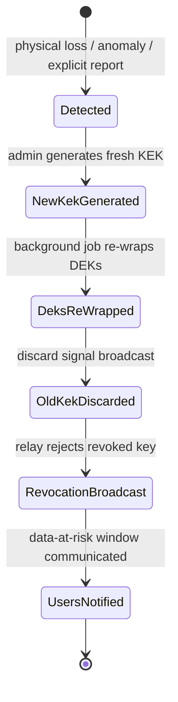
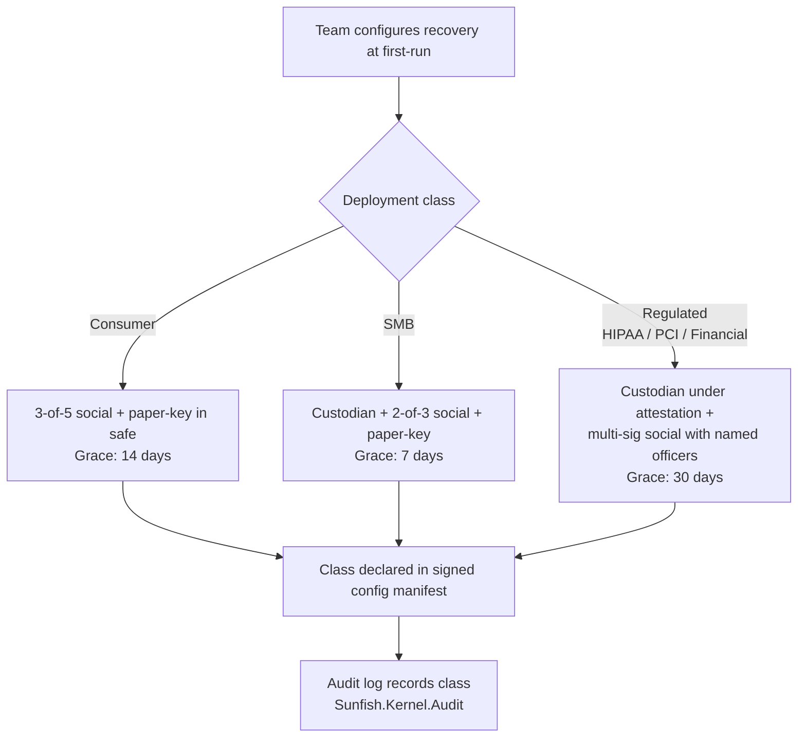
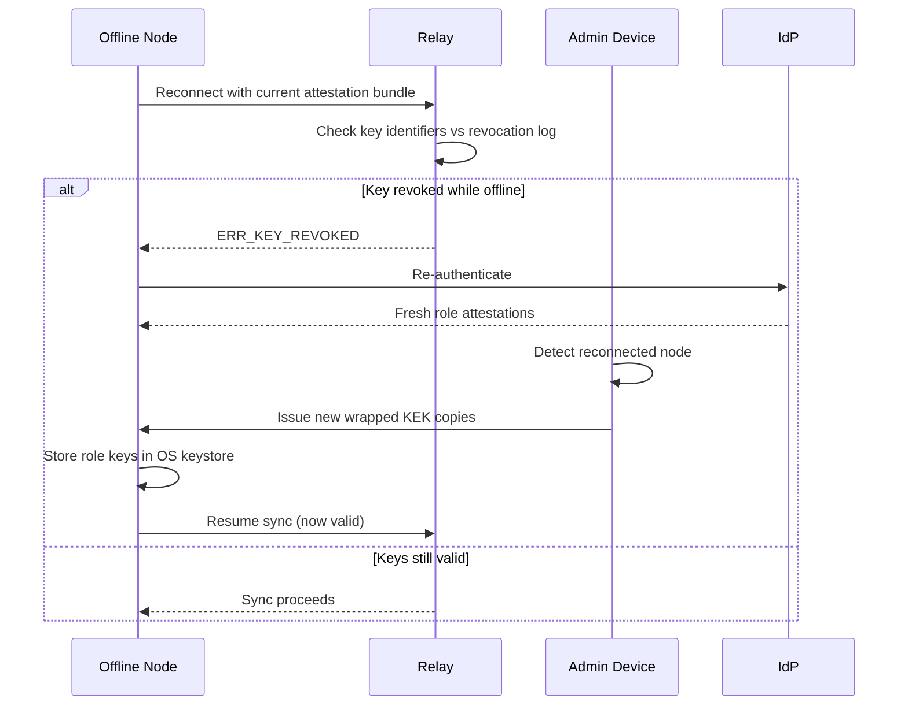
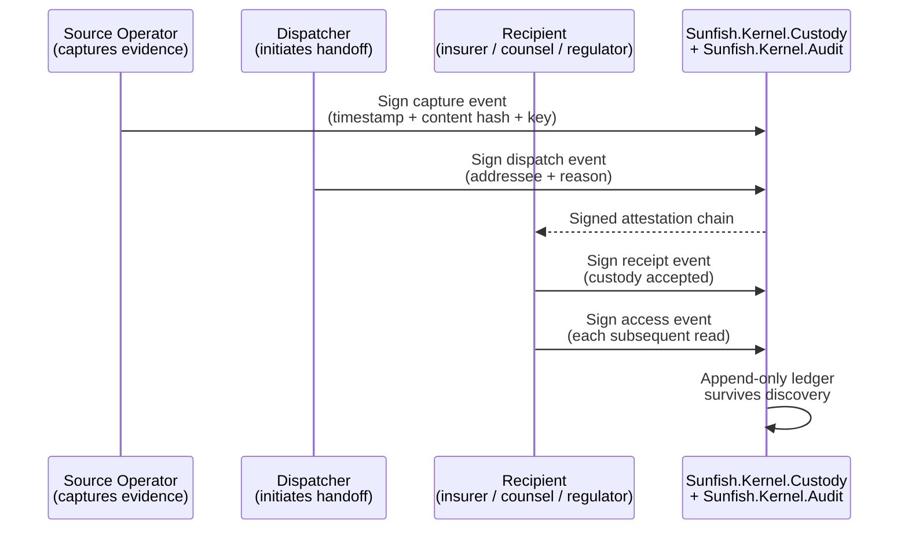

# Ch22 + Ch23 Diagram Proposals

## TL;DR

Ch22 and Ch23 currently have **zero Mermaid diagrams** (the Phase 3 relocation didn't carry visualizations from Ch15; Ch15 retained its single Key-Hierarchy diagram). Both chapters describe operational flows that are diagram-friendly — state machines, sequence interactions, decision trees. PAO proposes **5 diagrams total** (2 in Ch22, 3 in Ch23), each at the location where the section's narrative most benefits from a visual anchor.

Diagrams are *proposals* — Yeoman or CO can decide to apply, defer, or modify. Pre-staged here so the artwork exists when the chapter is ready for visual polish.

## Ch22 — Key Lifecycle Operations

### Diagram 1 — Key Compromise Incident Response State Machine

Place after the opening paragraphs of §Key Compromise Incident Response (currently the chapter's first content section). Visualizes the procedure as a 5-state flow:



**Why:** The §KCIR section walks through the procedure linearly but the state transitions are non-obvious — readers benefit from seeing the irreversible-progression nature (you can't roll back to "old KEK still valid" once you've discarded it). The diagram makes the partial-access-not-granted decision concrete.

### Diagram 2 — Key-Loss Recovery Deployment-Class Decision

Place inside §Key-Loss Recovery, after the deployment-class table. Visualizes the per-class composition of mechanisms:



**Why:** §Key-Loss Recovery is the longest section in Ch22 (4,845 words pre-prune). A reader needs a quick mental model of "which deployment class am I, and what does that compose to?" before diving into the mechanism descriptions. The flowchart provides that mental model in 10 seconds of scanning.

## Ch23 — Endpoint, Collaborator, and Custody Operations

### Diagram 3 — Offline Node Reconnection + Revocation Handshake

Place after the opening paragraphs of §Offline Node Revocation and Reconnection. Sequence diagram showing the rejection flow:



**Why:** The §Offline Revocation section reads as procedural prose; the conditional branch (revoked vs valid) is the load-bearing logic. A sequence diagram makes the multi-party choreography visible — Node, Relay, Admin, IdP are all involved, and the order matters.

### Diagram 4 — Collaborator Departure Trust Boundary

Place inside §Collaborator Revocation and Post-Departure Partition, after the introduction. Visualizes the partition before/after departure:

```mermaid
flowchart LR
    subgraph Before["Before revocation"]
        TeamA[Team]
        AliceA[Alice<br/>finance role]
        BobA[Bob<br/>finance role]
        CarolA[Carol<br/>departing]
        TeamA --> AliceA
        TeamA --> BobA
        TeamA --> CarolA
    end
    subgraph After["After revocation + KEK rotation"]
        TeamB[Team]
        AliceB[Alice<br/>new finance KEK]
        BobB[Bob<br/>new finance KEK]
        CarolB[Carol<br/>old KEK only<br/>read-only access to historical]
        TeamB --> AliceB
        TeamB --> BobB
        TeamB -.x.-> CarolB
    end
```

**Why:** §Collaborator Revocation is voice-pass-pending (#45) and the prose anchors to a departure-moment scene that the author will write. A diagram of "before" vs "after" gives readers the structural picture independent of the narrative — the cryptographic effect of revocation is concrete (Carol retains historical access via old KEK; cannot decrypt new KEK material).

### Diagram 5 — Chain-of-Custody Multi-Party Transfer

Place inside §Chain-of-Custody for Multi-Party Transfers. Sequence diagram showing the dispatcher → recipient → regulator handoff:



**Why:** §Chain-of-Custody is one of the most legally-load-bearing sections. The signed-receipt primitive distinguishes a chain-of-custody record from a timestamp database — that distinction is hard to convey in prose. A sequence diagram makes the per-event signing surface visible.

## Recommended placement + application

Diagrams are additive (no prose to remove). Application:

1. Yeoman applies the 5 diagrams via Edit at the locations marked above.
2. Each diagram adds ~15-30 lines of Mermaid markdown.
3. Total chapter word-count impact: +200 words across both chapters (Mermaid blocks are counted by `wc -w` but are visualization, not prose). Acceptable.
4. After application, run `make draft-pdf` to verify Pandoc renders the Mermaid blocks correctly.

## What PAO is NOT proposing

- No diagrams for the voice-pass-locked subsections of either chapter (§Collaborator Revocation's departure-moment narrative, §Key-Loss Recovery's mechanism-specific narratives) — those need the author's voice-pass first; diagrams may want to anchor to anecdote-specific framing.
- No diagrams for §Endpoint Compromise's sub-pattern 47a scope declaration — the section's strength is its prose claim ("here is what we explicitly do not protect against"); a diagram would weaken the rhetorical weight.
- No diagrams for §Event-Triggered Re-classification's max-register CRDT invariant — the algebraic property is not improved by a diagram; the prose carries it.
- No diagrams for §Forward Secrecy's ratchet — the existing Signal protocol literature has the canonical version; better to cross-reference than reproduce.

## Status

- Diagrams pre-staged: 5 (2 in Ch22, 3 in Ch23)
- Application: pending Yeoman or CO call. Application is mechanical (paste-in via Edit at marked locations). Reversible per-diagram if any individual one isn't a fit.

---

**End of proposal.** Diagrams ready to copy into the chapters when the author wants the visual anchors.
