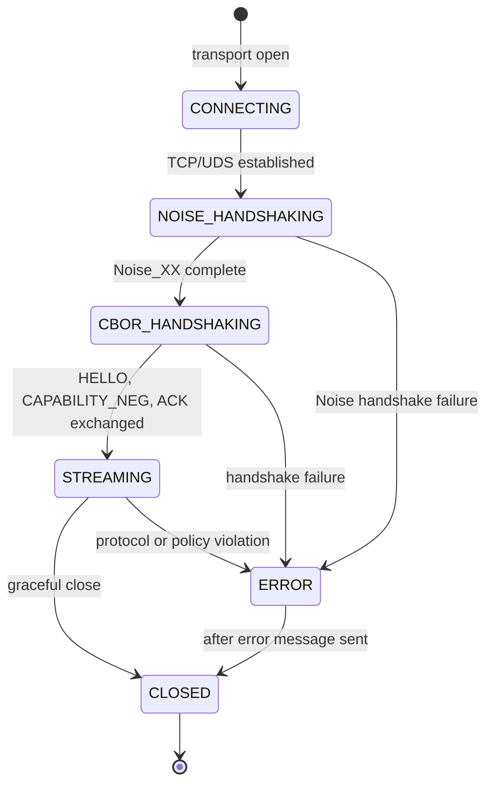

# Appendix A — Sync Daemon Wire Protocol

<!-- icm/prose-review -->

<!-- Target: ~2,000 words -->
<!-- Source: v13 §6.2, Sunfish accelerators/anchor/README.md -->

---

## A.1 Overview

This appendix is the normative wire-protocol specification. Chapter 14 covers architecture and design rationale. This appendix defines the bytes on the wire. Implementers writing a conformant daemon or relay treat this text as authoritative. Where prose and Chapter 14 conflict, this appendix wins.

The sync daemon communicates over Unix domain sockets on Linux, macOS, and Windows 10 / Server 2019 and later. The socket path is configurable. The Sunfish (the open-source reference implementation, [github.com/ctwoodwa/Sunfish](https://github.com/ctwoodwa/Sunfish)) reference default is `/var/run/sunfish-sync.sock` on Linux/macOS and `\\.\pipe\sunfish-sync` on Windows. All CBOR (Concise Binary Object Representation) exchange runs inside a Noise Protocol Framework tunnel. Every connection MUST complete a Noise_XX handshake — Ed25519 static keys, ChaCha20-Poly1305, BLAKE2s — before any message defined in this appendix is exchanged. The CBOR framing in §A.2 operates entirely inside the Noise transport layer, which provides confidentiality, integrity, and replay protection. This appendix does not re-specify those properties.

All messages use binary CBOR encoding with a 4-byte length prefix. The protocol defines five message types that participate in the handshake sequence. Once the handshake completes, the connection transitions to continuous delta streaming. The daemon sends HELLO, negotiates capabilities with CAPABILITY_NEG, and the relay sends ACK before streaming begins. DELTA_STREAM messages carry CRDT (Conflict-free Replicated Data Type) operations for the lifetime of the connection. GOSSIP_PING messages flow on a 30-second interval to maintain membership state. Error messages terminate or pause a connection at any point in the lifecycle.

Relay deployment jurisdiction determines data-transit exposure. For deployments under data-localization mandates (Russia 242-FZ, India DPDP (Digital Personal Data Protection), UAE DPL (Data Protection Law), PIPL (Personal Information Protection Law) — see Appendix F for the full coverage matrix), on-premise relay deployment keeps all protocol traffic within the local deployment boundary.

---

## A.2 Message Framing

Every message on the wire consists of a 4-byte little-endian `uint32` length prefix followed immediately by a CBOR-encoded message body of exactly that many bytes.

```
+------------------+-------------------------------+
| length: uint32   | body: CBOR map (length bytes)  |
| (little-endian)  |                               |
+------------------+-------------------------------+
```

The maximum allowed body size is 4,194,304 bytes (4 MiB). This cap is a relay memory-allocation invariant. The relay pre-allocates receive buffers sized to this bound, and exceeding it risks denial-of-service through unbounded allocation. A receiver that encounters a length prefix exceeding this limit MUST close the connection without sending an error message. Receivers MUST read the full `length` bytes before decoding; partial reads are a protocol error. Typical DELTA_STREAM messages are 1–64 KiB. HELLO and ACK are <1 KiB. A GOSSIP_PING carrying 200 peer entries is ~32 KiB. The 4 MiB ceiling bounds bulk snapshot reconciliation edge cases.

Every CBOR body is a CBOR map. Every map contains a `type` field (tstr) that identifies the message type. All CBOR encoding of fields that appear in signed contexts (§A.6) MUST use Deterministic Encoding per RFC (Request for Comments) 8949 §4.2: definite-length arrays and maps, map keys sorted by lexicographic byte order, integers encoded in the shortest form, and floating-point numbers in their shortest exact representation. Fields that are not signed SHOULD use Deterministic Encoding but MAY use any valid CBOR encoding. Receivers MUST ignore unknown fields in any map. This rule enables optional fields to be added in minor protocol versions without breaking existing implementations.

---

## A.3 Handshake Messages



The handshake sequence inside the CBOR layer is: **HELLO → CAPABILITY_NEG → ACK**. The connecting node sends HELLO immediately after the Noise handshake completes. It then sends CAPABILITY_NEG back-to-back without waiting for a response. The relay buffers HELLO and uses CAPABILITY_NEG to construct the full request context — attestation validation, lease acquisition, bucket authorization — in a single transaction. This back-to-back design saves one round trip in the common case. The cost is that the relay accepts HELLO before it knows whether the attestation will validate. The Noise transport guarantees that HELLO's `node_id` matches the Noise static key, so the relay can index pending-handshake state by node identity before CAPABILITY_NEG arrives.

### A.3.1 HELLO

Sent by the connecting node as the first message on every new connection.

| Field | CBOR Type | Required | Description |
|---|---|---|---|
| `type` | tstr | required | Literal value `"HELLO"` |
| `node_id` | bstr | required | Ed25519 public key of the sending node, exactly 32 bytes |
| `schema_version` | tstr | required | Semver string (e.g. `"1.4.2"`) identifying the application schema version |
| `supported_versions` | array of tstr | required | All wire protocol semver strings this node can speak, for rolling-upgrade negotiation |
| `protocol_version` | uint | required | Wire protocol version. Current value: `1` |

`node_id` is the stable identity of the node across reconnections. The relay uses it as the lookup key for attestation and lease state. Nodes MUST NOT rotate their `node_id` without re-onboarding.

`supported_versions` MUST include the semver string corresponding to `protocol_version`. It MAY include older versions to allow a two-version overlap during rolling upgrades. See §A.7 for the compatibility policy.

### A.3.2 CAPABILITY_NEG

Sent by the connecting node immediately after HELLO, in the same connection. See the §A.3 back-to-back design note for the rationale.

| Field | CBOR Type | Required | Description |
|---|---|---|---|
| `type` | tstr | required | Literal value `"CAPABILITY_NEG"` |
| `crdt_streams` | array of tstr | required | Stream identifiers for which the node requests CRDT delta subscription |
| `cp_leases` | array of tstr | optional | Record type identifiers for which the node requests CP-class lease capability |
| `bucket_subscriptions` | array of tstr | required | Sync bucket names the node requests access to |
| `attestation_bundle` | bstr | required | CBOR-encoded `AttestationBundle` (see §A.6) proving the node's role |

`crdt_streams` identifies the CRDT document streams by string key. Stream identifiers are application-defined and MUST be stable across reconnections. The relay validates each stream identifier against the role claims in `attestation_bundle` before granting access.

`cp_leases` is omitted when the node does not require CP-class (strongly-consistent) record access. CP-class record types require a distributed lease for the duration of a session. The relay acquires and holds this lease — per the Flease protocol; see Chapter 14 for the full lease-protocol specification — on behalf of the node before returning ACK. Record types not listed in `cp_leases` default to AP-class (available, partition-tolerant) and do not acquire leases.

`bucket_subscriptions` names the sync buckets defined in the application's bucket manifest. The relay grants only the subset the node's role attestation authorises.

### A.3.3 ACK

Sent by the relay after validating HELLO and CAPABILITY_NEG. A single ACK closes the handshake and permits streaming to begin.

| Field | CBOR Type | Required | Description |
|---|---|---|---|
| `type` | tstr | required | Literal value `"ACK"` |
| `negotiated_version` | uint | required | Wire protocol version the relay has selected per §A.7 rule 5. MUST be a value in the connecting node's `supported_versions` array |
| `granted_streams` | array of tstr | required | Subset of `crdt_streams` from CAPABILITY_NEG that the relay grants |
| `granted_buckets` | array of tstr | required | Subset of `bucket_subscriptions` from CAPABILITY_NEG that the relay grants |
| `denied_reason` | tstr | optional | Human-readable explanation; present only when one or more requested streams or buckets are denied |

`negotiated_version` is the highest wire protocol version supported by both the connecting node (in `supported_versions`) and the relay. The connecting node MUST use this version for all subsequent messages on the connection. If the negotiated version differs from the node's preferred `protocol_version`, the node SHOULD log the downgrade for operator review.

`granted_streams` and `granted_buckets` MAY be empty arrays. An empty grant is not an error. It means the attestation bundle does not authorise any of the requested resources. The node SHOULD surface this condition to the operator rather than silently continuing.

When `denied_reason` is present, the node MUST log it. The node MAY retry with a reduced request set without re-establishing the transport connection.

---

## A.4 Streaming Messages

### A.4.1 DELTA_STREAM

Carries a single CRDT operation from one node to all subscribed peers on the same stream. The relay fans out each DELTA_STREAM it receives to every node subscribed to that `stream_id`.

| Field | CBOR Type | Required | Description |
|---|---|---|---|
| `type` | tstr | required | Literal value `"DELTA_STREAM"` |
| `stream_id` | tstr | required | CRDT stream identifier; MUST match a value in `granted_streams` |
| `op_type` | tstr | required | One of `"insert"`, `"delete"`, `"update"` |
| `vector_clock` | map of tstr→uint | required | Logical clock at the time of operation; keys are the 64-character lowercase hexadecimal encoding of the 32-byte Ed25519 node public key (type tstr), values are sequence numbers (uint) |
| `payload` | bstr | required | Opaque CRDT operation bytes. The current Sunfish reference implementation uses YDotNet (the .NET CRDT engine port of Yjs ([github.com/yjs/yjs](https://github.com/yjs/yjs), the JavaScript CRDT library) via Rust FFI) and serialises payloads per the Yjs binary update format (see [YDotNet docs]); deployments on Loro ([github.com/loro-dev/loro](https://github.com/loro-dev/loro), a Rust-core CRDT library) use the Loro binary operation format. The `ICrdtEngine.ApplyDelta` contract makes this choice reversible at build time |
| `epoch_id` | tstr | optional | Present only for CP-class records; identifies the epoch in which this operation was authorised |

`op_type` is advisory metadata for the receiving application layer. The CRDT engine applies `payload` without inspecting `op_type`. The field exists to allow the application to route operations to the correct merge handler before deserialization. A mismatch between `op_type` and the actual operation contained in `payload` is not automatically detectable by the receiver — the CRDT engine will apply the payload regardless. Applications that route on `op_type` MUST validate the routing against the engine's post-apply state if correctness depends on the distinction. Otherwise, silent routing errors are possible. The sender SHOULD set `op_type` accurately, but the protocol does not enforce it.

`epoch_id` is required for any operation on a CP-class record type. The receiver MUST verify that its local epoch matches `epoch_id` before applying `payload`. A mismatch produces ERR_EPOCH_MISMATCH (§A.5).

The relay does not reorder or buffer DELTA_STREAM messages. Operations arrive in network order. The CRDT engine is responsible for convergent merge regardless of delivery order.

### A.4.2 GOSSIP_PING

Sent by each node to all connected peers every 30 seconds. The relay does not generate GOSSIP_PING. It relays the message as-is to all nodes on the session. GOSSIP_PING maintains membership state for partition detection and stale peer recovery. `membership_excerpt` carries a partial view of the node's known peer list so that receivers can reconcile divergent membership views and detect peers that have silently dropped from the overlay.

| Field | CBOR Type | Required | Description |
|---|---|---|---|
| `type` | tstr | required | Literal value `"GOSSIP_PING"` |
| `sender_id` | bstr | required | Ed25519 public key of the sending node, exactly 32 bytes |
| `membership_excerpt` | array of maps | required | Partial membership view; each entry is a map with three keys (see below) |
| `sender_vector_clock` | map of tstr→uint | required | Sender's full vector clock summary at the time of ping |

Each entry in `membership_excerpt` is a CBOR map with the following fields:

| Field | CBOR Type | Required | Description |
|---|---|---|---|
| `node_id` | bstr | required | Ed25519 public key of the described peer |
| `last_seen` | uint | required | Unix timestamp (seconds) of the last message received from this peer |
| `vector_clock_summary` | map of tstr→uint | required | Most recent vector clock the sender has recorded for this peer |

A receiver that observes a `last_seen` value older than 90 seconds for any peer SHOULD treat that peer as suspected-partitioned and escalate to the application layer. The 90-second threshold is three times the 30-second ping interval. That ratio keeps false-positive partition signals below one per hour per healthy peer under normal jitter. For long-absence reconnection — a node that was offline for hours and reestablishes, routine in deployments affected by unreliable grid power — the relay treats the returning node as new. Prior session state is discarded. CAPABILITY_NEG reacquires leases and subscriptions. The node catches up via DELTA_STREAM replay. There is no "resume long-absent session" primitive in this version of the protocol.

---

## A.5 Error Codes

Error messages are valid at any point in the connection lifecycle, including during the handshake. On receipt of an error message, the receiver MUST apply the retry semantics defined below before reconnecting.

All error messages share the following structure:

| Field | CBOR Type | Required | Description |
|---|---|---|---|
| `type` | tstr | required | Error code string (see table below) |
| `reason` | tstr | required | Human-readable description of the specific error condition |

| Error Code | `type` Value | Retry Semantics |
|---|---|---|
| Rate limit | `"ERR_RATE_LIMIT_EXCEEDED"` | Retry after exponential backoff: initial interval 1 s, maximum 60 s, with uniform jitter in [0, interval/2] |
| Version mismatch | `"ERR_VERSION_INCOMPATIBLE"` | No retry. Upgrade the daemon or relay to a compatible version before reconnecting |
| Missing attestation | `"ERR_ATTESTATION_REQUIRED"` | Re-authenticate with the IdP (Identity Provider) to obtain a fresh attestation bundle, then retry the handshake |
| Epoch mismatch | `"ERR_EPOCH_MISMATCH"` | Fetch the current epoch snapshot from any available peer, apply it locally, then retry the operation |
| Revoked key | `"ERR_KEY_REVOKED"` | Re-authenticate with the IdP. Obtain a new key bundle from the organisation administrator before reconnecting. The existing `node_id` key is permanently invalidated |
| Bucket unauthorised | `"ERR_BUCKET_NOT_AUTHORIZED"` | No retry. The node's role attestation does not grant access to the requested bucket. Obtain a new attestation with the correct role claims |
| Relay throttle | `"ERR_THROTTLE"` | Relay-enforced rate limit distinct from per-node rate limiting. Apply the same backoff policy as ERR_RATE_LIMIT_EXCEEDED |

Implementations MUST NOT retry on ERR_VERSION_INCOMPATIBLE or ERR_BUCKET_NOT_AUTHORIZED without operator intervention. Automatic retry on these codes produces a tight reconnect loop that degrades relay capacity.

---

## A.6 QR Onboarding Payload Format

The QR onboarding payload transfers both the attestation bundle and an initial state snapshot from an existing node to a new node. The payload is suitable for QR code encoding, NFC transfer, or secure paste. It is a flat byte sequence with the following layout:

```
+-------------------------+--------------------------------------+
| bundle_length: uint32   | attestation_bundle: CBOR (N bytes)   |
| (little-endian)         |                                      |
+-------------------------+--------------------------------------+
| snapshot_length: uint32  | snapshot: raw bytes (M bytes)       |
| (little-endian)          |                                     |
+-------------------------+--------------------------------------+
```

`attestation_bundle` is a CBOR map with the following fields:

| Field | CBOR Type | Required | Description |
|---|---|---|---|
| `issuer_public_key` | bstr | required | Ed25519 public key of the attestation issuer, exactly 32 bytes |
| `subject_public_key` | bstr | required | Ed25519 public key of the new node being attested, exactly 32 bytes |
| `role_claims` | array of tstr | required | Role names granted to the subject (e.g. `"editor"`, `"viewer"`) |
| `signature` | bstr | required | Ed25519 signature (RFC 8032) over the concatenation `issuer_public_key ‖ subject_public_key ‖ role_claims_cbor` (‖ denotes byte-string concatenation), signed by the issuer's private key. `role_claims_cbor` MUST be encoded per Deterministic CBOR (RFC 8949 §4.2) to ensure cross-implementation signature verifiability |
| `issued_at` | uint | required | Unix timestamp (seconds) at which the bundle was signed |

**Founder bundles:** `issuer_public_key` equals `subject_public_key`. The signature is self-signed by the founder's own private key. Founder bundles carry an implicit grant of every role claim and are accepted only during initial node creation.

**Joiner bundles:** `issuer_public_key` is the founder's key or any key already holding the `admin` role claim. The issuer signs with their private key. The relay verifies the signature against `issuer_public_key` before accepting the bundle during CAPABILITY_NEG.

Attestation bundles have no built-in expiry field. Revocation is enforced at the relay via a revocation list keyed on `issuer_public_key ‖ subject_public_key`. A revoked bundle produces ERR_KEY_REVOKED regardless of `issued_at`.

**Security properties.** Attestation bundles are bearer credentials. Possession of a valid bundle grants the claimed roles until the relay's revocation list is updated. Compromise of a bundle requires immediate revocation via the relay. If the relay is unavailable during compromise, the revocation window is bounded by the time to next reachability. Replay protection is delegated to the Noise transport layer (§A.1). Each session uses ephemeral keys, so a captured bundle cannot be replayed into an active session without the subject's Noise static key. A stolen bundle combined with a stolen Noise static key remains a valid attack vector until relay-enforced revocation takes effect. This is the compelled-access and device-theft threat model Chapter 15 specifies.

**Algorithm constraints.** This protocol specifies Ed25519 (RFC 8032) for node identity and attestation signatures. Ed25519 is approved under FIPS 186-5 (2023) for deployments subject to FIPS algorithm policy review. Deployments subject to GOST R 34.10-2012 — Russian Federation public sector, critical infrastructure — or other national algorithm mandates must negotiate algorithm selection at a layer above this wire-protocol specification. The current version does not support algorithm agility for `signature`.

**Data-protection note.** `role_claims` and `node_id` may constitute personal data under GDPR (General Data Protection Regulation) Article 4(1), UK GDPR, LGPD (Lei Geral de Proteção de Dados) Article 5, India's DPDP Act 2023, and parallel regimes (UAE DPL, NDPR (Nigeria Data Protection Regulation), POPIA (Protection of Personal Information Act), PIPL, Japan PIPA (Personal Information Protection Act), Korea PIPA — see Appendix F) where the node identity is attributable to an identifiable natural person. Implementers MUST evaluate the bundle contents under the applicable regime. The QR transfer channel itself is assumed untrusted. The relay's signature verification provides integrity. Confidentiality of the bundle during transfer is the implementer's responsibility — in practice, by scanning the QR code inside a trusted physical perimeter rather than from photographs or remote displays.

`snapshot` is an opaque byte sequence produced by the CRDT engine's snapshot serialisation. The Sunfish reference implementation currently uses YDotNet's state-vector format (`Y.Doc.encodeStateAsUpdate`). Deployments on Loro use `loro::export_snapshot`. The format is versioned with the CRDT engine, not with the wire protocol. The receiving node passes `snapshot` directly to the engine's hydration API (Application Programming Interface). On hydration failure the node MUST discard the snapshot and request a full state transfer via DELTA_STREAM replay from a peer. State transfer bandwidth is a concern in low-bandwidth environments — 2G, VSAT, rural 4G. Deployments targeting such environments should size sync buckets per Chapter 16 to bound replay volume.

---

## A.7 Backward Compatibility Policy

The following guarantees are normative. Implementations that rely on them may treat a violation as a protocol defect in the non-conforming peer and close the connection without further retry.

**Versioning scheme.** The `protocol_version` field in HELLO is a uint carrying the *major* wire-protocol version only. Minor-version revisions — additions of optional fields, new error codes, clarifications — reuse the same major uint without increment. Implementations discover minor-version capabilities by field presence and by the `supported_versions` array of semver strings (e.g. `"1.0.0"`, `"1.1.0"`, `"1.2.0"`) that HELLO carries alongside the uint. `schema_version` is the *application*-level schema version and is independent of the wire protocol version. Breaking changes to the wire format require incrementing `protocol_version` and publishing a new major semver line.

The following guarantees apply across minor version increments (same major `protocol_version`):

1. The `type` field in each defined message type is stable. It will not be renamed or have its value changed in a minor version.
2. Fields documented as required in an existing message type will not be removed in a minor version. A receiver MAY reject a message that omits a required field.
3. Optional fields may be added to any existing message type in any minor version. Receivers MUST ignore unknown fields; this rule is mandatory, not advisory.
4. A message carrying `protocol_version` greater than the receiver's maximum supported major version produces ERR_VERSION_INCOMPATIBLE. The receiver closes the connection immediately after sending the error.
5. The `supported_versions` semver array in HELLO enables a two-version overlap during rolling upgrades. If the receiver supports any version listed in `supported_versions`, it MUST negotiate down to the highest mutually supported version (returned in ACK's `negotiated_version`) rather than returning ERR_VERSION_INCOMPATIBLE.

Breaking changes — removing required fields, renaming message types, or changing field semantics — require a major `protocol_version` increment. Implementations SHOULD NOT assume that two nodes with the same major version have identical optional field support. They MUST apply the unknown-field-ignore rule.

---

## A.8 Conformance Requirements

A conformant implementation MUST satisfy every requirement below. Identifiers (REQ-A-NNN) are stable across minor versions to enable test-suite construction.

| ID | Requirement |
|---|---|
| REQ-A-001 | Receivers MUST close connections when the length prefix exceeds 4 MiB without sending an error message (§A.2) |
| REQ-A-002 | Receivers MUST read the full `length` bytes before decoding (§A.2) |
| REQ-A-003 | Receivers MUST ignore unknown fields in any CBOR map (§A.2) |
| REQ-A-004 | All CBOR encoding of signed fields MUST use Deterministic Encoding per RFC 8949 §4.2 (§A.2) |
| REQ-A-005 | Every connection MUST complete a Noise_XX handshake before CBOR exchange begins (§A.1) |
| REQ-A-006 | Nodes MUST NOT rotate `node_id` without re-onboarding (§A.3.1) |
| REQ-A-007 | `supported_versions` MUST include the semver string corresponding to `protocol_version` (§A.3.1) |
| REQ-A-008 | The relay MUST validate each stream identifier against role claims in `attestation_bundle` before granting access (§A.3.2) |
| REQ-A-009 | Relays MUST return ACK only after validating both HELLO and CAPABILITY_NEG (§A.3.3) |
| REQ-A-010 | ACK MUST carry `negotiated_version` matching §A.7 rule 5 (§A.3.3) |
| REQ-A-011 | Connecting nodes MUST use `negotiated_version` for all subsequent messages (§A.3.3) |
| REQ-A-012 | The receiver MUST verify that its local epoch matches `epoch_id` before applying a CP-class `payload` (§A.4.1) |
| REQ-A-013 | On hydration failure the node MUST discard the snapshot and request full state transfer (§A.6) |
| REQ-A-014 | On ERR_VERSION_INCOMPATIBLE or ERR_BUCKET_NOT_AUTHORIZED, implementations MUST NOT retry automatically (§A.5) |
| REQ-A-015 | Attestation signatures MUST be verifiable via Ed25519 (RFC 8032) against `issuer_public_key` (§A.6) |
| REQ-A-016 | Revoked bundles MUST produce ERR_KEY_REVOKED regardless of `issued_at` (§A.6) |

---

## A.9 Test Vectors

The following test vectors are normative for interoperability verification. All hex is lowercase, no separators. Full vectors including Noise handshake bytes are published alongside the Sunfish reference implementation under `accelerators/anchor/tests/wire-vectors/`.

**Vector 1 — HELLO**

```
node_id:            1c0ffee0ba5eba11deadbeef0123456789abcdef0123456789abcdef01234567
schema_version:     "1.4.2"
supported_versions: ["1.0.0", "1.1.0"]
protocol_version:   1

CBOR (deterministic):
a5 64 74 79 70 65 65 48 45 4c 4c 4f 67 6e 6f 64 65 5f 69 64
58 20 1c 0f fe e0 ba 5e ba 11 de ad be ef 01 23 45 67 89 ab
cd ef 01 23 45 67 89 ab cd ef 01 23 45 67 6e 73 63 68 65 6d
61 5f 76 65 72 73 69 6f 6e 65 31 2e 34 2e 32 72 73 75 70 70
6f 72 74 65 64 5f 76 65 72 73 69 6f 6e 73 82 65 31 2e 30 2e
30 65 31 2e 31 2e 30 70 70 72 6f 74 6f 63 6f 6c 5f 76 65 72
73 69 6f 6e 01
```

**Vector 2 — Attestation bundle signature input (founder self-sign)**

```
issuer_public_key:    same as node_id above (founder self-signed)
subject_public_key:   same (founder)
role_claims_cbor:     82 65 61 64 6d 69 6e 66 65 64 69 74 6f 72  (["admin","editor"])

Signature input (concatenation, 96 bytes total):
1c0ffee0ba5eba11deadbeef0123456789abcdef0123456789abcdef01234567
1c0ffee0ba5eba11deadbeef0123456789abcdef0123456789abcdef01234567
8265 61 64 6d 69 6e 66 65 64 69 74 6f 72

Ed25519 signature (hex, 64 bytes):
[reference implementation output — see tests/wire-vectors/founder-sig.hex]
```

Additional vectors covering CAPABILITY_NEG, ACK, DELTA_STREAM (insert/update/delete), GOSSIP_PING with membership excerpt, and each error code are maintained in the reference implementation test suite. They MUST pass byte-for-byte equivalence to be considered conformant.
