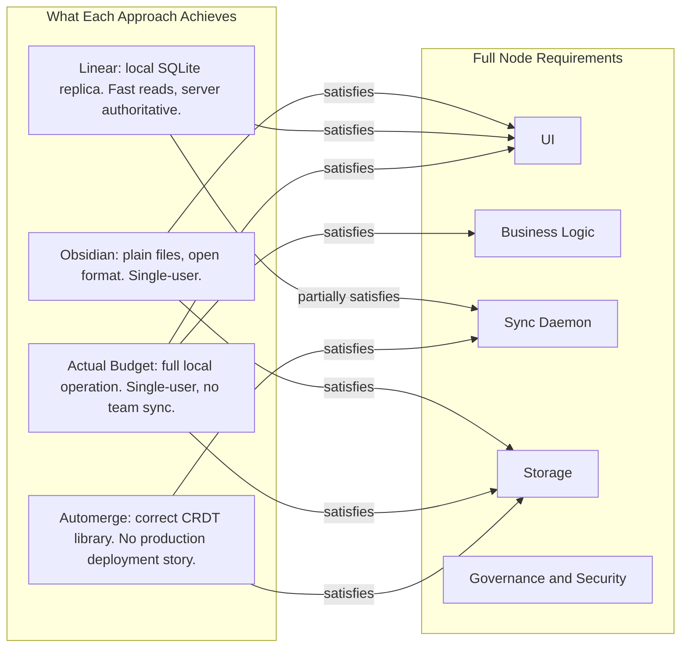
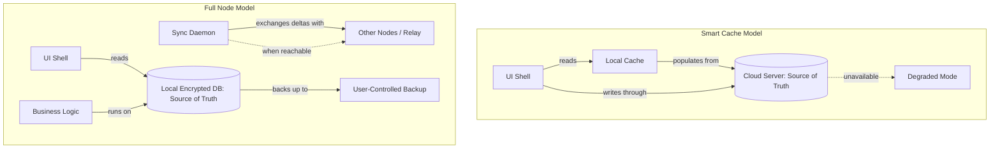

# Chapter 2 — Local-First: From Sync Toy to Serious Stack

<!-- icm/prose-review -->

<!-- Target: ~4,000 words -->
<!-- Source: v13 §2.1–§2.4, §19; v5 §1–§3 -->

---

In 2019, researchers at Ink & Switch asked what it would mean for software to take data ownership seriously [1] — not in the legal sense of privacy policies and terms of service, but in the structural sense: software that keeps your data on your machine, syncs it when convenient, and does not stop working the moment a vendor server fails or a company changes its business model. They named the answer "local-first software" and listed seven properties that any serious implementation would have to satisfy.

The seven properties expose exactly where every existing attempt — including the best commercial ones — falls short. Getting to all seven requires more than clever sync. It requires running a complete application stack at the edge, not a smarter cache of someone else's database.

---

## The Seven Ideals

The seven properties from Kleppmann et al. [1] are not a wishlist. They are a minimum bar. Read them as constraints that filter out anything that merely approximates local-first. Most apps pass two or three. Almost nothing passes all seven. The ones that fail are instructive, because they fail in the same places and for the same reasons.

**No spinners, no waiting.** The software responds instantly because it reads from local state, not from a network request. In practice, most apps fail this for anything beyond trivial reads. A project management tool that must phone home to load the task list fails this property during the first round-trip, and fails it permanently when the network is gone.

**Work is not trapped on one device.** Your data on your laptop should be your data on your desktop, your tablet, your colleague's machine. This means sync across devices and across people — not as a feature requiring a subscription upgrade, but as a structural property. Apps that sync through a vendor's servers pass the property only while the vendor exists and the subscription is paid. When either condition ends, the data is trapped.

**The network is optional.** Not "the network is preferred" or "reduced functionality offline." Optional means the full application works without any network connection, indefinitely, then syncs when a connection becomes available. This eliminates every app whose read path hits a remote API and every app whose write path queues locally and waits. Real offline requires that the local node hold an authoritative copy of data it is allowed to act on.

**Seamless collaboration.** Multiple people should be able to edit the same data simultaneously without explicit locking, without "checkout" workflows, and without a person designated to resolve conflicts manually. This is the property that made centralized servers feel necessary — if two people are writing concurrently, something has to decide the order. CRDTs provide the mathematical alternative: merge semantics that guarantee convergence without a coordinator. Software that requires a server to adjudicate concurrent writes fails this property the moment the server is unreachable.

**The long now.** Your data should outlive the vendor, the subscription, and the company's strategic priorities. A user who adopted Sunrise Calendar built workflows on it. When Microsoft shut it down in 2016, those workflows had an expiry date they did not know about. The long now means data in an open format, stored on user-controlled hardware, remains accessible regardless of what happens to the company that made the tool. Proprietary sync formats — even sync formats that feel invisible — fail this property.

**Security and privacy by default.** Data that lives locally is harder to breach at scale. A centralized database is a target; exfiltrating it compromises every user simultaneously. Distributed local stores raise the cost of attack — an adversary who compromises one node gets one user's data, not all users' data. But local storage without encryption creates a different problem: physical access to the device is sufficient. Security by default means end-to-end encryption at rest and in transit, with key control in the user's hands, not the vendor's. A local app that stores data in plaintext fails this property as badly as a cloud app does.

**You retain ultimate ownership and control.** The user decides where the data lives, who can access it, and when to delete it. This is not a contractual guarantee. It is a structural one: the bits live on hardware the user controls, in a format the user can read, under encryption the user can manage. Ownership conveyed only through a contract is ownership that can be revoked when the contract changes.

Seven properties. Together they describe software that works for the user independent of vendor survival, vendor pricing, and vendor infrastructure. No production app satisfies all seven today.

---

## What Exists Today: A Taxonomy of Local-First Attempts

The local-first community has produced serious work. The apps below are not failures — they are the best commercial implementations of local-first thinking available. Their limitations are not oversights. They are the boundary where local-first principles meet the practical difficulty of running a full application stack at the edge.

### The Document Sync Apps (Obsidian, Notion)

Obsidian stores notes as plain markdown files on your local filesystem. This is a genuinely correct choice. Plain text in an open format, on your own storage, is the most durable data model available. No import problem, no export problem, no proprietary encoding. If Obsidian disappears tomorrow, the files remain and every text editor on the planet reads them. The long-now property is satisfied by the data format alone.

Where Obsidian stops is structured data and collaboration. Markdown files have a limited conflict resolution strategy: when two devices modify the same file concurrently, Obsidian’s sync service attempts a line-level text merge for plain markdown, but falls back to a conflict copy when merging fails or for non-text files. The conflict copy sits alongside the original; resolution is manual. For a solo note-taker, this is an infrequent and tolerable annoyance. For a team using shared notes to track client work, project status, or decisions — where concurrent edits are the norm — the duplicate-file model fails. There is no CRDT underneath Obsidian's sync. The conflict strategy is to tell the user there is a conflict and let them figure it out.

The deeper limitation is scope. Markdown files have no relational structure, no queryable schema, no concept of record types that relate to each other. A project has tasks; a task has a status, an assignee, a due date, subtasks, comments, and attachments. None of that fits in a flat text file without inventing a convention, and no two Obsidian users will invent the same convention. The moment a team needs structured data — not documents, but records — Obsidian's model breaks down. It is a document tool that happens to sync, not a structured-data tool with local-first properties.

Notion presents the inverse problem. It has structured data: databases, filtered views, linked records, formulas. But it is architecturally a web application with a rich offline cache. Notion added offline write support in mid-2025, allowing edits to pre-marked pages to sync on reconnect. The limitations remain significant: offline access requires opting individual pages in manually, database views sync at most fifty rows, and mobile sync requires Wi-Fi rather than cellular. The authoritative copy remains on Notion's servers throughout. Concurrent edits go through Notion's servers, which hold the authoritative copy. The long-now property fails immediately: Notion data lives in Notion's proprietary format, on Notion's servers, accessible only through Notion's application. An export produces a ZIP archive of markdown files and CSVs — a representation, not a migration. The relational structure, the filters, the formulas, the comment threads — none of these export faithfully to a format another application understands.

Both approaches demonstrate a genuine tension: plain-file formats satisfy the long now but cannot support structured collaboration; structured databases support collaboration but require a centralized authority. The missing piece is a data model that is both structured and convergent — which is what CRDTs over a typed document store provide.

### The Lightweight Replica Apps (Linear, Liveblocks)

Each Linear client maintains a local SQLite replica of the user's team data. Writes go to local state first; the sync engine applies them to the local replica immediately and propagates to the server asynchronously. The result is an application that feels instant — no loading spinners, no optimistic-update lag, no visible round trips. The gap is where the replica ends. Linear's local SQLite database is a replica: it reflects a copy of server state, not an authoritative local node. The server remains the source of truth. When Linear's servers are unreachable, offline writes to server-owned records — status changes on issues, comment submissions, project mutations that require server-side validation — either fail silently or queue for an uncertain duration. More critically, Linear's sync protocol is proprietary: there is no peer-to-peer mode. Two Linear clients on the same local network cannot sync directly with each other when the internet is down. The relay is Linear's infrastructure, and it is not optional.

Background jobs — notifications, automations, integrations — run server-side. An automation that moves issues between states when conditions are met does not run on the local node; it runs in Linear's cloud. Remove the cloud and the automation stops. The local replica is a performance optimization and a UX improvement. It is not a full node.

The practical consequence: Linear passes the "no spinners" property and partially passes "the network is optional" for reads. It does not pass network-optional for writes to server-owned records, does not pass peer-to-peer collaboration without Linear's relay, does not pass vendor independence, and does not pass the long now — Linear's data lives in Linear's format, accessible through Linear's API, exportable to CSV only.

Liveblocks and similar collaborative state frameworks take this further in the CRDT direction, providing real-time collaborative cursors and shared state via CRDTs — but they operate as a hosted service. The CRDT engine runs on their infrastructure; clients are thin consumers of the hosted state. The collaboration model is correct; the data sovereignty model is not. Liveblocks is CRDT-as-a-service, which relocates the vendor dependency rather than eliminating it.

### The Local-First Finance App (Actual Budget)

Actual Budget runs entirely offline by default — no account required, no network request during normal operation. All budget data lives in a local SQLite file the user can copy, back up, or open directly. When the network is unavailable, Actual Budget functions identically to when it is available, because its operation does not depend on the network at any point.

This satisfies the first property (no spinners), the third (network optional), and substantially the seventh (ownership and control — the user has a file on their disk). It makes a credible attempt at the fifth (the long now) by virtue of using an open database format that other tools can read.

Where Actual Budget stops is collaboration and multi-device sync. The application is single-user by design. Two people cannot jointly manage a budget in Actual Budget without manual coordination: exporting the file, sending it, importing it, hoping no concurrent changes need to be merged. The optional sync service Actual Budget offers addresses multi-device access for a single user — the budget file syncs across the user's own devices through a hosted relay. This reintroduces a central server, though the server's role is deliberately minimal: relay and backup, not authority.

The team collaboration case does not exist. Actual Budget has no concept of roles, permissions, concurrent edits, or conflict resolution between multiple users. Its data model is single-user because its design is single-user. Adapting it to multi-user team workflows would require adding CRDTs, a distributed data model, access control, and a sync protocol — at which point it would no longer be Actual Budget, but a substantially new system.

The lesson from Actual Budget is that full local-first operation for a single user is achievable and commercially viable. The leap to team collaboration without reintroducing a central authority is the hard part that Actual Budget does not attempt.

### The Research Prototypes (Automerge, Ink & Switch Essays)

Automerge and the Ink & Switch body of work represent the most theoretically rigorous local-first implementation available [1]. Automerge is a CRDT library: given any two copies of an Automerge document that diverged during a network partition, merge them and get the same result regardless of merge order. The algorithm is correct. The library is production-quality for its intended use case. Ink & Switch has published detailed essays on collaborative applications built on Automerge — Pushpin, Backchat, Trellis — that demonstrate what local-first collaboration looks like in practice when the data model is right.

The gap between Automerge and a deployable production system is significant and intentional. Automerge is a library that operates on documents. It assumes the existence of a sync transport — something to move operations between peers. Several sync backends exist (the Automerge sync server, AutomergeRepo), and they work correctly. They provide no production deployment model for end-user software: enterprise governance, per-role access control, CP-class record types that require distributed lease coordination, financial correctness guarantees, key management at scale, MDM-compatible installers, or a business model.

The Ink & Switch essays are explicit about this. Pushpin is a demonstration. Backchat is a prototype. The essays document what is possible and identify what remains to be engineered. They are research artifacts, not shipping products. A developer who picks up Automerge and AutomergeRepo has the correct CRDT primitive and a working sync transport. They have not acquired a production system. They have acquired the foundation for one.

The document-centric nature of Automerge is also a structural constraint. Documents are a natural fit for rich text, drawings, and unstructured collaborative content. A team running a field operation with structured records — work orders, inspection logs, invoices, asset registries — needs typed records with schema migration, not just documents. The CRDT merge semantics generalize across both cases, but the tooling, the query model, and the schema evolution story are different problems that Automerge leaves to application builders.

---

## What Each Gets Right — and Where It Stops

The pattern across all four approaches is the same: each one takes local-first principles seriously in one layer and builds on a centralized dependency in another. The dependency is not accidental. In each case, it reflects a genuine hard problem that the approach did not attempt to solve.

Obsidian chose the simplest possible data model — plain files — because simple data models are durable and portable. The tradeoff is that a model simple enough to be completely open is also too simple to support structured collaboration. The file is the document, and concurrent file edits produce duplicates.

Linear built local-first performance without local-first authority. The SQLite replica solves the latency problem — the problem that makes cloud apps feel slow. It does not solve the sovereignty problem. The replica is a sync optimization, not a distributed system redesign.

Actual Budget built local-first authority without local-first collaboration. The single-user constraint is a scope decision. A budgeting tool for one person genuinely does not need team sync. The moment you extend the problem to a small team — a household, a small business, a department — the scope decision becomes a product gap.

Automerge built local-first correctness without local-first deployment. The CRDT is correct. What it needs around it to become a production system for enterprise users is substantial and largely outside the scope of a CRDT library. That is not a criticism; it is a description of what libraries do.

The missing step is not a better sync library, a more sophisticated CRDT, or a more polished local database. It is the composition of all the layers into a complete node.

---

## The Missing Step: Full Node, Not Smart Cache

The question that distinguishes this architecture from the approaches above is this:

> What if a user's workstation ran a full node of the system — including state, business logic, and sync — such that "the cloud" is merely another peer, not the source of truth?

A smart cache knows what the server knows, slightly earlier. A full node knows what the user's data is. The distinction matters when the server is down, when the vendor goes away, when the network is unreachable, and when the user needs to understand, export, or migrate their data.

A full node runs five things locally: the presentation layer, the application logic, the sync daemon, the storage layer, and the security primitives. The cloud, where it appears at all, handles relay and backup — assistance for coordination and disaster recovery, not a source of truth.

Consider what this changes for the field operation case. A construction superintendent's device running a smart-cache app can read recently synced records while offline. It cannot create a new inspection log against a work order that was not recently synced, because the work order's authoritative state lives on the server and the cache may be stale. It cannot run an automation that escalates an unresolved inspection to the site manager, because automations run server-side. When the sync eventually completes, there may be conflicts between the superintendent's offline writes and changes made by others — conflicts the smart-cache app resolves by whatever heuristic the vendor chose, without surfacing the conflict to the user.

A full node on the same device holds the complete relevant working set: all work orders the user is assigned to, all inspection logs for the current project, all assets in scope. It creates new records against local state and guarantees they will sync when connectivity returns. It runs business logic locally — the automation runs on the node, not on a server. When the sync completes, CRDT merge semantics handle concurrent edits with a defined and predictable strategy, surfacing genuine conflicts as a conflict inbox rather than silently picking a winner.

The full node does more than the smart cache not because it is smarter, but because it holds more data and carries more execution authority. The smart cache defers to a server it cannot reach. The full node acts on behalf of the user.

This reframes what "offline support" means. Offline support in the smart-cache model means "some operations work offline, with degraded functionality." Offline support in the full-node model means "all operations work offline, identically." The distinction is not a feature comparison. It is a structural property that follows from where authority lives.

Every component of this model has a production analogue that validates it separately. CRDTs are production-ready; Figma and Linear use them. Leaderless replication works at scale; Cassandra and DynamoDB rely on it. Desktop shell plus local server is a proven pattern; VS Code language servers and 1Password's local agent use it. Declarative partial sync is solved; PowerSync and ElectricSQL implement it. Silent background container services are normalized; Docker Desktop and Tailscale established the model. None of these components are speculative. What has not been done before is assembling them into a coherent, enterprise-deployable system with the governance model, security model, and business model that make it adoptable by real organizations.

---

## What This Book Adds

The seven Kleppmann ideals [1] define the target. They do not tell you how to satisfy all seven simultaneously in a system that also passes enterprise procurement review, deploys via MDM, satisfies HIPAA and SOC 2 auditors, handles key rotation when a team member leaves, migrates schema when nodes run different versions, survives a "couch device" returning after six months offline, and generates revenue that funds ongoing development.

The existing implementations — Automerge, Actual Budget, Linear's sync engine, Obsidian's local storage — each solve one part of this problem correctly. CRDTs handle concurrent merge. Local storage handles offline reads. Plain-file formats handle long-term portability. Fast local replicas handle perceived performance. None of them addresses the full set, and none provides the composition.

This book's contribution is the composition. Not new primitives — every component in this architecture has a production analogue. The CRDT merge semantics come from the Automerge and Yjs lineage. The gossip anti-entropy protocol comes from Cassandra and DynamoDB. The desktop shell plus local server pattern comes from VS Code and 1Password. The declarative partial sync model comes from PowerSync and ElectricSQL. The container-as-background-service model comes from Docker Desktop and Tailscale. The bidirectional schema lenses come from Ink & Switch's Cambria work.

What this book assembles from those proven components:

- A node architecture with a stable microkernel and domain plugins under strict versioned contracts, so the system can evolve without breaking in-field deployments.
- A per-record CAP positioning model that treats CRDT-merge records and lease-coordinated records as first-class distinct classes, with a defined boundary and a defined handoff between them.
- A three-tier CRDT GC policy that keeps document growth bounded without sacrificing merge correctness for active peers.
- A key hierarchy — root organization key, per-role key encryption keys, per-document data encryption keys — that makes key rotation proportional to document count rather than document size, and makes member removal cryptographically effective rather than contractually promised.
- A schema migration strategy using expand-contract, bidirectional lenses, and epoch coordination that allows nodes running different schema versions to coexist on a live team.
- An enterprise deployment model: MDM-compatible installers, SBOM generation, code signing and notarization, air-gap operation, incident response runbooks.
- A business model: AGPLv3 core, managed relay as the paid service, relay economics that become cash-flow positive before meaningful scale.
- A governance model: foundation-backed structure, community contributor path, dual-license CLA for enterprise customers.

The architecture stands on the local-first community's work. The paper that named the seven ideals [1] is the benchmark against which this book's design is measured throughout. The Ink & Switch essays on Automerge, Cambria, and collaborative document design are the intellectual foundation for the CRDT and schema evolution sections. Kleppmann's distributed systems work [2] provides the vocabulary that runs throughout Part III.

The word "serious" in this chapter's title is not a claim about complexity. It is a claim about scope. A sync toy satisfies one or two of the seven properties and defers the hard ones. A serious stack satisfies all seven — and adds the requirements that the ideals paper did not address: the deployment model, the security model, the governance model, the migration story, and the path to commercial sustainability. The next chapter shows what the complete stack looks like in a single diagram. Chapter 4 provides the decision framework for determining when this architecture is the right choice and when it is not.

---

## References

[1] M. Kleppmann, A. Wiggins, P. van Hardenberg, and M. McGranaghan, "Local-first software: You own your data, in spite of the cloud," in *Proc. ACM SIGPLAN Int. Symp. New Ideas, New Paradigms, and Reflections on Programming and Software (Onward!)*, Athens, Greece, 2019, pp. 154–178.

[2] M. Kleppmann, *Designing Data-Intensive Applications*, 1st ed. Sebastopol, CA: O'Reilly Media, 2017.
