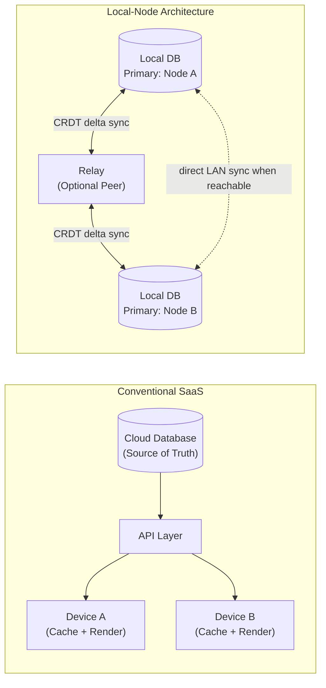
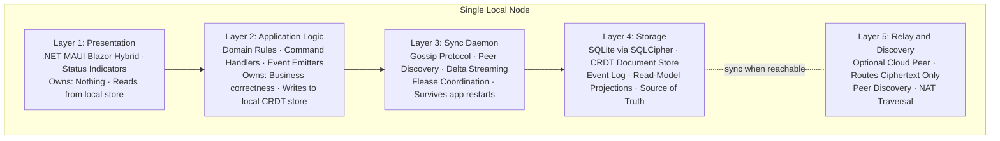

# Chapter 3 — The Inverted Stack in One Diagram

<!-- icm/prose-review -->

<!-- Target: ~3,000 words -->
<!-- Source: v13 §5, Executive Summary comparison table; v5 §2, §2.1, §2.2 -->

---

## The Inversion in One Sentence

Every architectural decision in this book follows from one reversal of priority:

> **Conventional SaaS:** Cloud database is primary — local device caches and renders.  
> **Local-Node Architecture:** Local node is primary — cloud relay is an optional sync peer.

In the conventional model, the local device is a thin client. It renders what the server says to render and writes what the server accepts. Remove the server and the device has nothing — a shell waiting for instructions that will not arrive. In the local-node model, the device *is* the server. The local encrypted database holds the authoritative copy of the user’s data. When peers are reachable, the node exchanges state with them. When no peers are reachable, the node operates at full fidelity. The node has no degraded mode, because it carries no dependency on any remote service for core function.

The relay is optional. Two nodes on the same LAN sync directly via mDNS peer discovery without a relay at all. The relay exists to help nodes find each other across NAT boundaries, not to hold their data. If the relay goes down, nodes fall back to direct peer-to-peer communication on the local network. If that also fails, they work offline and catch up when connectivity returns.

This is the inversion. Everything else is implementation.

---

## The Five Layers

The inversion restructures a five-layer stack. Each layer has a clear owner, a clear boundary, and a clear answer to the question every distributed system must answer: what happens when the network is unavailable?

### Layer 1: Presentation

The presentation layer renders what the local store contains. That is its entire job. It owns no state, caches nothing independently, and makes no decisions about data.

In the Anchor accelerator, this layer is a .NET MAUI Blazor Hybrid shell: a native application window embedding a Blazor WebView that renders Razor components backed by local data. The component surface is identical to the Bridge accelerator’s browser shell — the same `Sunfish.UICore` and `Sunfish.UIAdapters.Blazor` components render regardless of whether the node is a local desktop installation or a hosted tenant instance. This is deliberate. If a UI component only works against a cloud backend, it has not been designed correctly for this architecture.

The presentation layer’s primary local-first responsibility is status indication. Users should always know the state of their data without interrogating it. The `SunfishNodeHealthBar` component (`Sunfish.UIAdapters.Blazor`; pre-1.0) surfaces four states:

- **Sync-healthy:** The node is connected to at least one peer and has exchanged a recent delta.
- **Stale:** The node has not synced within its configured freshness threshold; local data may lag behind changes made by others.
- **Offline:** No peers are reachable. The node is operating on its own authoritative copy.
- **Conflict-pending:** One or more records have diverged from a peer version and require resolution.

When the network is unavailable, the presentation layer changes nothing about its behavior. It continues to render from the local store. The status indicator moves from sync-healthy to offline. The user can still create records, navigate, query, and run any domain workflow that does not require distributed lease coordination. They receive no error page, no spinner, no apology. The software works.

### Layer 2: Application Logic

The application logic layer runs domain business rules. Command handlers receive user intent and translate it into CRDT operations and domain events. It determines what constitutes a valid state transition, enforces invariants, and emits events that both the local store and the sync daemon consume.

This layer holds no network-aware code. It does not know whether the sync daemon is connected to peers. It writes to the local CRDT store unconditionally; the sync daemon propagates those writes when it can, not when consulted before they happen. This is the property that makes full offline operation possible: business logic executes against local state, not against a remote lock or remote validation service.

The one exception is CP-class records — those whose correctness requires distributed coordination, such as resource reservations, financial postings, and scheduled slots where double-booking is worse than unavailability. For these records, the application logic layer consults the sync daemon lease coordinator before writing. If quorum is unreachable, the write blocks and the UI surfaces a clear indicator. This is an explicit design choice: the user sees a constraint, not a mystery failure.

The CAP positioning is per record class, not per application:

| Record Class | CAP Position | Why |
|---|---|---|
| Documents, task descriptions, notes | AP (CRDT merge) | Divergence tolerable; merge is deterministic |
| Team membership, permissions | AP with deferred merge | Identity facts converge after reconnect |
| Resource reservations, scheduled slots | CP (distributed lease) | Double-booking is worse than unavailability |
| Financial transactions | CP (distributed lease + ledger) | Audit integrity requires strict ordering |

When the network is unavailable, AP-class records continue unimpeded. CP-class records that require a lease are unavailable for writes — this is the correct behavior, not a limitation.

### Layer 3: Sync Daemon

The sync daemon is a separate long-running process. It is not a thread in the application. It is not a hosted service that stops when the application window closes. It registers with the OS service manager and runs continuously from login, communicating with the application shell through a Unix domain socket. When the application restarts after a crash, the sync daemon has already been collecting deltas from peers; the application reconnects to a daemon that has been working the whole time.

The daemon manages five concerns:

**Peer discovery.** Discovery follows a three-tier hierarchy. On the local network, mDNS provides zero-configuration discovery — two devices on the same Wi-Fi segment find each other automatically. Across networks, a mesh VPN layer (WireGuard-based) handles NAT traversal without port forwarding. For teams where neither tier is viable, the managed relay provides a final option.

**Gossip anti-entropy.** Every 30 seconds, the daemon selects two random peers from its membership list and exchanges a delta — the operations each holds that the other lacks. Vector clocks track what each peer has seen. This is the same anti-entropy mechanism used by large-scale distributed databases [2]; on a five-person team, it runs across workstations with no infrastructure required.

**Delta streaming.** After the gossip protocol identifies divergence, the daemon streams the missing CRDT operations to each peer. The protocol wire format is CBOR — compact binary encoding that minimizes bandwidth for the intermittent, sometimes slow connections that field deployments encounter.

**Flease lease coordination.** For CP-class records, the daemon participates in distributed lease negotiation. When a node needs to write a resource reservation or financial posting, it broadcasts a lease request. The lease is granted when a quorum of reachable peers acknowledge. Default lease duration is 30 seconds; a node that goes offline releases its lease at expiry so the team is never permanently blocked by one disconnected device.

**Write buffering.** When no peers are reachable, the daemon continues accepting writes from the application logic layer and buffering them to durable local storage. The moment a peer becomes reachable — on the LAN, via VPN, or via the managed relay — the daemon begins working through the buffer. The application never needs to know that writes were queued.

When the network is unavailable, the sync daemon keeps running. It accumulates writes. It attempts peer discovery on its configured schedule. It surfaces link status to the presentation layer. It does not stop.

### Layer 4: Storage

Layer 4 is the source of truth for this node. Everything the presentation layer renders, everything the application logic layer reads, comes from here. Nothing here depends on a remote service.

The primary store is SQLite encrypted with SQLCipher. The encryption key is derived from user credentials using Argon2id and stored in the OS-native keystore — the macOS Keychain, Windows Credential Manager, or equivalent. Physical storage extraction without user credentials yields nothing readable.

Three storage structures coexist:

**The CRDT document store** holds all AP-class data as typed CRDT documents. Map documents hold structured records. List documents hold ordered sequences. Text documents hold rich text. The CRDT library — currently YDotNet (Yjs .NET bindings) in the Sunfish reference implementation, with Loro as the aspirational target when C# bindings mature — handles merge semantics: any two diverged copies of a document produce the same merged result regardless of merge order. The `ICrdtEngine` abstraction keeps the choice of CRDT library reversible.

**The event log** is an append-only sequence of every domain event and CRDT operation the node has ever processed. It never modifies past entries. Current aggregate state derives from replaying this log from the most recent snapshot. This structure provides corruption resistance, point-in-time recovery, and the audit trail that regulated industries require.

**Read-model projections** are materialized views derived from the event log — the tables, indexes, and calculated fields that make queries fast. If a projection becomes corrupted or stale, it is rebuilt from the event log. The event log is the ground truth; projections are a performance optimization.

When the network is unavailable, Layer 4 changes nothing. It continues accepting reads and writes. It has no awareness of whether peers exist.

### Layer 5: Relay and Discovery

Layer 5 is the only layer that touches infrastructure outside the local node, and it is optional.

The relay’s job is narrow: receive encrypted CRDT deltas from one peer, fan them out to co-subscribed peers, and provide a rendezvous point for peer discovery in environments where mDNS and mesh VPN do not reach. The relay holds no authoritative data. It stores no decrypted content. It cannot read the payloads it routes — every delta arrives as ciphertext produced by the sender’s DEK/KEK encryption layer, and the relay has no access to any key.

The relay’s two default trust levels reflect this:

- **Relay-only (default):** The relay receives and routes ciphertext. It cannot decrypt anything. This is the maximum-privacy configuration that satisfies data sovereignty requirements without exception.
- **Attested hosted peer (opt-in):** An administrator explicitly issues the hosted relay node a role attestation, making it a full peer. This enables the relay to participate in quorum for CP-class lease coordination — useful for teams too small to form quorum from workstations alone.

When the relay is unreachable, nodes fall back to direct peer-to-peer communication on the LAN. If that is also unavailable, they continue working offline. The relay’s failure is not the application’s failure.

---

## How This Changes Failure Modes

The conventional failure modes disappear. New ones appear. A complete architecture requires honesty about both.

**What disappears:** The availability dependency on vendor infrastructure is gone. No SaaS outage stops the application from functioning. No vendor shutdown destroys the data. No pricing change can interrupt an in-progress operation. The construction PM submitting a bid at 4:58 PM does not care whether a cloud region is degraded, because his node does not consult that region to function.

**What the relay adds and removes:** A managed relay is a potential single point of failure for discovery and NAT traversal — not for data. If the relay goes down, nodes on the same LAN continue syncing directly. Nodes on different networks cannot discover each other until the relay recovers, but their local state remains intact and they catch up automatically when it comes back. A relay outage is an inconvenience. It is not a data event.

**What the architecture introduces honestly:**

*Endpoint compromise expands the attack surface.* A centralized cloud database is a single high-value target behind enterprise controls. A fleet of workstations is a larger attack surface with heterogeneous security posture. SQLCipher encryption at rest limits the damage from physical device loss — storage extraction without credentials yields ciphertext. But a compromised running node, with the user authenticated, holds live key material in memory. The four-layer defense — encryption at rest, field-level encryption for high-sensitivity records, stream-level data minimization at the sync layer, and circuit breaker quarantine for offline writes — reduces the blast radius per compromised endpoint. It does not eliminate endpoint risk. Chapter 7 addresses the threat model and the key hierarchy without flinching.

*Schema migration complexity increases.* In a centralized SaaS deployment, a schema migration runs once against one database. In a local-node architecture, nodes update independently. A twenty-person team may run five schema versions simultaneously. The expand-contract pattern — new fields additive and backward-compatible during a compatibility window, old fields retired once all active nodes have updated — handles incremental change. Bidirectional lenses handle structural transformations. Schema epochs coordinate breaking changes via quorum agreement. The complexity is real and manageable, but it is categorically harder than single-database migration. Chapter 13 specifies every mechanism.

*CRDT GC debt accumulates.* A CRDT document records every operation in its history. Without garbage collection, a high-churn document grows without bound. The three-tier GC policy — aggressive compaction for stable documents, 90-day retention for active collaboration documents, indefinite retention for compliance-classified records — keeps growth bounded. But GC in a peer-to-peer system requires coordination: a peer offline for three months may return with operations that reference a history the active peers have already compacted. The stale peer recovery protocol handles this case. Chapter 6 covers the failure scenarios. CRDT GC is a real operational concern. This architecture addresses it; it does not make it disappear.

Part II is six rounds of adversarial review by people who were looking for exactly these problems.

---

## The Two Canonical Shapes: Anchor and Bridge

The five-layer model admits two canonical deployment shapes. Both use the same Sunfish component surface, the same sync protocol, and the same five-layer architecture. They differ in where the authoritative data location lives.

**Anchor** is Zone A: offline-by-default local-first. It targets .NET MAUI Blazor Hybrid — a native application embedding a Blazor WebView, running on Windows and macOS desktops. Data lives in a local SQLite database encrypted with SQLCipher. Device identity is a long-lived Ed25519 keypair generated at first run and stored in the OS keystore. Sync is opt-in; a user who never enables sync has a fully functional local application. A user who enables sync connects to a managed relay or a direct peer via the gossip protocol. Anchor is the right shape for professional service firms, field operations, and any environment where network connectivity is unreliable, regulated, or genuinely unavailable. The Sunfish `accelerators/anchor/` directory is the reference implementation — pre-1.0, in active development.

**Bridge** is Zone C: hybrid multi-tenant SaaS. It targets .NET Aspire with a Blazor Server shell and handles multiple commercial tenants with per-tenant data-plane isolation. Each tenant gets a dedicated local-node host process and a dedicated SQLCipher database. The hosted node participates in the tenant’s gossip scope as a ciphertext-only peer by default — it routes encrypted deltas but cannot read them. Tenants who need the hosted node to participate in quorum for CP-class operations can issue it a role attestation explicitly. Bridge is the right shape for organizations that want the deployment simplicity of a hosted service alongside the data sovereignty guarantees of a local-node architecture. The Sunfish `accelerators/bridge/` directory is the reference implementation — pre-1.0, in active development.

Both shapes use `Sunfish.Kernel.Sync` and `Sunfish.Foundation.LocalFirst` (pre-1.0). Neither shape changes the sync protocol, the CAP positioning model, or the storage architecture. The difference between Anchor and Bridge is not two different systems — it is one system instantiated at two different authoritative data locations. A developer who understands the five layers understands both shapes. The choice between them is a deployment decision. Chapter 4 provides the framework for making it.

---

## What Changes for the Developer

This architecture shifts three fundamental habits.

**Writes are local first, propagated second.** In conventional SaaS, a write succeeds when the server acknowledges it. In this model, a write succeeds when it lands in the local store. Sync is asynchronous and non-blocking. Command handlers succeed on local durability, not remote confirmation. Every state mutation must be expressed as a CRDT operation that can be merged with concurrent mutations from other nodes — operations rather than current-state assignments. This discipline is the fundamental shift.

**Business logic owns its correctness independently of the network.** The application logic layer has no implicit network-call path. Every validation, every invariant, every state machine transition runs against local data. Logic that depends on globally consistent current state belongs in the CP-class record category, coordinated through distributed leases. Logic that treats a network call as a validation shortcut fails when the network is absent — which means it fails in the field.

**Failure modes are explicit.** An AP-class write always succeeds locally. A CP-class write either acquires a lease or surfaces a clear constraint. A sync conflict surfaces in the conflict inbox, not as a silent overwrite. The system’s failure modes are designed to be visible. The developer’s job is to wire those signals to the UI correctly, not to paper over them.

The five layers in one diagram are the complete picture. Everything that follows is detail.

---

## References

[1] M. Kleppmann, A. Wiggins, P. van Hardenberg, and M. McGranaghan, “Local-first software: You own your data, in spite of the cloud,” in *Proc. ACM SIGPLAN Int. Symp. New Ideas, New Paradigms, and Reflections on Programming and Software (Onward!)*, Athens, Greece, 2019, pp. 154–178.

[2] M. Kleppmann, *Designing Data-Intensive Applications*, 1st ed. Sebastopol, CA: O’Reilly Media, 2017.
