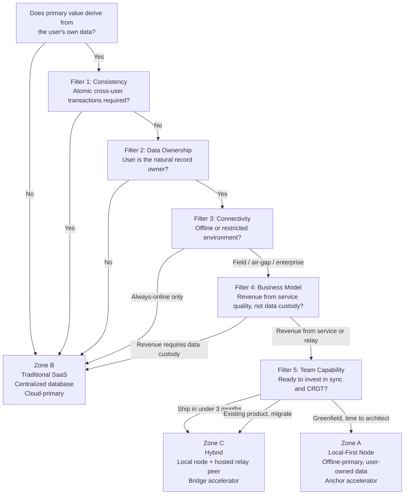

# Chapter 4 — Choosing Your Architecture

<!-- icm/prose-review -->

<!-- Target: ~3,500 words -->
<!-- Source: v13 §20.2–20.8 -->

---

Answer this question before reading any further:

> **Does the primary value of your software come from the user's own data — or from aggregating data across many users?**

If the value lives in a single user's records — their projects, their clients, their documents, their field data — the local-node architecture is the right default. If the value lives in pooled behavior across users — rankings, recommendations, market pricing, social graphs — centralized infrastructure is structurally required. No version of this architecture changes that answer.

---

## The One Question That Decides Everything

Some software's core value pre-exists every other user. A project management tool where a solo user's project list is valuable on day one. A CRM where a consultant's client records matter before any colleague joins. A design tool where the file exists before any reviewer opens it. The user-owned data is the primary asset. The local node is the correct home for that asset. The architecture in this book was built for that case.

Other software earns its value only when many users show up. A global leaderboard. A price-discovery marketplace. A social platform where content is worthless without an audience. The primary asset is aggregated state. That asset needs a coordinator. No local-node design changes that.

Most real products contain both. A project management tool's core value is user-owned. Its org-wide reporting analytics are aggregated. The architecture question is not which category fits the whole product. It is which category fits the *primary* records. Secondary aggregated features can sit on a separate service layer without compromising the architecture for the main data plane.

---

The five filters apply in order. Three of them (F1, F2, F4) can produce hard-stop verdicts; the order matters because any hard stop ends the evaluation. The order also reflects how decisively each filter rules: F1 is a property of the domain (independent of business model and team), F2 is a property of who owns the data (independent of how the team monetizes it), F3 is a property of the operational environment, F4 is a property of the business model, and F5 is a property of the team's capacity. Apply them top-down. If F1 stops the evaluation, F2 through F5 do not run. If F1 and F2 pass but F4 produces a hard stop (revenue requires data custody), the architecture cannot be reconciled with the business — F4 wins, even if F2 and F3 cleared. The five-filter sequence is therefore a precedence chain, not five independent tests.

## Filter 1: Consistency Requirements (Hard Stop)

This is the strongest filter for disqualifying the entire architecture. Answer each question honestly.

| Question | If yes |
|---|---|
| Does any transaction need to be atomic across multiple users *simultaneously*? | **Stop. Centralized only.** |
| Is stale data dangerous — payments, inventory reservations, seat allocations? | **Stop. Centralized only.** |
| Does every user need the exact same truth at the exact same millisecond? | **Stop. Centralized only.** |
| Can users tolerate eventual consistency, where peers may diverge for minutes or hours? | Local-first viable. Continue. |

No distributed system can be both available during partitions and immediately consistent across all nodes. If your domain requires atomic cross-user transactions — a seat reservation that prevents two users from booking the same seat at once, a payment that must debit one ledger and credit another atomically, a trade execution that requires globally consistent state at the moment of settlement — stop here. The local-node architecture is not the right choice for that work.

This does not mean local-node architectures cannot handle financial data. The double-entry ledger is a deliberately specified subsystem here. It handles CP-class operations correctly: local posting with idempotent replay, CQRS read models for aggregated views, period closing with rollup snapshots. The ledger treats certain operations — cross-user settlements, real-time inventory — as out of scope for eventual consistency. If your product's *core loop* requires those operations, you are building a payments processor. You are not building a local-first productivity tool.

The test is specific. Do your *primary* records require atomic cross-user consistency as a moment-to-moment invariant? A field operations manager's daily work log shows yesterday's site activity from a peer who came back online this morning. That is eventual consistency. That is fine. A commodities exchange must show every participant the same order book at the same microsecond. That is a different system. This architecture is not for it.

---

## Filter 2: Data Ownership Profile

Who is the natural owner of the primary records?

| Profile | Model |
|---|---|
| User creates data; data describes the user's own work or clients | Local-first |
| Vendor aggregates anonymous user behavior as the product itself | Centralized |
| User owns their data but wants optional sharing and sync with peers | Local-first + relay |
| Data has value only when pooled: market prices, rankings, recommendations | Centralized |

(Regulatory-custodian-mandated authoritative copy — SEC, FINRA, FDA, certain healthcare and export-controlled workflows — is treated as an F1-class hard stop and is covered in Filter 1's eventual-consistency-not-acceptable cases. If a regulator, not the user or vendor, must hold the system of record, the architecture cannot make that guarantee structurally and the evaluation should have ended at F1.)

The distinction is not who *stores* the data. It is who *creates* it, who *uses* it, and who loses something meaningful if it becomes inaccessible. A construction PM's project files belong to the PM and their firm. The records describe their work, their bids, their subcontractor relationships. No other firm's data makes them more or less useful. The natural owner is obvious.

Contrast that with a platform whose core product is behavioral aggregation. An analytics suite that sells insights derived from usage patterns across its entire user base. A recommendation engine whose value comes from what millions of users clicked last week. The data's value is pooled. No individual user's data is the product. The aggregate is. That architecture requires a central store.

The most common real-world case is mixed ownership. It resolves to Zone C: user-owned records for the day-to-day data plane, with specific aggregated surfaces — org-wide dashboards, cross-team reporting, benchmarking — handled by a separate service. The local-node architecture handles user-owned records. It treats aggregated surfaces as optional read models, not authoritative sources.

If a regulatory custodian — not the user, not the vendor, but a regulator — must hold the authoritative copy, the architecture cannot make that guarantee structurally. Healthcare records under HIPAA, financial records under FINRA, export-controlled data under ITAR: each has frameworks specifying where authoritative custody must reside.

HIPAA accommodates local-first when a Business Associate Agreement covers the storage architecture and audit trails satisfy 45 CFR §164.312's technical safeguards. The administrative safeguards under §164.308 (workforce training, access management, contingency planning) are operator-policy concerns that endpoints make harder, not easier, because each endpoint is its own access boundary. FINRA Rule 4511 and SEC Rule 17a-4 specify third-party WORM storage for broker-dealer records — requirements that may route specific retention flows to a centralized custodian even when day-to-day operations run local-first. Know which regime applies before reaching this filter.

---

## Filter 3: Connectivity and Operational Environment

What are the real operational conditions? Not the happy path. What happens when the network is gone for hours or days?

| Environment | Model |
|---|---|
| Field workers, construction sites, rural offices, mobile-poor coverage | Local-first mandatory |
| Air-gapped facilities: defense, nuclear, certain financial data centers | Local-first mandatory |
| Enterprise with MDM (Mobile Device Management) governance, IT-controlled endpoints, BYOC (Bring Your Own Cloud) storage policy | Local-first node strongly preferred |
| Regulated data residency requirements (GDPR (General Data Protection Regulation), HIPAA, and a growing global set — see atlas below) | Local-first or on-premises |
| Hospital floors, clinical environments, legal depositions in opposing counsel's office | Local-first strongly preferred |
| Always-online, browser-only, zero install friction, anonymous access acceptable | Traditional SaaS (Software as a Service) |

Name the actual deployment environment. Not the cloud provider's SLA (Service Level Agreement) — the physical location where the user sits when they need the software to work.

A structural engineer doing site inspections drives between locations where cell coverage is intermittent at best. A legal team doing document review in a hotel conference room during depositions cannot guarantee stable internet. A nurse on a hospital floor whose building WiFi was designed for administrative staff and retrofitted for clinical use cannot stop charting because a cloud API (Application Programming Interface) returned a timeout. A field operations crew at a rural extraction site may have satellite uptime measured in hours per day with significant latency.

These scenarios frame intermittent connectivity as exceptional. Globally, it is the baseline. Hundreds of millions of enterprise workers across Sub-Saharan Africa, South and Southeast Asia, and rural Latin America operate through load-shedding, 2G/3G coverage gaps, and irregular power — not as edge cases but as daily conditions. For these markets, local-first is not a contingency design. It is the architecture that matches the work.

For these users, the question is not "can the software degrade gracefully?" It is "does the software work without network access?" Degradation is a different failure mode from absence. An app that loads stale data and queues writes is degraded — it still works. An app that shows a spinner and refuses to accept input is broken.

The enterprise environment deserves separate attention. IT departments in regulated industries — finance, healthcare, defense contracting, government — often require that data not leave controlled infrastructure. A cloud SaaS where data lives on a vendor's servers in a region the vendor selects fails this requirement directly. A local-node architecture where data lives on MDM-managed endpoints under IT's control passes it. The data residency properties this architecture provides as a structural side effect of its design are a primary procurement advantage in enterprise sales — not a secondary nice-to-have.

The regulatory landscape behind this filter is now global. European pressure comes from the 2020 Schrems II ruling, which constrains EU personal data transfers to US cloud providers without supplemental safeguards — followed by the 2023 EU-US Data Privacy Framework, which provides an alternative transfer mechanism for participating US organizations but is itself in active legal review and may not survive the next round of court challenges. National enforcement runs through Germany's BSI (Bundesamt für Sicherheit in der Informationstechnik) and France's CNIL (Commission nationale de l'informatique et des libertés). India's DPDP (Digital Personal Data Protection) Act 2023 and the RBI (Reserve Bank of India) data localization circular, the UAE's DIFC (Dubai International Financial Centre) DPL (Data Protection Law) 2020 (which may legally prohibit foreign cloud storage for DIFC-licensed financial entities), and Russia's Federal Law 242-FZ — among the first general-purpose data localization laws globally, predating GDPR by two years — are representative; the full coverage matrix across GCC (Gulf Cooperation Council), APAC (Asia-Pacific), African, and Americas markets is in Appendix F. In each jurisdiction, the architecture where data lives on the user's own hardware is the architecture that makes compliance tractable. In several (DIFC, RBI, 242-FZ, PIPL (Personal Information Protection Law)), it is closer to the architecture the law requires.

If your users work offline regularly — or in environments where they *should* be able to work offline even if they currently cannot — the connectivity filter points toward local-first.

---

## Filter 4: Business Model Alignment

Does the business model depend on controlling data access — or does it thrive when users control their own data?

| Situation | Implication |
|---|---|
| Revenue from monthly access to a hosted service where data lives server-side | Traditional SaaS viable — exposed to switching-cost erosion over time |
| Revenue from support, professional services, managed relay, or tooling extensions | Local-first strongly viable |
| Network effects require all users on a single shared platform to function | Centralized required |
| Enterprise sales with security review, vendor risk assessment, data residency audit | Local-first node (structurally easier to pass procurement review) |
| Open-source sustainability with a managed hosted offering as the revenue path | Local-first strongly preferred |

This filter catches a mismatch technical teams often miss. A team builds the right local-node architecture for its domain. Then it adopts a business model that requires controlling data access. It has built an internal contradiction. The local-node architecture is structurally incompatible with monetization that depends on data custody.

If revenue requires that users *cannot* access their data without the vendor's platform — per-API-call billing, subscription gating that prevents export, data lock-in as the primary retention mechanism — the local-node architecture actively undermines the business. Users who own their data can leave. If making departure difficult is the retention strategy, this architecture makes that strategy impossible to execute.

If revenue comes from service quality, support, the convenience of a managed relay, additional tooling, or enterprise support contracts, the local-node architecture is additive. Users who own their data and can export it freely still pay for a well-run relay, responsive support, and a team that handles the infrastructure complexity they do not want to manage. The managed relay is the correct unit of competitive analysis. Users pay for the service, not for access to their own data.

Dual-licensing — an open-source core with a commercial managed offering — is the strongest alignment pattern for this architecture. The community version provides the open core. The commercial offering provides the managed relay, the enterprise MDM tooling, the security audit documentation, and the SLA. Revenue scales with the quality of the service, not with the difficulty of leaving.

One clarification European procurement officers will ask for. Relay failure degrades sync and cross-organization collaboration. It does not affect local operation or data access. A team whose relay provider fails keeps working on the local plane and replaces the relay without data migration. The relay is replaceable infrastructure, not a data custodian.

---

## Filter 5: Team Capability and Timeline

This filter governs *when* and *how*. It does not govern *whether*. A team fully committed to Zone A that ships nothing in the first year serves no user. Honest capability assessment prevents that outcome.

| Constraint | Implication |
|---|---|
| Need to ship in under 3 months | Start with traditional SaaS; architect for local-node migration from day one |
| Team has no CRDT (Conflict-free Replicated Data Type) or distributed sync experience | Budget 3–6 months for CRDT and sync; add 1–3 months for key management design before production |
| Existing hosted product with established user base and historical data | Hybrid: retain cloud as sync relay, add local-node capability incrementally |
| Greenfield project with a team prepared to invest in the architecture | Local-first node from day one |

Four skills separate local-node development from standard web application development. Acquire them honestly; do not assume they transfer automatically.

**CRDT debugging.** When two peers diverge and produce unexpected merged state, the developer must understand which CRDT types were involved, which operations arrived in which order, and what the merge semantics guarantee. This is not "find the bug and fix it." This is reasoning about convergent state under uncertainty. The mental model is different from debugging a request-response API.

**Distributed state management.** The local node holds authoritative state that must remain consistent under concurrent local edits, incoming sync deltas, and schema migrations simultaneously. Each of these can conflict with the others. Managing that state correctly — knowing when to apply incoming deltas immediately, when to defer them, when to reject them — requires explicit design, not improvisation.

**Schema migration in a multi-version environment.** Nodes update independently. At any given moment, the user base runs a distribution of software versions. A schema migration must work correctly when a newly updated node exchanges data with a node running two versions behind. The expand-contract pattern — adding new fields before removing old ones, maintaining backward-compatible event formats during a transition window, retiring old formats only after the compatibility window closes — is not optional.

**Key management.** The architecture requires per-document data encryption keys, per-role key encryption keys, and device identity keys. Rotation, revocation, and recovery procedures must be designed and implemented before the first production deployment. A team that has not designed key compromise recovery before shipping has created a data loss risk that cannot be resolved under pressure. Plan one to three months for key hierarchy design and rotation procedure implementation before naming a production date.

These skills are learnable, not rare. The combined estimate — three to six months for CRDT and sync plus one to three months for key management — reflects real project history, not pessimism. Teams that treat those months as a legitimate investment ship stable systems. Teams that skip them ship systems that fail on reconnection edge cases and schema incompatibilities in the field.

Engineering capability is necessary but not sufficient. A team that clears all four engineering skills above can still ship Zone A and discover six months later that they cannot operate it. Operational capability is the second half of F5: fleet telemetry exported from unowned endpoints (which fleet members synced recently, which schema version each runs, key-rotation events), MDM coordination with customer IT on installer signing and configuration profiles, supply-chain signing with notarization and a published SBOM, and on-call runbooks for common fleet failure modes (quorum loss, schema-version skew, certificate rotation). Each is a real engineering commitment, not a nice-to-have. Part IV (Chapters 17–20) and Chapter 21 specify the playbooks; a team that treats operational capability as something to figure out post-launch ships software that fails customer 1.

---

## The Three Outcome Zones

Running the five filters produces one of three conclusions. The three Zones are presented as discrete categories because most projects land cleanly in one — but they are anchor points on a spectrum, not a strict partition. Some projects sit between Zone A and Zone C (a small team starting Anchor-style on the Anchor accelerator and adding a hosted relay later), and one valid migration path moves a Zone C deployment toward Zone A over years as engineering capacity grows. Read the Zones as the three positions most teams settle at, not as the only positions the architecture supports.

**Zone A — Local-First Node**

All five filters clear without a hard stop. The team has the timeline and capability to build the full architecture from the start. Zone A is the pure form. Every user runs a complete local node. The relay is optional infrastructure for peer discovery and backup. The software operates at full fidelity without any server.

Zone A applies to: single-tenant or team-scoped productivity and business software; offline or regulated operational environments; software whose core value exists before any other user joins; professional or enterprise users who install software and expect it to stay installed. Representative domains: project management, professional CRM, field operations tools, legal and healthcare records management, engineering and design applications.

The Zone A operational picture: a fleet of MDM-managed endpoints running the Anchor accelerator (Sunfish `accelerators/anchor/`), a self-hosted or managed relay coordinating peer discovery and serving as a fan-out point when LAN sync is not viable, and a fleet observability pipeline collecting per-endpoint sync-health, schema-version, and key-rotation telemetry. When the relay fails, day-to-day work continues on the local plane; sync catches up when the relay returns. Part III (Chapters 11–16) specifies the architecture; Part IV (Chapters 17–20) and Chapter 21 specify the playbooks for shipping, MDM packaging, enterprise procurement, and fleet operations.

**Zone B — Traditional SaaS or Website**

Filter 1 or Filter 2 (or Filter 4) produced a hard "Centralized only" verdict. Zone B is the correct answer for: multi-tenant aggregation as the core value proposition; anonymous public access without persistent identity; millisecond global consistency as a domain requirement; pure content delivery; and one common scope-driven case worth naming: a small-team, fast-ship, low-stakes greenfield project where the architecture in this book would be overkill. A two-person team prototyping a public-facing web app over a weekend should not be carrying CRDT debugging discipline as overhead. Zone B is the right answer there too.

Zone B is the right answer for a significant category of software. Building financial trading infrastructure on a local-node architecture is not principled — it is wrong for the domain. The architecture serves specific problems, and those problems are identified by passing all five filters.

**Zone C — Hybrid**

The filters pass for user-scoped primary records but fail for specific coordination features — or Filter 5 indicates a timeline that cannot support the full Zone A investment immediately. Zone C is the most frequent outcome for enterprise software teams adopting local-first incrementally. The local node handles all user-owned data and day-to-day compute. The cloud relay handles sync, cross-organization collaboration, payments, and compliance reporting. A traditional web layer handles public-facing surfaces. The Bridge accelerator (Sunfish `accelerators/bridge/`) is the reference implementation; Chapter 18 specifies the Zone C migration playbook for an existing hosted SaaS product.

Zone C also applies to teams migrating an existing SaaS product. Retaining cloud infrastructure as the sync relay while adding local-node capability incrementally is a legitimate migration path, not a compromise. Hybrids designed to move toward Zone A over time stay architecturally honest. Hybrids that allow server-side logic to accumulate indefinitely tend to re-centralize gradually — a failure mode the epilogue addresses directly.

One legal nuance worth surfacing for European procurement: under GDPR Article 28, a managed-relay operator that routes encrypted traffic without holding decryption keys is acting as a processor rather than a controller, and the relay-operator-as-processor question is a recurring procurement topic. Chapter 15 specifies the data-processing-agreement template and the relay-operator legal posture in detail.

### Per-Zone Compliance Posture

Each Zone enables a different default compliance posture for the major regulatory regimes. The framework below names the structural baseline; Chapter 15 specifies the supplemental controls and Appendix F details the per-jurisdiction obligations.

| Regulatory regime | Zone A (Local-First Node) | Zone C (Hybrid) | Zone B (Traditional SaaS) |
|---|---|---|---|
| **GDPR / Schrems II** | Data residency satisfied structurally; relay holds ciphertext only | Same as Zone A on the data-plane; relay-operator-as-processor agreement under Article 28 required | Requires Standard Contractual Clauses + supplemental safeguards per Schrems II |
| **HIPAA** | §164.312 technical safeguards met by encryption-at-rest + role-scoped keys; §164.308 administrative safeguards depend on the operator's policies | Same as Zone A on the local-data plane; BAA covers the relay operator | BAA with vendor required; administrative safeguards covered by vendor's compliance program |
| **DIFC DPL / GCC residency laws** | Authoritative data on user-controlled hardware in-jurisdiction; satisfied by default | Same as Zone A if relay is in-jurisdiction; otherwise transfer requirements apply | Requires in-jurisdiction cloud region + cross-border transfer governance |
| **India DPDP / RBI circular** | User-controlled storage in-jurisdiction satisfies localization | Relay placement determines transfer posture | Requires in-jurisdiction infrastructure |
| **China PIPL** | User-controlled storage in-jurisdiction satisfies most data-localization rules; security assessment still required for cross-border transfers | Same as Zone A if relay is in-jurisdiction; cross-border transfer requires CAC security assessment | Requires CAC-approved cross-border transfer mechanism (security assessment, standard contract, or certification) |
| **Brazil LGPD** | User-controlled storage satisfies data-subject rights structurally | Relay placement determines transfer posture; requires DPA with relay operator | Requires LGPD-compliant transfer mechanism (international cooperation, contractual clauses, certification) |
| **Japan APPI / Korea PIPA** | User-controlled storage in-jurisdiction simplifies cross-border-transfer analysis | Relay placement governs transfer posture; opt-in consent for cross-border transfer typically required | Requires explicit consent or equivalent mechanism for cross-border transfer of personal data |
| **South Africa POPIA / Nigeria NDPR** | In-jurisdiction user-controlled storage satisfies the residency-leaning provisions | Same as Zone A if relay is in-jurisdiction; otherwise transfer-restriction analysis applies | Requires in-jurisdiction infrastructure or compliant cross-border transfer mechanism |
| **Russia 242-FZ** | Personal-data storage on Russian-territory user-controlled hardware satisfies the requirement structurally | Relay must be in-territory for the personal-data flow; or storage component must remain in-jurisdiction with transfer restrictions | Requires in-territory cloud infrastructure for any personal-data-handling subsystem |
| **SOC 2** | Vendor's own SOC 2 covers software-supply-chain controls; customer's IT covers endpoint operation | Vendor's SOC 2 covers software + relay; customer's IT covers endpoints | Vendor's SOC 2 covers everything end-to-end |

The table inverts a common assumption. Local-first does not skip compliance; it shifts where compliance burden sits. Zone A moves operational compliance toward the customer's IT (which is often what regulated customers want, because they already have the controls). Zone B keeps compliance with the vendor (which is often what customers without strong IT want). Zone C splits the burden along the same line as the data plane.

### A Worked Example: The Construction-Industry SaaS Migration

A 60-person construction-industry software company has shipped a hosted SaaS for project bid management since 2019. Their largest customers are general contractors in Texas, Saudi Arabia, and Germany. The Saudi customer's IT team has flagged data residency as a procurement blocker; the German customer's data protection officer has raised Schrems II concerns; the Texas customer is happy with the current product but is rebidding the contract. The team is evaluating whether to migrate to Zone A, Zone C, or stay in Zone B.

*Filter 1 (Consistency).* Project bids, takeoff sheets, RFI logs, and submittal histories are not atomic-cross-user transactions. A two-hour eventual-consistency window during reconnection is acceptable. The double-entry change-order ledger is the one subsystem that may need CP-class treatment, but it can be modeled as a per-project lease — a Flease-coordinated lease scoped to one project, specified in Chapter 14. **Pass.**

*Filter 2 (Data ownership).* Each general contractor's project data describes their own work, their own subcontractors, and their own contractual obligations. No regulatory custodian needs to hold the authoritative copy. **User is the natural owner. Local-first.**

*Filter 3 (Connectivity).* Field superintendents work on construction sites with intermittent cellular coverage. Owner conferences happen in client offices behind enterprise firewalls. **Local-first mandatory.**

*Filter 4 (Business model).* Revenue comes from per-seat subscription to a managed service: bid templates, integration with QuickBooks and Procore, tier-2 support. Users do not lose data when subscriptions lapse — historical bids remain readable. The business model thrives when users own their data. **Local-first viable.**

*Filter 5 (Team capability).* The team has built sync engines before but not CRDT-based ones. Existing customers cannot tolerate a six-month feature freeze for a from-scratch rewrite. Greenfield Zone A is not the right shape. **Zone C — Hybrid migration, retain cloud relay, add local-node capability incrementally.**

Verdict: Zone C. The team adopts the Bridge accelerator pattern, runs Phase 1 (data-plane local replicas with read-through to the existing API) for 90 days, then Phase 2 (write-path migration to local-first with the existing API as a sync relay) over the following six months. Chapter 18 specifies this migration playbook in detail.

---

## The Practical Shortcut

If the five filters feel like too much evaluation for a project in early discovery, three questions produce a fast answer for most cases.

**Does the user own their primary records?** The records describe the user's work, their clients, their projects. The user retains meaningful access even if they stop paying. If yes — the local-node architecture is the right default.

**Does the team need to work offline for extended periods?** Not "it would be nice if offline worked." Users are in environments where reliable connectivity cannot be guaranteed and the software must work regardless. If yes — the architecture needs to treat offline as the primary case, not a fallback.

**Does the product need to outlive vendor infrastructure?** The software should keep working regardless of whether the vendor survives, is acquired, changes its pricing, or is directed to stop serving your jurisdiction — as hundreds of thousands of organizations in Russia and CIS (Commonwealth of Independent States) markets learned in 2022 when Western SaaS vendors suspended service under sanctions enforcement. If yes — the product must hold its own authoritative data. Software that depends on a vendor server to function cannot outlive the vendor's continued permission to serve you.

If all three answers are yes: Zone A or Zone C. Start with Anchor (the Zone A local-first desktop accelerator) for a greenfield. Start with Bridge (the Zone C hybrid SaaS accelerator) for a migration or hybrid deployment. Run the full five filters to confirm no blocking constraint applies.

If any answer is no: identify which filter captures it. A "no" on the first question is Filter 2. A "no" on the second is a Zone C tolerance. A "no" on the third is Filter 4 — a business model that requires data custody. Each has a specific implication, and the relevant filter section above addresses it.

The shortcut identifies whether a full evaluation is worth the time. It does not replace the filters for a production architectural decision.

---

## What You Have Earned

A reader who cleared all five filters has earned an architecture that outlives vendor decisions, works through connectivity gaps and power interruptions, and satisfies compliance in every major regulatory jurisdiction. Anchor is the Zone A reference implementation for greenfield local-first projects. Bridge is the Zone C reference for teams migrating an existing SaaS product or offering a hosted option alongside a self-hosted one. Both reference Sunfish (the open-source reference implementation, [github.com/ctwoodwa/Sunfish](https://github.com/ctwoodwa/Sunfish)) packages — pre-1.0 implementations of the architecture this book specifies, not finished products — and both are specified in full in Part IV.

Before that implementation, Part II stress-tests the architecture against the hardest objections five domain experts could construct. The council did not begin as believers. They began as skeptics. Every block they raised, every condition they imposed, and every objection they cleared makes the architecture stronger and the failure modes better understood.
