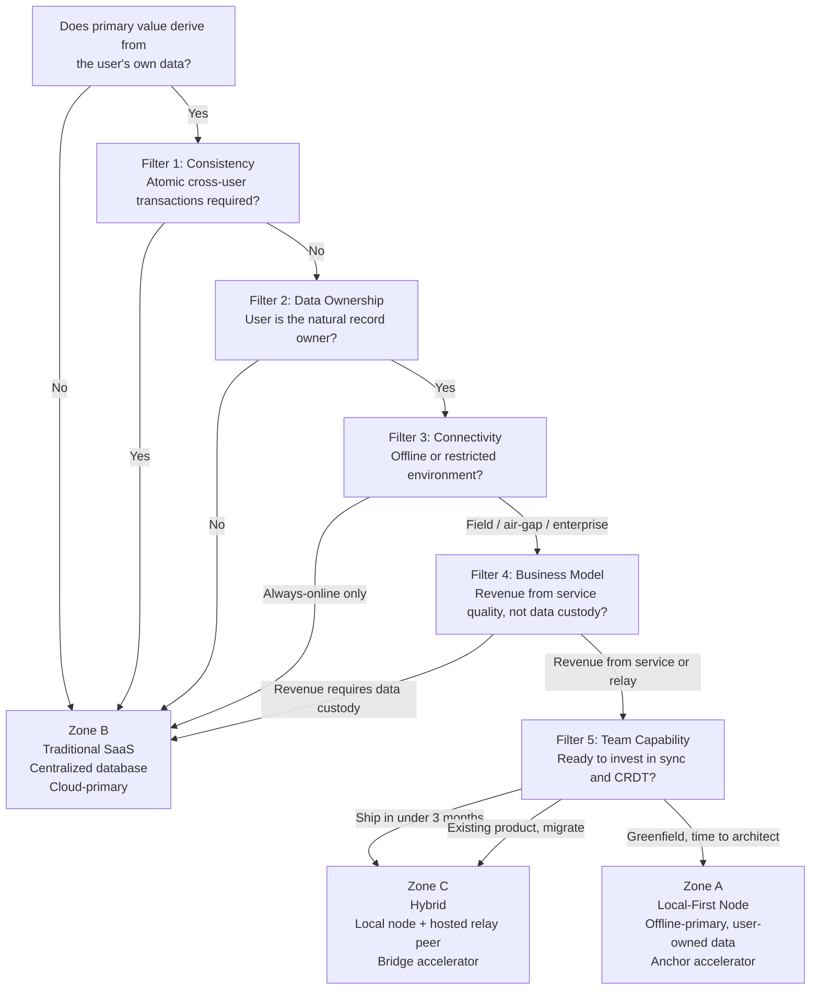

# Chapter 4 — Choosing Your Architecture

<!-- icm/prose-review -->

<!-- Target: ~3,500 words -->
<!-- Source: v13 §20.2–20.8 -->

---

Answer this question before reading any further:

> **Does the primary value of your software come from the user's own data — or from aggregating data across many users?**

If the value comes from a single user's records — their projects, their clients, their documents, their field data — the local-node architecture is the right default. If the value comes from pooling behavior across users — rankings, recommendations, market pricing, social graphs — centralized infrastructure is structurally required. No version of this architecture changes that answer.

---

## The One Question That Decides Everything

Software whose core value pre-exists any other user — a project management tool where a solo user's project list is valuable on day one, a CRM where a consultant's client records matter before any colleague joins, a design tool where the file exists before any reviewer opens it — has user-owned data as its primary asset. The local node is the correct home for that asset. The architecture in this book was built for that case.

Software whose value emerges only when many users are present — a global leaderboard, a price-discovery marketplace, a social platform where content is worthless without an audience — has aggregated state as its primary asset. That asset requires a coordinator. No local-node design changes that.

Most real products contain both. A project management tool's core value is user-owned. Its org-wide reporting analytics are aggregated. The architecture question is not which category applies to the whole product — it is which category applies to the *primary* records. Secondary aggregated features can sit on a separate service layer without compromising the architecture for the main data plane.

---

## Filter 1: Consistency Requirements (Hard Stop)

This is the only filter that can disqualify the entire architecture. Answer each question honestly.

| Question | If yes |
|---|---|
| Does any transaction need to be atomic across multiple users *simultaneously*? | **Stop. Centralized only.** |
| Is stale data dangerous — payments, inventory reservations, seat allocations? | **Stop. Centralized only.** |
| Does every user need the exact same truth at the exact same millisecond? | **Stop. Centralized only.** |
| Can users tolerate eventual consistency, where peers may diverge for minutes or hours? | Local-first viable. Continue. |

No distributed system can be both available during partitions and immediately consistent across all nodes. If your domain requires atomic cross-user transactions — a seat reservation that prevents two users from booking the same seat simultaneously, a payment that must debit one ledger and credit another atomically, a trade execution that requires globally consistent state at the moment of settlement — stop here. The local-node architecture is not the right choice.

This does not mean local-node architectures cannot handle financial data. The double-entry ledger is a deliberately specified subsystem in this architecture, and it handles CP-class operations correctly: local posting with idempotent replay, CQRS read models for aggregated views, period closing with rollup snapshots. But the ledger treats certain operations — cross-user settlements, real-time inventory — as out of scope for eventual consistency. If your product's *core loop* requires those operations, you are building a payments processor, not a local-first productivity tool.

The test is specific: do your *primary* records require atomic cross-user consistency as a moment-to-moment invariant? If a field operations manager's daily work log can show yesterday's site activity from a peer who came back online this morning, that is eventual consistency and it is fine. If a commodities exchange must show every participant the same order book at the same microsecond, that is a different system and this architecture is not for it.

---

## Filter 2: Data Ownership Profile

Who is the natural owner of the primary records?

| Profile | Model |
|---|---|
| User creates data; data describes the user's own work or clients | Local-first |
| Vendor aggregates anonymous user behavior as the product itself | Centralized |
| Regulatory custodian must hold the authoritative copy (SEC, FINRA, FDA) | Centralized |
| User owns their data but wants optional sharing and sync with peers | Local-first + relay |
| Data has value only when pooled: market prices, rankings, recommendations | Centralized |

The key distinction is not who *stores* the data — it is who *creates* it, who *uses* it, and who loses something meaningful if it becomes inaccessible. A construction PM's project files belong to the PM and their firm. Those records describe their work, their bids, their subcontractor relationships. No other firm's data makes them more or less useful. The natural owner is obvious.

Contrast that with a platform whose core product is behavioral aggregation — an analytics suite that sells insights derived from usage patterns across its entire user base, or a recommendation engine whose value comes from what millions of users clicked last week. The data's value is pooled. No individual user's data is the product; the aggregate is. That architecture requires a central store.

The most common real-world case is mixed ownership, which resolves to Zone C: user-owned records for the day-to-day data plane, with specific aggregated surfaces — org-wide dashboards, cross-team reporting, benchmarking — handled by a separate service. The local-node architecture handles user-owned records and treats the aggregated surfaces as optional read models, not authoritative sources.

If a regulatory custodian — not the user, not the vendor, but a regulator — must hold the authoritative copy, the architecture cannot make that guarantee structurally. Healthcare records under HIPAA, financial records under FINRA, export-controlled data under ITAR: each has regulatory frameworks specifying where authoritative custody must reside. Some of those frameworks accommodate local-first with appropriate controls. Some cannot. Know which regime applies before reaching this filter.

---

## Filter 3: Connectivity and Operational Environment

What are the real operational conditions? Not the happy path — what happens when the network is gone for hours or days?

| Environment | Model |
|---|---|
| Field workers, construction sites, rural offices, mobile-poor coverage | Local-first mandatory |
| Air-gapped facilities: defense, nuclear, certain financial data centers | Local-first mandatory |
| Enterprise with MDM governance, IT-controlled endpoints, BYOC storage policy | Local-first node strongly preferred |
| Regulated data residency requirements: GDPR, HIPAA, FedRAMP, ITAR | Local-first or on-premises |
| Hospital floors, clinical environments, legal depositions in opposing counsel's office | Local-first strongly preferred |
| Always-online, browser-only, zero install friction, anonymous access acceptable | Traditional SaaS |

Name the actual deployment environment. Not the cloud provider's SLA — the physical location where the user sits when they need the software to work.

A structural engineer doing site inspections drives between locations where cell coverage is intermittent at best. A legal team doing document review in a hotel conference room during depositions cannot guarantee stable internet. A nurse on a hospital floor whose building WiFi was designed for administrative staff and retrofitted for clinical use cannot stop charting because a cloud API returned a timeout. A field operations crew at a rural extraction site may have satellite uptime measured in hours per day with significant latency.

For these users, the question is not "can the software degrade gracefully?" It is "does the software work without network access?" Degradation is a different failure mode from absence. An app that loads stale data and queues writes is degraded — it still works. An app that shows a spinner and refuses to accept input is broken.

The enterprise environment deserves separate attention. IT departments in regulated industries — finance, healthcare, defense contracting, government — often require that data not leave controlled infrastructure. A cloud SaaS where data lives on a vendor's servers in a region selected by the vendor fails this requirement directly. A local-node architecture where data lives on MDM-managed endpoints under IT's control passes it. The data residency properties that the local-node architecture provides as a structural side effect of its design are a primary procurement advantage in enterprise sales — not a secondary nice-to-have.

If your users work offline regularly, or in environments where they *should* be able to work offline even if they currently cannot, the connectivity filter points toward local-first.

---

## Filter 4: Business Model Alignment

Does the business model depend on controlling data access — or does it thrive when users control their own data?

| Situation | Implication |
|---|---|
| Revenue from monthly access to a hosted service where data lives server-side | Traditional SaaS viable — exposed to switching-cost erosion over time |
| Revenue from support, professional services, managed relay, or tooling extensions | Local-first strongly viable |
| Network effects require all users on a single shared platform to function | Centralized required |
| Enterprise sales with security review, vendor risk assessment, data residency audit | Local-first node (structurally easier to pass procurement review) |
| Open-source sustainability with a managed hosted offering as the revenue path | Local-first strongly preferred |

This filter catches a mismatch that technical teams often miss. A team that builds the right local-node architecture for their domain and then adopts a business model that requires controlling data access has built an internal contradiction. The local-node architecture is structurally incompatible with monetization that depends on data custody.

If revenue requires that users *cannot* access their data without the vendor's platform — per-API-call billing, subscription gating that prevents export, data lock-in as the primary retention mechanism — the local-node architecture actively undermines the business. Users who own their data can leave. If making departure difficult is the retention strategy, this architecture makes it impossible to execute.

If revenue comes from service quality, support, the convenience of a managed relay, additional tooling, or enterprise support contracts, the local-node architecture is additive. Users who own their data and can export it freely still choose to pay for a well-run relay, responsive support, and a team that handles the infrastructure complexity they do not want to manage. The managed relay is the correct unit of competitive analysis: users pay for the service, not for access to their own data.

Dual-licensing — an open-source core with a commercial managed offering — is the strongest alignment pattern for this architecture. The community version provides the open core. The commercial offering provides the managed relay, the enterprise MDM tooling, the security audit documentation, and the SLA. Revenue scales with the quality of the service, not with the difficulty of leaving.

---

## Filter 5: Team Capability and Timeline

This filter governs *when* and *how*, not *whether*. A team fully committed to Zone A that ships nothing in the first year serves no user. Honest capability assessment prevents that outcome.

| Constraint | Implication |
|---|---|
| Need to ship in under 3 months | Start with traditional SaaS; architect for local-node migration from day one |
| Team has no CRDT or distributed sync experience | Budget 3–6 additional months before production deployment |
| Existing hosted product with established user base and historical data | Hybrid: retain cloud as sync relay, add local-node capability incrementally |
| Greenfield project with a team prepared to invest in the architecture | Local-first node from day one |

Four skills separate local-node development from standard web application development. Teams need to acquire them honestly, not assume they transfer automatically.

**CRDT debugging.** When two peers diverge and produce unexpected merged state, the developer must understand which CRDT types were involved, which operations arrived in which order, and what the merge semantics guarantee. This is not "find the bug and fix it" — it is reasoning about convergent state under uncertainty. The mental model is different from debugging a request-response API.

**Distributed state management.** The local node holds authoritative state that must remain consistent under concurrent local edits, incoming sync deltas, and schema migrations simultaneously. Each of these can conflict with the others. Managing that state correctly — knowing when to apply incoming deltas immediately, when to defer them, when to reject them — requires explicit design, not improvisation.

**Schema migration in a multi-version environment.** Nodes update independently. At any given moment, the user base runs a distribution of software versions. A schema migration must work correctly when a newly updated node exchanges data with a node running two versions behind. The expand-contract pattern — adding new fields before removing old ones, maintaining backward-compatible event formats during a transition window, retiring old formats only after the compatibility window closes — is not optional.

**Key management.** The architecture requires per-document data encryption keys, per-role key encryption keys, and device identity keys. Rotation, revocation, and recovery procedures must be designed and implemented before the first production deployment. A team that has not designed key compromise recovery before shipping has created a data loss risk that cannot be resolved under pressure.

These skills are learnable, not rare. The estimate of 3–6 additional months for a team without prior sync experience reflects real project history, not pessimism. Teams that treat those months as a legitimate investment ship stable systems. Teams that skip them ship systems that fail on reconnection edge cases and schema incompatibilities in the field.

---

## The Three Outcome Zones

Running the five filters produces one of three conclusions.

**Zone A — Local-First Node**

All five filters clear without a hard stop, and the team has the timeline and capability to build the full architecture from the start. Zone A is the pure form: every user runs a complete local node, the relay is optional infrastructure for peer discovery and backup, and the software operates at full fidelity without any server.

Zone A applies to: single-tenant or team-scoped productivity and business software; offline or regulated operational environments; software whose core value exists before any other user joins; professional or enterprise users who install software and expect it to stay installed. Representative domains: project management, professional CRM, field operations tools, legal and healthcare records management, engineering and design applications.

**Zone B — Traditional SaaS or Website**

Filter 1 or Filter 2 produced a hard "Centralized only" verdict. Zone B is the correct answer for: multi-tenant aggregation as the core value proposition; anonymous public access without persistent identity; millisecond global consistency as a domain requirement; pure content delivery.

Zone B is the right answer for a significant category of software. Building financial trading infrastructure on a local-node architecture is not principled — it is wrong for the domain. The architecture serves specific problems, and those problems are identified by passing all five filters.

**Zone C — Hybrid**

The filters pass for user-scoped primary records but fail for specific coordination features — or Filter 5 indicates a timeline that cannot support the full Zone A investment immediately. Zone C is the most frequent outcome for enterprise software teams adopting local-first incrementally. The local node handles all user-owned data and day-to-day compute. The cloud relay handles sync, cross-organization collaboration, payments, and compliance reporting. A traditional web layer handles public-facing surfaces.

Zone C also applies to teams migrating an existing SaaS product. Retaining cloud infrastructure as the sync relay while adding local-node capability incrementally is a legitimate migration path, not a compromise. Hybrids designed to move toward Zone A over time stay architecturally honest. Hybrids that allow server-side logic to accumulate indefinitely tend to re-centralize gradually — a failure mode the epilogue addresses directly.

---

## The Practical Shortcut

If the five filters feel like too much evaluation for a project in early discovery, three questions produce a fast answer for most cases.

**Does the user own their primary records?** The records describe the user's work, their clients, their projects. The user retains meaningful access even if they stop paying. If yes — the local-node architecture is the right default.

**Does the team need to work offline for extended periods?** Not "it would be nice if offline worked" — users are in environments where reliable connectivity cannot be guaranteed and the software must work regardless. If yes — the architecture needs to treat offline as the primary case, not a fallback.

**Does the product need to outlive vendor infrastructure?** The software should continue to work regardless of whether the vendor survives, is acquired, or changes its pricing. If yes — the product must hold its own authoritative data. Software that requires a vendor server to function cannot outlive the vendor.

If all three answers are yes: Zone A or Zone C. Start with Anchor for a greenfield. Start with Bridge for a migration or hybrid deployment. Run the full five filters to confirm there is no blocking constraint.

If any answer is no: identify which filter captures it. A "no" on the first question is Filter 2. A "no" on the second is a Zone C tolerance. A "no" on the third is Filter 4 — a business model that requires data custody. Each has a specific implication, and the relevant filter section above addresses it.

The shortcut identifies whether a full evaluation is worth the time. It does not replace the filters for a production architectural decision.

---

## Anchor Is Your Zone A. Bridge Is Your Zone C.

The framework in this chapter has given you a method. If you ran the filters and the architecture applies, the next question is where to start building.

Anchor is the Zone A reference implementation. It provides .NET MAUI Blazor Hybrid application scaffolding, SQLCipher encrypted local storage, Ed25519 device identity, a gossip-based sync daemon with mDNS local peer discovery, QR-code device onboarding, and the foundational local-first UX primitives — offline status indicators, sync state tokens, conflict surfacing. You bring the domain; Anchor brings the stack.

Bridge is the Zone C reference implementation. It provides per-tenant data-plane isolation on a hosted node, a ciphertext-only relay where the server coordinates sync without ever accessing plaintext data, and the hybrid architecture that lets user-owned records live locally while the cloud handles cross-tenant coordination. Bridge is the right starting point for teams migrating an existing SaaS product toward local-first properties, or for teams whose enterprise customers need a vendor-hosted option alongside a self-hosted one.

Both accelerators reference packages from the Sunfish project — `Sunfish.Kernel.Sync`, `Sunfish.Foundation.LocalFirst`, `Sunfish.Kernel.Security` — whose APIs are stable at the architectural level and evolving at the method level. They are pre-1.0 implementations of the architecture this book specifies, not finished products.

Part IV walks through both accelerators in detail. Before reaching that implementation, Part II stress-tests the architecture against the hardest objections five domain experts could construct. The council did not begin as believers. They began as skeptics. Every block they raised, every condition they imposed, and every objection they cleared makes the architecture stronger and the failure modes better understood.

That is where this book goes next.
