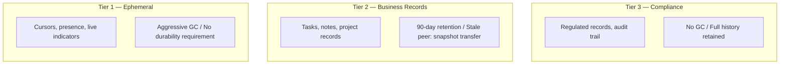
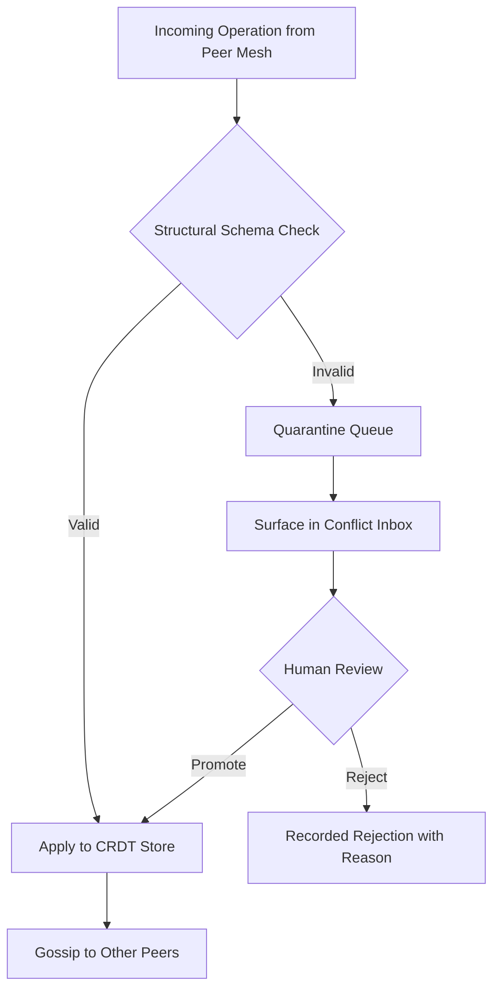

# Chapter 6 — The Distributed Systems Lens

<!-- icm/prose-review -->

<!-- Target: ~3,500 words -->
<!-- Source: R1 Shevchenko, R2 Shevchenko, v13 §2, §6, §9 -->

---

## Who Is Prof. Shevchenko

Prof. Dmitri Shevchenko has published fourteen papers on CRDT (Conflict-free Replicated Data Type) correctness, consensus protocols, and eventual consistency in production systems. He is not a theorist who watches production from a distance. He has personally debugged five CRDT deployments that diverged in ways the academic literature said were impossible. Which means he has sat across a conference table from an engineering team and explained, slowly and without flourish, why the data on the screen in front of them is inconsistent in a way that cannot be fully reconstructed — only estimated. His standard opening in any review is a version of the same question. *Where does your system produce incorrect results under real network conditions?*

His lens for evaluating this architecture is narrow on purpose. He does not object to complexity. He objects to *hidden* complexity — the places where the architecture says *the CRDT handles it* and quietly expects the reader to assume that means the user sees correct data. CRDT convergence and application correctness are not the same property. He will find every place the paper conflates them.

He read the architecture with zero tolerance for optimism about network partitions. The posture produced two blocking issues.

---

## Act 1: Round 1 — Two Correctness Failures

Shevchenko's Round 1 verdict was BLOCK. His domain average was 7.1 out of 10. In a different category distribution that would have been a PROCEED WITH CONDITIONS. But two of his eight dimensions scored 6 — CRDT garbage collection strategy and Flease lease protocol correctness — and both failures were specific enough to constitute genuine *correctness gaps*, not general concerns about completeness.

### The CRDT GC Problem

CRDT documents grow monotonically. Every insert, every delete, every character typed into a rich-text field is recorded in the document's internal state as an operation node. Deleted characters become tombstones. Historical positions in list structures remain encoded in the causal graph. The visible content of a document and the internal representation of that document are not the same size. The gap widens with every edit.

This is not a bug in CRDT implementations. It is a structural property of the data type. An operation-based CRDT must retain enough history to deterministically merge concurrent changes from peers who have not yet seen each other's operations. Prune that history prematurely and two nodes that have been offline and reconnect may fail to merge correctly — because one node can no longer identify the causal context of the other's operations.

The practical consequence: a document edited for twelve months has accumulated twelve months of operation history. For most documents in most applications, library-level compaction keeps this bounded — modern CRDT libraries perform internal GC on operations that all known peers have already seen. But the claim that *all known peers have acknowledged these operations* is a synchronized global statement. It requires every peer to have been online and to have synchronized. A node offline for several months breaks the assumption silently, in the background, with no error message at the moment it happens.

The architecture's initial treatment of CRDT growth named three mitigation strategies — library-level compaction, application-level document sharding, and periodic shallow snapshots — without specifying when any strategy applied, on what timeline, or what happened when a compacted document encountered a peer whose vector clock predated the compaction boundary. Shevchenko's objection was precise. Without a checkpoint or retention window, long-running nodes accumulate unbounded op log history, and the GC gap causes production failures in any deployment running longer than twelve months.

He was right. The failure mode is not immediate. It manifests only when the combination of active editing, extended offline periods, and library GC thresholds align to produce a sync attempt that the receiving node cannot complete incrementally. The error is silent unless the sync daemon explicitly detects the incompatibility and surfaces it. An architecture without a GC policy is an architecture that defers this failure to its first long-lived deployment.

### The Flease Split-Write Window

Flease is a lease protocol for distributed systems that provides distributed mutual exclusion without a dedicated leader process [1]. Each node negotiates leases through message-passing; a lease is granted when a quorum of reachable peers acknowledge the request. This makes Flease appropriate for the architecture's CP-class records — sequential ID generation, global unique constraint enforcement, financial transaction totals — because those operations require linearizable writes that exactly one node may perform at a time.

The architecture cited Flease correctly for this purpose. What it did not address was what happens at the boundary of a lease term when the network fails.

Consider the scenario. A lease holder starts a write, then loses connectivity before it completes. Peers cannot contact the lease holder to confirm the write. The lease expires. A new lease is negotiated by a peer that has quorum among the remaining nodes. At this point, two states exist simultaneously. The original node may believe it successfully completed its write — if it processed the operation locally before losing connectivity — and the new lease holder proceeds to accept writes from the remainder of the team.

This is the *split-write window*. Whether it produces incorrect results depends on what happens when both nodes eventually reconnect. For AP-class records, CRDT merge semantics resolve this deterministically — the CRDT handles the concurrent writes, and the result, while possibly surprising to the user, is at least consistent. For CP-class records under Flease, the whole point is that CRDT merge is insufficient — these are the records where concurrent writes produce double-bookings, oversold inventory, or duplicate sequential IDs. These are the records where the user trusts that the system will not quietly lie to them.

Shevchenko's objection was that the architecture had not proved this window was safe, nor specified a fence that prevented it. One of his standard review prompts asks for exactly this proof. The architecture had no answer.

### The BLOCK Verdict

Shevchenko's BLOCK verdict rested on both failures together. The GC problem will cause production failures for any deployment running longer than twelve months. The Flease split-write window is a potential data corruption scenario. Both must be resolved before implementation.

He also raised three conditions — not blocking, but required for a full PROCEED — around constraint validator consistency, sync daemon message format specification, and reconnection storm behavior when many nodes reconnect simultaneously after a relay outage. These were completeness gaps rather than correctness failures. They waited for Round 2.

---

## What Changed Between Rounds

The revision addressed both blocks by replacing the general posture of *the CRDT handles it* with a specific, testable policy for each failure mode.

**Three-tier GC policy.** The architecture adopted a differentiated approach based on data class. Ephemeral data — cursor positions, presence indicators, live-collaboration signals — uses aggressive library-level GC. These records have no durability requirement; losing a cursor position is not a correctness failure. Business records use a 90-day retention window: the architecture commits to retaining at least 90 days of operation history before compaction, which means a peer offline for fewer than 90 days can always reconnect and merge incrementally. Compliance records use no GC at all — full operation history, retained indefinitely, required for the immutability guarantees that regulated industries need.

*Three parallel tiers. Tier 1 (Ephemeral) covers cursors, presence, and live indicators with aggressive GC and no durability requirement. Tier 2 (Business Records) covers tasks, notes, and project records with 90-day retention and snapshot-transfer recovery for stale peers. Tier 3 (Compliance) covers regulated records and audit trails with no GC and full history retained.*

This policy is specific and falsifiable. A deployment can test whether the GC boundary is enforced. A peer can determine from its vector clock whether incremental sync is possible before attempting it.

The tier mapping has direct regulatory implications. Tier 3 (no-GC) is required — not recommended — for records subject to GDPR (General Data Protection Regulation)/Schrems II, India's DPDP (Digital Personal Data Protection) Act + RBI (Reserve Bank of India) financial data localization, China's PIPL (Personal Information Protection Law), and the parallel regimes named in Appendix F. For these regimes, full operation history is a regulatory obligation that no retention optimization can override. The Tier 3 data class is also the structural answer to Schrems II specifically: data retained locally under local key management, with no relay-exposed payload, is the direct architectural response to the constraint on transfers of EU personal data to US cloud providers. GDPR Article 17 (right to erasure) creates a specific tension with full-history retention — a CRDT that retains every operation contains the complete edit history of every field by design. The resolution is deletion via a compensating operation that overwrites content in all present and future reads while preserving the operation log's audit integrity. Chapter 15 (Security Architecture) specifies the mechanism.

**Stale peer recovery protocol.** The 90-day retention window creates a new edge case: a peer offline for 95 days reconnects and requests operations the originating node has already compacted away. When a reconnecting peer's vector clock predates the current GC horizon, the sync daemon detects the incompatibility at the CAPABILITY_NEG phase, abandons incremental sync, and initiates a full-state snapshot transfer. The peer receives the current document state directly — not the operations that produced it — and resumes gossip anti-entropy from the snapshot as a new baseline. This is slower than incremental sync. It is correct, and it is deterministic.

**Flease split-write proof.** The resolution required distinguishing between two record classes that had been treated as a single category. For CP-class records that use CRDT merge semantics for their underlying representation — records where the CP constraint is a domain invariant layered on top of an AP data structure — the CRDT handles the write window correctly. Two concurrent writes during a lease gap produce a merged state that CRDT semantics resolve, and the domain invariant is enforced as a post-merge validation step. For records where two concurrent writes cannot be merged at all — sequential IDs, unique constraints — the architecture specified a fence: the new lease holder requires acknowledgment from all reachable peers that the previous lease has expired and no in-flight write is pending before accepting the first new write. This is safe under the crash-failure model the architecture assumes, and it is honestly scoped.

**Reconnection storm handling.** Gossip anti-entropy pairs nodes randomly and exchanges deltas on a periodic tick. When many nodes reconnect simultaneously, the resource governor throttles per-tick bandwidth consumption so that each gossip cycle processes a bounded number of exchanges. The architecture made this explicit rather than assumed.

A practical note on verification. The convergence guarantees specified above are architectural commitments ahead of the CRDT backend integration currently in progress: the reference implementation replaces its present stub with YDotNet (the .NET CRDT engine port of Yjs via Rust FFI) (the .NET CRDT engine port of Yjs ([github.com/yjs/yjs](https://github.com/yjs/yjs), the JavaScript CRDT library) via Rust FFI (Foreign Function Interface)) as the production CRDT engine, and delta apply-back in the sync daemon is the adjacent integration that makes two-node convergence demonstrable end-to-end. The specification is complete. The evidence catches up when those integrations land.

---

## Act 2: Round 2 — Surviving the Correctness Audit

Shevchenko's Round 2 average was 6.8 — slightly below his Round 1 average of 7.1 — with a PROCEED WITH CONDITIONS verdict. The lower average reflects that he examined the revised architecture more deeply and found second-order concerns where the Round 1 architecture had not provided enough surface area to critique. A reviewer who finds a Round 2 architecture more objectionable than Round 1 is not saying it got worse. He is saying it became precise enough to critique at a deeper level.

### Correctness Under Partition

His first Round 2 prompt received a satisfactory answer on the Flease question for the first time. The two-node degraded mode was, in his assessment, correct and honest. The quorum arithmetic was accurate. A managed relay serves as a Flease quorum participant for two-person teams — giving them CP-class write guarantees without requiring a third physical node — he called *architecturally elegant and practically significant*. It eliminates the threshold problem that affects small teams in most consensus systems: below a certain team size, the quorum requirement cannot be met without additional infrastructure, and most systems either ignore this or handle it poorly.

His remaining concern on correctness was about scope. The architecture identified three operations as requiring Flease linearizability: sequential ID generation, global unique constraint enforcement, and financial transaction totals. Shevchenko's objection was not that this list was wrong — it is not — but that it reads as exhaustive when it is only illustrative. Implementers building applications on this architecture need to identify every operation in their domain model that requires linearizable semantics before committing to an implementation strategy. An inventory quantity field can oversell. An appointment slot can be double-booked. A resource allocation can be overcommitted. All three are CP-class operations that belong under Flease, and none are obvious from the examples the architecture named.

### GC Safety and the Stale Peer Gap

The 90-day retention policy passed Shevchenko's safety analysis for its own tier. He worked through the logic explicitly. Aggressive GC for ephemeral data is safe because those records have no durability requirement. The 90-day retention for business records is safe if and only if the GC policy confirms peer acknowledgment of all operations older than 90 days before compaction. No-GC for compliance records is safe by construction.

The condition he raised on GC concerned the boundary case the stale peer recovery protocol was designed to handle, but had not been specified precisely enough. If a peer goes offline on day one and reconnects on day 95, and the GC horizon is 90 days, the originating node has already compacted away operations from the early days of that peer's absence. The peer's vector clock predates the GC boundary. The stale peer recovery protocol initiates full-state snapshot transfer — but the architecture did not specify what happens if no peer currently online has a complete snapshot covering the reconnecting peer's last known state. In practice, the compliance tier's no-GC policy means compliance records are always fully recoverable. Business records in the 90-day tier may have a recovery gap if all online peers have applied GC past the reconnecting peer's last synchronization point.

This is his highest-priority Round 2 condition. Specify the exact behavior when no online peer can serve a complete incremental stream from the reconnecting peer's vector clock, including which data classes are affected by that gap.

### Prolonged Partition Handling

During a prolonged partition — a node offline for 30 days, generating operations in isolation — those operations accumulate in the sync daemon's outbound buffer. The sync daemon cannot transmit them because no peers are reachable. Shevchenko's question was about the buffer's behavior under sustained load. What is the buffer limit, and what happens when it is reached?

The architecture's answer was implicit in the design but not stated. The CRDT store itself serves as the durable outbound buffer. Operations written to the local CRDT store are persisted across process restarts; the sync daemon re-reads them on reconnection and transmits them incrementally. This means the buffer is bounded only by local disk capacity, not by in-memory queue size — the correct design for a local-first architecture where offline duration is unbounded. But the architecture did not state this explicitly.

His medium-priority condition is to make this explicit. An implementer who misunderstands this and builds a separate in-memory-only outbound queue produces an architecture that silently loses operations during extended offline periods — a correctness failure that manifests only after a sufficiently long partition.

### Byzantine Failure Propagation

Shevchenko's fourth prompt identified what he considered the most likely failure mode in the first year of production use. It is not malicious behavior. It is a software bug.

A CRDT operation produced by a buggy client version may be structurally valid — well-formed CBOR (Concise Binary Object Representation), correct causal dependencies, valid operation type — while being semantically incorrect. A character insertion at the wrong position. A counter increment that wraps incorrectly. A field value set to an impossible state by a client-side validation bug. The CRDT accepts this operation, merges it faithfully, and propagates it to every peer in the mesh. Every node converges on the same incorrect state. The correctness guarantee the CRDT provides is exactly the property that makes this failure mode difficult to remediate: convergence is consistent, deterministic, and durable.

Production CRDT-based systems have encountered exactly this failure mode — ghost operations from software defects that required targeted remediation rather than a clean rollback. The architecture provided no section addressing operation validation before insertion into the CRDT store, no schema-level check for structural validity of incoming operations, and no break-glass recovery procedure for corrupt operation sequences already replicated to peers.

His medium-priority condition is to add a brief section on CRDT operation validation and corrupt-sequence recovery. Operation validation gates insertion into the CRDT store: before an operation is applied locally and queued for gossip, the sync daemon checks it against the current schema definition for the operation's record type. An operation that fails this check is quarantined rather than applied. The quarantine queue — already part of the architecture for handling offline writes that need post-reconnect validation — serves this purpose without additional infrastructure. Corrupt-sequence recovery requires human judgment about what the correct domain state should have been. That process needs to be documented and the tooling needs to exist before it is needed under production pressure.

### Round 2 Verdict: PROCEED WITH CONDITIONS

Shevchenko's conditions from Round 2, in priority order:

- **C1 (High):** Specify the stale peer recovery behavior when no online peer can serve a complete incremental stream from the reconnecting peer's vector clock. State which data classes are affected by that gap. (Resolved in Chapter 14, CRDT Engine specification.)
- **C2 (High):** Explicitly instruct implementers to enumerate all linearizable operations in their domain model before beginning development. The Flease list in the architecture is illustrative, not exhaustive.
- **C3 (Medium):** Clarify that the CRDT store serves as the durable outbound operation buffer during partition — making explicit that operations written to the store are not lost during extended offline periods.
- **C4 (Medium):** Add a section on CRDT operation validation before insertion into the CRDT store, and a break-glass procedure for corrupt-sequence recovery.
- **C5 (Low):** Add a one-paragraph enumeration of required test categories for the sync protocol: network partition simulation, clock skew injection, concurrent edit generation, GC boundary conditions, Byzantine operation injection, and long-partition reconnect scenarios.

His commendation was unequivocal. The Flease treatment in Round 2 was correct. The relay-as-Flease-participant insight for two-person teams was architecturally elegant. It was the first time in his review that he described any element of the architecture with a term of approval.

---

## The Non-Negotiable Distributed Systems Checklist

What a practitioner carries forward from Shevchenko's review:

- **Enumerate linearizable operations before development.** Identify every operation in the domain model that requires CP-class semantics — sequential IDs, unique constraints, resource allocation, financial totals, inventory quantities, appointment slots. The architecture's Flease examples are illustrative, not exhaustive.
- **Classify every record into one of three GC tiers by data class.** Ephemeral records use aggressive GC; business records use 90-day retention (extending to 180 days for deployments with known seasonal multi-month offline patterns); compliance records use no GC. When a record could belong to multiple tiers, assign the higher tier.
- **Implement the stale peer recovery protocol for vector clocks predating the GC horizon.** Full-state snapshot transfer with documented concurrent-transfer limits and priority relative to normal gossip anti-entropy.
- **Validate CRDT operations at store entry against the current schema.** Structurally valid operations that violate schema constraints are quarantined, not applied. Schema version compatibility is negotiated at CAPABILITY_NEG to avoid rejecting legitimate operations from peers running earlier versions.
- **Document the break-glass recovery procedure for corrupt operation sequences.** Convergence is consistent. Convergence on a bug is persistent. The tooling to remediate a propagated software defect must exist before it is needed.
- **Define test categories for partition behavior.** Network partition simulation, clock skew injection, concurrent edit generation, GC boundary conditions, Byzantine operation injection, and long-partition reconnect scenarios.

---

## The Principle: Convergence Is Not Correctness

Practitioners building on CRDT foundations will be tempted to treat convergence as settled once they have understood the data structures. It is not.

A CRDT guarantees that all peers converge to the same state. It does not guarantee that the state they converge to is the state the user intended. A buggy operation propagates faithfully. An operation that was valid when generated but violates a domain invariant added three months later is still applied correctly. Two concurrent writes that individually satisfy every constraint can produce a merged state that violates a constraint neither write would have violated alone — because constraints are evaluated per-write, not per-merge.

The three-tier resolution model handles this correctly at the structural level: CRDT for AP-class records, distributed lease for CP-class records, user arbitration for semantic conflicts that neither mechanism can resolve. But within each tier, the application bears responsibility for validating domain semantics that the data structure cannot enforce.

The validation boundary sits at the entry point of the CRDT store. An operation passes from the gossip mesh through the sync daemon's schema check and into the store. Once it is in the store, it is in scope for merge, and reversing it requires a compensating operation rather than a deletion. The circuit breaker quarantine queue handles offline writes that need post-reconnect validation; the same mechanism applies to incoming operations from peers that may be running a different schema version or a buggy client release.

*Incoming operations from the peer mesh undergo a structural schema check. Valid operations apply to the CRDT store and gossip to other peers. Invalid operations enter the quarantine queue, surface in the conflict inbox, and require human review. Review outcomes are either promotion to the CRDT store or a recorded rejection with reason.*

The GC policy, the stale peer recovery protocol, and the Flease split-write resolution are all instances of the same underlying demand. Correctness requires specifying what happens at the boundary conditions that the happy-path design never exercises. In a distributed system, those boundaries arrive on their own schedule, at production scale, in a deployment that real users depend on.

The split-write window arrives the first time a lease holder loses connectivity mid-write. The GC horizon arrives twelve months into the first long-lived deployment. The corrupt operation sequence arrives the first time a client-side bug ships to production. All three arrive on their own schedule. The architecture's job is to specify what happens in each case before the case arrives.

Convergence is a property of data structures. Correctness is a property of applications.

---

## References

[1] B. Kolbeck, M. Hogqvist, J. Stender, and F. Hupfeld, "Flease: Clash-free Lease Coordination without State Replication," in *Proc. 31st IEEE Int. Conf. Distrib. Comput. Syst. (ICDCS)*, Minneapolis, MN, USA, Jun. 2011, pp. 631–640.
