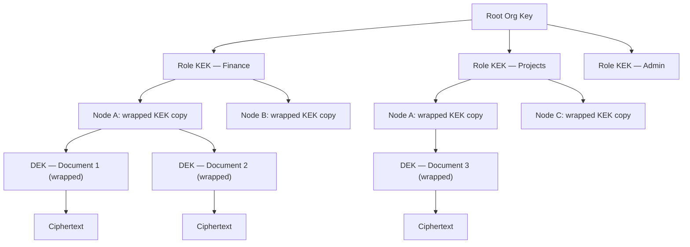

# Chapter 7 — The Security Lens

<!-- Target: ~3,500 words -->
<!-- Source: R1 Okonkwo, R2 Okonkwo, v13 §11, v5 §4 -->

---

Nia Okonkwo has broken three “local-first” demos in under twenty minutes. Each time, the attack was the same: ignore the application layer, ignore the data-at-rest story, go straight for the sync channel. Two of those demos had no auth at all on the sync socket. The third had auth, but the key was a sixteen-character string hardcoded in the config. She found it by running `strings` on the binary.

She is not a hostile reviewer because she dislikes the inverted stack. She is a hostile reviewer because she has learned that distributed architectures fail at exactly the places their designers felt most confident. The encryption is usually fine. The key hierarchy is often documented. What breaks is the gap between the hierarchy on paper and the incident response when the hierarchy is violated.

Okonkwo read the first version of this paper with that question in front of her: not “is the cryptography correct” but “what happens the day after the breach.”

---

## Act 1: Round 1 — The Key Compromise Gap

### What Earned a 9/10

The first version of the architecture paper gets one dimension nearly right: data minimization at the protocol layer. Subscription filtering enforced at the sync daemon’s send tier — not at the application layer, not at the UI — is the correct control placement, and it is specified clearly. A node that lacks the required role attestation never receives the operations. There is no receive-and-hide, no “we filter it before displaying,” no trust placed in the application to discard what it should not have. The daemon does not send it.

Okonkwo scored this dimension a 9 out of 10. In her experience, this is the dimension most commonly implemented backwards. Teams build an application that receives all data and enforces visibility rules in UI components — which means the data crossed the network, landed in local storage, and is accessible to anyone who knows where to look. Send-tier filtering is the architectural achievement that makes the rest of the security story coherent. If it had been application-layer filtering, no amount of key management would have compensated.

The threat model section also earns her respect. The paper acknowledges that distributing data to endpoints does not eliminate the honeypot problem — it distributes it to the weakest endpoint. A cloud database is a single high-value target behind enterprise controls. A fleet of workstations is a larger attack surface with heterogeneous posture. The paper does not pretend otherwise.

What it does not do is follow that acknowledgment to its conclusion.

### The Blocking Issue: No Key Compromise Response

The key hierarchy described in the first version uses envelope encryption. Each document gets a random Data Encryption Key (DEK). Each role gets a Key Encryption Key (KEK). The DEK is encrypted with the role KEK and stored alongside the ciphertext. When role membership changes, the administrator generates a new KEK, re-wraps all DEKs with it, and discards the old KEK. Nodes that cannot obtain the new KEK cannot decrypt future records.

This is the correct model. The problem is what happens when the KEK itself is compromised — not rotated on schedule, but actually stolen.

The first version of the paper scores a 5 out of 10 on incident response for key compromise. There is no detection mechanism. There is no re-keying procedure for the compromise case as opposed to the scheduled rotation case. There is no analysis of what historical data is now accessible to an attacker who holds the KEK. There is no user notification path.

Consider the failure scenario concretely. A senior administrator’s workstation is physically stolen. The attacker recovers the device, breaks the full-disk encryption — a realistic attack if the device is powered on — and extracts the OS keychain. The keychain contains the current role KEK for every role this administrator manages. With the KEK, the attacker can decrypt every wrapped DEK in the sync log. Every document those roles ever had access to is now readable.

The paper describes the key hierarchy. It does not describe what happens next.

For Okonkwo, this is not a documentation gap. An architecture that specifies a key hierarchy without specifying what to do when the hierarchy is violated has not specified a security model — it has specified a pleasant normal-path story. Security architectures are evaluated on their failure modes. The normal path is never the problem.

The specific questions that must be answered:

How does the system detect a key compromise? Anomalous access patterns, a physical loss report, a user reporting a stolen device — the detection pathway matters because time between compromise and detection determines data-at-risk scope.

What is the re-keying procedure for the compromise case? Scheduled rotation uses the existing KEK to re-wrap DEKs. A compromised KEK cannot be used to re-wrap — doing so produces DEKs wrapped with the same compromised key. The procedure must generate an entirely new KEK chain.

What historical data is at risk? A compromised KEK exposes every document that KEK ever protected, back to the moment that key was created. The data-at-risk window is not defined by when the compromise occurred — it is defined by the KEK’s age.

What does the user see? An incident response that produces correct cryptographic behavior but no user-visible notification is not an incident response. Someone must be told that their data was potentially exposed.

The three conditions raised alongside the block — diagram the key hierarchy, specify the offline node revocation reconnection flow, address in-memory key material — are completeness items. They are real. But the block stands on the compromise response alone.

### Round 1 Verdict: PROCEED — Conditional on One Prerequisite

Okonkwo issues PROCEED WITH CONDITIONS. The domain average of 7.3 out of 10 supports that verdict. But one condition is not a condition in the normal sense — it is a prerequisite. No security review of a key-based system can sign off without a specified compromise response. A score of 5 out of 10 on the weakest dimension — for a dimension that governs every other security property in the architecture — means the architecture cannot advance past a security review until that dimension is resolved.

The architecture is unusually honest for its class. The threat model is real. The send-tier filtering is correct. The attacker-mindset framing — that distributing data to endpoints distributes the attack surface — is rare in local-first literature. But the incident response gap is the kind of gap that causes real-world security reviews to fail. The condition holds until it is resolved.

---

## What Changed Between Rounds

The revisions between Round 1 and Round 2 address every item Okonkwo flagged.

The key hierarchy is diagrammed. The diagram runs from the root organization key down through role KEKs, then per-node wrapped copies of those KEKs, then per-record DEKs, then ciphertext. The relationship between each layer is explicit: role KEKs are wrapped with each authorized node’s public key, DEKs are wrapped with the role KEK, and ciphertext is produced by the DEK using a symmetric cipher. No level of the hierarchy is implicit.

This is the hierarchy Okonkwo asked for in Round 1:

The key compromise response procedure is now specified. Detection triggers include physical loss reports, anomalous access patterns identified in the audit log, and explicit administrator reports. On detection, the procedure is: generate an entirely new KEK for the affected role, not derived from the compromised key. Re-wrap every DEK owned by that role using the new KEK. Discard the old KEK and all node-level copies of it. Broadcast revocation through the relay. Notify affected users with the data-at-risk window: from the compromised key’s creation date to the moment of revocation.

The offline node revocation reconnection flow is now specified at the step level. When an offline node reconnects, the sync daemon presents its current attestation bundle to the relay. The relay checks the revocation log. If any key in the node’s bundle has been revoked, the relay rejects the sync handshake. The node receives a specific error code indicating revocation, not a generic connection failure. Before sync can resume, the node must obtain a fresh key bundle — which requires the user to re-authenticate against the IdP, establish new role attestations, and receive new wrapped KEK copies from the administrator. The user sees a message: “Your access credentials have been updated. Sign in again to continue syncing.”

In-memory key material is addressed at the implementation level. Locked memory pages prevent the OS from swapping key material to disk. The application zeros key material on process exit. These are implementation constraints on `Sunfish.Kernel.Security`, not suggestions.

---

## Act 2: Round 2 — Four Remaining Conditions

Round 2 opens with a commendation. The data minimization at the sync layer is architecturally correct and, in Okonkwo’s assessment, represents a meaningful improvement over most commercial CRDT implementations. The blocking issue is resolved. The question is what remains.

Four conditions emerge. None is a block. All are real.

### Supply Chain: Who Signs the Release

The architecture uses content-addressed identifiers for update distribution. When a new release is published, the CID of the package is computed and distributed. Clients verify the CID before installation. A compromised CDN cannot serve a corrupt package because the CID mismatch fails immediately.

This is correct. The gap is one step earlier.

The CID guarantees the integrity of the package relative to the CID. It does not guarantee that the CID itself came from the legitimate build process. An attacker who compromises the build system can produce a valid package, compute its correct CID, and sign that CID with a compromised release signing key. Clients verify the CID, confirm it matches, and install the attacker’s payload.

Three things are missing. First, key custody specification for the release signing key: who holds it, how it is stored, what happens if it is compromised. A release signing key stored on a developer’s laptop is not a supply chain security posture — it is a single point of failure. Second, a reproducible build requirement: independent parties must be able to verify that the published binary matches the published source. Without reproducibility, the build process is an unauditable black box. Third, integration with a supply chain transparency framework such as Sigstore [1], which provides a publicly auditable log of signing events. A signing event that does not appear in the transparency log can be detected and rejected by clients.

Okonkwo scores this dimension 7 out of 10. The content-addressing model is the right foundation. The signing key custody and transparency layer are what complete it.

### The Compromised Relay

The revised paper addresses relay compromise correctly. The relay is untrusted transport: all data is end-to-end encrypted, the relay handles ciphertext, and a relay operator who reads everything on the wire gets operation identifiers and timestamps, not payloads.

This is the right architecture. The condition is about what the relay can see even when it cannot read payloads.

Traffic analysis is sensitive. A relay operator who cannot read messages can still observe which nodes communicate with which, at what times, and at what volume. For a legal firm, the communication pattern between two nodes during a specific time window can reveal which matters are active and which team members are collaborating — without any payload access at all. For healthcare deployments, communication frequency between specific nodes can reveal patient activity patterns.

The architecture is not broken. The limitation is real and must be disclosed. Organizations for whom metadata privacy is a hard requirement should run a self-hosted relay on infrastructure they control, eliminating the third-party relay operator as a metadata observer. The paper should state this plainly rather than leaving security teams to discover it during deployment.

### Physical Access and the Memory Window

The at-rest encryption story is correct. SQLCipher protects local databases. Keys are derived from user credentials using Argon2id and stored in OS-native keystores. Physical storage extraction without credentials produces no plaintext.

The gap is the memory window while the application is running.

An attacker with thirty minutes of physical access to a live system can use cold boot attack techniques or memory forensics tools. Cold boot exploits the remanence of DRAM: memory contents persist briefly after power loss and can be read if the attacker acts within seconds to minutes of shutdown, depending on hardware. Memory forensics tools that run from a bootable USB can dump process memory directly. The decryption key that is in memory while the application is running is readable by both techniques.

The mitigation is a re-authentication interval. The application requests re-authentication from the OS keychain at configurable intervals — every four hours is the recommended default for high-security deployments. An attacker who gains physical access to an authenticated session can operate within that window. An attacker who encounters a session requiring re-authentication cannot proceed without the user’s credentials.

This is a hardening recommendation, not an architecture flaw. The base model is correct. The recommendation narrows the exposure window for deployments where physical access is a realistic threat vector. Okonkwo scores physical access an 8 out of 10.

### GDPR Article 17 in a CRDT System

This is the condition Okonkwo scores lowest in Round 2: compliance framework mapping, 5 out of 10. It surfaces a genuine conflict between the architecture’s design and a legal requirement affecting every organization operating in the European Union.

Article 17 of the General Data Protection Regulation establishes the right to erasure [2]. A data subject can request that an organization delete their personal data. The organization must comply. For conventional databases, deletion is straightforward: delete the row, purge the backups, confirm. For a CRDT system with no-GC compliance records, deletion is not straightforward.

The CRDT operation log for compliance-tier records is immutable by design. The immutability is not a bug — it is the feature. An append-only log with signed entries provides the tamper evidence that regulated industries require for audit trails. Breaking the log to delete an operation breaks the continuity property the compliance tier exists to provide.

The conflict is real. The architecture cannot simultaneously provide an immutable audit log and comply with Article 17 through conventional deletion.

The resolution is crypto-shredding. Rather than deleting the operation from the log, the system destroys the DEK that protects the content of that operation. The operation entry remains in the log — preserving the structural integrity of the DAG — but its content is permanently unreadable. No DEK, no plaintext. The ciphertext in the log becomes an unrecoverable stub.

This pattern satisfies Article 17 for content: the personal data is unrecoverable and therefore effectively erased. It does not satisfy Article 17 for metadata: the operation identifier, timestamp, and structural position in the DAG remain. Whether operation metadata constitutes personal data under Article 17 depends on whether it is linkable to an identified or identifiable natural person — a legal question the architecture cannot answer, but which must be disclosed.

The paper must document the crypto-shredding pattern and state the limitation clearly: personal data in operation content is erasable via DEK destruction; operation metadata is not erasable without breaking the log. Organizations subject to Article 17 should obtain legal review of whether this satisfies their specific obligations.

### Round 2 Verdict: PROCEED WITH CONDITIONS

Okonkwo issues PROCEED WITH CONDITIONS. Domain average 7.0 out of 10. The blocking issue from Round 1 is fully resolved. The full condition list:

**C1 (High):** Specify release signing key custody, reproducible build requirement, and Sigstore integration for update supply chain transparency.

**C2 (High):** Address GDPR Article 17 for the no-GC compliance CRDT tier — document the crypto-shredding pattern and explicitly scope the limitation on operation metadata.

**C3 (Medium):** Acknowledge relay metadata and traffic analysis limitation for high-sensitivity deployments. State the self-hosted relay as the mitigation.

**C4 (Medium):** Specify a recommended default re-attestation interval — twenty-four hours balances a bounded revocation window against operational friction.

**C5 (Low):** Add cold boot and in-memory key hardening recommendation for high-security deployments, including the four-hour re-authentication interval guidance.

C1 and C2 must be addressed before first external release. C3 through C5 are addressable in the companion document without blocking alpha implementation.

---

## The Principle: Defense-in-Depth Is Not Optional

The council’s security review surfaces the central tension in distributed endpoint architectures. The inverted stack solves the central honeypot problem: a fleet of workstations is a harder target than a single cloud database, because there is no single high-value target and no single breach that exposes all data for all users. A compromised node exposes only what that node is authorized to access.

This is a genuine improvement. Okonkwo acknowledges it. It is also a displacement of the problem rather than an elimination of it.

A fleet of workstations is a distributed attack surface. Each node is a potential target. The security posture of the weakest endpoint is the security posture of the data that endpoint holds. In an enterprise deployment with fifty nodes, an attacker does not target the strongest endpoint — they target the one belonging to the administrator with the broadest role access and the worst patch cadence.

This is why the architecture requires defense-in-depth across four layers, and why none of the four layers is optional.

Layer one is encryption at rest. SQLCipher on local databases. Argon2id key derivation. OS-native keystores. Physical storage extraction without credentials yields no plaintext. This layer is table stakes.

Layer two is field-level encryption. Per-record DEKs. Per-role KEKs. DEK/KEK envelope encryption. An attacker who compromises a node’s local storage gets encrypted blobs. Without the KEK, the DEKs are useless. Without the DEKs, the ciphertext is useless.

Layer three is stream-level data minimization. Subscription filtering at the sync daemon’s send tier. A compromised node is limited to the operations it was authorized to receive. The blast radius of a single node compromise is bounded by role scope, enforced at the protocol layer where it cannot be bypassed by application changes.

Layer four is circuit breaker and quarantine. Offline writes queue for validation against current team state before promotion. A node that reconnects after a long offline period does not automatically push its queued writes to peers — those writes enter a quarantine queue and are validated against current policy before merging. This prevents a compromised offline node from pushing malicious writes on reconnection.

The data minimization invariant — send-tier filtering, enforced at the protocol layer — is what makes the security story credible. Without it, layers one and two protect data at rest but cannot contain a breach once data is in transit. An application-layer filter that receives all operations and hides some in the UI is not a security control. It is a UI control. An attacker with access to the sync socket or the local database bypasses it entirely.

Every practitioner building on this architecture should treat the send-tier filtering invariant as inviolable. The filter belongs in the sync daemon. It does not belong in the view layer, the API handler, or a permission check on a UI component. The moment it moves, the blast radius of any node compromise expands from role-scoped to total.

Distribute the data to endpoints for resilience. Treat each endpoint as a potential breach. Four layers. No shortcuts.

---

## References

[1] S. E. Bhatt et al., “Sigstore: Software Signing for Everybody,” in *Proc. 29th ACM Conf. Comput. Commun. Secur. (CCS ’22)*, Los Angeles, CA, USA, Nov. 2022, pp. 2353–2367, doi: 10.1145/3548606.3560596.

[2] European Parliament and Council, “General Data Protection Regulation (GDPR),” Regulation (EU) 2016/679, Art. 17 — Right to Erasure, *Off. J. Eur. Union*, Apr. 2016.
