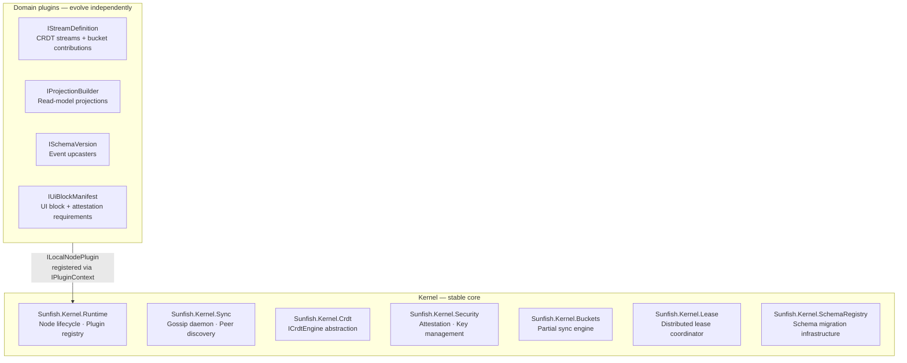
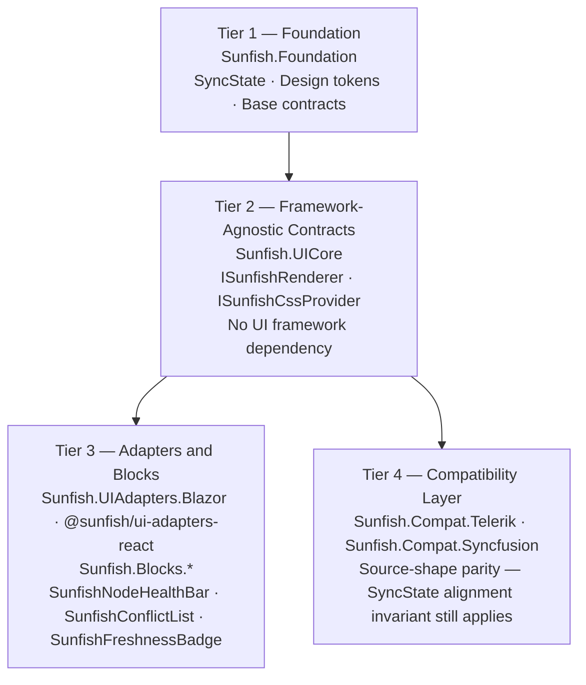

# Chapter 11 — Node Architecture

<!-- icm/prose-review -->
<!-- Target: ~4,000 words -->
<!-- Source: v13 §5, v5 §3 -->

Domain requirements evolve faster than infrastructure. A construction firm node gains a progress-tracking module without touching the sync daemon. A legal practice swaps one ledger plugin for a matter-billing variant without rebuilding the CRDT (Conflict-free Replicated Data Type) engine. The architecture that makes this tractable is a structural constraint enforced from the first design decision: the kernel changes slowly, and domain code changes independently.

The local node enforces this separation through a microkernel monolith — a small, stable core that owns all infrastructure concerns, surrounded by domain plugins that implement well-defined extension-point contracts. The monolith half of that phrase matters as much as the microkernel half. All plugins run in-process with the kernel. No per-plugin processes. No inter-plugin RPC calls. No serialization overhead between a task board plugin and the CRDT engine underneath it. The microkernel pattern disciplines the design; the in-process execution preserves the performance properties that make a local node viable at all.

## The Microkernel Monolith

The microkernel approach divides node responsibilities into two categories. The first holds concerns that must stay stable across years, because changing them affects every plugin. The second holds concerns that must evolve rapidly, because they encode domain knowledge.

Kernel responsibilities are infrastructure concerns. The kernel manages the node lifecycle, the sync daemon, the CRDT engine abstraction, schema migration infrastructure, security primitives, the partial sync engine, and the plugin registry itself. These components share one characteristic: a breaking change to any of them requires coordinated updates across every plugin installed on that node. That coordination cost justifies strict versioning and a high threshold for interface changes.

Plugin responsibilities are domain concerns. Plugins define aggregates, commands, and events. They declare which CRDT stream types they use and which sync buckets they contribute to. They register read-model projections rebuilt from the event log. They surface UI blocks to the kernel UI layer. These components share the opposite characteristic: they change frequently, they deploy independently, and a new version of one plugin requires no coordination with any other.

The kernel enforces the boundary through version contracts. Each plugin declares an identifier and a semantic version. The plugin registry loads plugins in topological dependency order: a plugin that depends on another receives the guarantee that its dependency is fully loaded before its own load phase executes. The kernel rejects cycles and missing dependencies at load time, not at runtime. Plugin identifiers follow reverse-DNS convention, which makes the namespace unambiguous across first-party and third-party sources.

Three practical benefits follow from this split. Domain teams develop plugins against a stable kernel contract without forking kernel code or coordinating with kernel release cycles. Deployment bundles enable or disable modules per organizational requirement: a construction firm node carries different plugins than a legal practice node, but both run the same kernel. Third-party module authors build against the same extension-point contracts as first-party plugins. The kernel cannot distinguish a domain block built by the node operator from one built by a vendor integration. Both satisfy the same interfaces. Both receive the same lifecycle management.



## Kernel Responsibilities

The kernel owns eight infrastructure concerns. Each is stable across plugin versions. Each exposes a contract that plugins depend on but do not implement.

**Node lifecycle and process orchestration.** `Sunfish.Kernel.Runtime` manages the `INodeHost` lifecycle through five states: `Stopped`, `Starting`, `Running`, `Stopping`, and `Faulted`. The `Faulted` state is terminal and activates on an unrecoverable error. The host starts the plugin registry, sequences plugin loads in topological dependency order, and reverses that order on shutdown so that plugin dependencies remain available until after the plugin has released its own resources. A faulted node does not restart automatically. Automated restart after an unrecoverable fault can mask data integrity problems that require operator diagnosis.

**Plugin discovery, loading, versioning, and lifecycle management.** The `IPluginRegistry` interface loads plugins in topological order, detects dependency cycles, and rejects missing dependencies before any plugin load phase executes. On unload, plugins release in reverse topological order. Among plugins at the same dependency depth, the registry sorts by plugin ID to produce deterministic ordering. The registry is a one-shot load surface: it rejects a second load call until the prior set has been fully unloaded, preventing partial state from a failed swap from contaminating the running plugin set.

**Sync daemon protocol, gossip anti-entropy, and peer discovery.** `Sunfish.Kernel.Sync` runs the intra-team gossip daemon — a timer-driven round scheduler that selects random peers for delta exchange, maintains a vector clock per peer, and coordinates capability negotiation at each handshake. Peer discovery operates across three tiers. The first tier uses mDNS for zero-configuration LAN-local discovery with no infrastructure dependency. The second tier uses a WireGuard mesh VPN for cross-segment discovery within an organization. The third tier uses the managed relay for cross-organization or relay-assisted connectivity. Chapter 14 specifies the full protocol and wire format.

**CRDT engine abstraction.** `Sunfish.Kernel.Crdt` exposes `ICrdtEngine` as the single point of contact for creating and opening CRDT documents. The abstraction carries an engine name and version string so the runtime can surface the active backend in diagnostics without depending on a specific implementation. YDotNet (the .NET CRDT engine port of Yjs ([github.com/yjs/yjs](https://github.com/yjs/yjs), the JavaScript CRDT library) via Rust FFI (Foreign Function Interface)) (the .NET CRDT engine port of Yjs ([github.com/yjs/yjs](https://github.com/yjs/yjs), the JavaScript CRDT library) via Rust FFI (Foreign Function Interface)) — the Yjs/yrs .NET bindings — is the validated backend pending integration into `Sunfish.Kernel.Crdt`; the current runtime ships a `StubCrdtEngine` marked explicitly "DO NOT SHIP TO PRODUCTION" that provides total-order replay for test scenarios. The Wave 1 integration work closes that gap. The architecture targets Loro ([github.com/loro-dev/loro](https://github.com/loro-dev/loro), a Rust-core CRDT library) as the aspirational replacement once the `loro-cs` bindings expose the snapshot, delta, and vector-clock surfaces the sync protocol requires. All backends satisfy the same `ICrdtEngine` contract; switching engines requires no changes to kernel or plugin code. Chapter 12 specifies the full data layer and compaction strategy.

**Schema migration infrastructure.** `Sunfish.Kernel.SchemaRegistry` maintains the registry of event schema versions and their upcasters, coordinates schema epochs across the peer set, and manages stream compaction that removes superseded event versions. Nodes running different plugin versions read events from each other through the upcaster chain. That tolerance is how the architecture survives the mixed-version deployments inevitable when nodes update independently on their own schedules. Chapter 13 specifies the full migration protocol and epoch coordination.

**Security primitives.** `Sunfish.Kernel.Security` owns Ed25519 device keypairs, X25519 key agreement for per-role key wrapping, attestation issuance and verification, and role key lifecycle management. Role attestations flow through capability negotiation during each peer handshake. Non-attested peers are refused bucket subscriptions before any data is transferred. The key hierarchy runs from the organization root key, through per-role key-encryption keys, to per-node wrapped data-encryption keys — giving revocation the property that rotation work is proportional to document count, not document size. Chapter 15 specifies the full security architecture.

**Partial and selective sync.** `Sunfish.Kernel.Buckets` evaluates sync-bucket eligibility against attestation bundles received during handshake. Buckets are named, declaratively specified subsets of the team dataset, each gated on a required role attestation. A node that lacks the required attestation never receives events from the protected bucket. Filtering happens at the send tier — before events leave the originating daemon — not at the receive tier where the data has already traveled. This is the data minimization invariant the council review identified as non-negotiable: subscription filtering at send, not receive.

**Distributed lease coordination.** `Sunfish.Kernel.Lease` implements a Flease-inspired [3] distributed lease coordinator for CP-class record writes. A write to a CP-class record — a financial posting, a period-close decision, any record where concurrent writes from different nodes produce conflicting domain state — requires a lease granted by a quorum of peers before the write proceeds. Quorum is strict majority of the configured peer set: a five-node team requires three acknowledgments; a seven-node team requires four. A node that cannot reach quorum blocks the write and surfaces a staleness indicator to the UI layer rather than proceeding with a write that will generate a conflict requiring manual resolution. A partition that prevents quorum blocks all CP-class writes for its duration. This is the architecturally accepted cost of CP positioning, because the alternative — permitting uncoordinated writes during partition — generates the financial-record conflicts the coordinator exists to prevent. Chapter 14 covers the full lease wire messages and the partition recovery protocol.

Together these three components — the `ICrdtEngine` for AP-class records with deterministic merge, the Flease coordinator for CP-class records requiring linearizable writes, and the append-only ledger engine for financial and audit records that are not subject to merge at all — implement the three-tier CRDT resolution model specified as the third non-negotiable in the Chapter 10 synthesis. The plugin contract enforces tier classification: each `ILocalNodePlugin` declares its record types' tier assignments in its manifest, and the kernel routes writes to the appropriate coordinator based on that declaration. Plugins cannot silently elevate a record from AP to CP, or demote a ledger record to AP merge. Tier classification is a manifest property validated at load time, not a runtime decision the plugin can mutate.

A lease is granted when a strict majority of the node's configured peer set acknowledges the request. For a five-node deployment, three acknowledgments are required. The asymmetric partition failure mode follows from this requirement. If a network partition divides peers such that two subsets each independently believe they have quorum and both attempt to acquire a lease for the same CP-class resource, the Flease coordination protocol uses epoch-stamped lease tokens. A node that acquires a lease under a given epoch holds exclusive access until lease expiry. When the partition heals, the node with the lower epoch number has its lease superseded; its pending write is rejected and surfaced to the application as a lease conflict for the user to resolve — not as a silent overwrite. This is a deliberate design choice consistent with CP positioning: in an asymmetric partition, the system blocks the at-risk write rather than permitting a double-booking.

**Event bus and durability.** `Sunfish.Kernel.EventBus` provides `IEventBus` for in-process event publication and `IEventLog` for durable, append-only event persistence. The event log is the authoritative record from which read-model projections are rebuilt. Both a file-backed implementation for production and an in-memory implementation for tests ship with the package.

## Plugin Contracts

Every domain plugin implements `ILocalNodePlugin`. The kernel plugin registry calls the plugin load method with an `IPluginContext` that provides the registration surface. The plugin registers one or more extension-point objects through this context: stream definitions, projections, schema versions, and UI block manifests. After load completes, the kernel assembles the full stream topology, projection graph, schema upcaster chain, and UI block set from all loaded plugins in combination.

**`IStreamDefinition`** declares a CRDT stream that the plugin contributes. Each definition carries a stable stream identifier, a schema version string, the event type names emitted on the stream, and the sync-bucket IDs this stream contributes to. Bucket contributions determine which role-attested peers receive events from this stream during sync. A stream with empty bucket contributions is local-only: it participates in local event sourcing but does not propagate to peers via the gossip daemon.

**`IProjectionBuilder`** registers a read-model projection that the kernel can rebuild from the event log. Each projection declares its stable projection ID and the source stream ID it reads from. Projections hold no authoritative state. They are derived views the kernel may discard and rebuild at any time. The rebuild method must be idempotent and safe to call repeatedly: the kernel relies on this guarantee during schema migration and CRDT compaction when the event log is being reprocessed.

**`ISchemaVersion`** declares the event types a plugin produces and provides an upcaster that lifts older event payloads to the current in-memory shape. Each instance carries the event type it handles, the current canonical version it produces, and the set of older versions it accepts as input. Upcasters must be pure functions with no side effects and no I/O. When a peer sends an event at an older schema version, the kernel chains through the upcaster registry until it reaches the local current version, lifting the event incrementally through each intermediate shape.

**`IUiBlockManifest`** registers a UI block with the kernel UI layer. Each manifest declares a stable block identifier, a display name, a category label for grouping in the block picker, the stream IDs the block reads from, and the role attestations the current user must hold to render the block. The kernel uses the attestation requirements to suppress blocks whose underlying streams the current user cannot access. A block that presents data the user cannot receive is not rendered and not listed in the block picker. UI visibility and sync eligibility stay synchronized.

The `IPluginContext` surface collects these registrations during the plugin load phase and makes them available to the kernel after all plugins in the current load batch have completed. Plugins resolve shared services through `IPluginContext.Services`, which exposes the host DI container. A plugin can access `ICrdtEngine`, `IEventLog`, or any other kernel-registered service without depending on a specific implementation.

```csharp
// illustrative — package APIs are pre-1.0
public sealed class SchedulingPlugin : ILocalNodePlugin
{
    public string Id      => "com.example.scheduling";
    public string Version => "1.2.0";
    public IReadOnlyCollection<string> Dependencies => [];

    public Task OnLoadAsync(IPluginContext ctx, CancellationToken ct)
    {
        ctx.RegisterStream(new ShiftScheduleStream());
        ctx.RegisterProjection(new ScheduleByWeekProjection());
        ctx.RegisterSchemaVersion(new ShiftEventV2Upcaster());
        ctx.RegisterUiBlock(new ShiftBoardManifest());
        return Task.CompletedTask;
    }

    public Task OnUnloadAsync(CancellationToken ct) => Task.CompletedTask;
}
```

After load, the kernel topology includes `ShiftScheduleStream` in its sync-bucket evaluation, `ScheduleByWeekProjection` in its projection rebuild schedule, `ShiftEventV2Upcaster` in its upcaster chain for shift events, and `ShiftBoardManifest` in its UI block registry. The kernel contains no knowledge of what scheduling means as a domain concept. That knowledge lives entirely in the plugin.

## The UI Kernel: Four-Tier Layering

The UI kernel enforces a constraint parallel to the data kernel's kernel-plugin split: every infrastructure state visible to the data layer has a corresponding representation in the UI layer. A node that has entered stale mode, quarantine, or conflict-pending produces component-level visual state that corresponds precisely to its data-layer state. The UI cannot report healthy when the data layer reports conflict-pending. This alignment invariant is enforced structurally through four tiers, each building on the tier below it.

**Tier 1 — Foundation.** `Sunfish.Foundation` provides design tokens and the base type hierarchy. The `SyncState` enumeration — defined in `Sunfish.UIAdapters.Blazor` and shared across all UI tiers — encodes the five node states the rest of the architecture reasons about. `Healthy` means sync is within the configured freshness threshold. `Stale` means beyond the threshold but the data is still trusted for read operations. `Offline` means no transport or no signal. `ConflictPending` means at least one record in the working set requires user resolution before sync can proceed cleanly. `Quarantine` means the replication layer has flagged data that cannot be resolved automatically and requires operator review before it can rejoin the synchronized set. Every component in the upper tiers binds to this enumeration. No tier introduces a UI state that does not correspond to a `SyncState` value.

**Tier 2 — Framework-Agnostic Contracts.** `Sunfish.UICore` defines the renderer and provider contracts without any dependency on a UI framework. `ISunfishRenderer` accepts a `SunfishWidgetDescriptor` — a framework-agnostic description of a widget including its kind, parameters, and children — and returns an opaque, platform-specific render payload. `ISunfishCssProvider` maps component state to CSS class strings. `ISunfishIconProvider` maps icon identifiers to platform-appropriate icon representations. Components declared at this tier have no Blazor dependency and no React dependency. They describe what a component contract is, not how it renders. This isolation is what allows third-party adapters and compatibility shims to satisfy the same contracts as the production adapters.

**Tier 3 — Adapters and Blocks.** `Sunfish.UIAdapters.Blazor` implements Tier 2 contracts as Razor components and ships `ISunfishCssProvider` implementations targeting Bootstrap 5, Fluent UI, and Material 3. Domain plugin blocks live in `Sunfish.Blocks.*`: the task board, resource allocation scheduler, ledger posting grid, and bulk conflict resolution wizard are blocks that implement `IUiBlockManifest` and render through Tier 2 component contracts. The sync-state components are a first-class concern at this tier. `SunfishNodeHealthBar` renders three `SunfishSyncStatusIndicator` pills covering the three node health axes: node process health, link status, and data freshness. `SunfishConflictList` subscribes to the kernel conflict inbox. `SunfishFreshnessBadge` binds to per-record staleness metadata maintained by the kernel. `SunfishOptimisticButton` exposes three write states — pending, confirmed, and failed — that map directly to the lifecycle of a locally-applied write awaiting sync confirmation. The `@sunfish/ui-adapters-react` npm package provides parity implementations of the Tier 2 component contracts for applications rendering the node UI surface in a React host.

**Tier 4 — Compatibility and Adapter Layer.** `Sunfish.Compat.Telerik` and `Sunfish.Compat.Syncfusion` expose the public parameter shapes of their respective component libraries as thin wrappers over canonical Sunfish (the open-source reference implementation, [github.com/ctwoodwa/Sunfish](https://github.com/ctwoodwa/Sunfish)) components. An application migrating from Telerik UI for Blazor replaces `using Telerik.Blazor.Components` with `using Sunfish.Compat.Telerik` and retains most markup while routing all rendering through Tier 2 contracts and the Tier 3 CSS provider. This is source-code shape parity, not visual parity: the compat packages do not reproduce the visual appearance of Telerik or Syncfusion components. The same Tier 2 `SyncState` alignment invariant applies equally: a compat wrapper that renders a data grid over stale records must surface `SyncState.Stale` through the same CSS token system as any first-party component.



The `SyncState` enumeration defined in Foundation propagates unchanged through every tier. No tier is permitted to present data as current when the kernel reports it as stale. No tier is permitted to hide a resolvable conflict from a user who has the authority to act on it.

Accessibility is a Tier 1 contract, not a Tier 3 polish. Every sync-state component — `SunfishNodeHealthBar`, `SunfishSyncStatusIndicator`, `SunfishFreshnessBadge`, `SunfishConflictList` — must communicate state through more than color: `role="status"` for non-blocking updates, `aria-live="polite"` for state-change announcements, and text labels alongside any iconography. The `IUiBlockManifest` interface declares accessibility metadata for each block — the roles it exposes, the live-region policy it follows, the keyboard shortcut surface it registers; `ISunfishIconProvider` implementations must pair every icon with a text equivalent. The local-first architecture carries an accessibility advantage worth naming at the specification level: assistive technology users do not lose their data source when connectivity fails, because the data source never left the device. An application that was accessible when online stays accessible when offline. Chapter 20 specifies the full AT treatment; this chapter fixes the contract at the kernel.

## Process Boundaries and IPC

The sync daemon runs as a separate long-running process from the MAUI (.NET Multi-platform App UI) host or Blazor shell. This boundary is intentional and structurally load-bearing. The sync daemon survives host restarts. In-flight gossip rounds and active peer connections continue uninterrupted when the user navigates away or the host process cycles. The daemon manages its own connection pool, peer membership list, and CRDT document store: state that must outlast any individual host session.

The primary design motivation is not convenience. It is the operational reality of deployments where host process cycling is routine rather than exceptional: load-shedding in Lagos where power cuts six to twelve hours per day, VSAT-only field sites in rural East Africa where connectivity is measured in hours per day, intermittent 3G/4G deployments across rural India and Latin America where network loss is the baseline condition. In these contexts the daemon's survival across unplanned host termination is not a nice-to-have. It is the architectural guarantee that buffered writes reach the durable event log before acknowledgment, that peer membership persists across device reboots, and that recovery after abrupt power loss is automatic rather than operator-mediated. The circuit-breaker quarantine queue, implemented in `Sunfish.Kernel.Sync`, buffers inbound and outbound operations through such interruptions and holds unverified writes pending re-attestation on the next clean daemon start.

The host communicates with the daemon over a length-prefixed binary channel. On POSIX platforms — Linux and macOS — `Sunfish.Kernel.Sync` uses Unix domain sockets via `UnixDomainSocketEndPoint`. File-permission controls on the socket path confine the channel to authorized processes on the same machine. On Windows, named pipes serve the equivalent role with OS-level pipe access controls. Both transports use identical framing: every message is a CBOR (Concise Binary Object Representation) payload preceded by a 4-byte big-endian length prefix. Individual frames are capped at 16 MiB. Payloads exceeding this limit must be chunked at the application layer, a condition that arises in practice only for full bucket snapshots during initial node sync.

The IPC channel is authenticated. The daemon enforces the five-phase handshake — `HELLO`, `CAPABILITY_NEG`, `ACK`, `DELTA_STREAM`, and `GOSSIP_PING` — against every connecting process. The `HELLO` message carries an Ed25519 signature over a canonical CBOR array of `[node_id, schema_version, public_key, sent_at]`. The daemon verifies the signature against the claimed public key and rejects any `HELLO` message whose `sent_at` timestamp falls outside a ±30-second window. This replay-protection window closes the attack surface where a captured handshake message could be replayed by an unauthorized process on the same machine. The window assumes host-daemon clock synchronization within one second — both processes run on the same machine, so OS-native time is sufficient. The window does not depend on NTP or external time sources, and clock skew in intermittent-connectivity field environments does not affect it because the window is enforced on local-host IPC only.

Capability negotiation follows successful authentication. The host declares its workspaces and required role attestations; the daemon responds with the allowed subscription set based on the attestation bundles the host presents. Non-attested subscriptions are refused at this stage. A host presenting no attestation for the financial records bucket receives no events from that bucket, regardless of what its application code requests. No bypass path through the local IPC channel differs from the peer-to-peer path: both follow the same attestation verification logic.

After capability negotiation, the relationship is push-based. The daemon pushes change notifications to the host as CRDT deltas arrive from peers. The host does not poll the daemon. Command traffic flows in the opposite direction: the host sends create, update, and delete operations, which the daemon validates against the CRDT document store, applies locally, and schedules for gossip propagation to peers. This command channel separates user intent from CRDT operations: the host describes what the user wants to do; the daemon determines how to express that intent as CRDT mutations compatible with concurrent edits from other nodes.

CBOR encoding per RFC (Request for Comments) 8949 [1] applies to all IPC messages. Canonical mode — definite-length encodings with length-then-lexicographic key ordering — is required for all messages that carry signatures. Canonical encoding ensures the bytes over which a signature is computed are identical across platforms and implementations.

The managed relay connects to the daemon over TCP (Transmission Control Protocol), independent of the local socket channel. The local socket is strictly for host-to-daemon communication on the same machine. Relay connectivity, peer discovery beyond mDNS range, and cross-organization sync belong to the daemon and do not involve the host process directly. Chapter 14 specifies the full wire protocol for both the IPC channel and the relay connection.

Relay transit is optional for nodes that can reach each other directly. Nodes on the same LAN discover peers via mDNS and sync without contacting the relay at all; the relay is required only when nodes are on different networks with no direct IP path between them. The relay observes and routes ciphertext only — it holds no decryption keys and cannot read payload content. A relay outage prevents cross-network peer discovery but does not affect local data: nodes on the same LAN continue syncing normally, and nodes on different networks queue CRDT deltas and catch up automatically once the relay recovers.

The architecture's relay-is-ciphertext-only design directly addresses cross-jurisdiction compliance constraints across major regulatory regimes. In every jurisdiction the technical claim is identical: authoritative data and the keys protecting it reside on infrastructure the operator controls; no foreign-operator-accessible payload is created by routing ciphertext through a relay. The most consequential legal instruments this structural property answers cluster into three anchors. The 2020 Schrems II ruling (Data Protection Commissioner v. Facebook Ireland Limited, Court of Justice of the EU [2]) constrains cross-border transfer of EU personal data to US-hosted infrastructure without adequate supplemental safeguards — enforced nationally by Germany's BSI (Bundesamt für Sicherheit in der Informationstechnik) and France's CNIL (Commission nationale de l'informatique et des libertés). The UAE's DIFC (Dubai International Financial Centre) Data Protection Law 2020 may legally prohibit foreign cloud storage for DIFC-licensed financial entities. Russia's Federal Law 242-FZ — among the first general-purpose data localization laws globally, enacted in 2015 and predating GDPR (General Data Protection Regulation) by two years — establishes the doctrinal pattern the rest of these regimes later followed. The full coverage matrix across APAC (Asia-Pacific) (PIPL (Personal Information Protection Law), PIPA (Personal Information Protection Act)), South Asia (DPDP (Digital Personal Data Protection), RBI (Reserve Bank of India)), Africa (POPIA (Protection of Personal Information Act), NDPR (Nigeria Data Protection Regulation), Kenya DPA), and Americas (LGPD (Lei Geral de Proteção de Dados), LFPDPPP (Ley Federal de Protección de Datos Personales en Posesión de los Particulares)) regimes is in Appendix F. Compliance officers should treat the architecture's structural answer as a primary compliance argument, distinct from and additive to whatever contractual safeguards their jurisdiction requires — including GDPR Article 17 (right to erasure) against the append-only CRDT event log, which Chapter 13 specifies through stream compaction and crypto-shredding at the storage layer.

## Sunfish Package Map

The Sunfish package set maps directly to the architectural layers described in this chapter. The dependency direction is strictly from upper layers to lower: plugins depend on kernel packages, kernel packages depend on foundation packages, foundation packages have no Sunfish dependencies. No package in a lower layer imports from a higher layer.

| Layer | Package | Primary responsibility |
|---|---|---|
| Foundation | `Sunfish.Foundation` | Core contracts, design tokens, identity types, cryptographic primitives |
| Foundation | `Sunfish.Foundation.LocalFirst` | Local encrypted store (SQLCipher), `IOfflineStore`, circuit-breaker quarantine queue |
| Kernel contracts | `Sunfish.Kernel` | Type-forwarding facade for the seven kernel primitives: entity store, version store, audit log, permission evaluator, blob store, schema registry, event bus |
| Kernel runtime | `Sunfish.Kernel.Runtime` | `INodeHost`, `IPluginRegistry`, `ILocalNodePlugin`, `IPluginContext`, all five extension-point contract interfaces |
| Kernel runtime | `Sunfish.Kernel.Sync` | `IGossipDaemon`, mDNS peer discovery, handshake protocol, CBOR wire codec, Unix socket and named-pipe transport |
| Kernel runtime | `Sunfish.Kernel.Crdt` | `ICrdtEngine` abstraction; YDotNet backend (validated, integration pending); `StubCrdtEngine` (current, test-only, marked "DO NOT SHIP TO PRODUCTION"); Loro backend (aspirational) |
| Kernel runtime | `Sunfish.Kernel.Security` | `IAttestationIssuer`, `IAttestationVerifier`, `IRoleKeyManager`, `IEd25519Signer`, `IX25519KeyAgreement` |
| Kernel runtime | `Sunfish.Kernel.Buckets` | `IBucketRegistry`, YAML bucket definitions, `IBucketFilterEvaluator`, lazy-fetch stubs |
| Kernel runtime | `Sunfish.Kernel.Lease` | Flease-inspired `ILeaseCoordinator` for CP-class record write serialization |
| Kernel runtime | `Sunfish.Kernel.Ledger` | Double-entry `IPostingEngine`, CQRS read models, period-close snapshots |
| Kernel runtime | `Sunfish.Kernel.SchemaRegistry` | `ISchemaRegistry`, schema lenses, upcaster chains, epoch coordination, stream compaction |
| Kernel runtime | `Sunfish.Kernel.EventBus` | `IEventBus`, `IEventLog` with file-backed and in-memory implementations |
| UI | `Sunfish.UICore` | `ISunfishRenderer`, `ISunfishCssProvider`, `ISunfishIconProvider`, `SunfishWidgetDescriptor` |
| UI | `Sunfish.UIAdapters.Blazor` | Razor component implementations, Bootstrap / Fluent UI / Material 3 CSS providers, sync-state components |
| UI | `@sunfish/ui-adapters-react` (npm) | React implementations of UICore component contracts, Bootstrap / Fluent UI / Material 3 CSS providers |
| UI compat | `Sunfish.Compat.Telerik` | Telerik-parameter-shaped Razor wrappers over canonical Sunfish components |
| UI compat | `Sunfish.Compat.Syncfusion` | Syncfusion-parameter-shaped Razor wrappers over canonical Sunfish components |
| Domain blocks | `Sunfish.Blocks.*` | Domain plugin building blocks: accounting, assets, forms, inspections, leases, maintenance, rent collection, scheduling, tasks, tax reporting, workflow |

The composition root wires the kernel layer by calling each package DI extension method. The following illustrative example shows a Zone A node wiring the full kernel stack:

```csharp
// illustrative — package APIs are pre-1.0
builder.Services
    .AddSunfishKernelRuntime()
    .AddSunfishCrdtEngine()
    .AddSunfishKernelSync()
    .AddSunfishKernelSecurity()
    .AddSunfishKernelBuckets()
    .AddSunfishKernelSchemaRegistry()
    .AddSunfishKernelEventBus()
    .AddSunfishLocalFirst()
    .AddSunfishEncryptedStore();
```

Each `AddSunfish*` extension uses `TryAddSingleton` internally. A preceding registration — a test double, a stub CRDT backend, a custom socket transport — takes precedence without modifying the extension method. A test harness injects an in-memory CRDT stub by calling `AddSunfishCrdtEngineStub()` before `AddSunfishCrdtEngine()`, and injects an in-process sync transport by registering `InMemorySyncDaemonTransport` before `AddSunfishKernelSync()`.

The `Sunfish.Kernel` facade package exists for a specific structural reason. Five of the seven kernel primitives — entity store, version store, audit log, permission evaluator, and blob store — are already implemented in `Sunfish.Foundation.*` sub-packages. `Sunfish.Kernel` re-exports them via assembly type forwarding so that a package wanting to communicate "we only touch the kernel surface" takes a single dependency rather than listing individual Foundation sub-packages. The two remaining primitives — schema registry and event bus — are implemented in `Sunfish.Kernel.SchemaRegistry` and `Sunfish.Kernel.EventBus` respectively and surfaced through stub interfaces in `Sunfish.Kernel`. This split between the facade and the runtime package reflects a deliberate boundary: the facade exposes stable contracts; `Sunfish.Kernel.Runtime` owns the live services with state.

All Sunfish packages are pre-1.0. Package names are stable for reference in this specification; specific interface method signatures and registration-method options are subject to change before the 1.0 release. The Anchor (the Zone A local-first desktop accelerator) accelerator in `accelerators/anchor/` assembles this full wiring in a working Zone A node. Chapter 17 provides the minimal implementation path using that accelerator as the starting point.

---

[1] C. Bormann and P. Hoffman, "Concise Binary Object Representation (CBOR)," RFC 8949, Internet Engineering Task Force, December 2020.

[2] Court of Justice of the European Union, Data Protection Commissioner v. Facebook Ireland Limited and Maximillian Schrems, Case C-311/18, Judgment of 16 July 2020.

[3] B. Kolbeck, M. Högqvist, J. Stender, and F. Hupfeld, "Flease: Scalable Fault-Tolerant Lease Negotiation for Distributed Systems," in *Proc. USENIX Annual Technical Conference (USENIX ATC)*, Boston, MA, 2012.
