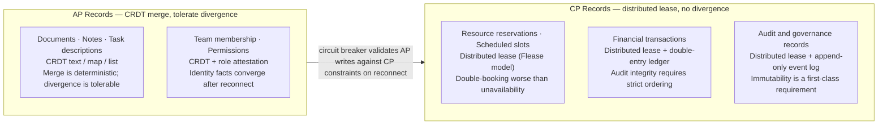
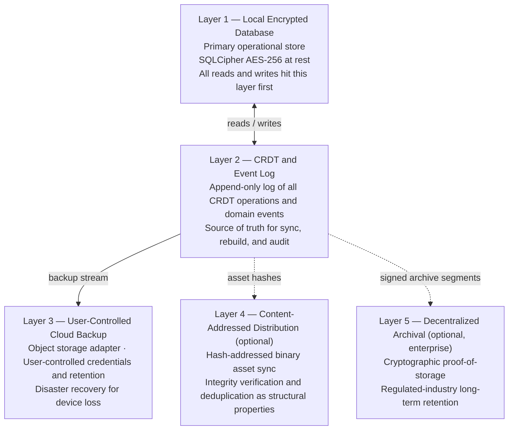

# Chapter 12 — CRDT Engine and Data Layer

<!-- icm/prose-review -->
<!-- Target: ~4,000 words -->
<!-- Source: v13 §2.2, §2.4, §9, §12; v5 §3.1; ADR 0028 -->
<!-- Part: III — specification voice -->

---

Every CRDT-based system eventually faces the same two questions. Which data structures get to diverge? Which ones cannot afford to? The data layer answers both. It defines the document primitives that merge automatically, the CP-class records that require a lease before any write proceeds, the engine that executes the merge, and the storage stack underneath. Get this layer right and the rest of the node runs on a predictable foundation. Get it wrong and no amount of sync-protocol sophistication recovers correctness at the domain level. The merge math may be flawless. The wire format may be audited line by line. A financial posting will still arrive double-counted.

The data layer carries three structural concerns. The CRDT engine itself, together with the abstraction that keeps the engine choice reversible. A per-record positioning model that specifies whether each record class converges through merging or serializes through a lease. A five-tier storage stack that places durability guarantees in the right layer for each concern. A fourth concern — the double-entry ledger — is not a separate subsystem. It is the canonical example of how CP-class records are modeled correctly in a local-first system.

---

## The Three-Layer CRDT Architecture

The data layer's CRDT foundation rests on three formal properties the merge function must satisfy: commutativity, associativity, and idempotency. Any two peers applying the same set of operations in any order produce the same state. Applying an operation twice produces the same state as applying it once. These are the guarantees the CRDT library provides to the semantic layer. The semantic layer adds domain constraints on top. The view layer projects both for rendering. Each layer extends rather than overrides the guarantees beneath it.

The CRDT data model separates three concerns. Collapse them together and you produce systems where merge logic depends on domain rules and domain rules depend on how storage happens to arrange bytes. Keep the three layers distinct and the merge logic stays mathematically clean, the domain rules stay expressible as business constraints rather than workarounds, and the query layer stays replaceable without touching either of the other two.

**The data layer** provides the raw CRDT types: maps, lists, text, and counters. These types carry no domain semantics. A map knows how to merge concurrent key insertions. A list knows how to merge concurrent element insertions while preserving insertion order across peers. A text type resolves concurrent character insertions into a human-legible result rather than arbitrary interleaving. A counter accumulates increments from multiple peers and converges to the correct sum. None of these types know what a "task" is, what a "period close" means, or whether a specific sequence of map mutations represents a valid state transition for a financial posting. They know only the merge rule for their structure. The math of how bytes meet, nothing more.

**The semantic layer** interprets CRDT changes as domain events. When the data layer reports that a map key changed from one value to another, the semantic layer determines whether that change represents a valid state transition — a task moving from `In Progress` to `Done` — or an invalid one, such as a posted transaction being directly mutated to change its amount. The semantic layer enforces domain invariants that CRDT merge cannot enforce by itself. CRDT merge is data-structure-centric, not domain-centric. A CRDT map will happily merge two peers' concurrent writes to a financial posting's amount field. The semantic layer is what turns that merge into a compensating ledger entry instead of a silently corrupted balance.

**The view layer** projects the current CRDT state into indexes and read models optimized for query. The view layer holds no authority. It holds no state that cannot be rebuilt from the data and semantic layers. Projections registered through `IProjectionBuilder` live here: balance tables, task boards, resource calendars, aging reports. When the CRDT engine compacts a document, the view layer rebuilds its projections from the surviving snapshot plus any events that postdate the compaction boundary. The rebuild must be idempotent. The kernel may trigger it at any time without notice.

Swapping the CRDT engine — moving from YDotNet (the .NET CRDT engine port of Yjs ([github.com/yjs/yjs](https://github.com/yjs/yjs), the JavaScript CRDT library) via Rust FFI (Foreign Function Interface)) to Loro ([github.com/loro-dev/loro](https://github.com/loro-dev/loro), a Rust-core CRDT library) — does not touch the semantic layer or the view layer. Swapping the query technology does not touch the data or semantic layers. Each layer has one reason to change.

---

## Per-Record CAP Positioning

The CAP theorem is not a global setting. A single local node applies different positions to different record classes at the same time, because the cost-benefit tradeoff for divergence differs by record type. For a task description, divergence is tolerable: two offline peers can each edit the text, and the merge produces a result the user can review. For a resource reservation or a financial posting, divergence is not tolerable. Two offline peers each committing a reservation or amount that conflicts produces a state that cannot be made consistent after the fact without business-level harm.

The per-record CAP positioning model assigns each record class to either AP or CP explicitly, with the mechanism that enforces the position and the rationale for the choice.



| Record Class | CAP Position | Mechanism | Rationale |
|---|---|---|---|
| Documents, notes, task descriptions | AP | CRDT (text / map / list) | Divergence tolerable; merge deterministic |
| Team membership, permissions | AP with deferred merge | CRDT + role attestation | Identity facts converge after reconnect |
| Resource reservations, scheduled slots | CP | Distributed lease | Double-booking worse than unavailability |
| Financial transactions | CP | Distributed lease + double-entry ledger | Audit integrity requires strict ordering |
| Audit and governance records | CP + append-only | Distributed lease + event log | Immutability is a first-class requirement |

**AP records** tolerate divergence because the merge is deterministic and the domain consequence of temporarily inconsistent state is acceptable. A task description that two peers edited at the same time produces a merged text the user can review. A team membership list that two peers updated concurrently resolves through CRDT map merge plus role attestation verification on reconnect. The deferred merge for identity facts introduces a brief window of inconsistency — peer B may briefly see a stale membership list while offline — but the system converges to the correct state once both peers reconnect and verify their attestation bundles.

**CP records** prohibit divergence because concurrent writes from different nodes produce conflicting domain state that cannot be resolved by merge alone. Resource reservations are the clearest case: two nodes each committing the same room for overlapping slots offline cannot resolve the conflict through merge. The merged state would show the room double-booked. That is exactly what the system must prevent. Financial transactions require strict ordering for audit integrity: a posting that appears in two different positions in the ledger sequence because two peers applied it at different logical times is an audit failure, not a merge anomaly.

Nodes operating offline in AP mode accumulate writes against AP records freely. CP-class writes attempted offline are queued in the circuit-breaker quarantine queue. On reconnect, the circuit breaker attempts to acquire the required lease before promoting each queued CP write to the shared event log. A CP write that cannot acquire a lease — because another node already holds the lease and committed a conflicting write — surfaces to the user as a conflict requiring resolution. Not as a silent merge.

The boundary between AP and CP is not a guess. It is a domain decision that belongs in the semantic layer. The data layer does not know which record classes are CP. That designation lives in the plugin's stream definition registered with the kernel. CP-designated streams route writes through distributed lease coordination via `Sunfish.Kernel.Lease` before any write reaches the CRDT document store. <!-- illustrative — the specific kernel interface through which plugins declare CP/AP designation is pre-1.0 -->

---

## CRDT Engine Selection: YDotNet, Loro, and the ICrdtEngine Abstraction

The `ICrdtEngine` interface in `Sunfish.Kernel.Crdt` exposes what the sync protocol and schema migration infrastructure need: create and open documents, produce incremental deltas since a given version vector, apply deltas from peers, produce and restore full-state snapshots, and advance the local version vector. No kernel package, no plugin, and no sync daemon code takes a dependency on a specific engine implementation.

The abstraction carries an engine name and version string that appear in diagnostics, handshake capability advertisements, and stale peer recovery logs. An implementation swap from YDotNet to Loro does not require a schema epoch bump, because the event log stores domain events, not CRDT wire format. The CRDT document is a live working surface. The append-only event log is the source of truth from which that surface can be rebuilt. Swapping the engine rebuilds CRDT working documents from the event log under the new engine. It does not invalidate the event log itself.

**YDotNet** is the default production backend. YDotNet provides .NET bindings to `yrs`, the Rust rewrite of the Yjs core [3]. The bindings are well-maintained. The documentation is thorough. The behavior under conflict conditions is extensively tested. YDotNet supports the snapshot, delta, and version-vector surfaces the sync protocol requires.

**Loro** is the aspirational primary engine. Loro was designed with compaction as a first-class architectural concern from the outset, not bolted on afterward [4]. Its compact encoding and shallow snapshot model reduce memory footprint for high-churn documents and align directly with the three-tier garbage collection (GC) policy described below. The `loro-cs` bindings at `github.com/sensslen/loro-cs` distribute as a NuGet package tracking `loro-core`. The sync protocol requires snapshot restoration, version vector comparison, and delta production from the binding surface. The `ICrdtEngine` abstraction keeps the engine choice reversible. Sunfish (the open-source reference implementation, [github.com/ctwoodwa/Sunfish](https://github.com/ctwoodwa/Sunfish)) uses YDotNet as the current default, with Loro as the target once the binding surface covering these interfaces is complete.

**Automerge ([github.com/automerge/automerge](https://github.com/automerge/automerge), a JSON-like CRDT library)** is excluded not because its design is inferior — the Rust core is a strong reference implementation [6] — but because it lacks a first-class .NET binding covering the sync protocol surface. The decision is a binding gap, not a model gap. It is reversible the moment a covering binding ships.

The following example shows how a plugin consumes `ICrdtEngine`:

```csharp
// illustrative — package APIs are pre-1.0
public sealed class ProjectDocumentService
{
    private readonly ICrdtEngine _engine;

    public ProjectDocumentService(ICrdtEngine engine)
    {
        _engine = engine;
    }

    public ICrdtDocument CreateDocument(string documentId)
        => _engine.CreateDocument(documentId);

    public ICrdtDocument OpenFromSnapshot(
        string documentId, ReadOnlyMemory<byte> snapshot)
        => _engine.OpenDocument(documentId, snapshot);
}
```

The plugin never references a YDotNet type directly. If the engine backend changes, this code is unchanged.

---

## CRDT Growth and Garbage Collection

CRDT documents grow monotonically. Tombstones for deleted elements, historical operation records for concurrent edits, and metadata for version vector entries all accumulate as the document is used. A text document in active daily use for six months carries operation history proportional to every character ever typed, not just the characters currently visible. This is not a flaw in the CRDT model. It is the mechanism that makes deterministic merge possible without a central coordinator. The design question is not how to eliminate growth. The question is how to bound it.

Three mitigation strategies apply at different levels of the stack. They are not alternatives. A production deployment uses all three, applied selectively by document type. The operational cost is real: AckVector maintenance, peer-staleness window administration, and tier classification at stream definition time are responsibilities the architecture imposes on the operating team that a SaaS (Software as a Service) platform's managed-GC model would absorb. What the architecture buys in exchange is the set of properties a managed-GC model cannot provide. Operation under extended partition. Sovereign data residency. Survival of vendor-service interruption. The seven Kleppmann ideals as structural guarantees rather than vendor commitments.

**Library-level compaction** treats the engine's compaction behavior as a primary evaluation criterion. Loro is the aspirational primary for this reason: its compact encoding and shallow snapshot model produce significantly smaller documents for equivalent operation histories compared to engines with emergent GC approaches. For an engine with emergent GC — YDotNet — compaction still applies, but it requires that all peers have acknowledged operations before they are eligible for pruning. That creates a dependency on peer acknowledgment state that shallow snapshots avoid.

**Application-level document sharding** splits large logical documents into sub-documents under named map keys. A construction project document that accumulates high-churn activity in its daily log entries is split so that each week's log is a separate CRDT document under the project map. Archiving a week's log means deleting the map key that references it. The engine garbage-collects the sub-document independently of the rest of the project. Sharding belongs to the semantic layer: the plugin declares which domains use sharded sub-documents and what the sharding key is. The data layer executes the sharding transparently. Sharding is appropriate for high-churn domains — log entries, presence annotations, ephemeral comments — where the growth rate from accumulated operations would otherwise dominate document size over time.

**Periodic shallow snapshots** apply to extreme cases: programmatically generated content, high-frequency telemetry ingestion, or audit records that must be retained for regulatory purposes but accessed infrequently. A shallow snapshot captures current visible state plus a version vector encoding which operations are included. Operations older than the snapshot boundary are discarded. The snapshot becomes the new base for subsequent deltas. Shallow snapshots are not safe for all document types: they assume every peer has acknowledged all operations that predate the snapshot boundary. If a peer reconnects whose vector clock predates the snapshot boundary, full-state snapshot transfer replaces the incremental delta stream for that peer's recovery. Periodic shallow snapshots are opt-in, declared per document type in the plugin's stream definition.

### The Three-Tier GC Policy

The garbage collection policy assigns each document type to one of three tiers based on its durability requirements and peer acknowledgment characteristics.

**Aggressive GC (ephemeral tier)** applies to data where durability is not required: cursor positions, presence indicators, typing notifications, scroll positions. These documents use the engine's ephemeral mode, which discards operations on a short schedule without waiting for peer acknowledgment. An ephemeral-tier document that a peer never received is simply lost. The peer constructs a fresh view from the next broadcast. Aggressive GC is safe here precisely because the data is not durable by design.

**Medium-term retention (standard tier)** applies to operational documents in active use. Operations older than the configured retention window — 90 days by default; 180 days for deployments with documented seasonal multi-month offline patterns, including Gulf Cooperation Council (GCC) construction, rural Indian Banking, Financial Services, and Insurance (BFSI) field operations, and Sub-Saharan African field deployments — are eligible for compaction, but only if every peer in the active peer set has acknowledged them. Acknowledgment state is tracked per-document per-peer in a compact `AckVector` persisted alongside the Layer 2 event log. Each peer's acknowledgment watermark is the highest-indexed operation that peer has confirmed receiving, updated on each gossip round. The "active peer set" is the set of peers that have authenticated a CAPABILITY_NEG handshake within the deployment's configured peer-staleness window (30 days by default). A peer that has been absent longer than the peer-staleness window is dropped from the active set by administrator action. GC proceeds without their acknowledgment. A peer that returns after being dropped re-enters through the stale-peer recovery protocol below.

### The Stale Peer Recovery Protocol

When a peer reconnects after being offline long enough that its vector clock predates the GC horizon, incremental sync is no longer possible. The operations required to bring its state forward have been compacted away. The sync daemon detects this at the CAPABILITY_NEG phase by comparing the reconnecting peer's declared vector clock against the local compaction watermark. When the clock predates the watermark, the daemon abandons incremental sync for that peer and initiates full-state snapshot transfer.

The snapshot transfer protocol has four properties:

1. **Source selection.** The reconnecting peer prefers a snapshot from its most recent successful sync partner. If that peer is unavailable, any peer whose current snapshot covers the reconnecting peer's last-known-good state will serve. If no online peer has a complete snapshot from the reconnecting peer's vector clock forward, the daemon surfaces a `SnapshotUnavailable` condition. The peer must either wait for an eligible peer to come online or reinitialize from a Layer 3 backup.

2. **Concurrent transfer limits.** The sync daemon limits full-state transfers to two concurrent streams per source peer by default, ensuring that snapshot transfers do not starve normal gossip anti-entropy. Snapshot transfer runs at lower priority than incremental delta exchange: an incoming incremental delta from a non-stale peer preempts a snapshot transfer's bandwidth slice.

3. **Idempotency under interruption.** Snapshot transfers resume from byte offset on connection loss. The receiving peer verifies the snapshot's integrity hash after reassembly before committing it to Layer 1. A corrupted transfer is discarded and retried. The CRDT engine applies the snapshot atomically: either the full state becomes the new baseline, or the local state is unchanged.

4. **Per-tier behavior.** Compliance-tier documents (no GC) never require snapshot transfer because their operation history is always complete. Standard-tier documents use snapshot transfer when the peer's vector clock predates the 90-day or 180-day retention boundary. Ephemeral-tier documents do not participate in stale-peer recovery. The peer constructs fresh state from the next broadcast.

### CRDT Operation Validation at Store Entry

Every CRDT operation arriving at the local node passes through schema-level validation before storage. Validation gates insertion; failed operations route to the quarantine queue. Chapter 13 specifies the schema registry, upcaster chain, and epoch coordination protocol; Chapter 14 specifies the CAPABILITY_NEG wire format; Chapter 15 specifies the break-glass corrupt-sequence recovery procedure.

**No-GC compliance tier** applies to financial records, signed audit logs, governance decisions, and any document type subject to regulatory retention requirements. Documents at this tier accumulate indefinitely. Growth is bounded only by business volume — the number of transactions, audit events, and governance decisions the organization produces. For regulated industries, this is the correct bound. The growth is proportional to the business activity that the record exists to document.

The compliance tier is required — not preferred — for records under fourteen major data sovereignty regimes across six geographic regions: European data residency under GDPR Article 30 + Schrems II [5], Gulf and South Asia under DIFC DPL 2020 + DPDP + RBI, East Asia under PIPL + APPI + PIPA, Americas under LGPD + LFPDPPP, Africa under POPIA + NDPR, and CIS under Russia 242-FZ. Per-regime mapping including national enforcement, citation, and chapter-coverage in Appendix F.

Organizations subject to any of these regimes assign affected document types to the compliance tier at stream definition time. A stream classified for business-tier retention under one of these regimes produces an audit integrity problem that no GC correctness guarantee can recover. Chapter 15 specifies the GDPR Article 17 right-to-erasure interaction with no-GC retention through crypto-shredding at the data encryption key (DEK) level.

The tier assignment lives in the plugin's `IStreamDefinition`. A financial posting stream assigned to the medium-term retention tier produces an audit integrity problem that no GC correctness guarantee can recover. The tier assignment is a domain decision.

---

## The Double-Entry Ledger as the Canonical CP Subsystem

The double-entry ledger is the correct model for value records — not a CRDT workaround — because it aligns structurally with what the CP position requires: append-only, immutable, strictly ordered writes.

Every financial transaction produces at least two postings. The sum of all posting amounts for a single transaction is always zero — credits and debits balance. Postings are immutable once committed. Errors are corrected by posting compensating entries, not by mutating the erroneous posting in place. The immutability property is enforced structurally by the append-only event log, not just by accounting convention.

### The Posting Engine

`Sunfish.Kernel.Ledger` provides the posting engine that converts domain events into ledger entries under distributed lease coordination. A write to the ledger requires a lease granted by a quorum of peers through `Sunfish.Kernel.Lease`. The lease serializes concurrent posting attempts so that the ordering of postings in the ledger is deterministic across all peers once they synchronize.

Domain events carry idempotency keys. The posting engine guarantees that processing the same domain event multiple times — a consequence of at-least-once delivery in a distributed system — produces at most one set of postings. The first processing of an event commits the postings. Subsequent processing of the same event, identified by the same idempotency key, is a no-op that returns the same result as the first processing. That guarantee makes at-least-once event delivery safe for the posting engine without risking duplicate financial entries.

The following illustrative example shows a domain event being submitted to the posting engine:

```csharp
// illustrative — package APIs are pre-1.0
public sealed class InvoicePaymentHandler
{
    private readonly IPostingEngine _postingEngine;

    public InvoicePaymentHandler(IPostingEngine postingEngine)
    {
        _postingEngine = postingEngine;
    }

    public async Task HandleAsync(InvoicePaymentReceived evt, CancellationToken ct)
    {
        var tx = new Transaction(
            TransactionId: Guid.NewGuid(),
            IdempotencyKey: evt.EventId,
            Postings: [ /* balanced debit and credit postings */ ],
            CreatedAt: DateTimeOffset.UtcNow);

        await _postingEngine.PostAsync(tx, ct);
    }
}
```

The handler does not check whether the posting already exists. The engine's idempotency guarantee makes the double-submission safe.

### CQRS Write/Read Split

The ledger uses Command Query Responsibility Segregation (CQRS). The write side is the immutable posting event stream. The read side is a set of materialized projections: balance tables, statements, aging reports, period summaries. The projections are derived views. They hold no data that cannot be rebuilt by replaying the event stream from the beginning.

Business rule aggregates — credit limit checks, payment allocation decisions, overdue detection — read from the event stream directly or from the current lease-protected CP record state, never from a projection that may lag behind an asynchronous update cycle.

When a node recovers from a crash or resumes after a long offline period, projections rebuild from the event log automatically. The event log is the recovery procedure.

### Period Close and Rollup Snapshots

The projection engine computes rollup snapshots at period close: account balances as of the period end, profit-and-loss summaries, cash flow statements. These rollup snapshots are stored as closing events in the append-only log — computed values committed to the log because recomputing them on demand for historical periods is expensive.

Postings affecting a period that has already been closed are directed to adjustment accounts in the next open period. The closed period's rollup snapshot remains immutable. The correction appears in the current period as a debit to the adjustment account with a note referencing the original posting in the closed period. The closed period's event log is never rewritten, which preserves the audit integrity guarantee.

---

## The Five-Layer Storage Architecture

The storage architecture places five concerns in five distinct layers, each with independent durability semantics and failure modes. Layers 1 through 3 are always present. Layers 4 and 5 are opt-in.



**Layer 1 — Local Encrypted Database** is the primary operational store. All reads and all writes hit this layer first. `Sunfish.Foundation.LocalFirst` provides the SQLCipher-backed `IOfflineStore`. SQLCipher applies AES-256 encryption at the page level. The encryption key is derived from the device's OS-native keystore entry through `Sunfish.Kernel.Security`, never stored in plaintext alongside the database. Reads from this layer are synchronous from the application's perspective — no network round-trip. That is the property that makes the node viable in offline or high-latency conditions. If the database file is corrupted, the event log in Layer 2 is the recovery path: the node rebuilds the encrypted database by replaying the event log.

**Layer 2 — CRDT and Event Log** is the source of truth. Every CRDT operation, every domain event, every posting in the ledger appends to this log before any response is returned to the application. Appends are durable writes — `fsync`'d to disk on POSIX, `FlushFileBuffers`'d on Windows — before the application receives confirmation. An unplanned power interruption between application response and disk commit is not possible: either the write is visible after recovery, or it never returned to the application. This durability property is what makes the architecture viable in load-shedding deployments where process termination mid-write is a routine operational event. The log is append-only by construction. The write path has no mutation operation. The only operation that touches existing log entries is compaction under the three-tier GC policy, and compaction replaces a range of operations with a snapshot that represents the same state — it does not delete state silently. If Layer 1 is lost, Layer 2 rebuilds it. If Layer 2 is truncated without a compensating backup in Layer 3, the data in the truncated range is irrecoverable. This is the one storage failure mode with no mitigation path: log truncation without backup is permanent loss.

**Layer 3 — User-Controlled Cloud Backup** streams the event log to object storage under the user's own credentials. The provider adapter accepts any endpoint conforming to the S3 API (Application Programming Interface), including Azure Blob Storage and Google Cloud Storage alongside European, Gulf, Indian, and on-premise S3-compatible providers (the full per-region provider catalog appears in Appendix F). The user controls the credentials, the bucket, the jurisdictional residency, and the retention policy. The architecture does not constrain jurisdiction choice. Disaster recovery for the complete loss of a device proceeds by installing the application on a new device, providing the backup credentials, and allowing the node to restore from the object storage archive. Chapter 16 specifies the backup status UX and the full recovery walkthrough.

**Layer 4 — Content-Addressed Distribution** applies when binary assets — attachments, images, large files — synchronize across nodes. Content addressing computes a hash of the asset content and uses the hash as the storage key, which provides integrity verification and deduplication as structural properties rather than add-on checks. Two nodes that have independently received the same file confirm identity by comparing hashes. No redundant transfer occurs. This layer is opt-in because not all deployments sync binary assets, and the infrastructure overhead is unnecessary for text-and-structured-data nodes.

**Layer 5 — Decentralized Archival** provides cryptographic proof-of-storage for regulated industries with long-term retention requirements. Signed archive segments from the event log are committed to a decentralized storage network that issues cryptographic proofs confirming the data exists and has not been modified. These proofs satisfy audit requirements in regulated industries where a self-attesting archive would not pass scrutiny. This layer is enterprise-tier and opt-in. The local archive in Layers 1 and 2 remains valid and accessible regardless of Layer 5 availability. The decentralized layer adds an auditable proof, not an operational dependency.

---

## Failure Modes and Edge Cases

| Scenario | Behavior | Recovery |
|---|---|---|
| AP write conflicts between two offline peers | CRDT merge runs on reconnect; merged state surfaces through semantic layer validation | Conflict inbox displays record if semantic layer flags the merge as requiring review |
| CP write attempted while quorum unreachable | Write queued in circuit breaker quarantine queue; user sees staleness indicator | On quorum restoration, queued writes attempt lease acquisition in submission order |
| Reconnecting peer vector clock predates compaction boundary | Delta stream unavailable; node receives full-state snapshot under stale peer recovery protocol | Node replays from snapshot; event log rebuilt from snapshot forward |
| CRDT document grows beyond memory budget | Shallow snapshot triggered if opt-in for document type; older operations pruned | Projection rebuild follows snapshot; no domain data lost if policy correctly applied |
| Layer 1 database corrupted | Node enters faulted state; attempts rebuild from Layer 2 event log | Full rebuild from event log restores all domain state; rebuild time proportional to log length |
| Layer 2 log truncated without Layer 3 backup | Irrecoverable loss for truncated range | No automated recovery; manual reconstruction from external sources only |
| Posting engine receives duplicate event | Idempotency key match detected; second processing is a no-op; original posting returned | No action required; idempotency guarantee prevents duplicate ledger entries |
| Period close attempted while posting lease unavailable | Close blocked; posting engine returns lease-unavailable error | Retry after lease acquisition; closed period boundary cannot be committed without lease |
| Engine swap from YDotNet to Loro | CRDT working documents rebuilt from event log under new engine | Schema epoch bump not required; event log format is engine-independent |
| loro-cs binding gap for required API surface | Required ICrdtEngine method unavailable in current binding version | Fall back to YDotNet; contribute missing bindings if gap is small |

---

## Sunfish Package Reference

| Package | Responsibility |
|---|---|
| `Sunfish.Kernel.Crdt` | `ICrdtEngine` abstraction; YDotNet backend (validated, integration pending Wave 1); `StubCrdtEngine` (current, test-only, marked "DO NOT SHIP TO PRODUCTION"); Loro backend (aspirational); engine name and version diagnostics |
| `Sunfish.Kernel.Lease` | Flease-model distributed lease coordinator for CP-class record writes; quorum arithmetic; split-write safety |
| `Sunfish.Kernel.Ledger` | Double-entry `IPostingEngine`; idempotency key enforcement; CQRS read model projections; period-close rollup snapshots |
| `Sunfish.Foundation.LocalFirst` | SQLCipher-backed `IOfflineStore` (Layer 1); circuit-breaker quarantine queue for offline CP writes |
| `Sunfish.Kernel.EventBus` | `IEventLog` append-only persistence (Layer 2); file-backed production implementation; in-memory test implementation |

All packages are pre-1.0. Package names are stable for reference. Specific interface method signatures and registration-method options are subject to change before the 1.0 release. See Chapter 17 for the minimal implementation path, and Chapter 13 for the schema migration protocol that governs how event log format evolves across node versions.

---

## References

[1] M. Kleppmann, A. Wiggins, P. van Hardenberg, and M. McGranaghan, "Local-first software: You own your data, in spite of the cloud," in *Proc. ACM SIGPLAN Int. Symp. New Ideas, New Paradigms, and Reflections on Programming and Software (Onward! '19)*, Athens, Greece, Oct. 2019, pp. 154–178, doi: 10.1145/3359591.3359737. [Online]. Available: https://www.inkandswitch.com/essay/local-first/

[2] M. Kleppmann, *Designing Data-Intensive Applications*, 1st ed. Sebastopol, CA: O'Reilly Media, 2017.

[3] K. Jahns and H. Dietz, "Yjs: A CRDT framework for building collaborative applications," *GitHub repository*, 2015–2025. [Online]. Available: https://github.com/yjs/yjs. [Accessed: Apr. 23, 2026].

[4] Loro contributors, "Loro: CRDT framework making your app collaborative," *GitHub repository*, 2023–2025. [Online]. Available: https://github.com/loro-dev/loro. [Accessed: Apr. 23, 2026].

[5] Court of Justice of the European Union, Data Protection Commissioner v. Facebook Ireland Limited and Maximillian Schrems, Case C-311/18, Judgment of 16 July 2020.

[6] Automerge contributors, "Automerge: A JSON-like data structure (a CRDT) that can be modified concurrently by different users, and merged again automatically," *GitHub repository*, 2017–2025. [Online]. Available: https://github.com/automerge/automerge. [Accessed: Apr. 23, 2026].
