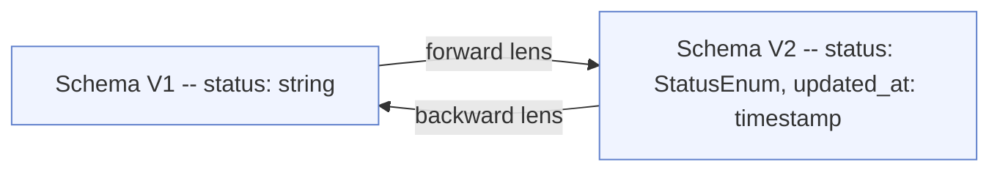
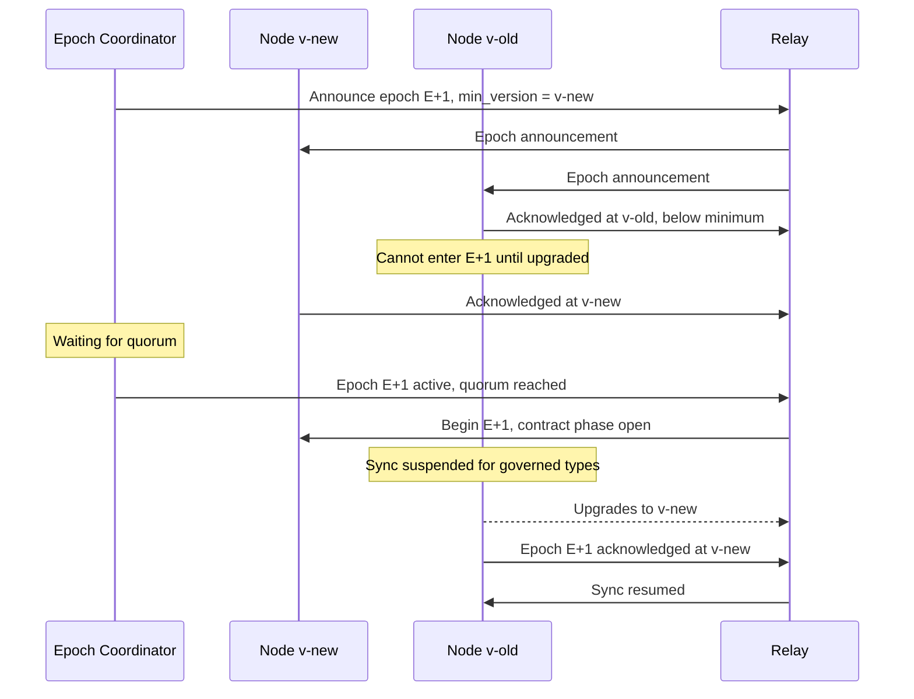
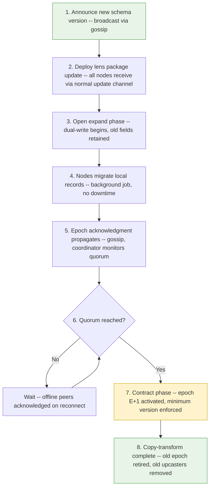

# Chapter 13 — Schema Migration and Evolution

<!-- icm/prose-review -->
<!-- Target: ~3,500 words -->
<!-- Source: v13 s7, s8, s15, s19; v5 s3; book-structure.md sCh13 -->
<!-- Part: III — specification voice -->

---

Schema migration in a local-node architecture has no central authority. No coordinated deployment window. Nodes upgrade on their own schedule. A team of twelve people running a local-first application may, at any given moment, have four people on the latest release, six on the previous release, and two on a release that is two minor versions old — one of whom has not connected to the network in six weeks. Every node holds an authoritative copy of the data. The sync daemon does not know which schema version a peer is running until the handshake. No central authority can force an upgrade. The application must remain correct and interoperable across all of those versions simultaneously.

Three mechanisms compose to solve this: the expand-contract pattern for safe additive migration, bidirectional schema lenses for structural transformation, and schema epoch coordination for the moments when a breaking change cannot be avoided. Each handles a different class of schema change. The architecture requires all three because no single mechanism covers the full range.

---

## The Problem: Nodes Run Different Versions

When node A upgrades from schema v2 to schema v3 and node B has not yet upgraded, the sync daemon on A sends CRDT (Conflict-free Replicated Data Type) operations that B must be able to interpret. If those operations reference a field that does not exist in B's schema, B has two bad options: reject the operation and lose data, or store the unknown field and risk producing an inconsistent state when domain logic queries it.

The same problem applies in the other direction. B sends operations from its v2 schema to A. A's semantic layer may now interpret those operations differently — a field that was a string in v2 is a structured object in v3. The lens that translates v2 operations into v3 semantics must exist on A before the first operation from B arrives.

The expand-contract pattern, lenses, and epochs address the cross-node problem at the point where it originates: the sync layer.

---

## Expand-Contract Migration

The expand-contract pattern — sometimes called parallel change — divides every schema modification into two phases separated by a compatibility window. The core invariant: at no point during migration does a node running the current schema produce operations that a node running the previous schema cannot safely store.

### The Expand Phase

In the expand phase, the new version adds fields while keeping the old ones. The application dual-writes: when creating or updating a record, it writes to both the old field and the new field simultaneously. Nodes running the old schema see only the old field and ignore the new one as an unknown key — CRDT maps are designed to tolerate unknown keys. Nodes running the new schema prefer the new field and fall back to the old field when the new one is absent, which happens when the record was last written by an old-schema node.

No coordination is required to begin the expand phase. Any node can upgrade. The expand-phase behavior is immediately correct for mixed-version operation.

The expand phase has one hard constraint: it must remain active for at least one full major version release cycle. The compatibility window must be long enough that all nodes in any realistic deployment have had the opportunity to upgrade. Teams with nodes that are infrequently connected — a laptop that travels, an air-gapped workstation, a device that a team member left on a shelf — dictate how long the compatibility window must stay open. The kernel tracks the oldest schema version seen from each peer in the current sync session. The epoch coordinator uses this tracking data to determine when the contract phase is safe to initiate.

### The Contract Phase

The contract phase removes the old field. It is a breaking change. A node running old schema v2 that receives an operation from a new schema v3 node — where the v3 node no longer writes the v2 field — will see a gap. If the old-schema node's domain logic depends on the old field and the new-schema node no longer writes it, the old-schema node produces incorrect state.

This is why the contract phase requires a schema epoch bump. The epoch bump is a version gate: the sync daemon on a v3 node rejects synchronization with any peer still running a schema below the minimum supported epoch. The peer receives a clear error — it cannot sync until it upgrades — rather than silently receiving partial data.

The contract phase does not begin automatically when the compatibility window expires. It requires explicit initiation by the epoch coordinator, covered below. Entering the contract phase is a deliberate operational act, not a timer.

### Dual-Write Safety

During the expand phase, dual-write semantics must be consistent across all code paths that produce records. A code path that writes only the new field produces records that old-schema nodes cannot interpret. The `ISchemaVersion` interface in `Sunfish.Kernel.Runtime` registers the schema version and its upcasting logic. Dual-write consistency across all write paths is a code-review invariant, not a runtime guarantee.

---

## Event Versioning and Upcasters

CRDT operations travel between nodes as immutable deltas. The events that result from applying those operations to domain aggregates are also immutable once written to the event log. Schema evolution cannot modify history. It can only add a read-path layer that transforms older events into the current in-memory shape.

Upcasters are that read-path layer. An upcaster is a pure function: it takes an event of type `RecordUpdatedV1` and returns the equivalent `RecordUpdatedV2`. The semantic layer applies upcasters on read, before domain logic sees the event. Domain logic always operates on the current-version event shape regardless of what is stored in the log.

Two classes of additive change do not require upcasters: adding a new optional field to an existing event type, and adding a new event variant. Old nodes receiving an event with an unknown optional field store it as an unknown key and ignore it. New nodes receiving an event missing the optional field treat absence as the field's default value. New event variants that old nodes cannot interpret are quarantined, not silently dropped — the circuit breaker queue holds them pending upgrade acknowledgment.

Non-additive changes require a new event type. Renaming a field in an existing event type is not additive: old nodes reading the old field name get an absent value, not the renamed one. The correct approach is to introduce `RecordUpdatedV2` with the renamed field, leave `RecordUpdatedV1` intact, and register an upcaster that promotes V1 events to V2 on read. The V1 event type is never modified.

### The Accumulation Problem

Upcaster chains accumulate over time. A system with three major versions of a record type has upcasters from V1 to V2 and V2 to V3. A system with ten major versions has nine upcasters composed in sequence for every event read. Each upcaster is individually simple. The chain introduces maintenance risk because developers must trace the full sequence to understand what any stored event means.

Mandatory stream compaction bounds the accumulation problem. Compaction is a background copy-transform job: it replays the original event stream, applies all current upcasters in sequence, and writes a new compacted stream where every event is already in the current-version shape. Once compaction completes and the compacted stream is verified, the old upcasters for compacted events are retired. The old stream is archived rather than deleted — it is the audit record of original history — but the read path no longer traverses it for operational queries.

Compaction is scheduled after each major schema epoch transition. It runs as a low-priority background process and does not block synchronization. The kernel checkpoints compaction progress so that an interrupted compaction resumes rather than restarts.

---

## Bidirectional Schema Lenses

A lens is a pair of transformation functions between two schema versions: a forward function that transforms a record from schema v(n) to schema v(n+1), and a backward function that transforms it back. The forward and backward functions must be inverses of each other up to information loss — a value that exists in v(n+1) but has no equivalent in v(n) cannot survive a round-trip backward.

Bidirectional lenses allow two nodes at different schema versions to exchange records without either node converting permanently to the other schema. When the newer-schema node sends a CRDT delta to an older-schema peer, the sync daemon applies the backward lens before transmitting. The peer receives a correctly shaped delta and processes it normally. When the older-schema peer sends a delta to the newer node, the receiving sync daemon applies the forward lens on receipt. Neither node stores data in the wrong version shape.

Lenses form a directed graph. Each directed edge between two consecutive schema versions carries a lens pair. To translate between non-adjacent versions, the sync daemon traverses the shortest path through the graph, composing lens functions in order. Version distance is a performance concern, not a correctness concern: a node that is three versions behind applies three composed lenses on receipt and transmission. The kernel caches composed lens chains per peer schema version to avoid recomputing the path on every delta.

The reference design for bidirectional schema lenses is Ink and Switch's Cambria project [1]. Cambria demonstrated that lenses can be declared as a data structure rather than hand-written code — a lens schema specifying field renames, type coercions, and structural transforms — and that the lens engine checks the bidirectionality constraint mechanically rather than by inspection. The architecture follows the Cambria model: lenses are registered as `ISchemaLens` implementations via `LensGraph.AddLens()` in `Sunfish.Kernel.SchemaRegistry`, and the `LensGraph` engine traverses and composes them. The current implementation requires lenses to be written as C# code rather than as pure declarative specifications — a pragmatic divergence from Cambria's data-driven approach that retains the bidirectionality and graph-composition properties.

### Lens Registration

Each plugin that owns a CRDT document type registers lenses for every version boundary it has published via `LensGraph.AddLens()` in `Sunfish.Kernel.SchemaRegistry`. The kernel discovers registered lenses at startup and constructs the version graph. A plugin that registers v1, v2, and v3 but omits the v1-to-v2 lens produces a startup error, not a runtime failure.

`Sunfish.Kernel.Sync` uses the kernel's lens registry when negotiating capability with a peer. During the HELLO handshake, the peer reports its schema version. The sync daemon checks whether a path exists through the version graph from the peer's version to the local version. If no path exists, synchronization for the affected record type is suspended until either the peer upgrades or a lens for the missing edge is installed.

---

## Schema Epochs and Coordination

Epochs solve the problem that lenses cannot: the contract phase. When a schema change removes a field, changes a field's CRDT type, or introduces a breaking structural reorganization that lenses cannot bridge bidirectionally, the architecture requires a coordination point where all active nodes acknowledge the new schema before the breaking change takes effect.

A schema epoch is a version boundary that carries a minimum supported peer version. Nodes below the minimum cannot synchronize for record types governed by the epoch. The epoch boundary is explicit, versioned, and distributed through the gossip network as a special administrative event — the same mechanism used for role attestation and key rotation.

### Epoch Lifecycle

The node initiating the migration acts as epoch coordinator — typically the team administrator's node. The coordinator role is statically assigned at team setup (the administrator node holds it by default) but is transferable through an authorized transfer event signed by the current coordinator or by a quorum of authenticated team members if the current coordinator is unreachable. Role transfer under authorized quorum prevents emergent role assumption by any node that happens to be online during an outage — authorization is required. The coordinator announces the new epoch to the relay and all directly reachable peers. Each peer acknowledges. The coordinator waits for quorum acknowledgment — strict majority of the currently reachable peer set, matching the CP-class lease quorum specified in Chapter 12 (5-node team = 3 acknowledgments; 7-node = 4) — before declaring the epoch active.

A majority of currently reachable peers must acknowledge the epoch announcement — not every peer must have upgraded. Peers offline at announcement time receive the epoch event on reconnect. An offline peer that reconnects after the epoch becomes active but before upgrading receives a clear message from its first peer contact: the epoch has advanced and the peer must upgrade before synchronization resumes for the affected record types. Unaffected record types continue to sync normally. Only the record types governed by the new epoch are gated.

### The Couch Device Problem

A routine operational condition for deployments with intermittent connectivity is a peer that has been offline for three or more major versions. For Sub-Saharan African field operations, rural Indian BFSI (Banking, Financial Services, and Insurance) deployments, rural Brazilian and Mexican secondary cities, and GCC (Gulf Cooperation Council) construction sites, this shape of reconnection is typical rather than pathological. This device — call it the couch device — returns after a long absence. Its schema is so old that the version graph no longer contains a lens path from its version to the current version: older lens edges have been retired after stream compaction. The couch device cannot sync incrementally. Snapshot delivery supports byte-offset resume across interrupted connections for bandwidth-constrained or unreliable links; typical business-tier snapshot size is bounded by the configured retention window (90 or 180 days of operational history per document type, per Chapter 12).

The resolution is a full snapshot download. During capability negotiation, the sync daemon detects that the peer's vector clock predates the current GC horizon — the point before which the system has compacted its event history and retired old lenses. The daemon reports a snapshot-required condition. The couch device discards its local event log for the affected record types and downloads a current-version snapshot from the nearest available peer. After the snapshot download completes, the device resumes normal incremental sync from the current epoch.

The couch device's offline edits during the absence present a separate problem. Changes that touch record types governed by the new epoch cannot be merged directly because the peer's event log is in a schema the current epoch no longer supports. Those changes are quarantined in the circuit breaker queue and presented to the user for review. The user can discard them, accepting that the locally-made changes are lost, or the team administrator can apply them manually by translating their intent into current-schema operations. Automatic merging of arbitrarily old operations across an epoch boundary is not safe, and the architecture does not attempt it.

### Copy-Transform Migration

When the epoch becomes active, the coordinator initiates the copy-transform background job. The job reads the existing event log for governed record types, applies all registered lenses and upcasters in sequence, and writes the result to a new epoch stream. Nodes that have already upgraded to the new schema read from the new stream. Nodes on the old schema read from the old stream, which is preserved in read-only mode until the epoch is retired.

The copy-transform job is idempotent. If it is interrupted, it resumes from the last checkpointed position. It does not block synchronization: nodes continue to receive and process new operations while the job runs in the background. New operations written during the copy-transform are written directly to the new epoch stream; the job does not re-process them.

Once all active nodes have acknowledged the new epoch and the copy-transform completes, the old epoch stream is marked retired. The old stream is not deleted — it remains in archival storage — but the read path no longer traverses it. Upcasters and lenses for retired epoch edges are removed from the version graph after a configurable retention window.

**Compliance properties of schema history.** The archived epoch streams are forensic artifacts with direct regulatory implications. Under GDPR (General Data Protection Regulation) Article 30 (records of processing activities) and Schrems II's constraint on cross-border transfer of personal data, local-only archival — streams remain on the node operator's storage, not replicated to the managed relay by default — is the structural compliance answer: archival stream retention does not trigger a cross-border transfer event because the data never leaves the jurisdiction. The same architectural property answers data localization mandates under Russia's Federal Law 242-FZ, the UAE's DIFC (Dubai International Financial Centre) DPL (Data Protection Law) 2020, India's DPDP (Digital Personal Data Protection) Act + RBI (Reserve Bank of India), and the parallel regimes named in Appendix F. GDPR Article 5(1)(e) storage limitation creates a tension that the configurable retention window addresses — retired epoch streams should be retained only as long as the applicable audit obligation requires, after which the deletion path specified in Chapter 15 (crypto-shredding at the DEK (Data Encryption Key) level) satisfies the right-to-erasure interaction with full-history retention. The ISchemaLens bidirectionality invariant is verified at `Sunfish.Kernel.SchemaRegistry` startup: each registered lens runs its forward and backward functions against a canonical property-based test fixture; a lens whose round-trip does not produce an identity transformation halts node startup with a diagnostic naming the failing lens edge. This is a runtime assertion, not a code-review convention.

---

## The Migration Runbook

The operational sequence for a schema migration follows eight steps. Each step is reversible until the contract phase is committed.

**Step 1 — Announce.** The epoch coordinator broadcasts the new schema version as an administrative event. All reachable nodes receive it immediately. Offline nodes receive it on reconnect.

**Step 2 — Deploy lens package.** The application update that carries the new schema version also carries the lens for the new version boundary. Lens deployment is part of the application release, not a separate operational action. A node that has not installed the update cannot participate in the new schema; it receives the epoch announcement but cannot acknowledge readiness until updated.

**Step 3 — Open expand phase.** The updated application begins dual-writing. Old-schema nodes continue normal operation. New-schema nodes read both fields and prefer the new one.

**Step 4 — Local record migration.** Each upgraded node runs a local background migration over its existing records, writing the new field alongside the old. The kernel tracks migration progress per record type; the sync daemon reports migration completion to peers as part of capability negotiation.

**Step 5 — Epoch acknowledgment.** Each node that has upgraded and completed local migration sends an epoch acknowledgment through the gossip network. The coordinator accumulates acknowledgments.

**Step 6 — Quorum check.** The coordinator monitors acknowledgment progress. Nodes that have been offline for extended periods are counted as outstanding. The team administrator can override the quorum wait for a specific peer if that peer is known to be permanently decommissioned.

**Step 7 — Contract phase.** The coordinator commits the epoch. The sync daemon begins enforcing the minimum version requirement for governed record types. Old-schema nodes that attempt to synchronize receive a version-gate error with a clear upgrade instruction.

**Step 8 — Copy-transform.** The background copy-transform job runs and completes. The old epoch stream is retired. Old lens edges are scheduled for removal after the retention window.

Each step from 1 through 6 is fully reversible: the epoch announcement can be withdrawn, the lens package update can be rolled back, and the expand phase can be closed without entering the contract phase. Once Step 7 commits, rolling back requires issuing a new epoch that restores the old minimum version — operationally equivalent to a forward migration, not a true rollback.

---

## What Cannot Be Migrated

Not every schema change is migratable through expand-contract and lenses. Three classes of change break bidirectional lens semantics and require a new document type — a fork — rather than a migration.

**Removing a field with no semantic equivalent.** A field that exists in v1 and is removed in v2 without being replaced or renamed has no value that a backward lens can produce. The backward lens from v2 to v1 must populate the v1 field with something, but no value exists to put there. The lens would produce a default or null value — a read-write round-trip destroys information. The change requires a new document type, not a migration.

**Changing a CRDT type.** A field that is a CRDT text type in v1 and a CRDT counter in v2 cannot be migrated through a lens. The merge semantics of the two types are incompatible: the text type resolves concurrent edits by preserving character-level insertions in their original positions; the counter type resolves concurrent increments by summing deltas. No transformation makes a history of text operations valid as a history of counter operations. Any attempt to convert the type silently discards the operational history and breaks the CRDT convergence guarantee. Changing a CRDT type requires treating the new field as a new field — the expand-contract pattern applies — then migrating values through an explicit application-level conversion, then retiring the old field through the contract phase.

**Splitting a field with no deterministic inverse merge.** A single field `full_name` split into `first_name` and `last_name` has a deterministic forward transform: split on the first space. It does not have a deterministic backward transform: no universal rule for merging `first_name` and `last_name` back into `full_name` handles all cultural naming conventions correctly. The architecture treats any field split where the backward transform is an approximation as a new document type, not a migration.

---

## Failure Modes and Edge Cases

| Scenario | Behavior | Recovery |
|---|---|---|
| Node on old schema receives new-schema operation with unknown CRDT field | Stores as unknown key; ignores in domain logic | Upgrade node; forward lens on sync resumes correct interpretation |
| Epoch coordinator goes offline before quorum reached | Epoch remains in announced state; no other node can advance it | Another node with coordinator role re-announces the epoch; existing acknowledgments are preserved |
| Copy-transform job interrupted mid-run | Job resumes from last checkpoint on restart | No action required; kernel tracks checkpoint automatically |
| Couch device returns after GC horizon | Snapshot-required error during handshake | Device downloads current-epoch snapshot; offline edits quarantined for manual review |
| Lens path missing between peer version and local version | Sync suspended for governed record types | Install lens update on either peer; kernel reconstructs path |
| Contract phase entered while one node is still on old schema | Old-schema node receives version-gate error on sync attempt | Node cannot sync governed record types until upgraded; unaffected types continue normally |
| Dual-write code path missing on one write branch | New-schema records missing old field; old-schema peers see gap | Identify missing dual-write path; fix in next patch; expand phase remains open |

---

## Sunfish (the open-source reference implementation, [github.com/ctwoodwa/Sunfish](https://github.com/ctwoodwa/Sunfish)) Package Reference

| Package | Responsibility |
|---|---|
| `Sunfish.Kernel.Runtime` | Schema version registry, `ISchemaVersion` interface, upcaster registration, expand-contract phase tracking |
| `Sunfish.Kernel.SchemaRegistry` | Bidirectional lens engine (`ISchemaLens`, `LensGraph`), epoch coordinator, copy-transform migrator, compaction scheduler |
| `Sunfish.Kernel.Sync` | Per-peer schema version negotiation via HELLO handshake, lens application on delta transmission and receipt, version-gate enforcement at contract phase |

Both packages are pre-1.0. Interface signatures are illustrative; validate against the current Sunfish (the open-source reference implementation, [github.com/ctwoodwa/Sunfish](https://github.com/ctwoodwa/Sunfish)) milestone before implementation.

See Chapter 17 for the tutorial path to registering schema versions and lenses, and Chapter 14 for the sync daemon protocol details that govern the HELLO handshake schema version exchange.

---

## References

[1] G. Litt and P. van Hardenberg, "Cambria: Schema evolution and change management for local-first software," Ink and Switch, 2021. [Online]. Available: https://www.inkandswitch.com/cambria/. [Accessed: Apr. 2026].

[2] M. Kleppmann, *Designing Data-Intensive Applications*, 1st ed. Sebastopol, CA: O'Reilly Media, 2017.
