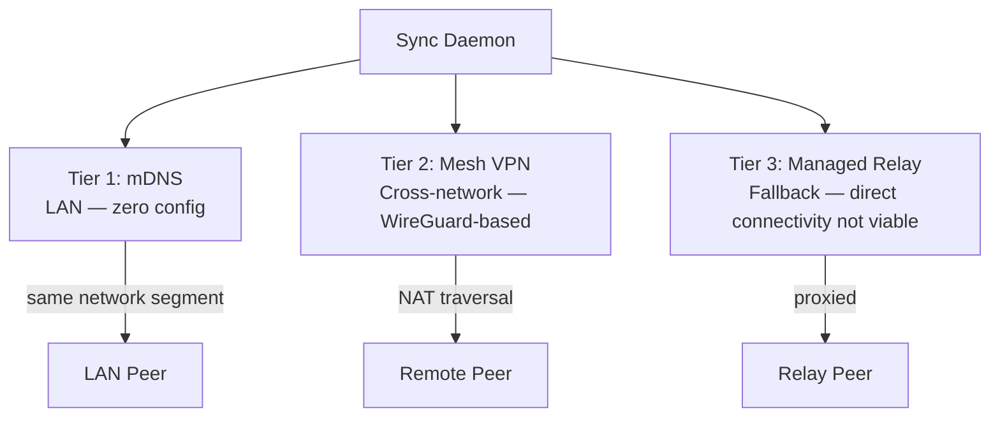
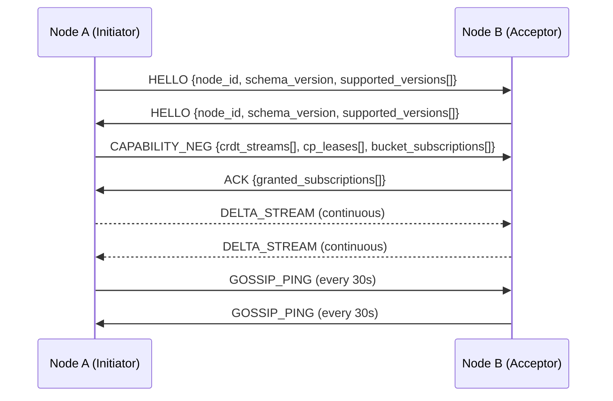
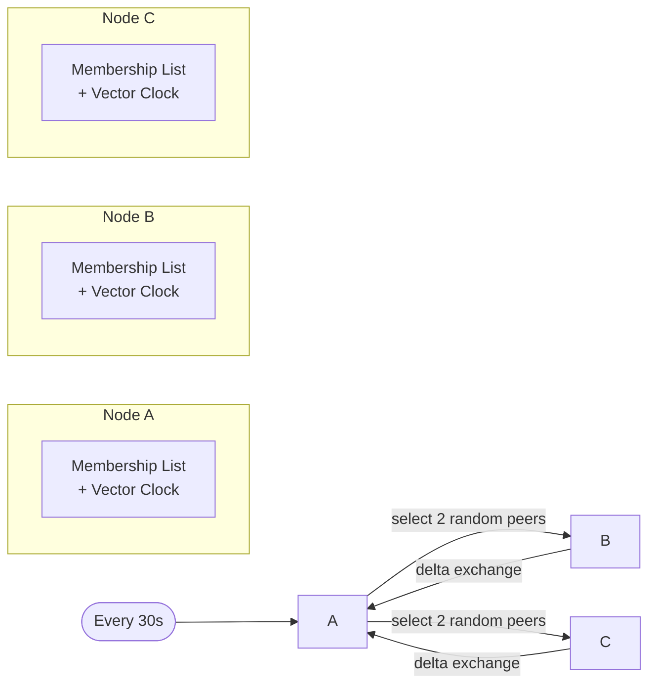
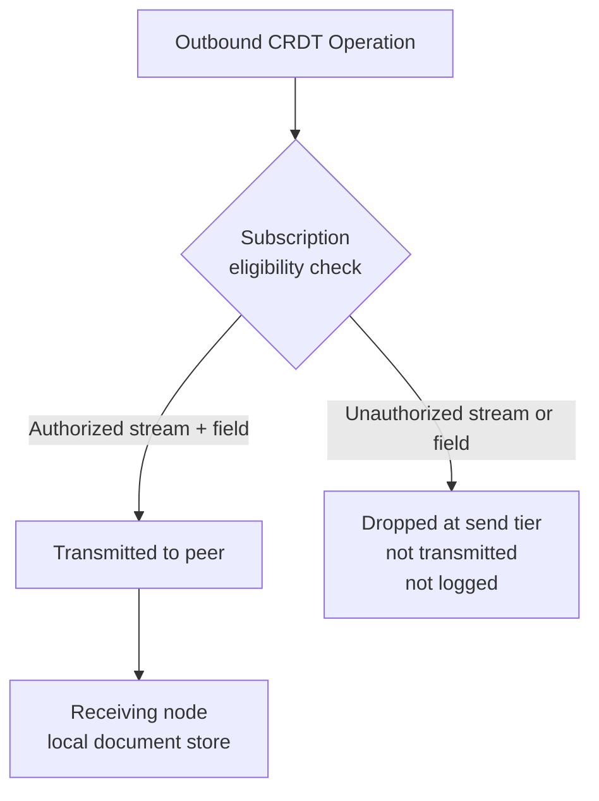
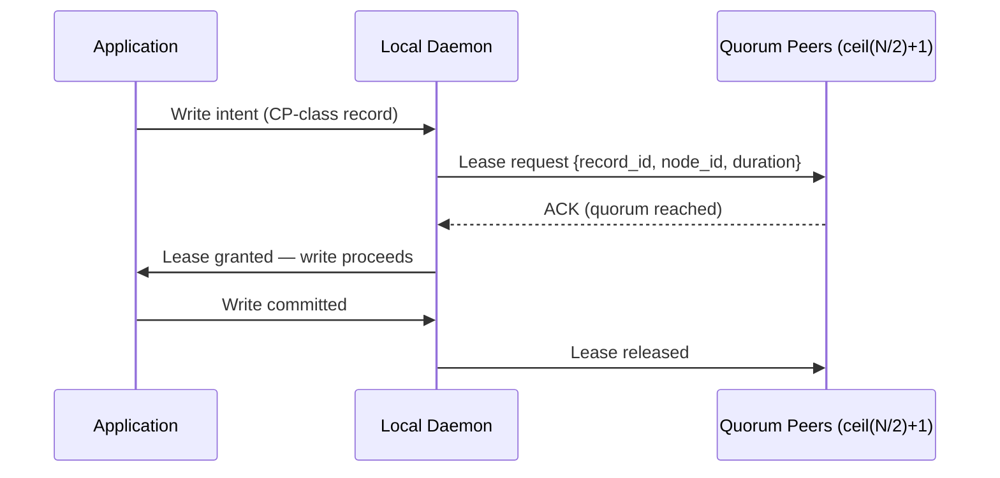
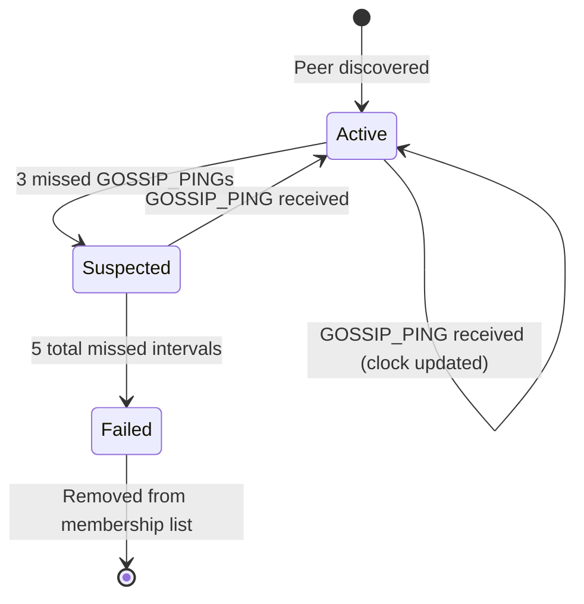

# Chapter 14 — Sync Daemon Protocol

<!-- icm/prose-review -->
<!-- Target: ~3,500 words -->
<!-- Source: v13 §6, v5 §3.4-3.5 -->

---

The sync daemon is the connective tissue of the local-first node. It maintains peer relationships, enforces subscription boundaries, and propagates state changes without coupling its lifecycle to the application that consumes it. Every design decision in this chapter follows from one constraint: the daemon must keep operating while the application restarts, updates, or crashes.

---

## Process Isolation

The sync daemon runs as a separate OS-level process from the application container. This is not a deployment convenience — it is the mechanism that makes offline resilience meaningful.

When the application restarts after an update, active peer connections survive. When the application crashes during a write, the daemon continues to accept incoming deltas and queue them for the application's next startup. When the host machine wakes from sleep, the daemon reconnects to peers before the application has finished loading its UI.

The application communicates with the daemon over a Unix domain socket on Linux and macOS, and over a named pipe on Windows using `System.Net.Sockets.UnixDomainSocketEndPoint` as the transport abstraction. This transport is available on Windows 10 and Windows Server 2019 and later. File-permission controls on the socket path ensure that only processes running as the same user — or with explicit ACL grants — can connect to the daemon.

All messages on the IPC channel are authenticated with device keys. A process that cannot present a valid device key cannot open a session with the daemon, regardless of whether it can reach the socket path. This prevents local privilege escalation attacks from injecting operations into the CRDT document store through the daemon's command channel.

The daemon owns four responsibilities that do not belong to the application layer: maintaining the local CRDT document store, managing peer and relay connections, enforcing per-peer capability and subscription rules, and running background tasks such as compaction and archival. The application layer reads and writes through the daemon; it does not touch the document store directly.

---

## Three-Tier Peer Discovery

The daemon discovers peers through three mechanisms in priority order. Each tier covers a different network topology, and the daemon runs all three concurrently — they are not fallbacks in the sense that a higher tier disables a lower one.



**Tier 1 — mDNS.** On a local network segment, the daemon announces its node ID, schema version, and IPC endpoint via multicast DNS. Peers on the same segment discover each other automatically with no configuration and no central coordinator. mDNS discovery is ephemeral: a peer that stops announcing is removed from the candidate list after three missed heartbeat intervals. The LAN constraint is not a limitation — it is the tier's defining property. mDNS traffic does not cross router boundaries, so nodes in different locations do not collide with each other's announcements.

**Tier 2 — Mesh VPN.** Peers on different networks connect through a WireGuard-based mesh VPN layer. The mesh handles NAT traversal automatically; no port forwarding is required on either side. The daemon treats mesh VPN peers identically to LAN peers once the VPN tunnel is established — the same handshake sequence, the same subscription model, the same gossip protocol. The mesh VPN layer also provides in-transit encryption independent of the sync protocol's own message authentication. The two layers are complementary: the mesh secures the transport, the protocol authenticates the operations.

**Tier 3 — Managed Relay.** For deployments where direct peer-to-peer connectivity is not viable — restrictive corporate firewalls, mobile devices on carrier NAT, cross-organizational connections — the daemon connects to a managed relay. The relay is a lightweight proxy: it forwards delta streams between peers without decrypting them. All relay-forwarded messages carry the same device-key authentication as direct connections. The relay cannot read content and cannot inject operations.

The daemon selects the lowest-latency path to each known peer. If a peer is reachable via both mDNS and mesh VPN, the daemon uses the mDNS path and keeps the VPN path as a hot standby. Path selection updates dynamically as network conditions change.

---

## Five-Step Handshake

Every peer connection begins with a structured handshake that establishes identity, negotiates capabilities, and confirms subscription grants before any CRDT operations flow. The handshake is synchronous from the initiating node's perspective: the daemon does not emit a DELTA_STREAM until it has received an ACK from the remote peer.



**HELLO.** Both peers identify themselves simultaneously. The HELLO message carries the sending node's node ID — a stable identifier derived from its device key — the current schema epoch, and the list of protocol versions the node supports. The session proceeds on the highest version supported by both nodes. A peer that supports no version in the other's list sends `SCHEMA_VERSION_INCOMPATIBLE` and closes the session. The schema epoch in HELLO tells the receiving node whether the sender is ahead, behind, or at parity. If the epochs are incompatible — the remote node is below the minimum supported epoch — the accepting node sends `SCHEMA_VERSION_INCOMPATIBLE` and closes the session; there is no partial or read-only mode. The application surfaces a schema update notification when the daemon closes a session on version grounds.

**CAPABILITY_NEG.** The requesting node declares what it participates in. The CAPABILITY_NEG message carries three arrays: the CRDT stream types the node holds and contributes to, the CP leases it currently holds, and the bucket subscriptions it requests. Each requested subscription includes a role attestation token signed by the node's device key. The receiving node verifies the attestation before granting any subscription. This is the phase where data minimization is enforced at the send boundary, not at the receiving application.

**ACK.** The accepting node evaluates the capability declaration against its subscription eligibility rules and responds with two arrays: `granted_subscriptions[]` — the subset it will emit — and `rejected[]` — subscriptions denied with typed reason codes (`MISSING_ATTESTATION`, `EXPIRED_ATTESTATION`, `INVALID_SIGNATURE`). The reason codes allow the requesting node to distinguish an attestation problem from a protocol failure. Streams the accepting node does not publish are absent from both arrays, preventing enumeration of streams the requester has no attestation for.

**DELTA_STREAM.** After ACK, both nodes begin emitting a continuous stream of CRDT operations for the granted subscriptions. Each delta is a compact binary representation of the operations the sender holds that the receiver's vector clock indicates it has not yet seen. Delta calculation is performed by `Sunfish.Kernel.Sync`. The stream is append-only from the sender's perspective; the receiver applies operations to its local document store and updates its vector clock accordingly. Operations that fall outside the recipient's granted subscriptions are dropped at the send tier without error.

**GOSSIP_PING.** Every 30 seconds, each node emits a GOSSIP_PING carrying its current vector clock summary and its membership list of known peers. The receiving node uses this to detect clock drift, discover new peers the remote node knows about, and identify peers it should attempt to connect to. GOSSIP_PING is the mechanism through which the network heals: a node that was isolated learns about new peers when it reconnects, without requiring a central directory.

---

## Gossip Anti-Entropy

The DELTA_STREAM handles real-time operation propagation. Gossip anti-entropy handles convergence: it ensures that nodes that missed operations during a partition eventually receive them.

Each node maintains a membership list. Each entry records a peer's node ID, its last known address for each discovery tier, its current reachability state (active, suspected, or failed), and the vector clock the local node last received from that peer.



Every 30 seconds, each node selects two peers at random from its active membership list and initiates a delta exchange. The exchange is symmetric: each node sends the operations it holds that the other's vector clock indicates are missing, and receives the same in return. After the exchange, both nodes have converged on the union of their operation sets for the subscribed streams.

The random peer selection prevents gossip load from concentrating on high-degree nodes. It ensures that information propagates across the network in O(log N) rounds regardless of the physical topology [1]. The 30-second default interval suits teams of up to 100 nodes; larger deployments require tuning the interval and the per-tick fanout count.

Vector clocks track causality at the operation level. Each CRDT operation carries a vector clock entry that identifies the node that generated it and the logical time at which it was generated. When a node receives an operation, it advances its vector clock accordingly. When it computes a delta for gossip, it includes all operations with vector clock entries that are causally ahead of the remote node's last known clock. `Sunfish.Kernel.Sync` manages clock maintenance and delta computation; the daemon surfaces the results through the gossip exchange.

The membership list propagates through gossip. When Node A sends a GOSSIP_PING to Node B, it includes its full membership list. Node B merges this with its own list, adding peers it does not know about and updating addresses and reachability states for peers it does. This is how a node that was offline learns about peers that joined or changed address during its absence, without requiring a central directory query.

---

## Data Minimization at the Stream Level

The sync daemon enforces subscription scope at the stream level, before operations leave the node. This is the data minimization invariant: a node never receives CRDT operations for documents or fields it is not authorized to hold.

This is architecturally different from filtering at the application layer. An application that loads all data and hides unauthorized fields in the UI does not provide data minimization — the unauthorized data resides on the device and is available to anyone with physical or privileged-process access. The daemon's approach ensures that unauthorized data never reaches the device at all.



Subscription eligibility is determined during CAPABILITY_NEG. Each stream entry in the `crdt_streams[]` list carries a role attestation — a signed claim that the requesting node's user holds the role required to access that stream. The attestation is verified against the node's device key. If the attestation is absent, expired, or invalid, the stream is excluded from `granted_subscriptions[]`.

Document schemas define subscription scopes within stream definitions registered with `Sunfish.Kernel.Sync`. Each stream definition specifies the minimum set of fields required for each role. The daemon uses these scope definitions when constructing outbound deltas: it strips operations for out-of-scope fields before transmitting, even within a stream the receiving node is authorized to receive. A field-level exclusion is invisible to the receiver — the delta simply does not contain operations for that field.

This design has a concrete security consequence: compromising an endpoint does not grant access to data that endpoint was never authorized to receive. An attacker who gains full control of a node can read everything on that node. They cannot read fields that were stripped at the source before the delta was transmitted.

The invariant holds across reconnection. When a node reconnects after a period offline, the daemon re-runs eligibility checks as part of the handshake before replaying any buffered deltas. If a role attestation has expired during the offline period, the corresponding streams are excluded from the new session's granted subscriptions, and previously buffered deltas for those streams are not replayed.

---

## Distributed Lease Coordination

CRDT-class records tolerate concurrent writes by design — conflicts merge automatically. CP-class records do not: they require exclusive write access, and concurrent writes produce undefined behavior at the application level. The sync daemon enforces exclusive access through distributed lease coordination.

Before a node writes to a CP-class record, it must acquire a distributed lease. The lease grant requires a quorum of peers to acknowledge the request. The default quorum is ceil(N/2) + 1, where N is the current active membership count. The default lease duration is 30 seconds.



If quorum is unreachable — because peers are offline, partitioned, or slow — the daemon blocks the write. It does not fall back to a best-effort write. The application layer receives a clear signal: the write cannot proceed, and the UI must reflect this with a definitive indicator. A blocked write is never silently queued as though it will eventually succeed.

Leases expire automatically at the configured duration. A node that goes offline without explicitly releasing its lease loses the lease at expiry. Other nodes detect the expiry through the absence of a lease renewal GOSSIP_PING. After expiry, the next node to request the lease acquires it through quorum acknowledgement.

The daemon tracks active leases in the CAPABILITY_NEG `cp_leases[]` field. When a node initiates a handshake with a peer that holds a lease on a record the local node also needs, the handshake surfaces the conflict immediately rather than deferring it to the write attempt. This early detection prevents the failure mode where a node discovers a lease conflict only after composing a write operation.

Lease coordination is managed within `Sunfish.Kernel.Sync`. The application layer interacts with leases through the daemon's command channel; it does not implement lease logic directly.

---

## Reconnection Storm Handling

When a network partition heals, all previously isolated nodes attempt to reconnect simultaneously. Each node's delta represents the full operation set it accumulated during the partition. Without coordination, this produces a traffic spike that overwhelms both the relay and any peer nodes that serve as gossip anchors.

The daemon implements exponential backoff with jitter on reconnection. When the daemon detects that a previously unavailable network path has become reachable, it does not immediately initiate sync. It waits a random interval drawn from an exponential distribution, bounded by a maximum of 60 seconds, before beginning the handshake sequence. The jitter ensures that nodes that disconnected at the same time do not reconnect at the same time.

```
backoff_interval = min(base * 2^attempt, max_seconds) + uniform_jitter(0, jitter_range)
```

Where `base`, `max_seconds`, and `jitter_range` are configurable per deployment, with the 60-second maximum enforced by the relay. A node that has been offline for an extended period — beyond a full gossip cycle — uses the maximum backoff on its first reconnection attempt regardless of its attempt count.

The managed relay enforces a per-node rate limit on delta submissions. A node that submits deltas faster than the rate limit is queued, not rejected. The queue is bounded: if the queue depth for a node exceeds the configured limit, the relay drops the oldest queued submission. The node receives a flow control indication within the ACK frame of the next handshake and increases its backoff interval for subsequent submissions.

These two controls together spread a partition-healing reconnection event across a 60-second window rather than concentrating it at the moment network access returns.

---

## Stale Peer Recovery

A node that reconnects after a long offline period carries a membership list that reflects the network as it existed when the node went offline. Peers may have changed address, left the network, or been replaced. The gossip protocol handles stale peer recovery through a structured failure detection sequence.

When the daemon sends a GOSSIP_PING to a peer and receives no response within one gossip interval (30 seconds), it records a missed interval for that peer. After three missed intervals, the peer transitions from active to suspected. After five total missed intervals, the peer transitions from suspected to failed and is removed from the active membership list.



The three-to-five interval progression is intentional. A peer that misses three pings may be temporarily unreachable due to a transient network event; marking it suspected without removing it preserves the address for reconnection. A peer that misses five consecutive intervals has either left the network or changed address; removing it cleans the membership list and stops gossip energy from being spent on unreachable addresses.

A suspected peer is not excluded from delta exchange. The daemon continues to send GOSSIP_PING to suspected peers at each gossip interval. If a suspected peer responds, it transitions immediately back to active. Its accumulated deltas are exchanged normally. No re-handshake is required for a peer that recovers from suspected state — the existing session remains valid.

A new peer with the same node ID as a previously failed peer is treated as a reconnect. The daemon initiates a fresh handshake, including a full CAPABILITY_NEG, and resets the failure counter for that node ID. This handles the common case of a node that changed its network address — a laptop that moved from one network to another, or a mobile device that switched from Wi-Fi to cellular.

Stale addresses in the membership list are cleaned up through two mechanisms: explicit removal when a peer reaches the failed state, and address updates from incoming GOSSIP_PING messages that carry a newer address for a known node ID. Node C knowing that Node B has a new address is sufficient: Node C's next GOSSIP_PING to Node A propagates the updated address before Node A has received a direct ping from Node B at its new location.

---

## Integration with Sunfish

The sync daemon's capabilities are exposed to the application layer through `Sunfish.Kernel.Sync`. This package manages the full protocol lifecycle: peer discovery across all three tiers, handshake sequencing, delta computation, gossip scheduling, lease coordination, and reconnection backoff. Stream definitions registered with `Sunfish.Kernel.Sync` declare the field-level access rules the daemon enforces during capability negotiation.

Applications interact with the daemon through the command channel on the Unix domain socket or named pipe. The command channel accepts write intents, subscription updates, and lease requests. It emits change notifications, lease status updates, and membership events. The application layer does not implement any part of the sync protocol — it declares what it needs and reacts to what the daemon delivers.

The separation between `Sunfish.Kernel.Sync` and the application layer is not just an API boundary — it is the boundary that makes the daemon's process isolation meaningful.

---

## Protocol Invariants

**Subscription scope is enforced at the source.** A node never transmits operations for streams or fields that the receiving node is not authorized to hold. Application-layer filtering is not a substitute for this guarantee.

**CP-class records require a quorum lease.** A write to a CP-class record that cannot obtain quorum acknowledgement is blocked, not queued. The failure is surfaced immediately to the application.

**Handshake precedes data flow.** No CRDT operations flow between two nodes until the five-step handshake completes, including schema version verification and subscription grant confirmation.

**Reconnection is rate-controlled.** The daemon applies exponential backoff with jitter on reconnection, and the relay enforces per-node rate limits on delta submissions. A partition-healing event produces bounded traffic.

These invariants hold whether peers communicate directly over mDNS, through a mesh VPN, or through a managed relay. The protocol does not have a "trusted network" mode that relaxes rules for LAN peers. The guarantees are uniform across all three discovery tiers.

---

## Related Specifications

Chapter 15 covers the security architecture that underpins the daemon's device-key authentication, role attestation verification, and the cryptographic mechanisms that make subscription filtering tamper-evident. The data minimization invariant described in this chapter depends on that security layer — the daemon's filtering is only as strong as the attestations it evaluates.

---

## References

[1] D. Kempe, A. Dobra, and J. Gehrke, "Gossip-based computation of aggregate information," in *Proc. 44th Annual IEEE Symposium on Foundations of Computer Science (FOCS)*, Cambridge, MA, USA, 2003, pp. 482–491.
