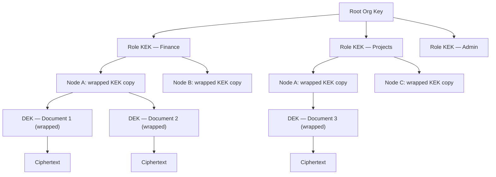

# Chapter 15 — Security Architecture

<!-- icm/prose-review -->

<!-- Target: ~3,500 words -->
<!-- Source: v13 §11, v5 §4 -->

---

## Threat Model

Distributing data to endpoints does not eliminate the honeypot problem. It distributes it. A cloud database concentrates value behind a single perimeter under enterprise-grade controls. A fleet of workstations spreads that value across many smaller perimeters — each with its own posture, its own discipline, its own weakest link. Every endpoint that holds plaintext is a potential breach point. The weakest device in the organization sets the attacker's minimum viable entry cost.

The threat model accepts this reality and chooses to bound the blast radius rather than deny it. Three properties do the bounding. Each node holds only the data its role subscriptions permit. Per-role encryption keys are never present on nodes that do not hold the corresponding role. Key compromise does not expose historical data encrypted under previously rotated keys. These properties mean that compromising one sales representative's laptop exposes sales data — not the finance ledger — and only the data encrypted under keys the laptop currently holds.

The system treats the relay as an untrusted intermediary. The relay routes ciphertext. It cannot read payload. It can, however, observe the shape of the conversation: which nodes connect to which, at what times, at what volume. For regulated industries where communication metadata is itself sensitive, the appropriate mitigation is a self-hosted relay on infrastructure the organization controls. A third-party relay operator cannot read payload plaintext under the described architecture — the relay holds ciphertext only, and decryption keys never leave originating nodes.

Administrative events — key distribution, role attestations, revocation broadcasts — travel through the same encrypted log as application data. The administrator's device is the highest-value target in the system. Compromising it enables fraudulent key generation and the distribution of rogue role bundles. `Sunfish.Kernel.Security` provides hardware-backed key storage where the platform supports it; organizations with elevated threat models require administrator operations only on managed devices with hardware security modules.

---

## Four Defensive Layers

The architecture applies defense in depth across four independent layers. Each layer protects without depending on any other layer working correctly. An attacker who defeats one layer gains nothing from the defeat unless they also defeat the next.

### Layer 1 — Encryption at Rest

All local databases use SQLCipher. The database key derives from a cryptographically random 256-bit root seed stored in the OS-native keystore — Keychain on macOS and iOS, the Windows Data Protection API (Application Programming Interface) on Windows, the Linux Secret Service on Linux — using HKDF (HMAC-based Key Derivation Function)-SHA256. The 256-bit root seed carries enough entropy that password-based key stretching is unnecessary. Physical extraction of storage media without access to the OS keystore yields no plaintext data.

The database key is never written to disk. The root seed lives in OS-managed keystore storage. The derived key is loaded into the process address space on demand and zeroed from memory after each database session closes.

### Layer 2 — Field-Level Encryption

Records in high-sensitivity buckets — financial data, personally identifiable information, health records — carry field-level encryption using per-role symmetric keys. The field-level key is distinct from the database key. A node that opens the database cannot read a field-encrypted record unless it also holds the appropriate role key.

The administrator generates per-role symmetric keys, wraps each key with every qualifying member's public key, and distributes the wrapped bundles as special administrative events in the log. Each member's device decrypts its bundle using the device's private key and stores the role key in the OS keystore. A member added to a role after records were encrypted decrypts those records immediately upon receiving the key bundle. A member removed from a role loses access to future records when the administrator rotates the key.

### Layer 3 — Stream-Level Data Minimization

The sync daemon enforces subscription filtering before any event leaves the originating node. Non-subscribed nodes never receive events, regardless of application-layer configuration or administrator error. The send-tier filtering invariant is the sync daemon's core access control gate. It is not an advisory policy.

This layer protects even when the relay is compromised or colluding. An attacker who compromises the relay sees only ciphertext of events that subscribing nodes requested.

### Layer 4 — Circuit Breaker and Quarantine

Offline writes are quarantined pending validation against current team state and policy. The circuit breaker activates when a node reconnects after a period of isolation and presents writes that conflict with current authorization policy — for example, writes from a user whose role was revoked while the node was offline.

Quarantined writes are held, not discarded. An administrator reviews the quarantine queue and either promotes each write — integrating it into the live log — or explicitly rejects it with a recorded reason. The rejection reason is logged; the audit trail captures what was offered, who reviewed it, and what decision was made. This approach preserves data written in good faith while enforcing authorization policy at the point of reintegration.

---

## Key Hierarchy

The key hierarchy separates organizational authority, role membership, node-level key custody, and document-level encryption into four independent tiers. Any tier can be rotated without affecting the others.

**Envelope encryption mechanics.** For each document, the system generates a random 256-bit Data Encryption Key (DEK) using the OS CSRNG — `getrandom(2)` on Linux, `BCryptGenRandom` on Windows, `SecRandomCopyBytes` on macOS. The DEK encrypts the document content with AES-256-GCM: 256-bit key, 96-bit random nonce generated per encryption event (never counter-derived, never reused under the same key), 128-bit authentication tag. The DEK is then encrypted — "wrapped" — using the current 256-bit Key Encryption Key (KEK) for the document's role, also under AES-256-GCM with a fresh 96-bit nonce. The wrapped DEK is stored alongside the ciphertext. To read a document, a node retrieves its KEK from the OS keystore, unwraps the DEK, and decrypts the document body. The KEK never touches the document body. The DEK never persists in unwrapped form beyond the active decryption operation.

**Key derivation parameters.** Argon2id derives the OS keystore password when user credentials are required (administrator bootstrap, recovery-key unseal): memory cost 64 MiB, iteration count 3, parallelism 4 — the current OWASP interactive baseline — for standard deployments. Regulated-industry deployments configure the high-security tier: memory cost 128 MiB, iteration count 4, parallelism 4. HKDF-SHA256 derives subordinate keys from the root seed. These parameters are the specification. Any implementation claiming conformance names these values in its configuration.

**Why this separation matters.** KEK rotation — triggered by role membership change or key compromise — does not require re-encrypting document bodies. The system re-wraps DEKs using the new KEK; the ciphertext is unchanged. Rotation work is proportional to the number of documents, not their cumulative size. A team with ten thousand documents completes KEK rotation by processing ten thousand small DEK blobs, not hundreds of megabytes of document bodies.

**Node-level custody.** Each node holds wrapped copies of the KEKs for its roles. A wrapped copy is decryptable only with the node's device private key. If a device is lost or decommissioned, its wrapped KEK copies cannot be used by anyone who does not also hold the device's private key. Revoking a node means withholding new KEK bundles. The node's existing wrapped copies become useless when the KEK is rotated.

---

## Role Attestation Flow

Role attestations and role keys are distinct mechanisms that serve distinct purposes. Attestations prove role membership. Keys enable decryption. The sync daemon uses attestations to make subscription decisions; key possession is separately verified before field-encrypted content is delivered.

The attestation and key distribution flow proceeds in five steps:

1. The administrator generates per-role symmetric KEKs from a fresh entropy source — not derived from any organizational root secret that would make the root a single point of compromise.
2. For each member of a role, the administrator wraps the role KEK with the member's device public key using asymmetric encryption. The wrapped bundle is specific to that device and that role.
3. The administrator publishes the wrapped bundles as administrative events in the CRDT (Conflict-free Replicated Data Type) log. These events are signed with the administrator's key; nodes verify the signature before accepting any bundle.
4. Each member's node receives the administrative event during the next sync cycle. The node decrypts its bundle using its device private key and writes the role KEK to the OS keystore.
5. During sync capability negotiation, each node presents its signed attestations. The sync daemon on the originating node verifies attestations and grants or denies subscriptions. Attestation alone does not prove key possession — a node that holds neither the attestation nor the key receives no events.

Key rotation on membership change follows the same flow. The administrator generates a new KEK for the affected role, wraps it for each current authorized member, and publishes the new bundles. Nodes removed from the role are excluded from the new bundle set. They retain the old KEK but cannot unwrap DEKs re-wrapped under the new KEK. The administrator triggers re-wrapping of existing DEKs as part of the offboarding procedure. Once that completes, revoked nodes lose access to all documents in the role regardless of generation.

---

## Key Compromise Incident Response

Scheduled key rotation is a maintenance operation. Key compromise is an incident. The response procedure differs from routine rotation in one critical way: the new KEK must not derive from the compromised key.

**Detection triggers.** The system logs all key access events to the audit log. Detection arrives from three sources: a physical loss report from a user whose device was stolen or found in an untrusted state; anomalous access patterns in the audit log that suggest unauthorized key use; or an explicit administrator report of suspected credential exposure. The incident response procedure activates on any of these triggers.

**New KEK generation.** The administrator generates an entirely new KEK for the affected role from a fresh entropy source. Derivation from the compromised key would propagate the compromise forward. All other aspects of the distribution flow — wrapping with member public keys, publishing as signed administrative events — are identical to routine rotation.

**DEK re-wrapping.** The system re-wraps every DEK owned by the affected role using the new KEK. The background job processes DEK blobs only, leaving document bodies unchanged. During re-wrapping, documents remain accessible to nodes that hold the current KEK. The old KEK is not discarded until all DEKs in scope are re-wrapped and new bundles are delivered to all authorized nodes.

**Old KEK discard.** Once DEK re-wrapping completes and new bundles are delivered, the administrator triggers discard of the old KEK. `Sunfish.Kernel.Security` broadcasts a discard signal through the relay; each node zeros its in-memory copy of the old KEK and removes it from the OS keystore. A node that received the discard signal but has not yet received the new bundle cannot decrypt documents in that role — and that is the correct behavior. Partial access is not granted as a fallback.

**Revocation broadcast.** The relay receives a revocation event for the compromised key identifier. Subsequent connection attempts from any node presenting the revoked key are rejected at the handshake layer with a specific error code.

**User notification.** Affected users receive a notification specifying the data-at-risk window: the interval from the compromised key's creation date to the moment the revocation broadcast was confirmed. The notification is specific — "documents in the Finance role between January 3 and April 17 may have been accessed" — not a generic security alert.

---

## Key-Loss Recovery

<!-- code-check: package references in this section include `Sunfish.Foundation.Recovery` (forward-looking — Volume 1 extension roadmap, not yet present in the Sunfish reference implementation; illustrative in the same sense the book's other pre-1.0 Sunfish references are illustrative). The other two references, `Sunfish.Kernel.Security` and `Sunfish.Kernel.Audit`, are in the current Sunfish package canon (verified 2026-04-28: packages/kernel-audit/ exists). -->

My mother called me in the summer of 2023 from my Aunt Vickie's house. Uncle Charlie had died — twenty-three years a Michigan conservation officer, and in his off-hours a hobby photographer who had earned a modest income selling his work online. There was the funeral. There was an iPhone, locked. It had been part of Charlie's daily life and potentially the channel through which his photographs reached buyers. None of us knew exactly what was on it. My aunt was sitting next to my mother, the iPhone on the table between them, and the question my mother was calling to ask, because I work in software, was whether there was a way to recover an iPhone.

I knew the answer before she finished. The honest version is: not really. There is a court order. There is Apple's deceased-relative process. There is a queue, a verification cycle, a chance the data comes back and a chance it doesn't — a probability distribution, not a recovery primitive, and not what my aunt was asking for with the device sitting in front of her.

I told her what I knew. She said okay. We talked about other things. The well-meaning Genius Bar staff were eventually able to help, and the photographs are now in my aunt's possession — a probability that resolved favorably, on a timeline outside our control, through the discretion of strangers acting in good faith. The next family in the same posture has no architectural reason to expect the same.

The architecture of this chapter is built for people like Charlie who just use technology on a daily basis, and for those who survive them. It is also built for the moment he never got to have, and for the call I did not have a better answer to.

Incident response handles the case where an attacker compromises a key. Key-loss recovery handles the case where the legitimate user loses one. The two scenarios look superficially similar — both require generating new keys and distributing them — but they differ in one critical way: in the compromise case, the user is present and the attacker is the unknown party; in the loss case, the user is the unknown party and the system must verify them before granting access.

Recovery is one of the few subjects in this book that splits cleanly into a policy chapter and a UX chapter — the two are paired by design. This section specifies what the architecture commits to. Ch20 §Key-Loss Recovery UX specifies what the user sees when those commitments engage. Each sub-section here has a counterpart there; readers who skim one without the other miss the point of either.

### Why this matters

The P7 ownership property — that users hold the keys to their own data — is not a defect-free guarantee. It is an honest trade. Users who retain their keys retain full control. Users who lose their keys lose their data. That boundary is the architecture's honest edge.

Real-world key loss arrives through five distinct failure modes. A master password is forgotten; a device is lost or stolen with no cloud backup in place; an OS factory reset wipes the keystore without a prior export; a hardware security token is physically destroyed or stolen; or a user dies or becomes incapacitated without a succession arrangement. Each of these converts the architecture's confidentiality guarantee into permanent data loss unless a recovery primitive is in place before the event.

A recovery primitive introduces a new attack surface. Any path that allows a legitimate user to recover access is a path an adversary can attempt to exploit. The design space is narrow: the primitive must be at least as hard for an adversary to traverse as the original custody chain was to compromise, and it must impose enough friction that a patient attacker is deterred by cost rather than by any single gate. The six mechanisms below occupy different positions in that design space. No single mechanism is universally correct. Deployment class, threat model, and the user population's tolerance for recovery friction all determine the right combination.

Recovery is the runtime mechanism for two upstream policies: succession arrangements with executor delegation (described in a future volume) and delegated capability grants. Those policies determine who is authorized to invoke recovery and under what conditions; the six mechanisms described later in this section implement the authorization cryptographically.

### Recommended Deployment Combinations

Pick the deployment class first; the rest of the section describes the mechanisms it composes. Consumer deployments optimize for a successful recovery the user will actually complete when needed; excessive friction means users skip setup and have no recovery path. Regulated deployments optimize for auditability and resistance to coercive attacks; the longer grace period reflects both regulatory dispute requirements and the higher likelihood that a regulatory-tier adversary has greater patience and resources.

| Deployment class | Primary mechanism | Secondary mechanism | Grace period |
|---|---|---|---|
| Consumer | Multi-sig social (3-of-5) | Paper-key offline | 14 days |
| SMB | Custodian-held + 2-of-3 social | Paper-key in safe | 7 days |
| Regulated (HIPAA, PCI, financial) | Custodian-held under attestation | Multi-sig social with named officers | 30 days |

The deployment class is declared at first-run and persists in the team's signed configuration manifest. `Sunfish.Foundation.Recovery` reads the class on initialization and binds the corresponding threshold and grace-period values; the manifest entry is itself a signed event in the audit log, so a class change is an audited operation that any node can verify.

**Consumer.** Three-of-five social recovery tolerates losing contact with two trustees and is straightforward to explain: "Pick five people you trust. Any three of them together can help you get your data back." The paper-key secondary fallback covers the scenario where trustees are unavailable for an extended period — a family emergency, a natural disaster, a death without notice. The 14-day grace period is long enough to give the original holder time to notice and dispute, short enough not to strand a user who genuinely lost access and needs timely recovery. `Sunfish.Foundation.Recovery` defaults to this configuration for consumer profiles.

**SMB.** Small and medium businesses typically have a legal relationship with a lawyer or accountant who can serve as institutional custodian. Combining that relationship with 2-of-3 social recovery across named officers — the owner, the operations manager, a designated deputy — provides both institutional accountability and a personal recovery path. The paper-key in a physical safe protects against simultaneous loss of all digital channels. The shorter 7-day grace period reflects the business continuity pressure that enterprise deployments typically face; a 30-day pause on a production account is not acceptable in most SMB contexts.

**Regulated.** HIPAA-covered entities, PCI-DSS merchants, and financial services firms face audit requirements that demand a documented, verifiable recovery path. The custodian-held mechanism under an attestation policy produces the audit artifact; the 30-day grace period satisfies the dispute and review timelines that regulated industries typically require. Multi-sig social recovery with named officers — named in the attestation policy — provides a secondary path where the custodian relationship fails. Every recovery event appears in the audit log maintained by `Sunfish.Kernel.Audit`; the log is the compliance artifact.

The consumer combination composes sub-patterns 48a (multi-sig social) and 48c (paper-key); the SMB combination composes 48b (custodian) with 48a; the regulated combination composes 48b with 48a, layered under sub-pattern 48e (timed grace period) tuned to the audit window. The next subsection describes each sub-pattern in turn.

### The six recovery mechanisms

#### Multi-sig social recovery

Multi-sig social recovery — sub-pattern 48a — distributes the recovery authority across a set of trusted individuals the user designates before any loss occurs. The construction derives from Shamir secret sharing [6]: the user's root recovery key is split into *n* shares, each share held by a separate trustee, and any *t* of the *n* shares suffices to reconstruct the key. Each trustee holds a share, not the full key; no single trustee can unilaterally reconstruct the recovery key or access the user's data.

A threshold of 3-of-5 tolerates the simultaneous unavailability of two trustees; a threshold of 2-of-3 is appropriate for smaller trust networks. The Argent smart wallet specification [5] and Vitalik Buterin's 2021 case for social recovery wallets [4] establish the pattern's practical architecture.

The dealer protocol matters as much as the threshold. The user's device runs the Shamir dealer locally over GF(2^256), seeded by the OS CSRNG, and produces *n* shares from the recovery key. Each share is wrapped under the trustee's enrolled public key before it leaves the device — shares never traverse the network or the relay in plaintext. After the dealer emits all shares, the device zeros the dealer's working state and the in-memory copy of the recovery key. The protocol is local-first: no third party — including the relay — ever sees the unwrapped shares.

<!-- technical-review: CSRNG output is uniformly distributed over GF(2^256) under standard cryptographic assumptions for getrandom(2) on Linux, BCryptGenRandom on Windows, and SecRandomCopyBytes on macOS — the OS CSRNGs cited in §Key Hierarchy. -->

Trustee designation happens at first-run, not after loss. A user who has not designated trustees before losing their key has no social recovery path. The time-lock period — default seven days — opens a dispute window: if the original holder's devices or trustees receive the recovery claim and the original holder is actually present, they can dispute and halt the process. The time-lock is not a network artifact; it is deliberate friction.

The threat model is collusion. If *t* trustees coordinate — or are simultaneously compromised by the same adversary — the recovery key is reconstructable without the original holder. Geographic and social diversity in trustee selection reduces collusion risk. Multi-sig social recovery is the correct mechanism for individuals and small partnerships. It is not the correct mechanism for enterprise deployments where the trust network cannot be meaningfully diversified.

Social-recovery legal status varies by jurisdiction. Trustee residency may itself trigger data-residency obligations under the DPDP Act (India), PIPL (China), DIFC DPL 2020 (Dubai International Financial Centre) and the parallel ADGM Data Protection Regulations 2021 (Abu Dhabi Global Market), Russia's Federal Law 242-FZ, and POPIA Section 72 (South Africa) cross-border transfer requirements. Deployments subject to localization requirements name their trustees in-jurisdiction or document an exception in the team's compliance posture (see Appendix F). For EU-resident users with trustees outside the EU/EEA, the share transfer is itself a data transfer under GDPR Chapter V — deployments name a Chapter V transfer mechanism (Standard Contractual Clauses, an adequacy decision, or binding corporate rules) before designating an out-of-region trustee. The cryptographic construction is sound everywhere; the legal classification of the trustees' role is not.

The deployment cost is low: trustee designation is a setup flow in `Sunfish.Foundation.Recovery`. The ongoing cost is maintaining accurate trustee contact information as relationships change.

#### Custodian-held backup key

Sub-pattern 48b delegates recovery authority to an institutional custodian: a law firm, a bank's custody division, a regulated cloud-custodian operating under an audited security posture, or a regulated institutional intermediary serving in a trust capacity (a system integrator under contract, a trust bank, a regulated escrow service — the institutional category that fills the role varies by region and industry). The architecture wraps the user's or organization's root recovery key and transfers the wrapped copy to the custodian under an attestation policy that specifies the conditions for release.

Release requires multi-factor identity verification through the custodian's out-of-band channel — in-person identity documents, video call, notarized request, or whatever the custodian's policy mandates. The custodian does not hold the key in plaintext; they hold a wrapped copy that `Sunfish.Foundation.Recovery` unwraps on the user's device after the custodian releases it. The custodian's channel is the verification gate; the cryptographic unwrapping happens locally.

The threat model is custodian compromise or coercion. An adversary who compromises the custodian's systems, or who legally compels the custodian to release the wrapped key, gains the wrapped blob. The wrapping itself provides no defense against coercion once the release conditions are met. The mitigation is the custodian's own audited security posture, the legal liability allocation in the custody contract, and the out-of-band identity verification that an adversary must also defeat.

The custody contract allocates liability for release errors in one of three postures. Posture (a) is custodian-disclaims-all: the custodian carries no liability for releases that turn out to be unauthorized. This is the most common contract for low-fee consumer custodianship and is weakly defensible against the user's loss; informed users avoid it. Posture (b) is bounded-cap liability: the custodian is liable for release errors up to a contractual cap, typical of regulated financial-services and trust-company custody. Posture (c) is joint liability with the architecture vendor: rare, expensive, and reserved for high-value institutional deployments where the vendor and custodian both carry insurance against release error. Regulated-industry deployments — HIPAA, PCI-DSS, financial services — typically require posture (b) at minimum; deployments accepting posture (a) for cost reasons document the trade-off in the team's compliance posture (see Appendix F).

Custodian-held backup key is the correct mechanism for enterprise deployments, regulated industries, and succession arrangements where executor delegation requires institutional involvement (cross-reference #32). Relying on a single custodian is itself a single point of failure for recovery: when the custodian is operational but the verification flow stalls for a specific user — identity dispute, custodian-side outage, staffing gap — recovery halts indefinitely. A secondary mechanism (paper-key, social) is the operational mitigation. The deployment cost reflects the custodian relationship: contract negotiation, enrollment, and annual audit. The ongoing cost is custodian fee and key refresh on rotation cycles.

#### Paper-key fallback

Sub-pattern 48c generates a BIP-39-style mnemonic phrase at first-run, prints it, and relies on the user to store it offline in a physically secure location. The phrase derives the root recovery seed through Argon2id (see §Key Hierarchy for the regulated-tier parameters: memory cost 128 MiB, iteration count 4, parallelism 4). The physical security perimeter — safe, safety-deposit box, fireproof lockbox — is the user's responsibility and the architecture's honest boundary.

Paper-key fallback is the simplest recovery mechanism to understand and the most forgiving in terms of threat model: no trustee can be compromised, no custodian can be coerced, no online account can be phished. The threat model shifts entirely to physical access. An adversary who obtains the printed phrase obtains the recovery key. The architecture provides no defense against that physical compromise.

Paper keys defeat cold-boot and hibernation attacks during an offline key-recovery operation because the recovery process does not require a running device with key material in memory. They are best suited to low-frequency recovery scenarios, single-user accounts, and deployments where every online escrow path is itself a higher risk than physical paper — a security researcher, a journalist working under hostile conditions, an individual deploying in a jurisdiction where digital custody creates legal exposure. Paper-key fallback is not a substitute for a primary recovery mechanism in multi-user environments. It is a secondary fallback.

#### Biometric-derived secondary key

Sub-pattern 48d derives a recovery key from a biometric template held in the device's hardware secure enclave — Apple Secure Enclave, Pixel Titan M, or Windows Pluton, as documented at the time of writing. The biometric template never leaves the enclave; the enclave derives a keying material value only on a positive biometric match and passes that value to `Sunfish.Kernel.Security` for the recovery unwrap operation. The biometric itself is never extracted, transmitted, or stored outside the hardware boundary.

<!-- technical-review: template non-exportability verified. Apple Secure Enclave: documented in Apple Platform Security [7] — the Secure Enclave processes biometric data and outputs match results and derived keys; raw templates are never exposed to the application processor. Pixel Titan M: consistent with Google's Titan M security architecture documentation — biometric matching executes in the secure environment; derived keys, not templates, cross the trust boundary. Windows Pluton: Windows Hello biometric templates reside in the Windows Hello container backed by the TPM or Pluton processor; template extraction is not available through any documented software API. All three platforms conform to the architectural claim. -->

The threat model includes coerced biometric presentation — the user asleep or physically compelled — and, for some sensor implementations, template extraction through hardware attacks. Biometric-derived secondary keys are not the default recovery mechanism in regulated-tier deployments. They are an appropriate secondary factor when combined with another mechanism — the combination of biometric plus paper-key plus grace period means no single coerced action completes recovery alone.

Biometric recovery is opt-in at the deployment level. Consumer deployments may enable it as a convenience secondary factor. Regulated deployments should not rely on it as a primary mechanism given the coercion exposure.

#### Timed recovery with grace period

Sub-pattern 48e is a composable layer, not a standalone mechanism. Any of the mechanisms above can be combined with a time-locked grace period, and every production deployment should combine them. The construction is simple: when the user submits a recovery claim, the system broadcasts it to the original holder's existing devices and to designated trustees. The original holder has a configurable window — seven to thirty days, depending on deployment class — to dispute the claim. If the holder disputes, recovery halts. If the grace period elapses without dispute, recovery completes and the new key takes effect.

The grace period is deliberate friction, not a network propagation delay. An adversary who can submit a recovery claim and also suppress the original holder's notifications for fourteen days has a substantially harder problem than an adversary who can complete recovery in seconds. The attacker who controls the recovery initiation path still must also control every notification channel simultaneously, for the duration of the grace period, without the holder noticing.

The threat model for the grace period mechanism specifically is a long-game adversary with persistent access to all of the original holder's notification channels — email, SMS, in-app, push. That threat model is not common and not low-cost. The mitigation against it is multi-channel notification (not only email, not only SMS) and trustee co-signing on completion, so the holder has additional channels through which a dispute can be registered.

`Sunfish.Foundation.Recovery` emits recovery-claim events and manages the grace-period state machine. The grace period is not a client-side timer; it is an event in the signed audit log, which means it is tamper-evident and observable by any node that validates the log.

#### Recovery-event audit trail

Sub-pattern 48f is the logging substrate on which all other mechanisms depend. Every recovery initiation, trustee response, dispute, and completion is a signed event in the same encrypted log used for application data. `Sunfish.Kernel.Audit` manages recovery-event records. Each record carries the recovery mechanism type, the trustee identifiers (where applicable), the claimed identity, the grace-period boundaries, and the completion or dispute attestation.

The audit trail is the legal artifact when a recovery is later contested. It is the architectural defense against silent recovery: a recovery that completes without a corresponding event in the log cannot be legitimate, and any node verifying the log detects the gap. The trail composes with §Chain-of-Custody for Multi-Party Transfers — the same multi-party signed-event structure, applied to recovery operations rather than data transfers.

Recovery audit records are retained by default for the deployment's regulatory retention period. Crypto-shredding the data subject's content stub on an Article 17 erasure request is technically possible; whether the surrounding trustee, custodian, and timing metadata is also erasable is jurisdiction-specific and intersects third-party rights. Trustees and custodians named in a recovery record retain a legitimate evidentiary interest in their participation being preserved against contested claims. Default behavior is to preserve the metadata pending a written legal determination; case-specific erasure follows counsel review (see §GDPR Article 17 and Crypto-Shredding).

### Recovery State-Machine Convergence

Recovery is a concurrent state machine across multiple signing parties on a partitionable transport. The original holder's devices, designated trustees, and the custodian (where present) all sign events into the same encrypted log; events propagate through the relay or directly between peers as the network allows. During a partition, two events may be filed concurrently against the same recovery claim — a dispute from the original holder's existing device and a completion event, whether the completion is a trustee-threshold attestation (sub-pattern 48a) or a single signed custodian-release event (sub-pattern 48b). The convergence rule binds both completion paths identically.

The convergence rule has two distinct layers. **Global log semantics:** no node accepts a completion event for a recovery claim against which a signed dispute event already exists in its log; the completion is rejected at validation, the recovery state resets, and re-initiation is required. The rule applies identically to trustee-threshold completions (sub-pattern 48a) and single-signed custodian-release events (sub-pattern 48b) — both are completion events under the same convergence policy. **Local node behavior:** a node that applied a completion before seeing a not-yet-propagated dispute event reverses the completion on dispute arrival during sync. The new key is in effect locally for the partition window between completion application and dispute arrival; after reversal, the node returns to the pre-completion state and the recovery requires re-initiation. The window is a real architectural fact — security-sensitive deployments size the grace period to make this window negligible compared to the time required for the original holder to detect and dispute.

The rule is asymmetric by design. The original holder's authority to halt outweighs the trustees' or custodian's authority to complete, because the cost of an erroneously-completed recovery is permanent loss of the original holder's data control while the cost of a halted-and-re-initiated recovery is operational delay. `Sunfish.Foundation.Recovery` enforces this convergence at the audit-log validation layer; the local-reversal behavior is a sync-layer consequence of the partition tolerance the architecture commits to elsewhere.

### Threat Model — Recovery as Attack Vector

Recovery primitives are attack surfaces. The cardinal rule: the aggregate difficulty of traversing the recovery path must be at least as high as the aggregate difficulty of compromising the original custody chain. Recovery that is easier to invoke than the original access was to obtain breaks confidentiality by another route.

Four specific attack patterns define the threat model for recovery operations.

**Trustee compromise.** An adversary compromises one or more trustees to reconstruct the Shamir secret-sharing threshold. The t-of-n threshold means a single trustee compromise yields nothing; the adversary must compromise *t* trustees simultaneously or in a coordinated window shorter than the grace period. Grace-period notification to the original holder provides a dispute opportunity even if *t*-minus-one trustees are compromised. Recovery fails when *t* trustees are simultaneously compromised. The architecture cannot defend against this outcome; it can only require that *t* is chosen large enough that simultaneous compromise is costly.

**Custodian coercion.** An adversary coerces the institutional custodian through legal process, extortion, or infiltration. The custodian's release conditions are the gate; once those conditions are met, the architecture provides no further defense. The mitigation is custodian selection, contract structure, and out-of-band identity verification that the adversary must also satisfy.

**Forged loss claim.** An adversary submits a recovery claim without actually holding the account. The grace period and multi-channel notification give the original holder a dispute window. Trustee co-signing on completion requires the adversary to also compromise the trustees. Signed audit trail entries log the claim identity and allow post-hoc forensics.

**Coerced recovery.** An adversary physically coerces the user to complete the recovery flow themselves. No cryptographic mechanism defeats physical coercion. The architectural mitigation is to ensure that no single coerced action completes the recovery flow: biometric plus paper-key plus grace period means the adversary must coerce the user into initiating, coerce each trustee into signing, and suppress notifications for the full grace period. That combination raises the cost of coercion substantially. It does not eliminate it.

Honest limitation: no recovery primitive defeats a sufficiently patient adversary with simultaneous control of every recovery channel. The architecture bounds the attack cost. It does not bound it to infinity.

### Boundaries and Operator Mitigations

Six failure modes sit outside the cryptographic guarantees of the mechanisms above. The architecture acknowledges each, prescribes operator mitigations where they exist, and documents what remains the user's responsibility.

A user who skips recovery setup at first-run and then loses their key loses their data. The architecture presents the choice and documents the consequence. It cannot force the choice. `Sunfish.Foundation.Recovery` surfaces an explicit acknowledgment prompt for users who decline setup; the acknowledgment is logged. The log records that the user declined, not that the architecture failed.

A user who designates trustees who are themselves all compromised — or who designates trustees who predecease them or become unreachable — has no social recovery path from that posture. The architecture cannot grade trustee selection or predict trustee availability over time. Periodic recovery-readiness audits (described in Ch20 §Key-Loss Recovery UX) surface the risk; the user must act on the reminder. Silent decay is a real operational failure mode: a 12-month audit cadence is too coarse to catch a trustee who changed contact details ten months ago, so deployments raise the bar with a quarterly liveness ping per trustee. The trustee's app responds to a tiny challenge; when the active trustee count falls below threshold + 1, the application surfaces a degraded-arrangement banner. The trustee-side cost is one challenge per quarter per user they serve as trustee — manageable at typical trustee-network sizes, worth budgeting against when an individual ends up named as trustee for many users at once. This converts silent decay into an observed event without flooding either party with alerts.

A user whose designated trustees act in bad faith — coordinated coercion in a family or business dispute, or a hostile inheritance claim — has limited defense beyond the grace-period dispute window. Selection of trustees with no shared interest in the user's data is the user's responsibility; the architecture cannot grade trustee motivations. The grace period helps when the user is reachable through their notification channels and detects the unauthorized claim; it does not help a user who is travelling, hospitalized, or otherwise out of contact for the duration of the window.

A user whose complete recovery arrangement becomes invalid before loss occurs — paper key destroyed in the same disaster that destroyed the device, custodian out of business, all trustees deceased — has no recovery path. The architecture cannot prevent a pre-arrangement from decaying. The mitigation is the same periodic readiness audit. An arrangement that has not been verified in 12 months may no longer be valid. The audit is the check. Nothing in the architecture substitutes for that check.

A user whose paper key is illegible at recovery time — water damage, faded ink, transcription error at first-run, prolonged storage degradation — has no recovery from that mechanism alone. The architectural mitigation is round-trip transcription verification at setup time and a recommended secondary mechanism. Ch20 §Key-Loss Recovery UX describes the setup-time verification flow; the deployment-class table above describes the secondary-mechanism recommendation per class.

A jurisdiction with mandatory key-escrow requirements supersedes the user-held recovery model entirely. Where such requirements apply — they are not currently in force in most jurisdictions named in Appendix F, but several CIS and ECOWAS policy discussions are active — the deployment substitutes an escrow-compliant custodian arrangement for the recovery-key custody chain, with separate compliance review. The architecture cannot honor user-held recovery and government-mandated escrow simultaneously; the deployment chooses one and documents the choice in the team's compliance posture.

### Implementation Surfaces

The recovery primitive is observable through five named contracts that any conforming implementation surfaces in its event taxonomy. The list is illustrative — the concrete event schema lands when `Sunfish.Foundation.Recovery` reaches its first milestone; the contracts themselves are stable across implementations.

- `RecoveryClaimSubmitted` — the user or a delegate has submitted a recovery claim; carries the claim identity, the mechanism type, and the grace-period boundary.
- `GracePeriodObserver` — emits ticks during the grace period and the terminal expiry event; nodes subscribe to drive the UX progress display. Tick frequency is implementation-defined and UX-driven — subscribers pull at the cadence their progress display requires (typically once per minute for in-app banners, once per hour for OS push notifications). Push delivery of the terminal expiry event is supported alongside pull; the recommended minimum poll interval for the intermediate ticks is one minute, to avoid log-validation thrash.
- `TrusteeAttestation` — a designated trustee has signed their share or co-signed a completion; carries the trustee identifier and the attestation type.
- `RecoveryDispute` — the original holder's device or a co-signing trustee has filed a dispute; carries the dispute reason and triggers the convergence halt described above.
- `RecoveryCompleted` — the threshold is met, the grace period has elapsed without dispute, and the new key is live.

Nodes wishing to integrate recovery flows subscribe to the relevant contracts through `Sunfish.Kernel.Audit`. The audit-log validation layer enforces the convergence rules before any UX layer observes the events.

---

## Offline Node Revocation and Reconnection

A node that is offline when a revocation event occurs does not receive that event until reconnection. The relay enforces revocation at the handshake layer, not through an out-of-band push.

When an offline node attempts to reconnect, the sync daemon presents the node's current attestation bundle to the relay. The relay checks each key identifier in the bundle against the revocation log. If any key has been revoked, the relay rejects the handshake with error code `ERR_KEY_REVOKED` — not a generic connection failure. The specific error code allows the node's client to distinguish between a network problem, an expired certificate, and a deliberate revocation.

The node cannot resume sync until the user re-authenticates through the IdP (Identity Provider). Re-authentication establishes fresh role attestations against current team state. After successful re-authentication, the administrator's device detects the reconnected node and issues new wrapped KEK copies for the roles the user currently holds. Once the new key bundle arrives and is stored in the OS keystore, sync resumes.

The user-visible message on revocation rejection is: "Your access credentials have been updated. Sign in again to continue syncing." The message avoids technical terminology and does not indicate whether the revocation was triggered by a compromise, a role change, or an administrative rotation.

A node whose revocation predates its last offline period may have accumulated writes in its local CRDT store during that period. Those writes enter the circuit breaker quarantine on reconnection and await administrator review before promotion. The combination of relay-level revocation rejection and circuit breaker quarantine ensures that a revoked node cannot inject writes into the live system without explicit administrator decision.

**Offline compromise window.** A node that is offline during a KEK discard broadcast continues to use the old — potentially compromised — KEK until reconnection. The architecture bounds this exposure in two ways. First, role-scoped KEKs rotate on a configurable schedule (default: every 90 days, or on any role-membership change), so an old KEK outside rotation has an intrinsic validity horizon. Second, the relay enforces revocation on reconnect — a node presenting an attestation against a revoked KEK receives `ERR_KEY_REVOKED` and cannot resume sync until re-attested. Documents encrypted with the compromised KEK between the discard broadcast and the offline node's reconnect remain readable by any holder of the old KEK during that window. The mitigation is time-bounded key validity enforced at the relay, with high-sensitivity deployments shortening the rotation schedule to reduce exposure. This is the honest boundary of the compromise-response procedure. The architecture cannot retroactively un-read data.

---

## Collaborator Revocation and Post-Departure Partition

<!-- code-check: this section references three Sunfish namespaces. `Sunfish.Kernel.Security` and `Sunfish.Kernel.Audit` are in the current Sunfish package canon (verified 2026-04-28: packages/kernel-audit/ exists). `Sunfish.Foundation.Recovery` is forward-looking under ADR 0046 — referenced here for the successor-entity KEK separation in the dissolution scenario; illustrative in the same sense the book's existing pre-1.0 Sunfish references are illustrative. -->

The architecture so far has assumed collaborators stay collaborative. Extension #18 specifies how authority is granted — scoped third-party write access, role distribution, trustee designation. The mirror operation has been missing. Revocation is the runtime mechanism for the ungrant of a delegated capability, and every deployment that ever onboards a second collaborator eventually has to perform one.

### Why this matters

An employee leaves. A consultant finishes an engagement. A board vote removes a corporate officer. A partnership dissolves. A family-business arrangement breaks down. Each scenario produces a former collaborator who holds a local cached copy of data they should no longer be able to modify or receive.

The architecture is honest about the physical impossibility of remote deletion. A revoked collaborator's local cached copy is still readable for already-synced data — the bytes are on their device, encrypted under a key that was valid at their last sync. The architecture does not claim to delete those bytes. It provides forward isolation: the revoked party cannot write to shared state going forward, cannot decrypt newly-encrypted state, and cannot receive new events. Legal enforcement of destruction for cached copies is the legal layer's responsibility — MDM (Mobile Device Management) policies, device-wipe procedures, contractual obligations in employment and collaboration agreements.

The revocation primitive extends a partial precedent. The companion architecture paper specifies key rotation on role-membership change as a single procedure: generate a new KEK, re-wrap DEKs for the remaining members, discard the old KEK. That procedure covers the cryptographic mechanics of sub-pattern 45b. The other five sub-patterns in this section — the explicit revocation event (45a), cached-copy management (45c), revocation propagation across peers (45d), bilateral data partition for dissolution (45e), and the revocation-event audit trail (45f) — are new architectural commitments in this volume, surfaced through the universal-planning review of #45 against the existing grant mechanism. The FAILED conditions at the close name the boundaries the primitive must hold. Cross-references to §Role Attestation Flow (the grant mechanism this section terminates) and §Key Compromise Incident Response (the compromise-driven cousin to departure-driven revocation) frame the existing architecture this primitive integrates with.

### Sub-pattern 45a — Explicit revocation event

A revocation is a cryptographically attested grant termination — a signed, timestamped event that declares a specific collaborator's access authority ended at a specific moment. The mere absence of a new key bundle does not propagate, does not anchor an audit timestamp, and does not produce a verifiable artifact for legal use.

The explicit event serves three purposes. All peers observe it and stop accepting writes from the revoked party. It anchors the timestamp for the data-at-risk window in sub-pattern 45f. It records the audit-trail entry that proves when access ended.

The event carries the revoked collaborator's node identifier or identifiers, the revoking administrator's signature, the UTC timestamp, the scope (role, data class, or full account), and a reason code (departure, contract-end, dispute, security-incident). The reason code is optional but recommended for regulated-industry deployments, where auditors distinguish voluntary departure from security-incident response. The OAuth 2.0 Token Revocation specification [8] establishes the prior art; this architecture diverges from RFC 7009 in one structural respect — no central authorization server exists, so the event must propagate to peers rather than invalidate at a single endpoint.

The event travels through the same administrative channel as role attestations and key bundles. The sync daemon's send-tier filtering activates the moment the event reaches a peer: peers stop routing writes from the revoked collaborator to shared state. Cross-reference to §Offline Node Revocation and Reconnection for the relay-layer enforcement that complements this event-layer mechanism — the relay enforces revocation at the handshake; the event enforces it at the application-data layer.

### Sub-pattern 45b — Post-revocation key rotation

Revocation without key rotation is weaker than the architecture can deliver. If the revoked collaborator's copy of the current KEK (Key Encryption Key) remains valid, they can still decrypt data re-encrypted after their departure — the logical "new" data is ciphertext under a key they hold. Key rotation closes this window.

The procedure follows §Role Attestation Flow's routine membership-change rotation, with one additional constraint: the administrator generates the new KEK before notifying the revoked collaborator, and excludes the revoked party from the new bundle set from the first publication. Notification sequence prevents a race in which the revoked party, alerted to the pending action, requests a fresh KEK during the window between intent and execution. The five-step sequence:

1. The administrator generates the new KEK from a fresh entropy source — not derived from the prior KEK, which would propagate the access boundary forward.
2. The administrator wraps the new KEK for every currently-authorized member, excluding the departing party.
3. The administrator publishes the revocation event from sub-pattern 45a and the new key bundle simultaneously as administrative events in the encrypted log.
4. The background DEK (Data Encryption Key) re-wrapping job processes existing documents in scope, wrapping each document's DEK under the new KEK.
5. `Sunfish.Kernel.Security` discards the old KEK after all authorized members confirm receipt of the new bundle. The revoked node, which never received the new bundle, cannot decrypt documents re-wrapped under the new KEK.

Re-wrapping scope matches access scope. If the departing collaborator held a subset of roles, rotation applies only to those roles. Rotating every organizational KEK on every departure is operationally expensive and architecturally unnecessary.

Rotation prevents forward access; it does not retrieve data already decrypted on the revoked device before departure. The legal layer handles destruction obligations for cached plaintext; the architecture handles the forward window. `Sunfish.Kernel.Security` manages the re-wrapping background job and the discard broadcast. Cross-reference to §Key Hierarchy for the DEK/KEK envelope mechanics that make targeted role-scoped rotation possible without re-encrypting document bodies.

### Sub-pattern 45c — Cached-copy management

A revoked collaborator's node retains its local cache of all data synced before revocation. This data is readable on their device. It was readable before revocation; revocation does not change its decryptability under the old KEK.

The architecture provides two controls for the period between revocation and legal-layer enforcement of destruction.

**Write quarantine.** The revoked node's writes enter the circuit breaker on any future reconnection attempt. Even if the node accumulates writes locally after revocation and later attempts to submit them, those writes await administrator decision before any promotion. No silent merge.

**Forward isolation.** The sync daemon's send-tier filtering ensures the revoked node receives no new events from the moment the revocation event propagates to each peer. The revoked collaborator's cache freezes at the revocation timestamp.

The architecture does not and cannot delete data from a remote device. Deployments that require demonstrated destruction — regulated industries, GDPR (General Data Protection Regulation) Article 17 obligations, data-subject deletion requests where a former employee was the data subject — enforce destruction through MDM policies, device-wipe procedures, and contractual obligations. The audit trail (sub-pattern 45f) documents the data-at-risk window and the frozen-cache timestamp. Cross-reference to §GDPR Article 17 and Crypto-Shredding for the content-erasure obligations on the originator's side; cached-copy management on the revoked party's device is a separate obligation.

### Sub-pattern 45d — Revocation propagation

A revocation event is only as effective as its propagation reach. Peers that do not learn of the revocation continue accepting writes from the revoked collaborator — the protocol failure the FAILED conditions explicitly flag.

Propagation follows the same gossip path as other administrative events. The relay forwards the event to all subscribing peers. Peers update their send-tier filtering on receipt: they stop routing writes from the revoked node identifier to shared log state, and they reject incoming gossip events originating from the revoked node. Under normal relay connectivity, revocation propagates to all online peers within seconds. Offline peers receive the event on next reconnection and immediately enforce it.

The propagation guarantee matches the architecture's general availability posture. Demanding synchronous global propagation would convert the primitive into a CP operation, requiring full connectivity before the action could complete. Revocation is AP: it takes effect on each peer the moment the peer receives the event. The OCSP and CRL precedents [9] [10] for X.509 certificate revocation establish the same trade-off — revocation takes effect when the relying party receives the status, not when the issuer signs it. The circuit breaker on reconnection handles the partition case where a revoked collaborator sends a write to an offline peer before that peer learns of the revocation: quarantine, not silent promotion.

### Sub-pattern 45e — Data partition for dissolution and dispute

Revocation terminates one collaborator's access while the remaining party retains the shared data. Dissolution is the harder case: both parties separate, and each needs an independent slice of the shared data going forward. A business partnership splits in two. Two co-founders divide an organizational dataset. A married couple with shared finances begins running separate accounts. A regulated entity spins out a subsidiary that takes part of a joint compliance record.

Each scenario is structurally novel relative to the OAuth, OCSP, and CRL prior art — those mechanisms handle single-party revocation; none handle bilateral data partition with successor-entity key separation.

The partition operation differs from revocation in shape. Revocation has a remaining authoritative party; partition produces two authoritative parties from one, with each holding a controlled fork. The partition procedure proceeds in four stages:

1. The parties — or an authorized administrator acting on legal direction — define the partition boundary: which data objects, which roles, which time ranges belong to which successor entity. The boundary is a declarative artifact, signed by the authorizing parties.
2. The authorizing party (administrator, legal trustee, or both parties together) publishes a partition event to the encrypted log under their signature. The event carries the boundary definition, the timestamp, and the authorizing signatures.
3. Each party's node constructs a local copy scoped to their partition boundary. The shared log persists as a read-only historical artifact; the two successor logs diverge forward from the partition event timestamp.
4. `Sunfish.Foundation.Recovery` generates a fresh KEK for each successor entity. Each party re-encrypts their successor log under that new KEK. The other party's old KEK cannot decrypt the successor log going forward. `Sunfish.Kernel.Security` enforces the cryptographic separation once the boundary is declared.

The asymmetry is deliberate. Data written before the partition event is part of the historical record. Each party retains a copy of that history as of the partition timestamp. Neither party can delete the other's historical copy — the architecture provides no mechanism for retroactive deletion of a shared log, and any deployment that promised one would be making a claim it could not honor. Post-partition writes to each successor log are private to the respective entity.

The legal layer references the architectural artifact. A court order, settlement agreement, or partnership-dissolution document names the partition event by its signed timestamp; the audit trail in sub-pattern 45f records who authorized the partition, what boundary was drawn, and when. Disputes over the boundary itself are legal disputes — the architecture enforces what was cryptographically attested, not what a party later claims should have been attested. Bilateral data partition with successor-entity key separation is this section's new architectural commitment.

CRDT operation-identifier semantics in both engines the architecture targets confirm the partition is safe. Yjs assigns every operation an `(clientID, clock)` pair where `clientID` is a random 53-bit integer chosen on first insert and `clock` is a per-client monotonic counter [12]. Loro uses the same shape: `ID = (PeerID, Counter)` where `PeerID` is a random `u64` and `Counter` is a per-peer monotonic `i32` [13].

Two properties of the partition prevent identifier collision between the successor logs. First, the architectural commitment is that the two successor logs never re-merge — they are forks, not branches awaiting reconciliation, and operations from one log never integrate into the other. The KEK separation enforces this at the cryptographic layer (the other party's KEK cannot decrypt the successor log going forward). Second, the partition protocol assigns a fresh node identifier scope to each successor entity, so even if the same physical device later associates with both successor entities through some out-of-band path, its operations in each log carry distinct `clientID`/`PeerID` values. Either property alone closes the collision question; the two together make it structural.

### Sub-pattern 45f — Revocation-event audit trail

`Sunfish.Kernel.Audit` records every revocation event, every key rotation triggered by revocation, every partition authorization, and every revocation dispute as a signed entry in the encrypted audit log.

Each record carries: the revoked collaborator's node identifier or identifiers; the revoking administrator's identity and signature; the UTC timestamp; the revocation scope; the KEK rotation trigger status (rotation initiated, rotation completed, old KEK discarded); the partition boundary definition (when sub-pattern 45e is invoked); and the data-at-risk window — the interval from the departing collaborator's earliest key possession to the confirmed rotation completion. The data-at-risk window is the field auditors most often request and the one that distinguishes a legally defensible record from an incomplete one.

The audit trail is the legally defensible record of when access ended. For employment disputes, it documents when the deployment terminated the former employee's data access. For partnership dissolutions, it is the partition authorization record. For regulated industries — HIPAA, SOX, PCI-DSS, NIST SP 800-12 [11] — it is the access-termination artifact those frameworks require. The trail composes with the recovery-event audit trail in §Key-Loss Recovery sub-pattern 48f; both share the `Sunfish.Kernel.Audit` substrate while their record schemas remain distinct. Cross-reference to §Chain-of-Custody for Multi-Party Transfers for the multi-party signed-event substrate that underpins both.

### FAILED conditions

The revocation primitive fails when any of the conditions below holds. Any one of them voids the primitive's guarantees.

- **A revoked collaborator can still write to shared state.** Architecture failure. The revocation event from sub-pattern 45a and the propagation mechanism in sub-pattern 45d together prevent this; if either fails, the primitive fails.
- **Revocation does not propagate to other peers within reasonable time under normal connectivity.** Protocol failure. Sub-pattern 45d specifies the propagation guarantee; offline-peer enforcement on reconnection covers the partition case. A propagation gap longer than the relay's documented bound is a defect, not a tolerated condition.
- **No audit trail of the revocation event.** Compliance failure. Sub-pattern 45f is the substrate; an absent or incomplete audit record means the deployment cannot prove when access ended, which is the foundation of any post-departure compliance demonstration.

The kill trigger for this primitive is a FAILED condition that recurs across three consecutive technical-review passes. A single intermittent failure is a defect to fix; a persistent failure signals that the primitive's design has not converged.

---

## Forward Secrecy and Post-Compromise Security

<!-- code-check: this section references two Sunfish namespaces — `Sunfish.Kernel.Security` and `Sunfish.Kernel.Sync` — both already in the current Sunfish package canon. No new top-level namespace is introduced; forward secrecy and post-compromise security extend the existing kernel session layer rather than adding a new Foundation tier. -->

Collaborator revocation closed the question of what happens at a session's end. Forward secrecy and post-compromise security govern what happens within a session that an attacker has partially observed. The key hierarchy and the four-layer defense model protect data at rest and constrain who may decrypt it. They are silent on a different question: when an adversary captures a session key today, what does that compromise expose about messages sent yesterday, and what does it expose about messages sent tomorrow.

Forward secrecy is the property that past communications stay confidential after a key compromise. Post-compromise security is the property that future communications recover confidentiality once the session advances past the captured state. Neither property is automatic. Each requires specific protocol design at the session layer. An architecture that names confidentiality without naming these two properties relies on the implementer or the transport substrate to supply them — a silent risk the conformance tests cannot detect. Sub-pattern 46e closes the gap by raising the commitment to a testable property of the protocol specification.

This section adds the session-key-compromise row to the §Threat Model taxonomy. §Key Compromise Incident Response governs the organizational response when a KEK is compromised; this section specifies what the protocol guarantees about messages before and after that response runs.

### Sub-pattern 46a — Per-message ephemeral key derivation

The key hierarchy uses long-lived KEKs to wrap per-document DEKs. That construction protects data at rest. It does not protect the transport of sync events between nodes, which travel through the relay as AES-256-GCM payloads. A relay observer who captures a long-lived session key decrypts every event encrypted under that key.

Per-message ephemeral key derivation closes that exposure. Each sync event carries a freshly derived message key. An attacker who recovers one message key decrypts exactly that message — not the prior message, not the next message. Compromise of today's message key does not expose yesterday's traffic, and rotation of the message key advances the chain past the compromised state.

The construction begins at session establishment. The two nodes perform an ephemeral X25519 (the Diffie-Hellman function over Curve25519) exchange and derive a shared secret. HKDF-SHA256 derives a per-message key chain from that secret. Each outbound message advances the chain by one step; the prior message key is zeroed after use. An attacker who recovers one chain state cannot reverse the chain — the ratchet is one-directional by construction.

This is the symmetric input path that sub-pattern 46b advances. `Sunfish.Kernel.Sync` owns the ephemeral exchange at session establishment. `Sunfish.Kernel.Security` owns the HKDF derivation and the per-message zeroing. The handshake boundary is the sync daemon protocol defined in Ch14 §Sync Daemon Protocol.

The honest boundary: per-message ephemeral derivation protects the transport. It does not protect the local database copy, which is AES-256-GCM encrypted under a DEK that persists until explicitly rotated. An attacker with both transport access and local-database access must compromise both layers. That is a harder problem. It is not an impossible one.

### Sub-pattern 46b — Sender and receiver ratchet (Double Ratchet)

Per-message ephemeral keys prevent retrospective decryption. The Double Ratchet pattern (Marlinspike and Perrin, Signal Foundation, 2016) [14] adds healing — the property that the session recovers confidentiality after a compromise without operator intervention.

The Double Ratchet combines two ratchets. The symmetric ratchet advances on every message: each outbound message derives its key from the ratchet state and advances that state forward. The Diffie-Hellman ratchet advances whenever a new DH public key from the other party arrives: the prior ratchet state combines with the new public key to produce a fresh shared secret, resetting the symmetric ratchet from a new entropy source the attacker who held the prior state cannot predict.

Forward secrecy comes from the symmetric ratchet's one-directionality. An attacker who recovers the ratchet state at time T decrypts messages from T forward but cannot reverse the ratchet to decrypt messages from before T. Post-compromise security comes from the Diffie-Hellman ratchet. Once both parties exchange a new ephemeral keypair — which happens naturally as they communicate — the session advances to a value the attacker who captured the old state cannot compute. The session heals automatically.

Session establishment uses an asynchronous key agreement protocol. The Signal X3DH (Extended Triple Diffie-Hellman) construction [15] establishes the initial shared secret from prekeys published in advance, allowing one party to initiate a session while the other party is offline. The Double Ratchet then runs over the X3DH output. The Inverted Stack adopts X3DH or an equivalent asynchronous key agreement so that a node coming online can begin a session with a currently offline peer.

The Noise framework [16] provides a composable substrate for handshake construction. The KK pattern (both parties have known static keypairs) is the closer fit to the Inverted Stack's enrolled-device model, where each node holds a registered device keypair. The architecture does not mandate one specific construction; it mandates that whatever construction is used satisfies the two properties named above. MLS (Messaging Layer Security, RFC 9420) [17] extends ratcheting to group messaging through a TreeKEM construction; deployments with large role groups may adopt MLS in place of pairwise Double Ratchet. The WhatsApp end-to-end encryption specification [18] documents the Double Ratchet at billion-user scale.

`Sunfish.Kernel.Sync` extends its session layer to implement the Double Ratchet, an MLS group session, or a Noise-pattern equivalent. The architectural commitment is the two properties — forward secrecy and post-compromise security — not the specific construction. Cross-reference to Ch14 §Sync Daemon Protocol for the handshake that carries the ratchet state; §Relay Trust Model for the relay's role as ciphertext forwarder that observes ratchet messages without decrypting them.

### Sub-pattern 46c — Automatic key rotation on suspected compromise or scheduled cadence

Post-compromise security through the DH ratchet is progressive. It heals as parties communicate. Automatic scheduled rotation is the complementary mechanism for deployments where parties stay offline for extended periods between exchanges and the ratchet does not advance through normal traffic.

Two triggers advance the ratchet state independently of message traffic. The first is suspected compromise. When endpoint-compromise detection fires (cross-reference to §Endpoint Compromise: What Stays Protected), the session forces an immediate DH ratchet step. The compromised party generates a new ephemeral X25519 keypair, publishes the new public component, and marks the previous session state as poisoned. Peers advance their own DH ratchet on receipt of the new public key. Collaborator revocation (cross-reference to §Collaborator Revocation and Post-Departure Partition) behaves the same way: a revocation event forces a ratchet advance for every remaining session, so the revoked party's last-known ratchet state cannot decrypt subsequent messages.

The second trigger is scheduled cadence. Even without a detected compromise, the session forces a DH ratchet step every 90 days, matching the KEK rotation cadence in §Key Hierarchy. Scheduled rotation closes the long-lived-session gap that arises when peers communicate frequently but never trigger a fresh DH exchange.

`Sunfish.Kernel.Security` exposes the rotation trigger interface. `Sunfish.Kernel.Sync` executes the new ephemeral exchange at the next feasible session event. The trigger is a no-op if the DH ratchet has already advanced within the rotation window through normal message traffic.

### Sub-pattern 46d — Sealed sender

The relay forwards ciphertext between nodes. Even without decrypting payload, the relay observes the communication graph: which node sends to which, at what rate, at what time. For most enterprise deployments, that metadata is not sensitive. For deployments in healthcare, legal services, or politically sensitive environments, knowing that Node A communicated with Node B at 11:47 PM on the day of a board vote is itself sensitive information.

Sealed sender hides the sender's identity from the relay. The sender encrypts the outer-envelope source identifier under the recipient's long-term public key before submitting the message. The relay sees the destination node identifier but not the source. The recipient unwraps the sealed identity after decrypting the message payload and verifies the sender's role attestation at that point.

The construction creates a validation asymmetry. Without seeing the sender, the relay cannot enforce sender-side authorization. The architecture resolves the asymmetry by moving authorization validation to the recipient: the recipient checks the sender's identity and attestation after unsealing. A relay that enforces authorization without seeing the sender requires zero-knowledge proof machinery; this book defers that variant to a future volume.

Sealed sender is opt-in. `Sunfish.Kernel.Sync` exposes a sealed-sender policy flag in the session configuration. Setting the flag switches the outer-envelope construction for metadata-sensitive deployments. Cross-reference to §Relay Trust Model for the full discussion of relay-observed metadata and its mitigations.

### Sub-pattern 46e — Protocol-level forward secrecy commitment

The preceding sub-patterns are implementation choices. Sub-pattern 46e is a declaration: the protocol specification names forward secrecy and post-compromise security as required properties, not as implementation details. Off-The-Record Messaging (Borisov, Goldberg, and Brewer, 2004) [19] established the precedent — naming these properties in the protocol spec itself, not in an implementation note — and Signal, MLS, and Noise all inherited the discipline. <!-- CLAIM: OTR 2004 [19] named forward secrecy explicitly; "post-compromise security" as a named property post-dates OTR (PCS terminology is generally attributed to Cohn-Gordon, Cremers, Garratt c. 2016). The phrase "these properties" therefore overcredits OTR for both. Defer to next-pass copy-edit (precision tightening, not architectural change). -->

Naming the commitment makes it testable. A conformance test for forward secrecy: given a recorded session state at time T, no key material derivable from that state decrypts a message sent at time T-1. A conformance test for post-compromise security: given a captured ratchet state at time T, after one DH ratchet advance, no key material derivable from the captured state decrypts a message sent at time T+2. These tests live in `Sunfish.Kernel.Security`'s test suite alongside the existing key-zeroing and memory-locking validations. They are cryptographic property assertions, not integration tests; any conforming implementation passes them. Cross-reference to §Key-Loss Recovery for the recovery interaction: recovery reconstitutes KEK custody but does not reconstitute ratchet state, so forward secrecy for the pre-recovery period is not retroactively recovered.

### FAILED conditions

The forward secrecy and post-compromise security primitive fails when any of the conditions below holds. Any one of them voids the primitive's guarantees.

- **Past messages are decryptable from current key material.** Forward secrecy failure. Occurs when per-message keys are not derived from an advancing ratchet, or when old ratchet states are not zeroed after use.
- **Current key compromise propagates to future messages without rotation.** Post-compromise security failure. Occurs when the DH ratchet never advances — either because the session implementation uses only a symmetric ratchet, or because DH advance is conditional on manual operator action.
- **No automatic key rotation exists.** Neither property is self-enforcing without a rotation mechanism. An implementation that names forward secrecy and post-compromise security in its protocol spec but offers no automatic trigger to advance the DH ratchet on suspected compromise or scheduled cadence has delivered a theoretical property without an operational one.

The kill trigger for this primitive is a FAILED condition that recurs across three consecutive technical-review passes. A single intermittent failure is a defect to fix; a persistent failure signals that the session-layer implementation has not converged on the architectural commitment.

---

## In-Memory Key Handling

Keys in memory are exposed to cold boot attacks, hypervisor memory inspection, and process memory dumps. The system applies three controls to minimize this exposure.

**Locked memory pages.** Key material is allocated in pages marked non-swappable using the platform's memory locking API — `mlock` on POSIX systems, `VirtualLock` on Windows. The OS cannot page this memory to disk during normal operation or under memory pressure. A hibernation event remains a risk; the mitigation is a short re-authentication interval that limits how long key material persists in any session.

**Zeroing on exit.** The process zeros all key material before exit, including on abnormal exit via registered signal handlers. `Sunfish.Kernel.Security` zeros using a function the compiler cannot optimize away — dead-store elimination removes zeroing code the optimizer considers unreachable because no subsequent read exists [1]. The package uses platform-provided secure zeroing where available.

**Re-authentication interval.** For high-security deployments, the system enforces a re-authentication interval of four hours. After four hours of continuous session time, the process evicts key material from the in-memory keystore and prompts the user to authenticate again. The four-hour window narrows the cold boot and memory forensics exposure: an attacker gaining physical access to a running machine more than four hours after the last authentication cannot extract key material that has already been evicted.

The four-hour default is configurable. Deployments with lower sensitivity requirements extend the interval. Deployments in highly regulated environments — healthcare, financial services — reduce it to sixty minutes or require hardware-backed authentication using FIDO2 or smart card to remove the interval-based tradeoff entirely.

---

<!-- code-check: extension #47 endpoint-compromise. Sub-patterns 47a–47f. Sunfish.Kernel.Security only — no new namespace. Forward-looking attestation handshake at Ch14 §Sync Daemon Protocol flagged with CLAIM marker. -->

## Endpoint Compromise: What Stays Protected

The protections in §In-Memory Key Handling assume the OS is honest. This section examines what happens when it is not. P6 makes a strong claim: data is encrypted at rest and in transit, keys never leave the node unencrypted, and the relay sees only ciphertext. That claim holds against a network adversary. It does not hold unchanged against an endpoint adversary.

The distinction is load-bearing. A user who reads only the P6 summary and concludes that their data is safe even when their phone is running Pegasus has drawn an incorrect inference. The architecture is responsible for making the correct inference available. This section adds the endpoint-compromise row to the master taxonomy in §Threat Model and fills it in.

Sub-pattern 47a is the explicit scope declaration: the security chapter itself names what protection the architecture provides and what it does not provide when the endpoint is compromised. Not a footnote. Not a disclaimer appended to the conclusion. A dedicated section a practitioner can reference directly, in response to the council's original challenge on over-claiming security guarantees (Ch7 §The Security Lens).

### Sub-pattern 47a — Scope declaration

The table below is the specification. It states what the architecture protects, what it does not protect, and the residual risk when the endpoint is compromised at OS level or hardware level.

| Protected | Not protected | Residual risk |
|---|---|---|
| Other users' data on the relay | Local key material once OS is compromised | Attacker reads plaintext in memory or in the OS keychain |
| Other devices in the user's fleet | The local node's cached copy | Attacker reads cached documents under the locally-held DEKs |
| Future ciphertext after key rotation | Past ciphertext under current keys | Attacker holds the keys; decryption is trivial |
| Transaction integrity (backdate attacks blocked) | The user's current session actions | Attacker impersonates the user going forward until revocation |

The table is not decorative. It is the deliverable for sub-pattern 47a, and it must appear verbatim in any deployment's security reference. The FAILED conditions for the primitive are derived from it: an architecture that allows a compromised endpoint to silently impersonate other devices, to backdate transactions, or that ships without documenting the endpoint-compromise scope, has not met the 47a specification.

### Sub-pattern 47b — HSM and Secure Enclave separation

The strongest hardware-level defense is key material that never leaves a tamper-resistant hardware module, even when the host OS is fully compromised. The Apple Secure Enclave [7], Google Pixel Titan M [20], and Microsoft Pluton [21] are production-deployed examples. The architecture's key hierarchy (§Key Hierarchy) places the root KEK in the platform's secure enclave when available. An attacker who owns the OS cannot extract the KEK by reading process memory or the keychain — the key exists only inside the enclave and is never presented to the OS in plaintext.

The protection boundary requires precision. Enclaves protect key material from OS-level extraction. They do not protect against a user who is coerced into authenticating — the rubber-hose boundary is outside any cryptographic primitive's scope. They do not protect against every physical hardware attack on the enclave itself: Intel SGX is the cautionary tale here, with multiple published academic side-channel attacks against successive generations [22][23][24]. Apple Secure Enclave and Google Titan M have a substantially better field record, and ARM TrustZone offers a comparable model on Arm-class hardware [25]. The architecture does not claim Secure Enclave is immune to all hardware attack; it claims the academic attack record is substantially shorter, and the deployment posture treats SGX and the others differently as a result.

`Sunfish.Kernel.Security` binds key material to the platform's secure enclave API on device classes where an enclave is available. On device classes without a hardware enclave — older Android devices, some Windows devices without Pluton — the package falls back to OS-keystore isolation with explicit documentation that the protection level is lower. The architecture does not silently degrade. The startup report identifies the key-storage tier in use, and administrators enforce a minimum tier through the deployment manifest. Regulated-tier deployments mandate enclave-backed key storage. Consumer-tier deployments encourage it.

### Sub-pattern 47c — Attested boot and integrity measurement

A compromised endpoint is most dangerous when the compromise is invisible — when the device continues to participate in the sync mesh without the relay or other peers detecting the anomaly. Attested boot addresses this. TPM 2.0 and equivalent mechanisms produce a cryptographic proof that the device is running expected, unmodified software at boot time. The node presents the attestation to the relay at handshake; the relay validates it against a known-good measurement before admitting the session. The relay denies admission to a device that fails attestation, and the device falls back to local-only operation. It does not silently contaminate the sync mesh.

The attestation surface integrates at the sync daemon's handshake layer (Ch14 §Sync Daemon Protocol). `Sunfish.Kernel.Security` exposes the attestation; the relay-side enforcement is in the relay's handshake policy, not the node package. <!-- CLAIM: Ch14 §Sync Daemon Protocol does not currently describe attestation validation at the handshake; this section assumes it as a forward dependency. Confirm in Ch14 cross-reference and either back-add or flag as a gap to address with a parallel Ch14 update. -->

The honest limitation is the runtime-compromise gap. Attestation covers boot-time integrity. It does not cover runtime compromise — a device that boots cleanly and is then exploited mid-session is not caught by attestation alone. The residual risk is in-session compromise between attestation events. For high-security deployments, the architecture requires re-attestation at every relay reconnection, which narrows the gap to a single session's duration. It does not eliminate it; an in-session zero-click exploit between two reconnects remains an exposure.

### Sub-pattern 47d — Remote-wipe capability

When a device is confirmed lost or compromised, the operator needs to revoke that device's access and, where possible, crypto-shred the local copy of the data. Remote wipe is the operational procedure. The administrator issues a revocation broadcast for the device's node identity — the same mechanism as §Collaborator Revocation, applied to a device rather than a person — carrying a crypto-shred instruction. On receipt, the node overwrites its local key material and database encryption key with random bytes before exit.

The honest limitation is reachability. Remote wipe is only as reliable as the device's network reachability at the moment the broadcast fires. A device that is powered off, in airplane mode, or behind a network that blocks the relay cannot receive the wipe instruction until it reconnects. The architecture does not guarantee synchronous destruction — it guarantees destruction upon next reachable sync event, with audit-trail confirmation. An attacker who deliberately keeps the device offline defeats this control until reconnection occurs.

MDM (Mobile Device Management) integration is the parallel channel that closes the offline-device gap. Enterprise deployments using Intune, Jamf, or Google Workspace MDM issue an OS-level wipe order through MDM channels in parallel with the architecture's crypto-shred. The two mechanisms are complementary; MDM catches the case where the device never reconnects to the relay. `Sunfish.Kernel.Security` implements the local-side crypto-shred instruction. MDM integration is the deployment layer's responsibility — it is not part of the kernel-security package.

### Sub-pattern 47e — Endpoint-compromise containment

The blast radius of a compromised endpoint must be bounded. Three containment mechanisms enforce the FAILED conditions stated in §Sub-pattern 47a — that a compromised device cannot impersonate other devices, cannot backdate transactions, and cannot access other users' data on the relay.

**Per-device keypair isolation.** Each device in a user's fleet holds a distinct keypair. Compromise of one device's private key does not compromise other devices in the same fleet. The sync daemon rejects session tokens signed by a key it does not recognize, and the relay enforces keypair-session binding at every reconnection. An attacker holding a stolen session token from one device cannot pivot it onto another.

**Append-only transaction log.** The CRDT operation log is append-only and each entry is signed by the originating device keypair. Backdating requires a valid signature from the target timestamp's keypair — an attacker who compromises a device today cannot sign operations as if they occurred last week, because the historical keypair is not the one currently in the OS keychain. Forward-secrecy key rotation (§Forward Secrecy and Post-Compromise Security) further narrows the window during which any single compromised key can sign anything at all.

**Role-scoped access.** A compromised device can access only the data classes and roles it was provisioned to access. It cannot escalate to roles held by other users on the relay. The relay enforces role-level access at every session handshake (§Role Attestation Flow). The compromise stays inside the lane it started in.

### Sub-pattern 47f — Honest documentation of post-compromise risk

This sub-pattern is not a cryptographic mechanism. It is an architectural commitment to honesty. The chapter must state directly what protection lapses at endpoint compromise, not leave the reader to infer it.

The lapses, stated directly: local cached data is readable with the locally-held keys. Peers trust future writes from the compromised device until revocation propagates. A session in progress at compromise time exposes whatever plaintext is already in memory. Biometric authentication on the compromised device cannot be trusted, because the attacker controls the authentication flow.

The architecture does not claim to solve endpoint compromise. It claims four things: blast-radius containment via the three mechanisms in §47e; hardware-backed key protection where the platform offers it; a remote-wipe path that completes when the device is reachable; and honest documentation of the residual risk so practitioners plan against it rather than discover it in an incident post-mortem. Pegasus, Predator, and Hermit operate at the level of full OS compromise with zero-click delivery [26][27]. Against these, hardware enclave separation is the only control that reliably retains key protection. On a fully Pegasus-compromised device, keys in the OS keychain are accessible; keys in a hardware enclave are not. No software-only architecture can claim otherwise.

### FAILED conditions

The primitive's FAILED conditions:

- Compromised endpoint can impersonate other devices in the sync mesh.
- Compromised endpoint can backdate transactions in the shared log.
- Endpoint compromise scope is not documented in the deployed architecture's security reference.

Any FAILED condition confirmed at technical review escalates to `Sunfish.Kernel.Security` maintainers before the draft advances. This primitive has security-boundary implications; a confirmed failure is not a prose-pass defect.

---

## Supply Chain Security

A local-first system that distributes application updates through a CDN inherits an update-pipeline attack surface. A compromised CDN can serve modified binaries. The architecture closes this gap through content addressing, signing, and transparency logging.

**Content-addressed updates.** Each update package is identified by a content identifier (CID) computed from the package contents. The CID is distributed alongside the update through a channel separate from the CDN — embedded in a signed release manifest published to the Sigstore ([sigstore.dev](https://www.sigstore.dev/), the supply-chain signing toolkit) transparency log. The client downloads the package from the CDN and verifies the computed CID against the manifest before installation. A compromised CDN cannot serve a corrupt package without the CID mismatch being detected at the client.

**Release signing key custody.** The CID must itself be signed by a legitimate release signing key. The integrity of the CID verification scheme depends entirely on the integrity of that key. The signing key is held in a hardware security module under multi-party authorization; signing operations require quorum approval. The key is never present in a CI/CD environment where build automation could extract it.

**Sigstore transparency log.** All signing events are logged to Rekor, Sigstore's public transparency log [2]. A client that encounters a signed package whose signing event is absent from the transparency log rejects the package. Absence indicates either a very recent signing event that has not yet propagated — acceptable with a short hold period — or a signing event that was deliberately withheld, indicating a rogue signing operation.

**Reproducible builds.** Independent parties can reproduce the published binary from the published source and verify that the computed CID matches. Reproducible builds transform the signing key from the sole trust anchor into one of two independent verification paths. A compromise that modifies the binary but cannot also modify the published source is detectable by any party that performs the reproducibility check.

---

## Chain-of-Custody for Multi-Party Transfers

<!-- code-check annotations: Sunfish.Kernel.Custody (NEW namespace, not in canon — forward-looking); Sunfish.Kernel.Audit (in-canon per cerebrum 2026-04-28, packages/kernel-audit/ exists). 0 class APIs / method signatures introduced. -->

A commercial driver finishes a shift, parks the rig, and uploads the day's dashcam footage. The next morning, an incident from that route arrives on the company's risk desk. The footage now has to travel: to the insurer, to opposing counsel, to a regulator, possibly to a court. At every handoff, a different party must be able to assert two facts — the file is the file the camera produced, and custody passed on a date no one can credibly dispute. A timestamp database can record both facts. It cannot defend them.

The audit trails specified in §Key-Loss Recovery sub-pattern 48f and §Collaborator Revocation sub-pattern 45f rest on the same substrate this section specifies. Both reference the multi-party signed-event mechanism without naming it. This section names it: chain-of-custody is a signed, append-only sequence in which each entry attests to a specific act by a specific party at a specific moment, with the signatures traceable to the deployment's key hierarchy. The distinction matters in court. A timestamp database says "this happened." A chain-of-custody record says "this party asserted this state, at this time, under this authority, and the signature resolves through the published key hierarchy." Only the second claim survives discovery, regulatory inspection, and adversarial challenge.

Three deployment scenarios make the mechanism load-bearing rather than decorative. Commercial-vehicle dashcam footage must survive the handoff chain from in-vehicle capture through insurer adjudication and possible litigation, with no gap a defense expert can exploit. Regulated-industry data transfers — clinical handoffs, audited financial exports, deposition-bound legal records — require both the dispatcher's and the recipient's signed attestation in the same record. LADOT-MDS-style mandated regulatory streams require continuous proof that the operator's exported telemetry is complete, not merely that each individual event is authentic. The architecture treats all three under one signed-receipt primitive; naming the scenarios sets the scope.

### What chain-of-custody is not

Chain-of-custody is not key-loss recovery. Recovery handles the case where a legitimate user loses custody of their own key; chain-of-custody handles the case where data moves from one authoritative party to another with each transition attested. The two share `Sunfish.Kernel.Audit` as substrate but their event schemas, authorization parties, and legal uses are distinct.

Chain-of-custody is not collaborator revocation. Revocation terminates a party's access authority; chain-of-custody attests to the transfer of data to a new custodian. A handoff followed by a revocation produces two distinct records in the same audit log.

Chain-of-custody is not supply-chain security. Supply-chain security addresses the integrity of the software distribution pipeline. Chain-of-custody addresses the integrity of the data-custody sequence at runtime.

State the distinctions once. The sub-patterns below assume them.

### Sub-pattern 9a — Multi-party signed transfer receipt

The transfer receipt is the unit of custody handoff. It binds a single transition: the transferor asserts that a specific data object, at a specific version, left their custody at a specific moment; the recipient asserts that the same data object arrived at their node at a specific moment, matches the transferor's assertion, and is now under their custody.

A receipt carries the data-object identifier (the CRDT document's stable ID, not a mutable name); the operation-vector identifying the specific version transferred (CRDT vector clock or equivalent); the transferor's node identifier and signature; the recipient's node identifier; a UTC transfer-initiation timestamp from the transferor; a UTC receipt-confirmation timestamp from the recipient; the transfer channel (relay, peer-to-peer, out-of-band import); and a custody scope declaring what authority the recipient now holds — read, write, re-transfer. The receipt is incomplete until both signatures land. A one-sided receipt is a `transfer-initiated` record, not a `transfer-completed` record.

The two-signature construction is not stylistic. Evidence-class custody records cannot admit ambiguity about whether the receiving party accepted the object in the state the transferor claims. The transferor cannot later assert the recipient never received the data; the recipient cannot later assert the data arrived in a state other than what the transferor recorded. Certified-mail receipts and bill-of-lading double-endorsement encode the same principle in physical logistics. The architecture renders it as a cryptographic primitive — two device-key signatures over the same content hash, separated in time, both required for the receipt to close.

The version vector matters because CRDT documents evolve. A dashcam frame captured at 14:07:31 and exported to a custody record at 14:07:35 must be identifiable as the specific state at those moments — not "the dashcam recording in general." The CRDT vector clock specifies the exact set of applied operations defining the transferred version, independent of any application-layer name [12][13].

`Sunfish.Kernel.Custody` manages transfer-receipt records. The transferor's node emits the receipt event on dispatch; the recipient's node confirms on delivery. Until the recipient's acknowledgment event arrives and validates against the transferor's original event, the receipt sits in `transfer-initiated` state. After confirmation, it advances to `transfer-completed`. Any mismatch between the transferor's asserted version and the recipient's confirmed version triggers a `transfer-disputed` event and halts the custody chain pending resolution. The receipt verifiability does not depend on either custodian's endpoint integrity — see §Endpoint Compromise: What Stays Protected. A compromised endpoint can refuse to sign or sign falsely, but it cannot forge the counterparty's signature.

### Sub-pattern 9b — Evidence-class temporal attestation

A transfer receipt establishes who handled what and when. Evidence-class temporal attestation strengthens the "when" so it survives adversarial challenge — the timestamp is anchored to an external, independently verifiable time source the architecture itself cannot retroactively alter.

A timestamp recorded by the originating node is only as trustworthy as the node's clock and software stack. An attacker with root access can backdate a timestamp by modifying the system clock before the event is recorded. Against a well-resourced adversary — a defendant in litigation, a counterparty in a regulatory proceeding — a self-attested timestamp is a timestamp the opposing party will challenge. The append-only log already prevents retroactive modification; DAG continuity breaks if the chain is tampered with. The remaining gap is anchor-to-external-time, which the log structure alone does not close.

The architecture integrates RFC 3161 trusted timestamping [28] for evidence-class transfers. The timestamp authority (TSA) is an external service — under EU deployments, a qualified trust service provider (QTSP) issuing qualified electronic time stamps to which eIDAS Article 41 [29] attaches the legal presumption of accuracy and integrity (the technical requirements for qualified time stamps live in Article 42); in other jurisdictions, an authority certified under the equivalent regulation.

On transfer-receipt creation, the transferor's node submits a TimeStampRequest containing a hash of the receipt event (SHA-256 by default) to the TSA. The TSA returns a TimeStampResponse: a signed time-stamp token whose `TSTInfo` structure binds the message imprint, the TSA identity, and the authority's certified time. The token persists alongside the receipt event in the audit log. Any node verifies the token's signature against the TSA's published certificate (per X.509 chain-of-trust [10]) and the message imprint against the receipt event. Backdating now requires compromising both the local log (blocked by DAG continuity) and the TSA (out of scope for a node-level attacker). <!-- design-decisions: §5 #9 + §8.2 — two-signature transfer receipt + RFC 3161 TSA anchoring is the architectural commitment surfaced at design-decisions §5 entry #9 ("multi-party signed transfer receipts, evidence-class temporal attestation"); §8.2 explicitly defers the formalization of multi-party signed transfer receipts to this writing task. -->

Not all deployments need external TSA anchoring. Consumer-tier deployments rely on the log's internal append-only semantics. Regulated deployments — those that produce evidence in legal proceedings, satisfy eIDAS AdES (Advanced Electronic Signature) requirements for evidence preservation, or comply with sector-specific record-keeping standards — declare a qualified TSA in their compliance posture. The deployment manifest records the TSA endpoint; `Sunfish.Kernel.Custody` invokes it on every evidence-class transfer event.

The architecture is local-first; a transfer that occurs while the node is offline cannot reach a TSA. The protocol queues the TimeStampRequest and submits it at the next relay-connected window. The receipt event records `tsa-pending` state until the token arrives. Nodes verifying the chain observe the pending flag and defer final evidence-class validation until the token is attached. An offline evidence-class transfer is not denied — its external timestamp anchor is deferred. The deployment's compliance posture documents the maximum acceptable pending duration before the gap escalates as a compliance event (see App B §Section 5).

### Sub-pattern 9c — Regulatory-export streaming with verifiable completeness

LADOT-MDS-style regulatory exports introduce a third variant. The mechanism is not a point-in-time bilateral receipt but a continuous signed stream emitted to a regulator with cryptographic proof that the stream is complete — no events were omitted, reordered, or modified between source and recipient.

A regulator receiving a data feed from a fleet operator must verify two things: that each individual event in the stream is authentic, and that the stream as a whole is complete. A tampered stream that omits unfavorable events while preserving the remainder is not detectable by verifying individual events in isolation. The stream must carry a running proof of completeness alongside its content.

The architecture addresses this with an append-only Merkle-tree commitment over the event stream, following the construction Crosby and Wallach formalized for tamper-evident logging [30] and standardized for the web PKI in Certificate Transparency [31]. As each event lands in the export log, the export pipeline folds its hash into a running Merkle root. The pipeline signs the root and emits it alongside each event batch. The regulator verifies that the received stream matches the committed root and that the root chain is internally consistent — each new root extends the prior one by exactly the new events, with no gaps. Any omission or reordering breaks the Merkle chain, and the regulator detects the gap without requiring any cooperation from the operator.

The stream operates in two modes. Real-time mode emits events and their Merkle proof to the regulatory endpoint at the cadence the regulator specifies. Batch mode exports a complete signed package at a scheduled interval. Both modes produce the same verifiable-completeness artifact; the difference is delivery cadence, not cryptographic content. Regulated deployments declare the mode in their compliance posture and communicate the choice to the receiving regulator.

Sub-patterns 9a and 9b cover bilateral handoffs — one party transferring to another, with both parties signing. Sub-pattern 9c covers unilateral continuous reporting — one party continuously attesting to a passive verifier. The distinction is authority. In 9a and 9b, the recipient acknowledges receipt and the receipt is a two-signature primitive. In 9c, the regulator validates the completeness proof but does not acknowledge individual events — the stream is unilateral by design, because regulatory recipients cannot be made co-authors of every record they ingest.

### Threat model for chain-of-custody

Chain-of-custody is itself an attack surface. Three failure modes define the threat model.

**Receipt forgery.** An attacker forges a transfer receipt to claim a data object was — or was not — transferred at a time that serves their interest. The two-signature construction in 9a prevents this. A receipt requires both the transferor's and recipient's valid signatures under their device keypairs. Forging the receipt requires compromising both device keypairs simultaneously. A single compromised endpoint can fabricate a one-sided `transfer-initiated` record but cannot complete the receipt without the other party's signature — see §Collaborator Revocation for the per-party key isolation that makes simultaneous compromise of two distinct parties a separate, much harder attack.

**Timestamp manipulation.** An attacker with control of the local node modifies the system clock before recording a transfer event, backdating it. Sub-pattern 9b's external TSA anchor detects this. The TSA token carries the TSA's certified time, independent of the node's clock. A backdated receipt produces a TSA token with a later certified time than the receipt's claimed dispatch time — the mismatch is detectable by any verifier. Evidence-class deployments must use the external TSA. Deployments without a TSA anchor have no defense against local-clock manipulation, and the compliance posture must declare this honestly.

**Stream omission.** An attacker omits events from a regulatory-export stream to conceal unfavorable activity. Sub-pattern 9c's Merkle-chain commitment prevents this. Any omission breaks the chain. The regulator detects the gap on receipt-side verification, without requiring cooperation from the operator who would be the party performing the omission.

### FAILED conditions

The chain-of-custody primitive fails when any of the conditions below holds. Any one of them voids the primitive's guarantees.

- **A transfer receipt is accepted as complete with only one signature.** Architecture failure. Sub-pattern 9a's two-signature requirement is the foundation of the bilateral attestation; a one-signature receipt cannot ground the legal claim of mutual acknowledgment.
- **A chain-of-custody event does not appear in the encrypted audit log.** Architecture failure. The audit substrate is the tamper-evident anchor; an event recorded outside the log is an event with no cryptographic continuity guarantee.
- **A regulatory-export stream is accepted as complete without a Merkle-chain verification step.** Compliance failure. Sub-pattern 9c's verifiable-completeness proof is the structural answer to stream omission; bypassing the verification step leaves the regulator with no defense against silent gaps.

The kill trigger for this primitive is a transfer receipt that closes as `transfer-completed` without a verifiable second signature traceable to the recipient's published key. A primitive that cannot guarantee the second signature has not been forged is not a chain-of-custody primitive — it is a logbook with extra ceremony.

### Implementation surfaces

Chain-of-custody is observable through four named event contracts. The list is illustrative; the concrete schema lands when `Sunfish.Kernel.Custody` reaches its first milestone.

- `CustodyTransferInitiated` — the transferor's node has signed and dispatched a transfer receipt; carries the data-object identifier, the version vector, the transferor signature, and the UTC dispatch timestamp.
- `CustodyTransferConfirmed` — the recipient's node has signed the acknowledgment; the receipt advances to `transfer-completed`; carries the recipient signature and the UTC confirmation timestamp.
- `CustodyTransferDisputed` — a mismatch between the transferor's asserted version and the recipient's confirmed version; the custody chain halts pending resolution; carries both signatures and the divergence description.
- `RegulatoryExportBatch` — a signed event-batch and Merkle proof emitted in streaming-export mode; carries the batch range (first and last event sequence numbers), the Merkle root, and the TSA token when evidence-class mode is active.

Nodes integrating custody-verification flows subscribe through `Sunfish.Kernel.Custody`. The audit-log validation layer enforces the two-signature requirement before the `CustodyTransferConfirmed` contract is emitted. Custody records compose with the recovery-event audit trail (§Key-Loss Recovery sub-pattern 48f) and the revocation-event audit trail (§Collaborator Revocation sub-pattern 45f) at the substrate layer; their record schemas remain distinct.

Article 17 erasure requests against an event in a `RegulatoryExportBatch` introduce a tension the streaming-export mode cannot resolve unilaterally — modifying the event would break the Merkle chain and invalidate every batch downstream of it. The architecture's answer is the same as for the compliance-tier CRDT log: crypto-shred the content (destroy the DEK) while preserving the structural entry, satisfying the content-erasure obligation without breaking the stream's completeness proof. See §GDPR Article 17 and Crypto-Shredding for the full mechanism. The deployment-time worksheet for custody operations sits at App B §Section 5.

---

## GDPR (General Data Protection Regulation) Article 17 and Crypto-Shredding

GDPR Article 17 grants data subjects the right to erasure [3]. Parallel erasure rights exist under India's DPDP (Digital Personal Data Protection) Act, Brazil's LGPD (Lei Geral de Proteção de Dados) Article 18, the UAE's DIFC (Dubai International Financial Centre) DPL (Data Protection Law) 2020 Chapter 4, and the broader matrix of regimes named in Appendix F (LFPDPPP (Ley Federal de Protección de Datos Personales en Posesión de los Particulares), POPIA (Protection of Personal Information Act), NDPR (Nigeria Data Protection Regulation), Kenya DPA, APPI (Act on the Protection of Personal Information), PIPA (Personal Information Protection Act)). The compliance-tier CRDT operation log is immutable by design — tamper evidence for regulated industries depends on DAG (Directed Acyclic Graph) continuity. Conventional deletion breaks the DAG. This creates a direct conflict between the architecture's integrity guarantees and the erasure obligations under these regimes. The crypto-shredding mechanism described below satisfies the content-erasure obligation uniformly across jurisdictions; the metadata residue limitation applies identically to all of them.

The architecture resolves the tension through crypto-shredding. When an erasure request targets an operation record, the system destroys the DEK for that specific record. The operation entry remains in the log; its content — the ciphertext — is permanently unreadable. The ciphertext becomes an unrecoverable stub: the bytes exist, but no key exists or ever will exist that can decrypt them.

This approach satisfies Article 17 for the content of the targeted record. The operation identifier, timestamp, and DAG position are not erasable without breaking the log structure. These constitute residual metadata. Under Article 17(3)(b)'s exemption for legal obligations and public interest, the log structure is a legitimate interest that overrides erasure of structural metadata — but that legal conclusion is jurisdiction-dependent and fact-specific.

Organizations subject to Article 17 must obtain legal review before relying on crypto-shredding as their erasure mechanism. The architecture makes content erasure technically possible. Legal counsel determines whether residual metadata satisfies the specific data subject's request under the applicable national implementation of the GDPR.

**Practical implementation.** The DEK for a targeted record is zeroed from all node keystores through the same broadcast mechanism used for compromised key discard. The operation stub in the log carries a marker indicating the DEK has been destroyed. Audit tools identify destroyed records without reading their content. The erasure event itself is logged with the data subject identifier, the targeted operation identifier, and the timestamp — the log records that an erasure occurred, even though the erased content is unrecoverable.

---

## Event-Triggered Re-classification

<!-- code-check annotations: Sunfish.Kernel.Security (in-canon, extends existing); Sunfish.Kernel.Audit (in-canon per cerebrum 2026-04-28); Sunfish.Kernel.SchemaRegistry (in-canon); Sunfish.Kernel.Sync (in-canon, propagates re-classification operation via gossip). 0 new top-level namespaces. 0 class APIs / method signatures introduced. -->

A commercial driver finishes a delivery shift. The dashcam footage from that route lands in the fleet's local-first store under the routine `operational` class — 30-day rolling retention, dispatcher-role envelope, no signed-export pipeline. Three days later, an insurer phones: a vehicle from that route was named in a third-party collision claim. The footage is now evidence. Its retention must extend, its access must tighten, and its export must carry the chain-of-custody primitive specified in §Chain-of-Custody for Multi-Party Transfers. None of that was true when the record was written; all of it must be true now — and replicas already sit on the driver's tablet, the dispatch desktop, and a back-office relay cache that may be offline until tomorrow morning. Schema-time classification cannot handle this. The architecture treats data-class escalation as a first-class operation on the CRDT log, governed by a CRDT-native invariant and propagated through the same gossip path that carries every other operation.

### Sub-pattern 10a — Re-classification operation and the max-register CRDT invariant

Re-classification is an operation, not a state mutation. The classification service does not overwrite a `class` field. It appends a new operation carrying four fields: the record identifier, the new class level, the trigger event identifier, and the signature of the asserting authority — operator, compliance system, or designated user role. The record's content does not change. Its envelope acquires a new assertion.

The CRDT invariant governing class level is the **max-register**. The class label of a record at any node is `max(L₁, L₂, ..., Lₙ)` taken over every re-classification operation that has reached the node. Max is associative, commutative, and idempotent — the three properties a strict semilattice requires for monotonic convergence. Two nodes that receive the same operations in different orders converge to the same label; a replayed operation does not change the resulting class. The mechanism aligns with the high-watermark principle NIST SP 800-60 prescribes for aggregated systems [37][38] and the periodic-review obligation ISO/IEC 27001:2022 Annex A 5.12 places on classified information [39].

The invariant has a sharp edge. **An operation `(record_id, lower_class)` is rejected at every replica.** Re-classification is monotonic upward; a record at Class 3 cannot be returned to Class 2 by any authority. A downward move would re-grant access already cut off; if a deployment determines an escalation was issued in error, the corrective path is deletion-and-recreation at the lower class with a fresh record identifier. The trigger event identifier is the load-bearing field for accountability — every operation names its cause (an incident-flag, a legal-hold directive, a regulator notice, an inferred-special-category trigger fired when a content scanner detects a GDPR Article 9 attribute [40]) and resolves to a record in `Sunfish.Kernel.Audit`.

**Principal novelty.** Microsoft Purview sensitivity labels [41], AWS Macie, and Google Cloud DLP perform classification and re-classification as centralized, online operations against a canonical store. None applies a max-register CRDT invariant to a security metadata field with access-control re-evaluation as a delivery-side effect. Those systems are the appropriate point of contrast, not the model. The contribution is convergent re-classification under partial replication without duplicating storage and without breaking the immutable audit trail.

### Sub-pattern 10b — Backward propagation across replicated copies

A re-classification operation propagates through the gossip path the sync daemon uses for every operation in `Sunfish.Kernel.Sync`. The mechanism is structurally identical to the revocation broadcast specified in §Collaborator Revocation and Post-Departure Partition. Where revocation broadcasts "this collaborator's KEK share is revoked," re-classification broadcasts "this record's class level has changed, and the new class's access policy applies retroactively." Transport identical; asserted fact different.

What distinguishes re-classification from an ordinary edit is the receiving node's behavior on delivery. The sync daemon hands the operation to `Sunfish.Kernel.Security` for immediate access-control re-evaluation — not on the next refresh cycle, not at the next session handshake, but inline before any pending read or write on the affected record reaches the application layer. Roles that held access at the prior class but lack access at the new class see their next attempted read denied with a `class-escalated` reason code.

Offline-node handling is the case the architecture has to get right. A node offline when the escalation fired holds a previously-lower-class copy. On reconnect, it receives the operation as part of its anti-entropy exchange, and the sync daemon processes the re-classification before delivering any pending reads or writes the application queued during the offline window. The local cached copy is not erased — the architecture does not delete data from offline replicas, the same commitment §Collaborator Revocation makes for revoked collaborators. Forward access at the prior class is cut off; previously-delivered reads are not retrieved. The UX consequence of this forward-only invalidation is specified in Ch20 §Data-Class Escalation UX.

### Sub-pattern 10c — Audit-trail handling under class change

The record's operation history was written under the prior class. Truncating it to hide pre-escalation state is out of scope — it would break the CRDT's append-only invariant. The historical operations remain in the log; the access policy that governs their retrieval changes. A role authorized at Class 1 was authorized to read history at Class 1; after escalation to Class 3, that role is not authorized to read the history unless it also holds access at Class 3. Cached copies a node held before escalation remain locally readable on that node — see §Collaborator Revocation sub-pattern 45c for the cached-copy framework — but no further history can be pulled from peers under the prior credential. The escalation event itself produces a record in `Sunfish.Kernel.Audit` carrying the record identifier, prior and new class levels, trigger identifier, asserting authority, and UTC timestamp; the audit record's own class is the **new** class.

### Sub-pattern 10d — Cross-class references and operator review

A low-class record holding a reference to a high-class record carries an implicit class obligation. The reference does not reveal content, but it proves a relationship exists — in a legal-hold context, a routine note referencing an incident report's identifier may disclose the existence of the investigation. When a record escalates, `Sunfish.Kernel.Security` queries the reference index maintained by `Sunfish.Kernel.SchemaRegistry` for every record holding an inbound reference to the escalated identifier. The audit trail flags those records for operator review; they are **not** auto-escalated, because auto-lifting would cascade unbounded. The operator either confirms referencing records remain at their original class or issues a separate re-classification operation, which propagates through 10b as a first-class escalation. The review surface is specified in Ch20 §Data-Class Escalation UX.

### Sub-pattern 10e — Schema-evolution non-interaction

Class level is a metadata field on the record's envelope, not a schema field on its payload. Re-classification does not change payload shape, does not require a lens, and does not advance the schema version; the migration engine is not invoked. Per-class field-access rules — fields permitted at Class 1 that must be redacted at Class 3 — are enforced at read time by `Sunfish.Kernel.Security`, not by the schema migration engine. Schema migration mutates payload shape; access enforcement filters payload content for delivery.

### Composition forward

A record escalated under §10a that later becomes subject to a deletion request follows §GDPR Article 17 and Crypto-Shredding at the new class level — the DEK destroyed is the new class's DEK. Composition with §Forward Secrecy and Post-Compromise Security is clean. The forward-secrecy ratchet (sub-pattern 46a–46b) operates per-session-pair on sync-event transport; re-classification is an event on the record's envelope, and the two layers do not interact. Envelope-only re-keying — re-wrapping the existing DEK under the new class's KEK — is sufficient for every class transition. The DEK itself does not change; the ratchet does not advance on a re-classification operation any differently than on any other operation; full content re-encryption is not required. Composition with §Chain-of-Custody for Multi-Party Transfers is equally clean. A transfer receipt binds a specific `(object-id, version-vector, transferor-signature, recipient-signature)` tuple at a specific moment. Subsequent escalation does not retroactively modify any field of the prior receipt — it produces a successor event in the audit log. The receipt's class field names the class at time of transfer and remains accurate as a historical fact; it is not made stale by escalation, because the receipt's claim is point-in-time, not perpetual.

### FAILED conditions

- **A re-classification operation lowers a record's class level.** Architecture failure. Max-register monotonicity is the foundation of convergence and access-control correctness.
- **An offline node delivers reads from a cached prior-class copy after receiving the re-classification operation on reconnect.** Architecture failure. Forward access at the prior class must be cut off inline at delivery.
- **A cross-class reference cascade auto-escalates referencing records without operator review.** Architecture failure. The §10d gate exists precisely to bound the propagation surface.
- **The escalation event is not recorded in `Sunfish.Kernel.Audit` at the new class level.** Compliance failure.

The kill trigger for this primitive is a re-classification operation that converges to a lower class than its highest received argument at any replica. A primitive that does not preserve max-register monotonicity is not data-class re-classification — it is mutable-state pretending to converge.

---

## Relay Trust Model

The relay is a ciphertext router. It receives encrypted event payloads from source nodes, validates destination subscriptions, and forwards to subscribing nodes. The relay operator cannot read payload content — the encryption layer is applied at the originating node before the event enters the relay.

**What the relay sees.** The relay observes which node identifiers communicate with which, at what times, at what message volume, and with what pattern of burst and quiescence. For most enterprise deployments, this communication graph is not sensitive. For legal services, healthcare, or other deployments where client-attorney privilege or patient confidentiality extends to the fact of communication — not only its content — the communication graph is sensitive metadata.

**Self-hosted relay.** The mitigation for metadata-sensitive deployments is a self-hosted relay on infrastructure the organization controls. A self-hosted relay eliminates the third-party relay operator as a metadata observer. The relay software is the same codebase as the managed relay; the difference is operational custody. Chapter 19 covers relay deployment configuration for enterprise environments.

**Relay and legal process.** A relay operator served with legal process can produce connection logs and message metadata. Content is not producible — the operator does not hold decryption keys. Organizations whose threat model includes legal process directed at the relay operator deploy a self-hosted relay and ensure that connection logs are subject to their own retention policies.

**Compelled-access threat model as a compliance argument.** The relay cannot produce decryptable content under legal compulsion because the relay does not possess decryptable content. This is the structural answer to compelled-access threat models across jurisdictions that Customer-Managed Key (CMK) patterns in major cloud platforms cannot match — CMK keeps the customer's key outside the cloud provider's direct custody, but the data itself still traverses third-party infrastructure, which makes the provider legally compellable to facilitate access through other means. Local-first keys on local hardware that never cross a third-party network defeat the attack surface CMK leaves exposed. The architecture answers the EU's 2020 Schrems II ruling (Data Protection Commissioner v. Facebook Ireland Limited), which constrains cross-border transfer of EU personal data to US-hosted infrastructure. It answers Russia's Federal Law 242-FZ (enacted 2015, predating GDPR by two years), which mandates Russian-citizen personal data reside on Russia-resident servers. It answers the UAE's DIFC Data Protection Law 2020, which prohibits foreign cloud retention for DIFC-licensed financial entities holding regulated data. It answers the parallel localization regimes named in Appendix F (DPDP + RBI (Reserve Bank of India), PIPL (Personal Information Protection Law) + MLPS (Multi-Level Protection Scheme) 2.0, APPI, PIPA + ISMS-P (Information Security Management System – Personal), LGPD, LFPDPPP, NDPR, POPIA, Kenya DPA). In each jurisdiction, the technical claim is the same: authoritative data and its keys reside on infrastructure the operator controls.

**The 2022 demonstration.** The compelled-access threat model is not theoretical. In 2022, Adobe, Autodesk, Microsoft, Figma ([figma.com](https://www.figma.com/), the design tool), and dozens of other Western SaaS (Software as a Service) vendors suspended or terminated service for users across Russia and the CIS (Commonwealth of Independent States) region under sanctions enforcement. Hundreds of thousands of organizations lost access to data they had created — in some cases over a decade of operational workflows, with days of notice. The architectural property that prevents this — local authoritative data, keys under user custody, relay holds only ciphertext — converts a vendor-dependency risk into a structural property. Organizations replacing Western SaaS under import substitution mandates find the architecture directly aligned with their adoption driver.

**Break-glass corrupt-sequence recovery.** When a CRDT sequence arrives in a structurally invalid state — cryptographic signature mismatch, reference to an unknown operation, schema-version violation the upcaster chain cannot resolve — the sync daemon quarantines the full sequence rather than applying any portion. Partial application is never safe for CP-class records and rarely safe for AP-class records. The break-glass procedure is explicit administrator action: the administrator inspects the quarantined sequence through the admin console's quarantine viewer, determines whether the sequence originated from a compromised client (reject with logged reason), a legitimate-but-buggy client (promote after domain-layer manual correction), or a transport corruption (request resend from source peer). No automatic reconciliation attempts to interpret a corrupt sequence. The audit log captures the sequence, the administrator's determination, and the disposition — the same audit trail that supports GDPR Article 30 records of processing activities.

**Traffic analysis resistance.** The current architecture does not implement constant-rate padding between nodes. Organizations whose threat model includes traffic analysis by a well-resourced adversary replace the relay with application-layer obfuscation or route it behind a mixnet. The architecture documents the limitation; the mitigation is an operator deployment choice outside the scope of `Sunfish.Kernel.Security`.

For operators who legitimately derive aggregate statistics from relay traffic — error rates, sync latencies, fleet health counts — §Privacy-Preserving Aggregation at Relay specifies the differential-privacy and k-anonymity mechanisms that satisfy the same metadata-protection intent as a self-hosted relay while still enabling operational intelligence.

---

## Privacy-Preserving Aggregation at Relay

<!-- code-check annotations: Sunfish.Kernel.Sync (in-canon, extends existing). 0 new top-level namespaces. 0 class APIs / method signatures introduced. -->

§Relay Trust Model named the self-hosted relay as the mitigation for metadata-sensitive deployments. That mitigation handles the *access* problem — it removes third-party operators as observers of the communication graph. It does not handle the *aggregation* problem. The organization that hosts its own relay still derives operational intelligence from the traffic it forwards: error rates, per-role sync latencies, fleet health counts, connection-duration distributions. Each retained statistic becomes a record that — if subpoenaed, exfiltrated, or repurposed — reveals individual node behavior at fine grain.

Differential privacy at the relay closes that gap. The relay computes operational statistics with calibrated noise and structural cohort floors. Any single node's contribution becomes statistically indistinguishable from its neighbors' in the published aggregate. The operator retains useful intelligence; individual behavior is protected.

The load-bearing scope: differential privacy here applies *only to metadata aggregates the relay computes as a side effect of routing* — counts, rates, latencies derived from packet headers and session timings. The relay receives ciphertext; payload content is differential-privacy-inaccessible because it is cryptographically inaccessible. Readers who conflate "DP on data" with "DP on relay-side metadata" misread the threat model. Forward secrecy (§Forward Secrecy and Post-Compromise Security) hides content; this section hides aggregates. The two compose orthogonally — neither weakens the other, neither alone closes the other's gap. §Endpoint Compromise: What Stays Protected establishes that the relay sees only ciphertext under any compromise scenario; this section establishes that even the metadata it does see is not retained at single-node granularity.

The section specifies three sub-patterns: differential-privacy noise injection on relay-side aggregates, a k-anonymity floor for per-role partitions with a named carve-out for recovery-event statistics, and a rolling-window privacy budget tracker for repeated time-series queries.

### Sub-pattern 12a — Differential-privacy noise injection

The relay holds plaintext metadata even in an encrypted-payload architecture: per-window operation counts, sync-latency bucket counts, error-event counts per code, connection-duration histograms. These are additive aggregates with sensitivity 1 — one node's participation can change a count by at most 1. The Laplace mechanism (Dwork and Roth [32]) adds noise with scale λ = 1/ε to satisfy ε-differential privacy. The Gaussian mechanism is the analogous construction for (ε, δ)-DP where the relay batches correlated counts.

Two ε settings cover most deployments. Standard operational telemetry uses ε = 1.0 per query (λ = 1) — a defensible baseline that preserves utility for fleet-health dashboards while keeping any single node's contribution recoverable only with low confidence. Regulated deployments — healthcare nodes, financial-services nodes, or any deployment where connection frequency itself is regulated — use ε = 0.1 per query (λ = 10), adding ten times the noise for ten times stronger privacy at the cost of degraded utility on small cohorts.

**Central DP at the relay tier — an architectural decision.** This architecture applies *central* differential privacy at the relay, not *local* differential privacy at each node. Each node reports raw sync events for delivery; the relay applies the noise once, when it publishes an aggregate to a dashboard, monitoring system, or export feed. RAPPOR (Erlingsson, Pihur, and Korolova [33]) and Apple's at-scale telemetry deployment [34] are the canonical local-DP precedents — each contributing node randomizes its own report before transmission, eliminating the need to trust the aggregator. The Inverted Stack chooses central DP. §Relay Trust Model already prescribes a self-hosted relay for metadata-sensitive deployments, and a self-hosted relay operated by the same organization whose nodes generate the statistics satisfies the "trusted curator" assumption central DP requires — by organizational identity rather than cryptographic construction. Central DP produces lower noise for equivalent guarantees because the noise is added once to the aggregate rather than once per contributor — a substantial utility advantage on the small-cohort statistics typical of enterprise sync deployments.

The trade-off is honest. Central DP requires the relay to apply the noise faithfully. For self-hosted deployments, that fidelity is under organizational control. Managed-relay deployments without operator audit rights either accept that operational telemetry is unavailable, contract for explicit audit rights, or layer local-DP randomization at the node tier as defense in depth. The relay exposes the choice — central, local, or hybrid — as a deployment-time configuration and refuses to default to a setting the deployment posture does not earn.

`Sunfish.Kernel.Sync` carries the noise injector as a relay-internal policy component. Mechanism, ε value, and aggregate-output schema are declared in the relay configuration manifest. Metadata-privacy enforcement is a sync-layer concern co-located with the metadata it operates on; no new top-level namespace is introduced.

### Sub-pattern 12b — k-anonymity floor for per-role aggregates

Some relay-side statistics partition by role: error rate for Finance-role nodes, sync latency for Compliance-role nodes, connection-success rate for Field-Operations nodes. If the Finance role has three members and one exhibits a persistent error pattern, the partition leaks that member's identity even after DP noise — Laplace noise with sensitivity 1 cannot mask a signal structurally unique to a partition of three.

The k-anonymity floor (Sweeney [35]) closes the gap. The relay suppresses any per-partition aggregate computed over fewer than k contributing nodes. Three suppression options compose with the policy: withhold the result entirely, merge the partition into a coarser parent (Finance-EMEA into Finance), or return a `below-cohort-minimum` indicator to the consuming dashboard. Withhold is the default; merge requires the operator to declare the parent partition explicitly.

k = 10 is a commonly applied minimum in operational-telemetry deployments and the practical floor recommended for this architecture; Sweeney's k-anonymity model [35] does not prescribe a specific value, and applied-privacy practice spans a k = 5 to k = 25 range depending on attribute sensitivity. Regulated deployments — healthcare, financial services, deployments invoking GDPR Article 25 data minimization — adopt k = 50 as a defensible high-water mark consistent with healthcare-privacy norms. l-diversity (Machanavajjhala et al. [36]) extends the model when a per-role partition has k members but a single sensitive-attribute value dominates; deployments that require l-diversity declare the parameter alongside k in the relay configuration.

**Carve-out for recovery-event partition statistics.** Recovery events are unusually sensitive relay-side statistics. A per-user recovery event — the metric defined by §Key-Loss Recovery sub-pattern 48f — may signal a compromised device before the user has detected the compromise. The k-anonymity floor applies to recovery-event partitions with a named exception: even when the cohort exceeds k, the relay suppresses the recovery-event partition statistic unless the operator holds explicit audit rights declared in the deployment manifest. This is an operator-policy decision, not a general suppression rule. The carve-out exists because the cost of exposing a single recovery event to an operator who lacks the authority to act on it exceeds the operational value of including recovery counts in routine fleet-health summaries.

The k-floor evaluator is a relay-internal policy component within `Sunfish.Kernel.Sync`. It evaluates partition cardinality before the noise injector executes; partitions below floor never reach the noise stage.

### Sub-pattern 12c — Rolling-window privacy budget tracker

Sync telemetry is time-series by construction: the operator runs the same latency-histogram query every hour, the same error-count query every fifteen minutes. Sequential composition is additive — n queries at ε per query consume nε of cumulative budget (Dwork and Roth [32], §3.5). An operator running hourly latency histograms at ε = 0.1 accumulates ε = 72 over thirty days. At that cumulative budget the formal DP guarantee has degraded to a value no privacy practitioner would defend in print.

The rolling-window budget tracker makes the degradation explicit and enforceable. The relay maintains a per-query-type, per-window allocation — default Σε = 10.0 over 30 days for standard operational telemetry. Each query consumes its ε from the active window. At 80% consumption the relay surfaces a `BudgetWarningRaised` event into the operator audit log. At 100% the relay queues subsequent queries of that type until the window advances and freed budget becomes available.

**Honest scoping.** The rolling-window budget is a practical engineering heuristic, not a formal solution to temporal differential privacy. Time-series DP composition under temporal correlation is an open research problem; the architecture does not claim to solve it. The tracker's value is operational: it forces the operator to confront the cumulative budget cost at deployment time rather than discover it after the formal guarantee has silently collapsed. Deployments requiring tighter bounds adopt advanced composition accounting (Dwork and Roth [32], §3.5) — the relay exposes simple-versus-advanced composition as a configuration knob, with simple as the conservative default.

**Tension with §Endpoint Compromise.** An endpoint-compromise incident produces a forensic burst — rapid reconnection attempts, anomalous operation counts, atypical latency profiles on the affected node. DP noise on these counts may mask the signal the operator needs to detect and scope the incident. The architecture's answer is a named incident-response mode that suspends DP aggregation for the affected node's metrics, recording raw events into a separate operator-controlled audit log for the incident's duration and resuming DP on closure. The suspension itself emits a signed event into `Sunfish.Kernel.Audit`, preserving the audit trail across the suspension period. The suspension event is encrypted to the operator role only — visible to the operator and to auditors holding the operator-role key, not to the broader node fleet — so the existence of the suspension does not itself leak the fact of an unconfirmed incident before the operator has scoped it.

The budget tracker is the third relay-internal policy component within `Sunfish.Kernel.Sync`. It composes upstream of the noise injector: a query that fails the budget gate never reaches DP evaluation, and a partition that fails the k-floor never reaches the budget gate.

### FAILED conditions

The privacy-aggregation primitive fails when any of the conditions below holds. Any one voids the primitive's guarantees.

- **A DP-labeled aggregate is published over a cohort smaller than the k-anonymity floor.** Architecture failure. Below floor, the noise required to mask a single contributor exceeds the signal magnitude, and the published number is privacy theater rather than privacy protection.
- **Cumulative ε within the rolling window exceeds the configured Σε without the budget gate halting subsequent queries.** Architecture failure. A budget gate that does not enforce its window allocation surrenders the formal guarantee while still labeling output as DP-protected.
- **Recovery-event partition statistics are published without the operator holding explicit audit rights declared in the deployment manifest.** Carve-out failure. The §12b exception exists precisely because routine inclusion of recovery counts exposes per-user compromise signals; bypassing the audit-rights gate defeats the carve-out's purpose.

The kill trigger for this primitive is a published DP-labeled statistic computed over a cohort below the k-anonymity floor. A primitive that labels noise-dominated output as differential privacy is not privacy preservation — it is a confidence trick performed on the operator and on the people whose behavior the data describes.

---

## Security Properties Summary

The four defensive layers, key hierarchy, and operational procedures provide four guarantees.

| Property | Guarantee | Mechanism |
|---|---|---|
| **Confidentiality** | A compromised endpoint exposes only data within the compromised node's role subscriptions and only data encrypted under keys present on that node. Data from other roles, other tenants, and future key generations is not exposed. | Role-scoped KEKs; per-document DEKs; bucket-level subscription filtering at sync negotiation. |
| **Integrity** | Tampering with historical records breaks DAG continuity and is detectable by any node that validates the log. Unsigned administrative events — key bundles, revocations, role changes — are rejected at receipt. | Append-only, DAG-linked CRDT operation log; administrator-signed administrative events. |
| **Availability** | An unavailable relay does not prevent local operations. Confidentiality and integrity guarantees hold offline. Sync resumes when the relay becomes available and the node's attestations are current. | Local-node primary architecture; relay is an optional sync peer, not a required dependency. |
| **Non-repudiation** | Every write is attributed to the device key of the originating node. A node cannot deny authorship of an operation it signed. | Long-lived Ed25519 device keypairs stored in hardware-backed OS keystores where available. |
| **Metadata minimization** | Relay-side aggregate statistics satisfy (ε, δ)-differential privacy with a k-anonymity floor. Per-partition aggregates below floor are suppressed. Cumulative ε is gated against a rolling-window budget, so individual-node behavior is not recoverable from published telemetry. | Central differential privacy at the relay tier, k-anonymity floor evaluator, and rolling-window budget tracker — all relay-internal policy components within `Sunfish.Kernel.Sync`. Suspension-event audit trail in `Sunfish.Kernel.Audit`. |

These properties hold under the threat model stated at the opening of this chapter. They do not hold if the administrator's device is compromised and the attacker performs fraudulent key distribution before detection. The administrator device is the system's trust anchor; its protection is an organizational security responsibility outside the scope of `Sunfish.Kernel.Security`.

---

## References

[1] D. Wheeler, "Secure Programming HOWTO," ver. 3.72, 2015. [Online]. Available: https://dwheeler.com/secure-programs/

[2] Sigstore Project, "Rekor: Transparency Log for Software Supply Chains," Linux Foundation, 2023. [Online]. Available: https://docs.sigstore.dev/logging/overview/

[3] European Parliament, "Regulation (EU) 2016/679 (General Data Protection Regulation)," Official Journal of the European Union, Apr. 2016, Art. 17.

[4] V. Buterin, "Why we need wide adoption of social recovery wallets," *vitalik.ca*, Jan. 2021. [Online]. Available: https://vitalik.ca/general/2021/01/11/recovery.html

[5] Argent, "Argent Smart Wallet Specification," *github.com/argentlabs*, 2020. [Online]. Available: https://github.com/argentlabs/argent-contracts/blob/develop/specifications/specifications.pdf

[6] A. Shamir, "How to share a secret," *Communications of the ACM*, vol. 22, no. 11, pp. 612–613, Nov. 1979.

[7] Apple Inc., "Apple Platform Security," May 2024. [Online]. Available: https://support.apple.com/guide/security/welcome/web

[8] Internet Engineering Task Force (IETF), "OAuth 2.0 Token Revocation," RFC 7009, Aug. 2013. [Online]. Available: https://www.rfc-editor.org/rfc/rfc7009

[9] Internet Engineering Task Force (IETF), "X.509 Internet Public Key Infrastructure Online Certificate Status Protocol — OCSP," RFC 6960, Jun. 2013. [Online]. Available: https://www.rfc-editor.org/rfc/rfc6960

[10] Internet Engineering Task Force (IETF), "Internet X.509 Public Key Infrastructure Certificate and Certificate Revocation List (CRL) Profile," RFC 5280, May 2008. [Online]. Available: https://www.rfc-editor.org/rfc/rfc5280

[11] National Institute of Standards and Technology (NIST), "An Introduction to Computer Security: The NIST Handbook," SP 800-12 Rev. 1, Oct. 1995 (rev. 2017). [Online]. Available: https://csrc.nist.gov/publications/detail/sp/800-12/rev-1/final

[12] K. Jahns, "Yjs Internals — Document Structure and Item Identifiers," *yjs/yjs* repository, 2024. [Online]. Available: https://github.com/yjs/yjs/blob/main/INTERNALS.md

[13] Loro Project, "Loro Common — Operation ID Type Definitions," *loro-dev/loro* repository, 2024. [Online]. Available: https://github.com/loro-dev/loro/blob/main/crates/loro-common/src/lib.rs

[14] M. Marlinspike and T. Perrin, "The Double Ratchet Algorithm," Signal Foundation, Nov. 2016. [Online]. Available: https://signal.org/docs/specifications/doubleratchet/

[15] M. Marlinspike and T. Perrin, "The X3DH Key Agreement Protocol," Signal Foundation, Nov. 2016. [Online]. Available: https://signal.org/docs/specifications/x3dh/

[16] T. Perrin, "The Noise Protocol Framework," rev. 34, Jul. 2018. [Online]. Available: https://noiseprotocol.org/noise.html

[17] R. Barnes, B. Beurdouche, R. Robert, J. Millican, E. Omara, and K. Cohn-Gordon, "The Messaging Layer Security (MLS) Protocol," Internet Engineering Task Force, RFC 9420, Jul. 2023. [Online]. Available: https://www.rfc-editor.org/rfc/rfc9420

[18] WhatsApp Inc., "WhatsApp Encryption Overview — Technical White Paper," Nov. 2021. [Online]. Available: https://www.whatsapp.com/security/WhatsApp-Security-Whitepaper.pdf

[19] N. Borisov, I. Goldberg, and E. Brewer, "Off-the-Record Communication, or, Why Not To Use PGP," in *Proc. ACM Workshop on Privacy in the Electronic Society (WPES)*, Washington, DC, USA, Oct. 2004, pp. 77–84.

[20] Google, "Pixel Titan M and Android Hardware-Backed Keystore," Android Developers documentation, 2024. [Online]. Available: https://source.android.com/docs/security/features/keystore and https://developer.android.com/privacy-and-security/keystore

[21] Microsoft, "Microsoft Pluton security processor," Microsoft Security Blog, Nov. 17, 2020. [Online]. Available: https://www.microsoft.com/en-us/security/blog/2020/11/17/meet-the-microsoft-pluton-processor-the-security-chip-designed-for-the-future-of-windows-pcs/

[22] J. Van Bulck *et al.*, "Foreshadow: Extracting the Keys to the Intel SGX Kingdom with Transient Out-of-Order Execution," in *Proc. 27th USENIX Security Symposium*, 2018, pp. 991–1008.

[23] K. Murdock *et al.*, "Plundervolt: Software-based Fault Injection Attacks against Intel SGX," in *Proc. IEEE Symposium on Security and Privacy (S&P)*, 2020, pp. 1466–1482.

[24] S. van Schaik *et al.*, "SGAxe: How SGX Fails in Practice," 2020. [Online]. Available: https://sgaxe.com/

[25] Arm Ltd., "Arm Security Technology — Building a Secure System using TrustZone Technology," white paper, Apr. 2009 (rev. 2022). [Online]. Available: https://developer.arm.com/documentation/prd29-genc-009492/

[26] Amnesty International Security Lab, "Forensic Methodology Report: How to catch NSO Group's Pegasus," Jul. 2021. [Online]. Available: https://www.amnesty.org/en/latest/research/2021/07/forensic-methodology-report-how-to-catch-nso-groups-pegasus/ (cross-confirmed by Citizen Lab peer review).

[27] Lookout Threat Intelligence, "Lookout Discovers Hermit Spyware," Apr. 2022 (with subsequent Citizen Lab confirmation of Kazakhstan use Jun. 2022). [Online]. Available: https://www.lookout.com/threat-intelligence/article/hermit-spyware-discovery — supplement with Google Threat Analysis Group analysis of Predator/Cytrox at https://blog.google/threat-analysis-group/.

[28] Internet Engineering Task Force (IETF), "Internet X.509 Public Key Infrastructure Time-Stamp Protocol (TSP)," RFC 3161, Aug. 2001. [Online]. Available: https://www.rfc-editor.org/rfc/rfc3161

[29] European Parliament and Council, "Regulation (EU) No 910/2014 on electronic identification and trust services for electronic transactions in the internal market (eIDAS)," Official Journal of the European Union, Jul. 2014, Art. 41. [Online]. Available: https://eur-lex.europa.eu/legal-content/EN/TXT/?uri=CELEX:32014R0910

[30] S. A. Crosby and D. S. Wallach, "Efficient Data Structures for Tamper-Evident Logging," in *Proc. 18th USENIX Security Symposium*, Montreal, Aug. 2009, pp. 317–334. [Online]. Available: https://www.usenix.org/legacy/event/sec09/tech/full_papers/crosby.pdf

[31] Internet Engineering Task Force (IETF), "Certificate Transparency Version 2.0," RFC 9162, Dec. 2021. [Online]. Available: https://www.rfc-editor.org/rfc/rfc9162

[32] C. Dwork and A. Roth, "The Algorithmic Foundations of Differential Privacy," *Foundations and Trends in Theoretical Computer Science*, vol. 9, nos. 3–4, pp. 211–487, 2014. [Online]. Available: https://www.cis.upenn.edu/~aaroth/Papers/privacybook.pdf

[33] Ú. Erlingsson, V. Pihur, and A. Korolova, "RAPPOR: Randomized Aggregatable Privacy-Preserving Ordinal Response," in *Proc. ACM Conference on Computer and Communications Security (CCS)*, Scottsdale, AZ, Nov. 2014. [Online]. Available: https://dl.acm.org/doi/10.1145/2660267.2660348

[34] Apple Inc. Differential Privacy Team, "Learning with Privacy at Scale," *Apple Machine Learning Journal*, vol. 1, no. 8, Dec. 2017. [Online]. Available: https://docs-assets.developer.apple.com/ml-research/papers/learning-with-privacy-at-scale.pdf

[35] L. Sweeney, "k-Anonymity: A Model for Protecting Privacy," *International Journal on Uncertainty, Fuzziness and Knowledge-Based Systems*, vol. 10, no. 5, pp. 557–570, 2002. [Online]. Available: https://dl.acm.org/doi/10.1142/S0218488502001648

[36] A. Machanavajjhala, D. Kifer, J. Gehrke, and M. Venkitasubramaniam, "l-Diversity: Privacy Beyond k-Anonymity," *ACM Transactions on Knowledge Discovery from Data*, vol. 1, no. 1, Mar. 2007. [Online]. Available: https://dl.acm.org/doi/10.1145/1217299.1217302

[37] National Institute of Standards and Technology (NIST), "Guide for Mapping Types of Information and Information Systems to Security Categories," SP 800-60 Vol. 1 Rev. 1, Aug. 2008. [Online]. Available: https://csrc.nist.gov/pubs/sp/800/60/v1/r1/final

[38] National Institute of Standards and Technology (NIST), "Guide for Mapping Types of Information and Information Systems to Security Categories," SP 800-60 Rev. 2 (Initial Working Draft), 2024. [Online]. Available: https://csrc.nist.gov/pubs/sp/800/60/r2/iwd

[39] International Organization for Standardization, "Information security, cybersecurity and privacy protection — Information security management systems — Requirements," ISO/IEC 27001:2022, Annex A 5.12 — Classification of information.

[40] European Parliament, "Regulation (EU) 2016/679 (General Data Protection Regulation)," Official Journal of the European Union, Apr. 2016, Art. 9. [Online]. Available: https://gdpr-info.eu/art-9-gdpr/

[41] Microsoft, "Learn about sensitivity labels — Microsoft Purview," Microsoft Learn documentation, 2024. [Online]. Available: https://learn.microsoft.com/en-us/purview/sensitivity-labels
