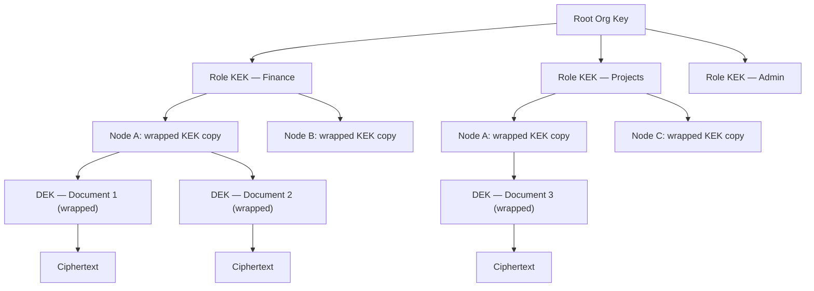

# Chapter 15 — Security Architecture

<!-- icm/prose-review -->

<!-- Target: ~3,500 words -->
<!-- Source: v13 §11, v5 §4 -->

---

## Threat Model

Distributing data to endpoints does not eliminate the honeypot problem — it distributes it. A cloud database presents a single high-value target behind enterprise-grade perimeter controls. A fleet of workstations presents a larger attack surface with heterogeneous security posture. Every endpoint that holds plaintext is a potential breach point; the weakest device in the organization sets the attacker's minimum viable entry cost.

The threat model accepts this reality and bounds the blast radius rather than denying it. Three properties constrain the damage a successful endpoint compromise can cause: each node holds only the data its role subscriptions permit; per-role encryption keys are never present on nodes that do not hold the corresponding role; key compromise does not expose historical data encrypted under previously rotated keys. These properties mean that compromising one sales representative's laptop exposes sales data — not the finance ledger — and only data encrypted under keys the laptop currently holds.

The system treats the relay as an untrusted intermediary. The relay routes ciphertext; it cannot read payload. The relay can observe communication patterns: which nodes connect to which, at what times, at what volume. For regulated industries where communication metadata is itself sensitive, the appropriate mitigation is a self-hosted relay on infrastructure the organization controls. A third-party relay operator never sees plaintext under any circumstance.

Administrative events — key distribution, role attestations, revocation broadcasts — travel through the same encrypted log as application data. The administrator's device is the highest-value target in the system. Compromising the administrator's device enables fraudulent key generation and distribution of rogue role bundles. `Sunfish.Kernel.Security` provides hardware-backed key storage where the platform supports it; organizations with elevated threat models require administrator operations only on managed devices with hardware security modules.

---

## Four Defensive Layers

The architecture applies defense in depth across four independent layers. Each layer provides protection that does not depend on any other layer functioning correctly. An attacker who defeats one layer gains nothing from the defeat unless they also defeat the next.

### Layer 1 — Encryption at Rest

All local databases use SQLCipher. The database key is derived from a cryptographically random 256-bit root seed stored in the OS-native keystore — Keychain on macOS and iOS, the Windows Data Protection API on Windows, the Linux Secret Service on Linux — using HKDF-SHA256. The 256-bit root seed carries sufficient entropy that password-based key stretching is unnecessary; physical extraction of storage media without access to the OS keystore yields no plaintext data.

The database key is never written to disk. The root seed lives in OS-managed keystore storage; the derived key is loaded into the process address space on demand and zeroed from memory after each database session closes.

### Layer 2 — Field-Level Encryption

Records in high-sensitivity buckets — financial data, personally identifiable information, health records — carry field-level encryption using per-role symmetric keys. The field-level key is distinct from the database key. A node that opens the database cannot read a field-encrypted record unless it also holds the appropriate role key.

The administrator generates per-role symmetric keys, wraps each key with every qualifying member's public key, and distributes the wrapped bundles as special administrative events in the log. Each member's device decrypts its bundle using the device's private key and stores the role key in the OS keystore. A member added to a role after records were encrypted decrypts those records immediately upon receiving the key bundle; a member removed from a role loses access to future records when the administrator rotates the key.

### Layer 3 — Stream-Level Data Minimization

The sync daemon enforces subscription filtering before any event leaves the originating node. Non-subscribed nodes never receive events regardless of application-layer configuration or administrator error. The send-tier filtering invariant is the sync daemon's core access control gate, not an advisory policy.

This layer provides protection even when the relay is compromised or colluding. An attacker who compromises the relay sees only ciphertext of events that subscribing nodes requested.

### Layer 4 — Circuit Breaker and Quarantine

Offline writes are quarantined pending validation against current team state and policy. The circuit breaker activates when a node reconnects after a period of isolation and presents writes that conflict with current authorization policy — for example, writes from a user whose role was revoked while the node was offline.

Quarantined writes are held, not discarded. An administrator reviews the quarantine queue and either promotes each write — integrating it into the live log — or explicitly rejects it with a recorded reason. The rejection reason is logged; the audit trail captures what was offered, who reviewed it, and what decision was made. This approach preserves data written in good faith while enforcing authorization policy at the point of reintegration.

---

## Key Hierarchy

The key hierarchy separates organizational authority, role membership, node-level key custody, and document-level encryption into four independent tiers. The separation allows any tier to be rotated without affecting the others.

**Envelope encryption mechanics.** For each document, the system generates a random Data Encryption Key (DEK) and encrypts the document content with AES-GCM using that DEK. The DEK is then encrypted — "wrapped" — using the current Key Encryption Key (KEK) for the document's role. The wrapped DEK is stored alongside the ciphertext. To read a document, a node retrieves its KEK from the OS keystore, unwraps the DEK, and decrypts the document body. The KEK never touches the document body; the DEK never persists in unwrapped form beyond the active decryption operation.

**Why this separation matters.** KEK rotation — triggered by role membership change or key compromise — does not require re-encrypting document bodies. The system re-wraps DEKs using the new KEK; the ciphertext is unchanged. Rotation work is proportional to the number of documents, not their cumulative size. A team with ten thousand documents completes KEK rotation by processing ten thousand small DEK blobs, not hundreds of megabytes of document bodies.

**Node-level custody.** Each node holds wrapped copies of the KEKs for its roles. A wrapped copy is decryptable only with the node's device private key. If a device is lost or decommissioned, its wrapped KEK copies cannot be used by anyone who does not also hold the device's private key. Revoking a node means withholding new KEK bundles; the node's existing wrapped copies become useless when the KEK is rotated.

---

## Role Attestation Flow

Role attestations and role keys are distinct mechanisms that serve distinct purposes. Attestations prove role membership. Keys enable decryption. The sync daemon uses attestations to make subscription decisions; key possession is separately verified before field-encrypted content is delivered.

The attestation and key distribution flow proceeds in five steps:

1. The administrator generates per-role symmetric KEKs from a fresh entropy source — not derived from any organizational root secret that would make the root a single point of compromise.
2. For each member of a role, the administrator wraps the role KEK with the member's device public key using asymmetric encryption. The wrapped bundle is specific to that device and that role.
3. The administrator publishes the wrapped bundles as administrative events in the CRDT log. These events are signed with the administrator's key; nodes verify the signature before accepting any bundle.
4. Each member's node receives the administrative event during the next sync cycle. The node decrypts its bundle using its device private key and writes the role KEK to the OS keystore.
5. During sync capability negotiation, each node presents its signed attestations. The sync daemon on the originating node verifies attestations and grants or denies subscriptions. Attestation alone does not prove key possession — a node that holds neither the attestation nor the key receives no events.

Key rotation on membership change follows the same flow. The administrator generates a new KEK for the affected role, wraps it for each current authorized member, and publishes the new bundles. Nodes removed from the role are excluded from the new bundle set. They retain the old KEK but cannot unwrap DEKs re-wrapped under the new KEK. The administrator triggers re-wrapping of existing DEKs as part of the offboarding procedure; once complete, revoked nodes lose access to all documents in the role regardless of generation.

---

## Key Compromise Incident Response

Scheduled key rotation is a maintenance operation. Key compromise is an incident, and the response procedure differs from routine rotation in one critical way: the new KEK must not derive from the compromised key.

**Detection triggers.** The system logs all key access events to the audit log. Detection arrives from three sources: a physical loss report from a user whose device was stolen or found in an untrusted state; anomalous access patterns in the audit log that suggest unauthorized key use; or an explicit administrator report of suspected credential exposure. The incident response procedure activates on any of these triggers.

**New KEK generation.** The administrator generates an entirely new KEK for the affected role from a fresh entropy source. Derivation from the compromised key would propagate the compromise forward. All other aspects of the distribution flow — wrapping with member public keys, publishing as signed administrative events — are identical to routine rotation.

**DEK re-wrapping.** The system re-wraps every DEK owned by the affected role using the new KEK. The background job processes DEK blobs only, leaving document bodies unchanged. During re-wrapping, documents remain accessible to nodes that hold the current KEK. The old KEK is not discarded until all DEKs in scope are re-wrapped and new bundles are delivered to all authorized nodes.

**Old KEK discard.** Once DEK re-wrapping completes and new bundles are delivered, the administrator triggers discard of the old KEK. `Sunfish.Kernel.Security` broadcasts a discard signal through the relay; each node zeros its in-memory copy of the old KEK and removes it from the OS keystore. A node that received the discard signal but has not yet received the new bundle cannot decrypt documents in that role — this is the correct behavior. Partial access is not granted as a fallback.

**Revocation broadcast.** The relay receives a revocation event for the compromised key identifier. Subsequent connection attempts from any node presenting the revoked key are rejected at the handshake layer with a specific error code.

**User notification.** Affected users receive a notification specifying the data-at-risk window: the interval from the compromised key's creation date to the moment the revocation broadcast was confirmed. The notification is specific — "documents in the Finance role between January 3 and April 17 may have been accessed" — not a generic security alert.

---

## Offline Node Revocation and Reconnection

A node that is offline when a revocation event occurs does not receive that event until reconnection. The relay enforces revocation at the handshake layer, not through an out-of-band push.

When an offline node attempts to reconnect, the sync daemon presents the node's current attestation bundle to the relay. The relay checks each key identifier in the bundle against the revocation log. If any key has been revoked, the relay rejects the handshake with error code `ERR_KEY_REVOKED` — not a generic connection failure. The specific error code allows the node's client to distinguish between a network problem, an expired certificate, and a deliberate revocation.

The node cannot resume sync until the user re-authenticates through the IdP. Re-authentication establishes fresh role attestations against current team state. After successful re-authentication, the administrator's device detects the reconnected node and issues new wrapped KEK copies for the roles the user currently holds. Once the new key bundle arrives and is stored in the OS keystore, sync resumes.

The user-visible message on revocation rejection is: "Your access credentials have been updated. Sign in again to continue syncing." The message avoids technical terminology and does not indicate whether the revocation was triggered by a compromise, a role change, or an administrative rotation.

A node whose revocation predates its last offline period may have accumulated writes in its local CRDT store during that period. Those writes enter the circuit breaker quarantine on reconnection and await administrator review before promotion. The combination of relay-level revocation rejection and circuit breaker quarantine ensures that a revoked node cannot inject writes into the live system without explicit administrator decision.

---

## In-Memory Key Handling

Keys in memory are exposed to cold boot attacks, hypervisor memory inspection, and process memory dumps. The system applies three controls to minimize this exposure.

**Locked memory pages.** Key material is allocated in pages marked non-swappable using the platform's memory locking API — `mlock` on POSIX systems, `VirtualLock` on Windows. The OS cannot page this memory to disk during normal operation or under memory pressure. A hibernation event remains a risk; the mitigation is a short re-authentication interval that limits how long key material persists in any session.

**Zeroing on exit.** The process zeros all key material before exit, including on abnormal exit via registered signal handlers. `Sunfish.Kernel.Security` zeros using a function the compiler cannot optimize away — dead-store elimination removes zeroing code the optimizer considers unreachable because no subsequent read exists [1]. The package uses platform-provided secure zeroing where available.

**Re-authentication interval.** For high-security deployments, the system enforces a re-authentication interval of four hours. After four hours of continuous session time, the process evicts key material from the in-memory keystore and prompts the user to authenticate again. The four-hour window narrows the cold boot and memory forensics exposure: an attacker gaining physical access to a running machine more than four hours after the last authentication cannot extract key material that has already been evicted.

The four-hour default is configurable. Deployments with lower sensitivity requirements extend the interval; deployments in highly regulated environments — healthcare, financial services — reduce it to sixty minutes or require hardware-backed authentication using FIDO2 or smart card to remove the interval-based tradeoff entirely.

---

## Supply Chain Security

A local-first system that distributes application updates through a CDN has an update-pipeline attack surface. A compromised CDN can serve modified binaries. The architecture closes this gap through content addressing, signing, and transparency logging.

**Content-addressed updates.** Each update package is identified by a content identifier (CID) computed from the package contents. The CID is distributed alongside the update through a channel separate from the CDN — embedded in a signed release manifest published to the Sigstore transparency log. The client downloads the package from the CDN and verifies the computed CID against the manifest before installation. A compromised CDN cannot serve a corrupt package without the CID mismatch being detected at the client.

**Release signing key custody.** The CID must itself be signed by a legitimate release signing key. The integrity of the CID verification scheme depends entirely on the integrity of that key. The signing key is held in a hardware security module under multi-party authorization; signing operations require quorum approval. The key is never present in a CI/CD environment where build automation could extract it.

**Sigstore transparency log.** All signing events are logged to Rekor, Sigstore's public transparency log [2]. A client that encounters a signed package whose signing event is absent from the transparency log rejects the package. Absence indicates either a very recent signing event that has not yet propagated — acceptable with a short hold period — or a signing event that was deliberately withheld, indicating a rogue signing operation.

**Reproducible builds.** Independent parties can reproduce the published binary from the published source and verify that the computed CID matches. Reproducible builds transform the signing key from the sole trust anchor into one of two independent verification paths. A compromise that modifies the binary but cannot also modify the published source is detectable by any party that performs the reproducibility check.

---

## GDPR Article 17 and Crypto-Shredding

GDPR Article 17 grants data subjects the right to erasure [3]. The compliance-tier CRDT operation log is immutable by design — tamper evidence for regulated industries depends on DAG continuity. Conventional deletion breaks the DAG. This creates a direct conflict between the architecture's integrity guarantees and Article 17's deletion obligation.

The architecture resolves the tension through crypto-shredding. When an erasure request targets an operation record, the system destroys the DEK for that specific record. The operation entry remains in the log; its content — the ciphertext — is permanently unreadable. The ciphertext becomes an unrecoverable stub: the bytes exist, but no key exists or ever will exist that can decrypt them.

This approach satisfies Article 17 for the content of the targeted record. The operation identifier, timestamp, and DAG position are not erasable without breaking the log structure. These constitute residual metadata. Under Article 17(3)(b)'s exemption for legal obligations and public interest, the log structure is a legitimate interest that overrides erasure of structural metadata — but that legal conclusion is jurisdiction-dependent and fact-specific.

Organizations subject to Article 17 must obtain legal review before relying on crypto-shredding as their erasure mechanism. The architecture makes content erasure technically possible; legal counsel determines whether residual metadata satisfies the specific data subject's request under the applicable national implementation of the GDPR.

**Practical implementation.** The DEK for a targeted record is zeroed from all node keystores through the same broadcast mechanism used for compromised key discard. The operation stub in the log carries a marker indicating the DEK has been destroyed. Audit tools identify destroyed records without reading their content. The erasure event itself is logged with the data subject identifier, the targeted operation identifier, and the timestamp — the log records that an erasure occurred, even though the erased content is unrecoverable.

---

## Relay Trust Model

The relay is a ciphertext router. It receives encrypted event payloads from source nodes, validates destination subscriptions, and forwards to subscribing nodes. The relay operator cannot read payload content — the encryption layer is applied at the originating node before the event enters the relay.

**What the relay sees.** The relay observes which node identifiers communicate with which, at what times, at what message volume, and with what pattern of burst and quiescence. For most enterprise deployments, this communication graph is not sensitive. For legal services, healthcare, or other deployments where client-attorney privilege or patient confidentiality extends to the fact of communication — not only its content — the communication graph is sensitive metadata.

**Self-hosted relay.** The mitigation for metadata-sensitive deployments is a self-hosted relay on infrastructure the organization controls. A self-hosted relay eliminates the third-party relay operator as a metadata observer. The relay software is the same codebase as the managed relay; the difference is operational custody. Chapter 19 covers relay deployment configuration for enterprise environments.

**Relay and legal process.** A relay operator served with legal process can produce connection logs and message metadata. Content is not producible — the operator does not hold decryption keys. Organizations whose threat model includes legal process directed at the relay operator deploy a self-hosted relay and ensure that connection logs are subject to their own retention policies.

**Traffic analysis resistance.** The current architecture does not implement constant-rate padding between nodes. Organizations whose threat model includes traffic analysis by a well-resourced adversary replace the relay with application-layer obfuscation or route it behind a mixnet. The architecture documents the limitation; the mitigation is an operator deployment choice outside the scope of `Sunfish.Kernel.Security`.

---

## Security Properties Summary

The four defensive layers, key hierarchy, and operational procedures provide four guarantees.

| Property | Guarantee | Mechanism |
|---|---|---|
| **Confidentiality** | A compromised endpoint exposes only data within the compromised node's role subscriptions and only data encrypted under keys present on that node. Data from other roles, other tenants, and future key generations is not exposed. | Role-scoped KEKs; per-document DEKs; bucket-level subscription filtering at sync negotiation. |
| **Integrity** | Tampering with historical records breaks DAG continuity and is detectable by any node that validates the log. Unsigned administrative events — key bundles, revocations, role changes — are rejected at receipt. | Append-only, DAG-linked CRDT operation log; administrator-signed administrative events. |
| **Availability** | An unavailable relay does not prevent local operations. Confidentiality and integrity guarantees hold offline. Sync resumes when the relay becomes available and the node's attestations are current. | Local-node primary architecture; relay is an optional sync peer, not a required dependency. |
| **Non-repudiation** | Every write is attributed to the device key of the originating node. A node cannot deny authorship of an operation it signed. | Long-lived Ed25519 device keypairs stored in hardware-backed OS keystores where available. |

These properties hold under the threat model stated at the opening of this chapter. They do not hold if the administrator's device is compromised and the attacker performs fraudulent key distribution before detection. The administrator device is the system's trust anchor; its protection is an organizational security responsibility outside the scope of `Sunfish.Kernel.Security`.

---

## References

[1] D. Wheeler, "Secure Programming HOWTO," ver. 3.72, 2015. [Online]. Available: https://dwheeler.com/secure-programs/

[2] Sigstore Project, "Rekor: Transparency Log for Software Supply Chains," Linux Foundation, 2023. [Online]. Available: https://docs.sigstore.dev/logging/overview/

[3] European Parliament, "Regulation (EU) 2016/679 (General Data Protection Regulation)," Official Journal of the European Union, Apr. 2016, Art. 17.
