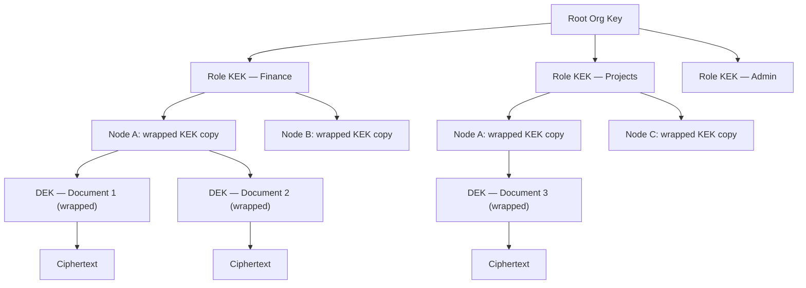

# Chapter 15 — Security Architecture

<!-- icm/prose-review -->

<!-- Target: ~3,500 words -->
<!-- Source: v13 §11, v5 §4 -->

---

## Threat Model

Distributing data to endpoints does not eliminate the honeypot problem. It distributes it. A cloud database concentrates value behind a single perimeter under enterprise-grade controls. A fleet of workstations spreads that value across many smaller perimeters — each with its own posture, its own discipline, its own weakest link. Every endpoint that holds plaintext is a potential breach point. The weakest device in the organization sets the attacker's minimum viable entry cost.

The threat model accepts this reality and chooses to bound the blast radius rather than deny it. Three properties do the bounding. Each node holds only the data its role subscriptions permit. Per-role encryption keys are never present on nodes that do not hold the corresponding role. Key compromise does not expose historical data encrypted under previously rotated keys. These properties mean that compromising one sales representative's laptop exposes sales data — not the finance ledger — and only the data encrypted under keys the laptop currently holds.

The system treats the relay as an untrusted intermediary. The relay routes ciphertext. It cannot read payload. It can, however, observe the shape of the conversation: which nodes connect to which, at what times, at what volume. For regulated industries where communication metadata is itself sensitive, the appropriate mitigation is a self-hosted relay on infrastructure the organization controls. A third-party relay operator cannot read payload plaintext under the described architecture — the relay holds ciphertext only, and decryption keys never leave originating nodes.

Administrative events — key distribution, role attestations, revocation broadcasts — travel through the same encrypted log as application data. The administrator's device is the highest-value target in the system. Compromising it enables fraudulent key generation and the distribution of rogue role bundles. `Sunfish.Kernel.Security` provides hardware-backed key storage where the platform supports it; organizations with elevated threat models require administrator operations only on managed devices with hardware security modules.

---

## Four Defensive Layers

The architecture applies defense in depth across four independent layers. Each layer protects without depending on any other layer working correctly. An attacker who defeats one layer gains nothing from the defeat unless they also defeat the next.

### Layer 1 — Encryption at Rest

All local databases use SQLCipher. The database key derives from a cryptographically random 256-bit root seed stored in the OS-native keystore — Keychain on macOS and iOS, the Windows Data Protection API (Application Programming Interface) on Windows, the Linux Secret Service on Linux — using HKDF (HMAC-based Key Derivation Function)-SHA256. The 256-bit root seed carries enough entropy that password-based key stretching is unnecessary. Physical extraction of storage media without access to the OS keystore yields no plaintext data.

The database key is never written to disk. The root seed lives in OS-managed keystore storage. The derived key is loaded into the process address space on demand and zeroed from memory after each database session closes.

### Layer 2 — Field-Level Encryption

Records in high-sensitivity buckets — financial data, personally identifiable information, health records — carry field-level encryption using per-role symmetric keys. The field-level key is distinct from the database key. A node that opens the database cannot read a field-encrypted record unless it also holds the appropriate role key.

The administrator generates per-role symmetric keys, wraps each key with every qualifying member's public key, and distributes the wrapped bundles as special administrative events in the log. Each member's device decrypts its bundle using the device's private key and stores the role key in the OS keystore. A member added to a role after records were encrypted decrypts those records immediately upon receiving the key bundle. A member removed from a role loses access to future records when the administrator rotates the key.

### Layer 3 — Stream-Level Data Minimization

The sync daemon enforces subscription filtering before any event leaves the originating node. Non-subscribed nodes never receive events, regardless of application-layer configuration or administrator error. The send-tier filtering invariant is the sync daemon's core access control gate. It is not an advisory policy.

This layer protects even when the relay is compromised or colluding. An attacker who compromises the relay sees only ciphertext of events that subscribing nodes requested.

### Layer 4 — Circuit Breaker and Quarantine

Offline writes are quarantined pending validation against current team state and policy. The circuit breaker activates when a node reconnects after a period of isolation and presents writes that conflict with current authorization policy — for example, writes from a user whose role was revoked while the node was offline.

Quarantined writes are held, not discarded. An administrator reviews the quarantine queue and either promotes each write — integrating it into the live log — or explicitly rejects it with a recorded reason. The rejection reason is logged; the audit trail captures what was offered, who reviewed it, and what decision was made. This approach preserves data written in good faith while enforcing authorization policy at the point of reintegration.

---

## Key Hierarchy

The key hierarchy separates organizational authority, role membership, node-level key custody, and document-level encryption into four independent tiers. Any tier can be rotated without affecting the others.

**Envelope encryption mechanics.** For each document, the system generates a random 256-bit Data Encryption Key (DEK) using the OS CSRNG — `getrandom(2)` on Linux, `BCryptGenRandom` on Windows, `SecRandomCopyBytes` on macOS. The DEK encrypts the document content with AES-256-GCM: 256-bit key, 96-bit random nonce generated per encryption event (never counter-derived, never reused under the same key), 128-bit authentication tag. The DEK is then encrypted — "wrapped" — using the current 256-bit Key Encryption Key (KEK) for the document's role, also under AES-256-GCM with a fresh 96-bit nonce. The wrapped DEK is stored alongside the ciphertext. To read a document, a node retrieves its KEK from the OS keystore, unwraps the DEK, and decrypts the document body. The KEK never touches the document body. The DEK never persists in unwrapped form beyond the active decryption operation.

**Key derivation parameters.** Argon2id derives the OS keystore password when user credentials are required (administrator bootstrap, recovery-key unseal): memory cost 64 MiB, iteration count 3, parallelism 4 — the current OWASP interactive baseline — for standard deployments. Regulated-industry deployments configure the high-security tier: memory cost 128 MiB, iteration count 4, parallelism 4. HKDF-SHA256 derives subordinate keys from the root seed. These parameters are the specification. Any implementation claiming conformance names these values in its configuration.

**Why this separation matters.** KEK rotation — triggered by role membership change or key compromise — does not require re-encrypting document bodies. The system re-wraps DEKs using the new KEK; the ciphertext is unchanged. Rotation work is proportional to the number of documents, not their cumulative size. A team with ten thousand documents completes KEK rotation by processing ten thousand small DEK blobs, not hundreds of megabytes of document bodies.

**Node-level custody.** Each node holds wrapped copies of the KEKs for its roles. A wrapped copy is decryptable only with the node's device private key. If a device is lost or decommissioned, its wrapped KEK copies cannot be used by anyone who does not also hold the device's private key. Revoking a node means withholding new KEK bundles. The node's existing wrapped copies become useless when the KEK is rotated.

---

## Role Attestation Flow

Role attestations and role keys are distinct mechanisms that serve distinct purposes. Attestations prove role membership. Keys enable decryption. The sync daemon uses attestations to make subscription decisions; key possession is separately verified before field-encrypted content is delivered.

The attestation and key distribution flow proceeds in five steps:

1. The administrator generates per-role symmetric KEKs from a fresh entropy source — not derived from any organizational root secret that would make the root a single point of compromise.
2. For each member of a role, the administrator wraps the role KEK with the member's device public key using asymmetric encryption. The wrapped bundle is specific to that device and that role.
3. The administrator publishes the wrapped bundles as administrative events in the CRDT (Conflict-free Replicated Data Type) log. These events are signed with the administrator's key; nodes verify the signature before accepting any bundle.
4. Each member's node receives the administrative event during the next sync cycle. The node decrypts its bundle using its device private key and writes the role KEK to the OS keystore.
5. During sync capability negotiation, each node presents its signed attestations. The sync daemon on the originating node verifies attestations and grants or denies subscriptions. Attestation alone does not prove key possession — a node that holds neither the attestation nor the key receives no events.

Key rotation on membership change follows the same flow. The administrator generates a new KEK for the affected role, wraps it for each current authorized member, and publishes the new bundles. Nodes removed from the role are excluded from the new bundle set. They retain the old KEK but cannot unwrap DEKs re-wrapped under the new KEK. The administrator triggers re-wrapping of existing DEKs as part of the offboarding procedure. Once that completes, revoked nodes lose access to all documents in the role regardless of generation.

---

## Key Compromise Incident Response

Operational flows specified in Chapter 22 §Key Compromise Incident Response.

---

## Key-Loss Recovery

Operational flows specified in Chapter 22 §Key-Loss Recovery.

---

## Offline Node Revocation and Reconnection

Operational flows specified in Chapter 23 §Offline Node Revocation and Reconnection.

---

## Collaborator Revocation and Post-Departure Partition

Operational flows specified in Chapter 23 §Collaborator Revocation and Post-Departure Partition.

---

## Forward Secrecy and Post-Compromise Security

Operational flows specified in Chapter 22 §Forward Secrecy and Post-Compromise Security.

---

## In-Memory Key Handling

Keys in memory are exposed to cold boot attacks, hypervisor memory inspection, and process memory dumps. The system applies three controls to minimize this exposure.

**Locked memory pages.** Key material is allocated in pages marked non-swappable using the platform's memory locking API — `mlock` on POSIX systems, `VirtualLock` on Windows. The OS cannot page this memory to disk during normal operation or under memory pressure. A hibernation event remains a risk; the mitigation is a short re-authentication interval that limits how long key material persists in any session.

**Zeroing on exit.** The process zeros all key material before exit, including on abnormal exit via registered signal handlers. `Sunfish.Kernel.Security` zeros using a function the compiler cannot optimize away — dead-store elimination removes zeroing code the optimizer considers unreachable because no subsequent read exists [1]. The package uses platform-provided secure zeroing where available.

**Re-authentication interval.** For high-security deployments, the system enforces a re-authentication interval of four hours. After four hours of continuous session time, the process evicts key material from the in-memory keystore and prompts the user to authenticate again. The four-hour window narrows the cold boot and memory forensics exposure: an attacker gaining physical access to a running machine more than four hours after the last authentication cannot extract key material that has already been evicted.

The four-hour default is configurable. Deployments with lower sensitivity requirements extend the interval. Deployments in highly regulated environments — healthcare, financial services — reduce it to sixty minutes or require hardware-backed authentication using FIDO2 or smart card to remove the interval-based tradeoff entirely.

---

<!-- code-check: extension #47 endpoint-compromise. Sub-patterns 47a–47f. Sunfish.Kernel.Security only — no new namespace. Forward-looking attestation handshake at Ch14 §Sync Daemon Protocol flagged with CLAIM marker. -->

## Endpoint Compromise: What Stays Protected

Operational flows specified in Chapter 23 §Endpoint Compromise: What Stays Protected.

---

## Supply Chain Security

A local-first system that distributes application updates through a CDN inherits an update-pipeline attack surface. A compromised CDN can serve modified binaries. The architecture closes this gap through content addressing, signing, and transparency logging.

**Content-addressed updates.** Each update package is identified by a content identifier (CID) computed from the package contents. The CID is distributed alongside the update through a channel separate from the CDN — embedded in a signed release manifest published to the Sigstore ([sigstore.dev](https://www.sigstore.dev/), the supply-chain signing toolkit) transparency log. The client downloads the package from the CDN and verifies the computed CID against the manifest before installation. A compromised CDN cannot serve a corrupt package without the CID mismatch being detected at the client.

**Release signing key custody.** The CID must itself be signed by a legitimate release signing key. The integrity of the CID verification scheme depends entirely on the integrity of that key. The signing key is held in a hardware security module under multi-party authorization; signing operations require quorum approval. The key is never present in a CI/CD environment where build automation could extract it.

**Sigstore transparency log.** All signing events are logged to Rekor, Sigstore's public transparency log [2]. A client that encounters a signed package whose signing event is absent from the transparency log rejects the package. Absence indicates either a very recent signing event that has not yet propagated — acceptable with a short hold period — or a signing event that was deliberately withheld, indicating a rogue signing operation.

**Reproducible builds.** Independent parties can reproduce the published binary from the published source and verify that the computed CID matches. Reproducible builds transform the signing key from the sole trust anchor into one of two independent verification paths. A compromise that modifies the binary but cannot also modify the published source is detectable by any party that performs the reproducibility check.

---

## Chain-of-Custody for Multi-Party Transfers

Operational flows specified in Chapter 23 §Chain-of-Custody for Multi-Party Transfers.

---

## GDPR (General Data Protection Regulation) Article 17 and Crypto-Shredding

GDPR Article 17 grants data subjects the right to erasure [3]. Parallel erasure rights exist under India's DPDP (Digital Personal Data Protection) Act, Brazil's LGPD (Lei Geral de Proteção de Dados) Article 18, the UAE's DIFC (Dubai International Financial Centre) DPL (Data Protection Law) 2020 Chapter 4, and the broader matrix of regimes named in Appendix F (LFPDPPP (Ley Federal de Protección de Datos Personales en Posesión de los Particulares), POPIA (Protection of Personal Information Act), NDPR (Nigeria Data Protection Regulation), Kenya DPA, APPI (Act on the Protection of Personal Information), PIPA (Personal Information Protection Act)). The compliance-tier CRDT operation log is immutable by design — tamper evidence for regulated industries depends on DAG (Directed Acyclic Graph) continuity. Conventional deletion breaks the DAG. This creates a direct conflict between the architecture's integrity guarantees and the erasure obligations under these regimes. The crypto-shredding mechanism described below satisfies the content-erasure obligation uniformly across jurisdictions; the metadata residue limitation applies identically to all of them.

The architecture resolves the tension through crypto-shredding. When an erasure request targets an operation record, the system destroys the DEK for that specific record. The operation entry remains in the log; its content — the ciphertext — is permanently unreadable. The ciphertext becomes an unrecoverable stub: the bytes exist, but no key exists or ever will exist that can decrypt them.

This approach satisfies Article 17 for the content of the targeted record. The operation identifier, timestamp, and DAG position are not erasable without breaking the log structure. These constitute residual metadata. Under Article 17(3)(b)'s exemption for legal obligations and public interest, the log structure is a legitimate interest that overrides erasure of structural metadata — but that legal conclusion is jurisdiction-dependent and fact-specific.

Organizations subject to Article 17 must obtain legal review before relying on crypto-shredding as their erasure mechanism. The architecture makes content erasure technically possible. Legal counsel determines whether residual metadata satisfies the specific data subject's request under the applicable national implementation of the GDPR.

**Practical implementation.** The DEK for a targeted record is zeroed from all node keystores through the same broadcast mechanism used for compromised key discard. The operation stub in the log carries a marker indicating the DEK has been destroyed. Audit tools identify destroyed records without reading their content. The erasure event itself is logged with the data subject identifier, the targeted operation identifier, and the timestamp — the log records that an erasure occurred, even though the erased content is unrecoverable.

---

## Event-Triggered Re-classification

Operational flows specified in Chapter 23 §Event-Triggered Re-classification.

---

## Relay Trust Model

The relay is a ciphertext router. It receives encrypted event payloads from source nodes, validates destination subscriptions, and forwards to subscribing nodes. The relay operator cannot read payload content — the encryption layer is applied at the originating node before the event enters the relay.

**What the relay sees.** The relay observes which node identifiers communicate with which, at what times, at what message volume, and with what pattern of burst and quiescence. For most enterprise deployments, this communication graph is not sensitive. For legal services, healthcare, or other deployments where client-attorney privilege or patient confidentiality extends to the fact of communication — not only its content — the communication graph is sensitive metadata.

**Self-hosted relay.** The mitigation for metadata-sensitive deployments is a self-hosted relay on infrastructure the organization controls. A self-hosted relay eliminates the third-party relay operator as a metadata observer. The relay software is the same codebase as the managed relay; the difference is operational custody. Chapter 19 covers relay deployment configuration for enterprise environments.

**Relay and legal process.** A relay operator served with legal process can produce connection logs and message metadata. Content is not producible — the operator does not hold decryption keys. Organizations whose threat model includes legal process directed at the relay operator deploy a self-hosted relay and ensure that connection logs are subject to their own retention policies.

**Compelled-access threat model as a compliance argument.** The relay cannot produce decryptable content under legal compulsion because the relay does not possess decryptable content. This is the structural answer to compelled-access threat models across jurisdictions that Customer-Managed Key (CMK) patterns in major cloud platforms cannot match — CMK keeps the customer's key outside the cloud provider's direct custody, but the data itself still traverses third-party infrastructure, which makes the provider legally compellable to facilitate access through other means. Local-first keys on local hardware that never cross a third-party network defeat the attack surface CMK leaves exposed. The architecture answers the EU's 2020 Schrems II ruling (Data Protection Commissioner v. Facebook Ireland Limited), which constrains cross-border transfer of EU personal data to US-hosted infrastructure. It answers Russia's Federal Law 242-FZ (enacted 2015, predating GDPR by two years), which mandates Russian-citizen personal data reside on Russia-resident servers. It answers the UAE's DIFC Data Protection Law 2020, which prohibits foreign cloud retention for DIFC-licensed financial entities holding regulated data. It answers the parallel localization regimes named in Appendix F (DPDP + RBI (Reserve Bank of India), PIPL (Personal Information Protection Law) + MLPS (Multi-Level Protection Scheme) 2.0, APPI, PIPA + ISMS-P (Information Security Management System – Personal), LGPD, LFPDPPP, NDPR, POPIA, Kenya DPA). In each jurisdiction, the technical claim is the same: authoritative data and its keys reside on infrastructure the operator controls.

**The 2022 demonstration.** The compelled-access threat model is not theoretical. In 2022, Adobe, Autodesk, Microsoft, Figma ([figma.com](https://www.figma.com/), the design tool), and dozens of other Western SaaS (Software as a Service) vendors suspended or terminated service for users across Russia and the CIS (Commonwealth of Independent States) region under sanctions enforcement. Hundreds of thousands of organizations lost access to data they had created — in some cases over a decade of operational workflows, with days of notice. The architectural property that prevents this — local authoritative data, keys under user custody, relay holds only ciphertext — converts a vendor-dependency risk into a structural property. Organizations replacing Western SaaS under import substitution mandates find the architecture directly aligned with their adoption driver.

**Break-glass corrupt-sequence recovery.** When a CRDT sequence arrives in a structurally invalid state — cryptographic signature mismatch, reference to an unknown operation, schema-version violation the upcaster chain cannot resolve — the sync daemon quarantines the full sequence rather than applying any portion. Partial application is never safe for CP-class records and rarely safe for AP-class records. The break-glass procedure is explicit administrator action: the administrator inspects the quarantined sequence through the admin console's quarantine viewer, determines whether the sequence originated from a compromised client (reject with logged reason), a legitimate-but-buggy client (promote after domain-layer manual correction), or a transport corruption (request resend from source peer). No automatic reconciliation attempts to interpret a corrupt sequence. The audit log captures the sequence, the administrator's determination, and the disposition — the same audit trail that supports GDPR Article 30 records of processing activities.

**Traffic analysis resistance.** The current architecture does not implement constant-rate padding between nodes. Organizations whose threat model includes traffic analysis by a well-resourced adversary replace the relay with application-layer obfuscation or route it behind a mixnet. The architecture documents the limitation; the mitigation is an operator deployment choice outside the scope of `Sunfish.Kernel.Security`.

For operators who legitimately derive aggregate statistics from relay traffic — error rates, sync latencies, fleet health counts — §Privacy-Preserving Aggregation at Relay specifies the differential-privacy and k-anonymity mechanisms that satisfy the same metadata-protection intent as a self-hosted relay while still enabling operational intelligence.

---

## Privacy-Preserving Aggregation at Relay

<!-- code-check annotations: Sunfish.Kernel.Sync (in-canon, extends existing). 0 new top-level namespaces. 0 class APIs / method signatures introduced. -->

§Relay Trust Model named the self-hosted relay as the mitigation for metadata-sensitive deployments. That mitigation handles the *access* problem — it removes third-party operators as observers of the communication graph. It does not handle the *aggregation* problem. The organization that hosts its own relay still derives operational intelligence from the traffic it forwards: error rates, per-role sync latencies, fleet health counts, connection-duration distributions. Each retained statistic becomes a record that — if subpoenaed, exfiltrated, or repurposed — reveals individual node behavior at fine grain.

Differential privacy at the relay closes that gap. The relay computes operational statistics with calibrated noise and structural cohort floors. Any single node's contribution becomes statistically indistinguishable from its neighbors' in the published aggregate. The operator retains useful intelligence; individual behavior is protected.

The load-bearing scope: differential privacy here applies *only to metadata aggregates the relay computes as a side effect of routing* — counts, rates, latencies derived from packet headers and session timings. The relay receives ciphertext; payload content is differential-privacy-inaccessible because it is cryptographically inaccessible. Readers who conflate "DP on data" with "DP on relay-side metadata" misread the threat model. Forward secrecy (§Forward Secrecy and Post-Compromise Security) hides content; this section hides aggregates. The two compose orthogonally — neither weakens the other, neither alone closes the other's gap. §Endpoint Compromise: What Stays Protected establishes that the relay sees only ciphertext under any compromise scenario; this section establishes that even the metadata it does see is not retained at single-node granularity.

The section specifies three sub-patterns: differential-privacy noise injection on relay-side aggregates, a k-anonymity floor for per-role partitions with a named carve-out for recovery-event statistics, and a rolling-window privacy budget tracker for repeated time-series queries.

### Sub-pattern 12a — Differential-privacy noise injection

The relay holds plaintext metadata even in an encrypted-payload architecture: per-window operation counts, sync-latency bucket counts, error-event counts per code, connection-duration histograms. These are additive aggregates with sensitivity 1 — one node's participation can change a count by at most 1. The Laplace mechanism (Dwork and Roth [32]) adds noise with scale λ = 1/ε to satisfy ε-differential privacy. The Gaussian mechanism is the analogous construction for (ε, δ)-DP where the relay batches correlated counts.

Two ε settings cover most deployments. Standard operational telemetry uses ε = 1.0 per query (λ = 1) — a defensible baseline that preserves utility for fleet-health dashboards while keeping any single node's contribution recoverable only with low confidence. Regulated deployments — healthcare nodes, financial-services nodes, or any deployment where connection frequency itself is regulated — use ε = 0.1 per query (λ = 10), adding ten times the noise for ten times stronger privacy at the cost of degraded utility on small cohorts.

**Central DP at the relay tier — an architectural decision.** This architecture applies *central* differential privacy at the relay, not *local* differential privacy at each node. Each node reports raw sync events for delivery; the relay applies the noise once, when it publishes an aggregate to a dashboard, monitoring system, or export feed. RAPPOR (Erlingsson, Pihur, and Korolova [33]) and Apple's at-scale telemetry deployment [34] are the canonical local-DP precedents — each contributing node randomizes its own report before transmission, eliminating the need to trust the aggregator. The Inverted Stack chooses central DP. §Relay Trust Model already prescribes a self-hosted relay for metadata-sensitive deployments, and a self-hosted relay operated by the same organization whose nodes generate the statistics satisfies the "trusted curator" assumption central DP requires — by organizational identity rather than cryptographic construction. Central DP produces lower noise for equivalent guarantees because the noise is added once to the aggregate rather than once per contributor — a substantial utility advantage on the small-cohort statistics typical of enterprise sync deployments.

The trade-off is honest. Central DP requires the relay to apply the noise faithfully. For self-hosted deployments, that fidelity is under organizational control. Managed-relay deployments without operator audit rights either accept that operational telemetry is unavailable, contract for explicit audit rights, or layer local-DP randomization at the node tier as defense in depth. The relay exposes the choice — central, local, or hybrid — as a deployment-time configuration and refuses to default to a setting the deployment posture does not earn.

`Sunfish.Kernel.Sync` carries the noise injector as a relay-internal policy component. Mechanism, ε value, and aggregate-output schema are declared in the relay configuration manifest. Metadata-privacy enforcement is a sync-layer concern co-located with the metadata it operates on; no new top-level namespace is introduced.

### Sub-pattern 12b — k-anonymity floor for per-role aggregates

Some relay-side statistics partition by role: error rate for Finance-role nodes, sync latency for Compliance-role nodes, connection-success rate for Field-Operations nodes. If the Finance role has three members and one exhibits a persistent error pattern, the partition leaks that member's identity even after DP noise — Laplace noise with sensitivity 1 cannot mask a signal structurally unique to a partition of three.

The k-anonymity floor (Sweeney [35]) closes the gap. The relay suppresses any per-partition aggregate computed over fewer than k contributing nodes. Three suppression options compose with the policy: withhold the result entirely, merge the partition into a coarser parent (Finance-EMEA into Finance), or return a `below-cohort-minimum` indicator to the consuming dashboard. Withhold is the default; merge requires the operator to declare the parent partition explicitly.

k = 10 is a commonly applied minimum in operational-telemetry deployments and the practical floor recommended for this architecture; Sweeney's k-anonymity model [35] does not prescribe a specific value, and applied-privacy practice spans a k = 5 to k = 25 range depending on attribute sensitivity. Regulated deployments — healthcare, financial services, deployments invoking GDPR Article 25 data minimization — adopt k = 50 as a defensible high-water mark consistent with healthcare-privacy norms. l-diversity (Machanavajjhala et al. [36]) extends the model when a per-role partition has k members but a single sensitive-attribute value dominates; deployments that require l-diversity declare the parameter alongside k in the relay configuration.

**Carve-out for recovery-event partition statistics.** Recovery events are unusually sensitive relay-side statistics. A per-user recovery event — the metric defined by §Key-Loss Recovery sub-pattern 48f — may signal a compromised device before the user has detected the compromise. The k-anonymity floor applies to recovery-event partitions with a named exception: even when the cohort exceeds k, the relay suppresses the recovery-event partition statistic unless the operator holds explicit audit rights declared in the deployment manifest. This is an operator-policy decision, not a general suppression rule. The carve-out exists because the cost of exposing a single recovery event to an operator who lacks the authority to act on it exceeds the operational value of including recovery counts in routine fleet-health summaries.

The k-floor evaluator is a relay-internal policy component within `Sunfish.Kernel.Sync`. It evaluates partition cardinality before the noise injector executes; partitions below floor never reach the noise stage.

### Sub-pattern 12c — Rolling-window privacy budget tracker

Sync telemetry is time-series by construction: the operator runs the same latency-histogram query every hour, the same error-count query every fifteen minutes. Sequential composition is additive — n queries at ε per query consume nε of cumulative budget (Dwork and Roth [32], §3.5). An operator running hourly latency histograms at ε = 0.1 accumulates ε = 72 over thirty days. At that cumulative budget the formal DP guarantee has degraded to a value no privacy practitioner would defend in print.

The rolling-window budget tracker makes the degradation explicit and enforceable. The relay maintains a per-query-type, per-window allocation — default Σε = 10.0 over 30 days for standard operational telemetry. Each query consumes its ε from the active window. At 80% consumption the relay surfaces a `BudgetWarningRaised` event into the operator audit log. At 100% the relay queues subsequent queries of that type until the window advances and freed budget becomes available.

**Honest scoping.** The rolling-window budget is a practical engineering heuristic, not a formal solution to temporal differential privacy. Time-series DP composition under temporal correlation is an open research problem; the architecture does not claim to solve it. The tracker's value is operational: it forces the operator to confront the cumulative budget cost at deployment time rather than discover it after the formal guarantee has silently collapsed. Deployments requiring tighter bounds adopt advanced composition accounting (Dwork and Roth [32], §3.5) — the relay exposes simple-versus-advanced composition as a configuration knob, with simple as the conservative default.

**Tension with §Endpoint Compromise.** An endpoint-compromise incident produces a forensic burst — rapid reconnection attempts, anomalous operation counts, atypical latency profiles on the affected node. DP noise on these counts may mask the signal the operator needs to detect and scope the incident. The architecture's answer is a named incident-response mode that suspends DP aggregation for the affected node's metrics, recording raw events into a separate operator-controlled audit log for the incident's duration and resuming DP on closure. The suspension itself emits a signed event into `Sunfish.Kernel.Audit`, preserving the audit trail across the suspension period. The suspension event is encrypted to the operator role only — visible to the operator and to auditors holding the operator-role key, not to the broader node fleet — so the existence of the suspension does not itself leak the fact of an unconfirmed incident before the operator has scoped it.

The budget tracker is the third relay-internal policy component within `Sunfish.Kernel.Sync`. It composes upstream of the noise injector: a query that fails the budget gate never reaches DP evaluation, and a partition that fails the k-floor never reaches the budget gate.

### FAILED conditions

The privacy-aggregation primitive fails when any of the conditions below holds. Any one voids the primitive's guarantees.

- **A DP-labeled aggregate is published over a cohort smaller than the k-anonymity floor.** Architecture failure. Below floor, the noise required to mask a single contributor exceeds the signal magnitude, and the published number is privacy theater rather than privacy protection.
- **Cumulative ε within the rolling window exceeds the configured Σε without the budget gate halting subsequent queries.** Architecture failure. A budget gate that does not enforce its window allocation surrenders the formal guarantee while still labeling output as DP-protected.
- **Recovery-event partition statistics are published without the operator holding explicit audit rights declared in the deployment manifest.** Carve-out failure. The §12b exception exists precisely because routine inclusion of recovery counts exposes per-user compromise signals; bypassing the audit-rights gate defeats the carve-out's purpose.

The kill trigger for this primitive is a published DP-labeled statistic computed over a cohort below the k-anonymity floor. A primitive that labels noise-dominated output as differential privacy is not privacy preservation — it is a confidence trick performed on the operator and on the people whose behavior the data describes.

---

## Security Properties Summary

The four defensive layers, key hierarchy, and operational procedures provide four guarantees.

| Property | Guarantee | Mechanism |
|---|---|---|
| **Confidentiality** | A compromised endpoint exposes only data within the compromised node's role subscriptions and only data encrypted under keys present on that node. Data from other roles, other tenants, and future key generations is not exposed. | Role-scoped KEKs; per-document DEKs; bucket-level subscription filtering at sync negotiation. |
| **Integrity** | Tampering with historical records breaks DAG continuity and is detectable by any node that validates the log. Unsigned administrative events — key bundles, revocations, role changes — are rejected at receipt. | Append-only, DAG-linked CRDT operation log; administrator-signed administrative events. |
| **Availability** | An unavailable relay does not prevent local operations. Confidentiality and integrity guarantees hold offline. Sync resumes when the relay becomes available and the node's attestations are current. | Local-node primary architecture; relay is an optional sync peer, not a required dependency. |
| **Non-repudiation** | Every write is attributed to the device key of the originating node. A node cannot deny authorship of an operation it signed. | Long-lived Ed25519 device keypairs stored in hardware-backed OS keystores where available. |
| **Metadata minimization** | Relay-side aggregate statistics satisfy (ε, δ)-differential privacy with a k-anonymity floor. Per-partition aggregates below floor are suppressed. Cumulative ε is gated against a rolling-window budget, so individual-node behavior is not recoverable from published telemetry. | Central differential privacy at the relay tier, k-anonymity floor evaluator, and rolling-window budget tracker — all relay-internal policy components within `Sunfish.Kernel.Sync`. Suspension-event audit trail in `Sunfish.Kernel.Audit`. |

These properties hold under the threat model stated at the opening of this chapter. They do not hold if the administrator's device is compromised and the attacker performs fraudulent key distribution before detection. The administrator device is the system's trust anchor; its protection is an organizational security responsibility outside the scope of `Sunfish.Kernel.Security`.

---

## References

[1] D. Wheeler, "Secure Programming HOWTO," ver. 3.72, 2015. [Online]. Available: https://dwheeler.com/secure-programs/

[2] Sigstore Project, "Rekor: Transparency Log for Software Supply Chains," Linux Foundation, 2023. [Online]. Available: https://docs.sigstore.dev/logging/overview/

[3] European Parliament, "Regulation (EU) 2016/679 (General Data Protection Regulation)," Official Journal of the European Union, Apr. 2016, Art. 17.

[4] V. Buterin, "Why we need wide adoption of social recovery wallets," *vitalik.ca*, Jan. 2021. [Online]. Available: https://vitalik.ca/general/2021/01/11/recovery.html

[5] Argent, "Argent Smart Wallet Specification," *github.com/argentlabs*, 2020. [Online]. Available: https://github.com/argentlabs/argent-contracts/blob/develop/specifications/specifications.pdf

[6] A. Shamir, "How to share a secret," *Communications of the ACM*, vol. 22, no. 11, pp. 612–613, Nov. 1979.

[7] Apple Inc., "Apple Platform Security," May 2024. [Online]. Available: https://support.apple.com/guide/security/welcome/web

[8] Internet Engineering Task Force (IETF), "OAuth 2.0 Token Revocation," RFC 7009, Aug. 2013. [Online]. Available: https://www.rfc-editor.org/rfc/rfc7009

[9] Internet Engineering Task Force (IETF), "X.509 Internet Public Key Infrastructure Online Certificate Status Protocol — OCSP," RFC 6960, Jun. 2013. [Online]. Available: https://www.rfc-editor.org/rfc/rfc6960

[10] Internet Engineering Task Force (IETF), "Internet X.509 Public Key Infrastructure Certificate and Certificate Revocation List (CRL) Profile," RFC 5280, May 2008. [Online]. Available: https://www.rfc-editor.org/rfc/rfc5280

[11] National Institute of Standards and Technology (NIST), "An Introduction to Computer Security: The NIST Handbook," SP 800-12 Rev. 1, Oct. 1995 (rev. 2017). [Online]. Available: https://csrc.nist.gov/publications/detail/sp/800-12/rev-1/final

[12] K. Jahns, "Yjs Internals — Document Structure and Item Identifiers," *yjs/yjs* repository, 2024. [Online]. Available: https://github.com/yjs/yjs/blob/main/INTERNALS.md

[13] Loro Project, "Loro Common — Operation ID Type Definitions," *loro-dev/loro* repository, 2024. [Online]. Available: https://github.com/loro-dev/loro/blob/main/crates/loro-common/src/lib.rs

[14] M. Marlinspike and T. Perrin, "The Double Ratchet Algorithm," Signal Foundation, Nov. 2016. [Online]. Available: https://signal.org/docs/specifications/doubleratchet/

[15] M. Marlinspike and T. Perrin, "The X3DH Key Agreement Protocol," Signal Foundation, Nov. 2016. [Online]. Available: https://signal.org/docs/specifications/x3dh/

[16] T. Perrin, "The Noise Protocol Framework," rev. 34, Jul. 2018. [Online]. Available: https://noiseprotocol.org/noise.html

[17] R. Barnes, B. Beurdouche, R. Robert, J. Millican, E. Omara, and K. Cohn-Gordon, "The Messaging Layer Security (MLS) Protocol," Internet Engineering Task Force, RFC 9420, Jul. 2023. [Online]. Available: https://www.rfc-editor.org/rfc/rfc9420

[18] WhatsApp Inc., "WhatsApp Encryption Overview — Technical White Paper," Nov. 2021. [Online]. Available: https://www.whatsapp.com/security/WhatsApp-Security-Whitepaper.pdf

[19] N. Borisov, I. Goldberg, and E. Brewer, "Off-the-Record Communication, or, Why Not To Use PGP," in *Proc. ACM Workshop on Privacy in the Electronic Society (WPES)*, Washington, DC, USA, Oct. 2004, pp. 77–84.

[20] Google, "Pixel Titan M and Android Hardware-Backed Keystore," Android Developers documentation, 2024. [Online]. Available: https://source.android.com/docs/security/features/keystore and https://developer.android.com/privacy-and-security/keystore

[21] Microsoft, "Microsoft Pluton security processor," Microsoft Security Blog, Nov. 17, 2020. [Online]. Available: https://www.microsoft.com/en-us/security/blog/2020/11/17/meet-the-microsoft-pluton-processor-the-security-chip-designed-for-the-future-of-windows-pcs/

[22] J. Van Bulck *et al.*, "Foreshadow: Extracting the Keys to the Intel SGX Kingdom with Transient Out-of-Order Execution," in *Proc. 27th USENIX Security Symposium*, 2018, pp. 991–1008.

[23] K. Murdock *et al.*, "Plundervolt: Software-based Fault Injection Attacks against Intel SGX," in *Proc. IEEE Symposium on Security and Privacy (S&P)*, 2020, pp. 1466–1482.

[24] S. van Schaik *et al.*, "SGAxe: How SGX Fails in Practice," 2020. [Online]. Available: https://sgaxe.com/

[25] Arm Ltd., "Arm Security Technology — Building a Secure System using TrustZone Technology," white paper, Apr. 2009 (rev. 2022). [Online]. Available: https://developer.arm.com/documentation/prd29-genc-009492/

[26] Amnesty International Security Lab, "Forensic Methodology Report: How to catch NSO Group's Pegasus," Jul. 2021. [Online]. Available: https://www.amnesty.org/en/latest/research/2021/07/forensic-methodology-report-how-to-catch-nso-groups-pegasus/ (cross-confirmed by Citizen Lab peer review).

[27] Lookout Threat Intelligence, "Lookout Discovers Hermit Spyware," Apr. 2022 (with subsequent Citizen Lab confirmation of Kazakhstan use Jun. 2022). [Online]. Available: https://www.lookout.com/threat-intelligence/article/hermit-spyware-discovery — supplement with Google Threat Analysis Group analysis of Predator/Cytrox at https://blog.google/threat-analysis-group/.

[28] Internet Engineering Task Force (IETF), "Internet X.509 Public Key Infrastructure Time-Stamp Protocol (TSP)," RFC 3161, Aug. 2001. [Online]. Available: https://www.rfc-editor.org/rfc/rfc3161

[29] European Parliament and Council, "Regulation (EU) No 910/2014 on electronic identification and trust services for electronic transactions in the internal market (eIDAS)," Official Journal of the European Union, Jul. 2014, Art. 41. [Online]. Available: https://eur-lex.europa.eu/legal-content/EN/TXT/?uri=CELEX:32014R0910

[30] S. A. Crosby and D. S. Wallach, "Efficient Data Structures for Tamper-Evident Logging," in *Proc. 18th USENIX Security Symposium*, Montreal, Aug. 2009, pp. 317–334. [Online]. Available: https://www.usenix.org/legacy/event/sec09/tech/full_papers/crosby.pdf

[31] Internet Engineering Task Force (IETF), "Certificate Transparency Version 2.0," RFC 9162, Dec. 2021. [Online]. Available: https://www.rfc-editor.org/rfc/rfc9162

[32] C. Dwork and A. Roth, "The Algorithmic Foundations of Differential Privacy," *Foundations and Trends in Theoretical Computer Science*, vol. 9, nos. 3–4, pp. 211–487, 2014. [Online]. Available: https://www.cis.upenn.edu/~aaroth/Papers/privacybook.pdf

[33] Ú. Erlingsson, V. Pihur, and A. Korolova, "RAPPOR: Randomized Aggregatable Privacy-Preserving Ordinal Response," in *Proc. ACM Conference on Computer and Communications Security (CCS)*, Scottsdale, AZ, Nov. 2014. [Online]. Available: https://dl.acm.org/doi/10.1145/2660267.2660348

[34] Apple Inc. Differential Privacy Team, "Learning with Privacy at Scale," *Apple Machine Learning Journal*, vol. 1, no. 8, Dec. 2017. [Online]. Available: https://docs-assets.developer.apple.com/ml-research/papers/learning-with-privacy-at-scale.pdf

[35] L. Sweeney, "k-Anonymity: A Model for Protecting Privacy," *International Journal on Uncertainty, Fuzziness and Knowledge-Based Systems*, vol. 10, no. 5, pp. 557–570, 2002. [Online]. Available: https://dl.acm.org/doi/10.1142/S0218488502001648

[36] A. Machanavajjhala, D. Kifer, J. Gehrke, and M. Venkitasubramaniam, "l-Diversity: Privacy Beyond k-Anonymity," *ACM Transactions on Knowledge Discovery from Data*, vol. 1, no. 1, Mar. 2007. [Online]. Available: https://dl.acm.org/doi/10.1145/1217299.1217302

[37] National Institute of Standards and Technology (NIST), "Guide for Mapping Types of Information and Information Systems to Security Categories," SP 800-60 Vol. 1 Rev. 1, Aug. 2008. [Online]. Available: https://csrc.nist.gov/pubs/sp/800/60/v1/r1/final

[38] National Institute of Standards and Technology (NIST), "Guide for Mapping Types of Information and Information Systems to Security Categories," SP 800-60 Rev. 2 (Initial Working Draft), 2024. [Online]. Available: https://csrc.nist.gov/pubs/sp/800/60/r2/iwd

[39] International Organization for Standardization, "Information security, cybersecurity and privacy protection — Information security management systems — Requirements," ISO/IEC 27001:2022, Annex A 5.12 — Classification of information.

[40] European Parliament, "Regulation (EU) 2016/679 (General Data Protection Regulation)," Official Journal of the European Union, Apr. 2016, Art. 9. [Online]. Available: https://gdpr-info.eu/art-9-gdpr/

[41] Microsoft, "Learn about sensitivity labels — Microsoft Purview," Microsoft Learn documentation, 2024. [Online]. Available: https://learn.microsoft.com/en-us/purview/sensitivity-labels
