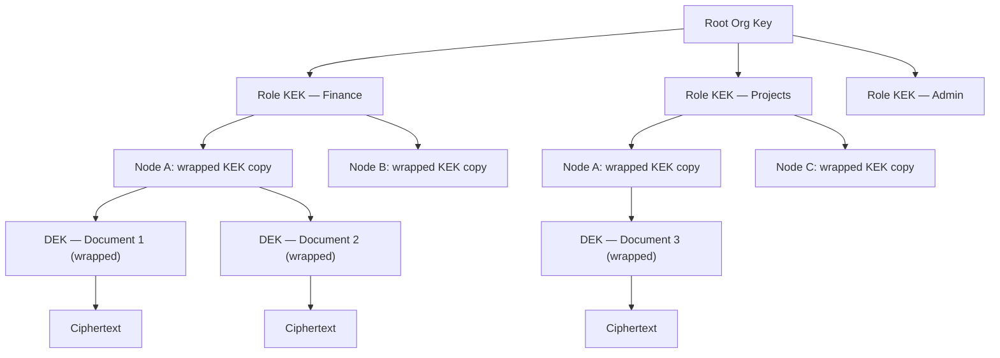

# Chapter 15 — Security Architecture

<!-- icm/prose-review -->

<!-- Target: ~3,500 words -->
<!-- Source: v13 §11, v5 §4 -->

---

## Threat Model

Distributing data to endpoints does not eliminate the honeypot problem. It distributes it. A cloud database concentrates value behind a single perimeter under enterprise-grade controls. A fleet of workstations spreads that value across many smaller perimeters — each with its own posture, its own discipline, its own weakest link. Every endpoint that holds plaintext is a potential breach point. The weakest device in the organization sets the attacker's minimum viable entry cost.

The threat model accepts this reality and chooses to bound the blast radius rather than deny it. Three properties do the bounding. Each node holds only the data its role subscriptions permit. Per-role encryption keys are never present on nodes that do not hold the corresponding role. Key compromise does not expose historical data encrypted under previously rotated keys. These properties mean that compromising one sales representative's laptop exposes sales data — not the finance ledger — and only the data encrypted under keys the laptop currently holds.

The system treats the relay as an untrusted intermediary. The relay routes ciphertext. It cannot read payload. It can, however, observe the shape of the conversation: which nodes connect to which, at what times, at what volume. For regulated industries where communication metadata is itself sensitive, the appropriate mitigation is a self-hosted relay on infrastructure the organization controls. A third-party relay operator cannot read payload plaintext under the described architecture — the relay holds ciphertext only, and decryption keys never leave originating nodes.

Administrative events — key distribution, role attestations, revocation broadcasts — travel through the same encrypted log as application data. The administrator's device is the highest-value target in the system. Compromising it enables fraudulent key generation and the distribution of rogue role bundles. `Sunfish.Kernel.Security` provides hardware-backed key storage where the platform supports it; organizations with elevated threat models require administrator operations only on managed devices with hardware security modules.

---

## Four Defensive Layers

The architecture applies defense in depth across four independent layers. Each layer protects without depending on any other layer working correctly. An attacker who defeats one layer gains nothing from the defeat unless they also defeat the next.

### Layer 1 — Encryption at Rest

All local databases use SQLCipher. The database key derives from a cryptographically random 256-bit root seed stored in the OS-native keystore — Keychain on macOS and iOS, the Windows Data Protection API (Application Programming Interface) on Windows, the Linux Secret Service on Linux — using HKDF (HMAC-based Key Derivation Function)-SHA256. The 256-bit root seed carries enough entropy that password-based key stretching is unnecessary. Physical extraction of storage media without access to the OS keystore yields no plaintext data.

The database key is never written to disk. The root seed lives in OS-managed keystore storage. The derived key is loaded into the process address space on demand and zeroed from memory after each database session closes.

### Layer 2 — Field-Level Encryption

Records in high-sensitivity buckets — financial data, personally identifiable information, health records — carry field-level encryption using per-role symmetric keys. The field-level key is distinct from the database key. A node that opens the database cannot read a field-encrypted record unless it also holds the appropriate role key.

The administrator generates per-role symmetric keys, wraps each key with every qualifying member's public key, and distributes the wrapped bundles as special administrative events in the log. Each member's device decrypts its bundle using the device's private key and stores the role key in the OS keystore. A member added to a role after records were encrypted decrypts those records immediately upon receiving the key bundle. A member removed from a role loses access to future records when the administrator rotates the key.

### Layer 3 — Stream-Level Data Minimization

The sync daemon enforces subscription filtering before any event leaves the originating node. Non-subscribed nodes never receive events, regardless of application-layer configuration or administrator error. The send-tier filtering invariant is the sync daemon's core access control gate. It is not an advisory policy.

This layer protects even when the relay is compromised or colluding. An attacker who compromises the relay sees only ciphertext of events that subscribing nodes requested.

### Layer 4 — Circuit Breaker and Quarantine

Offline writes are quarantined pending validation against current team state and policy. The circuit breaker activates when a node reconnects after a period of isolation and presents writes that conflict with current authorization policy — for example, writes from a user whose role was revoked while the node was offline.

Quarantined writes are held, not discarded. An administrator reviews the quarantine queue and either promotes each write — integrating it into the live log — or explicitly rejects it with a recorded reason. The rejection reason is logged; the audit trail captures what was offered, who reviewed it, and what decision was made. This approach preserves data written in good faith while enforcing authorization policy at the point of reintegration.

---

## Key Hierarchy

The key hierarchy separates organizational authority, role membership, node-level key custody, and document-level encryption into four independent tiers. Any tier can be rotated without affecting the others.

**Envelope encryption mechanics.** For each document, the system generates a random 256-bit Data Encryption Key (DEK) using the OS CSRNG — `getrandom(2)` on Linux, `BCryptGenRandom` on Windows, `SecRandomCopyBytes` on macOS. The DEK encrypts the document content with AES-256-GCM: 256-bit key, 96-bit random nonce generated per encryption event (never counter-derived, never reused under the same key), 128-bit authentication tag. The DEK is then encrypted — "wrapped" — using the current 256-bit Key Encryption Key (KEK) for the document's role, also under AES-256-GCM with a fresh 96-bit nonce. The wrapped DEK is stored alongside the ciphertext. To read a document, a node retrieves its KEK from the OS keystore, unwraps the DEK, and decrypts the document body. The KEK never touches the document body. The DEK never persists in unwrapped form beyond the active decryption operation.

**Key derivation parameters.** Argon2id derives the OS keystore password when user credentials are required (administrator bootstrap, recovery-key unseal): memory cost 64 MiB, iteration count 3, parallelism 4 — the current OWASP interactive baseline — for standard deployments. Regulated-industry deployments configure the high-security tier: memory cost 128 MiB, iteration count 4, parallelism 4. HKDF-SHA256 derives subordinate keys from the root seed. These parameters are the specification. Any implementation claiming conformance names these values in its configuration.

**Why this separation matters.** KEK rotation — triggered by role membership change or key compromise — does not require re-encrypting document bodies. The system re-wraps DEKs using the new KEK; the ciphertext is unchanged. Rotation work is proportional to the number of documents, not their cumulative size. A team with ten thousand documents completes KEK rotation by processing ten thousand small DEK blobs, not hundreds of megabytes of document bodies.

**Node-level custody.** Each node holds wrapped copies of the KEKs for its roles. A wrapped copy is decryptable only with the node's device private key. If a device is lost or decommissioned, its wrapped KEK copies cannot be used by anyone who does not also hold the device's private key. Revoking a node means withholding new KEK bundles. The node's existing wrapped copies become useless when the KEK is rotated.

---

## Role Attestation Flow

Role attestations and role keys are distinct mechanisms that serve distinct purposes. Attestations prove role membership. Keys enable decryption. The sync daemon uses attestations to make subscription decisions; key possession is separately verified before field-encrypted content is delivered.

The attestation and key distribution flow proceeds in five steps:

1. The administrator generates per-role symmetric KEKs from a fresh entropy source — not derived from any organizational root secret that would make the root a single point of compromise.
2. For each member of a role, the administrator wraps the role KEK with the member's device public key using asymmetric encryption. The wrapped bundle is specific to that device and that role.
3. The administrator publishes the wrapped bundles as administrative events in the CRDT (Conflict-free Replicated Data Type) log. These events are signed with the administrator's key; nodes verify the signature before accepting any bundle.
4. Each member's node receives the administrative event during the next sync cycle. The node decrypts its bundle using its device private key and writes the role KEK to the OS keystore.
5. During sync capability negotiation, each node presents its signed attestations. The sync daemon on the originating node verifies attestations and grants or denies subscriptions. Attestation alone does not prove key possession — a node that holds neither the attestation nor the key receives no events.

Key rotation on membership change follows the same flow. The administrator generates a new KEK for the affected role, wraps it for each current authorized member, and publishes the new bundles. Nodes removed from the role are excluded from the new bundle set. They retain the old KEK but cannot unwrap DEKs re-wrapped under the new KEK. The administrator triggers re-wrapping of existing DEKs as part of the offboarding procedure. Once that completes, revoked nodes lose access to all documents in the role regardless of generation.

---

## Key Compromise Incident Response

Scheduled key rotation is a maintenance operation. Key compromise is an incident. The response procedure differs from routine rotation in one critical way: the new KEK must not derive from the compromised key.

**Detection triggers.** The system logs all key access events to the audit log. Detection arrives from three sources: a physical loss report from a user whose device was stolen or found in an untrusted state; anomalous access patterns in the audit log that suggest unauthorized key use; or an explicit administrator report of suspected credential exposure. The incident response procedure activates on any of these triggers.

**New KEK generation.** The administrator generates an entirely new KEK for the affected role from a fresh entropy source. Derivation from the compromised key would propagate the compromise forward. All other aspects of the distribution flow — wrapping with member public keys, publishing as signed administrative events — are identical to routine rotation.

**DEK re-wrapping.** The system re-wraps every DEK owned by the affected role using the new KEK. The background job processes DEK blobs only, leaving document bodies unchanged. During re-wrapping, documents remain accessible to nodes that hold the current KEK. The old KEK is not discarded until all DEKs in scope are re-wrapped and new bundles are delivered to all authorized nodes.

**Old KEK discard.** Once DEK re-wrapping completes and new bundles are delivered, the administrator triggers discard of the old KEK. `Sunfish.Kernel.Security` broadcasts a discard signal through the relay; each node zeros its in-memory copy of the old KEK and removes it from the OS keystore. A node that received the discard signal but has not yet received the new bundle cannot decrypt documents in that role — and that is the correct behavior. Partial access is not granted as a fallback.

**Revocation broadcast.** The relay receives a revocation event for the compromised key identifier. Subsequent connection attempts from any node presenting the revoked key are rejected at the handshake layer with a specific error code.

**User notification.** Affected users receive a notification specifying the data-at-risk window: the interval from the compromised key's creation date to the moment the revocation broadcast was confirmed. The notification is specific — "documents in the Finance role between January 3 and April 17 may have been accessed" — not a generic security alert.

---

## Key-Loss Recovery

<!-- code-check: package references in this section include two forward-looking namespaces — `Sunfish.Foundation.Recovery` and `Sunfish.Kernel.Audit` — that are part of the Volume 1 extension roadmap and not yet present in the Sunfish reference implementation. They are illustrative in the same sense the book's existing pre-1.0 Sunfish references are illustrative; a future implementation milestone will land them. The other reference, `Sunfish.Kernel.Security`, is in the current Sunfish package canon. -->

My mother called me in the summer of 2023 from my Aunt Vickie's house. Uncle Charlie had died — twenty-three years a Michigan conservation officer, and in his off-hours a hobby photographer who had earned a modest income selling his work online. There was the funeral. There was an iPhone, locked. It had been part of Charlie's daily life and potentially the channel through which his photographs reached buyers. None of us knew exactly what was on it. My aunt was sitting next to my mother, the iPhone on the table between them, and the question my mother was calling to ask, because I work in software, was whether there was a way to recover an iPhone.

I knew the answer before she finished. The honest version is: not really. There is a court order. There is Apple's deceased-relative process. There is a queue, a verification cycle, a chance the data comes back and a chance it doesn't — a probability distribution, not a recovery primitive, and not what my aunt was asking for with the device sitting in front of her.

I told her what I knew. She said okay. We talked about other things. The well-meaning Genius Bar staff could not help. The iPhone is still on a shelf somewhere. Nobody knows what is on it.

The architecture of this chapter is built for people like Charlie who just use technology on a daily basis, and for those who survive them. It is also built for the moment he never got to have, and for the call I did not have a better answer to.

Incident response handles the case where an attacker compromises a key. Key-loss recovery handles the case where the legitimate user loses one. The two scenarios look superficially similar — both require generating new keys and distributing them — but they differ in one critical way: in the compromise case, the user is present and the attacker is the unknown party; in the loss case, the user is the unknown party and the system must verify them before granting access.

Recovery is one of the few subjects in this book that splits cleanly into a policy chapter and a UX chapter — the two are paired by design. This section specifies what the architecture commits to. Ch20 §Key-Loss Recovery UX specifies what the user sees when those commitments engage. Each sub-section here has a counterpart there; readers who skim one without the other miss the point of either.

### Why this matters

The P7 ownership property — that users hold the keys to their own data — is not a defect-free guarantee. It is an honest trade. Users who retain their keys retain full control. Users who lose their keys lose their data. That boundary is the architecture's honest edge.

Real-world key loss arrives through five distinct failure modes. A master password is forgotten; a device is lost or stolen with no cloud backup in place; an OS factory reset wipes the keystore without a prior export; a hardware security token is physically destroyed or stolen; or a user dies or becomes incapacitated without a succession arrangement. Each of these converts the architecture's confidentiality guarantee into permanent data loss unless a recovery primitive is in place before the event.

A recovery primitive introduces a new attack surface. Any path that allows a legitimate user to recover access is a path an adversary can attempt to exploit. The design space is narrow: the primitive must be at least as hard for an adversary to traverse as the original custody chain was to compromise, and it must impose enough friction that a patient attacker is deterred by cost rather than by any single gate. The six mechanisms below occupy different positions in that design space. No single mechanism is universally correct. Deployment class, threat model, and the user population's tolerance for recovery friction all determine the right combination.

Recovery is the runtime mechanism for two upstream policies: succession arrangements with executor delegation (described in a future volume) and delegated capability grants. Those policies determine who is authorized to invoke recovery and under what conditions; the six mechanisms described later in this section implement the authorization cryptographically.

### Recommended Deployment Combinations

Pick the deployment class first; the rest of the section describes the mechanisms it composes. Consumer deployments optimize for a successful recovery the user will actually complete when needed; excessive friction means users skip setup and have no recovery path. Regulated deployments optimize for auditability and resistance to coercive attacks; the longer grace period reflects both regulatory dispute requirements and the higher likelihood that a regulatory-tier adversary has greater patience and resources.

| Deployment class | Primary mechanism | Secondary mechanism | Grace period |
|---|---|---|---|
| Consumer | Multi-sig social (3-of-5) | Paper-key offline | 14 days |
| SMB | Custodian-held + 2-of-3 social | Paper-key in safe | 7 days |
| Regulated (HIPAA, PCI, financial) | Custodian-held under attestation | Multi-sig social with named officers | 30 days |

The deployment class is declared at first-run and persists in the team's signed configuration manifest. `Sunfish.Foundation.Recovery` reads the class on initialization and binds the corresponding threshold and grace-period values; the manifest entry is itself a signed event in the audit log, so a class change is an audited operation that any node can verify.

**Consumer.** Three-of-five social recovery tolerates losing contact with two trustees and is straightforward to explain: "Pick five people you trust. Any three of them together can help you get your data back." The paper-key secondary fallback covers the scenario where trustees are unavailable for an extended period — a family emergency, a natural disaster, a death without notice. The 14-day grace period is long enough to give the original holder time to notice and dispute, short enough not to strand a user who genuinely lost access and needs timely recovery. `Sunfish.Foundation.Recovery` defaults to this configuration for consumer profiles.

**SMB.** Small and medium businesses typically have a legal relationship with a lawyer or accountant who can serve as institutional custodian. Combining that relationship with 2-of-3 social recovery across named officers — the owner, the operations manager, a designated deputy — provides both institutional accountability and a personal recovery path. The paper-key in a physical safe protects against simultaneous loss of all digital channels. The shorter 7-day grace period reflects the business continuity pressure that enterprise deployments typically face; a 30-day pause on a production account is not acceptable in most SMB contexts.

**Regulated.** HIPAA-covered entities, PCI-DSS merchants, and financial services firms face audit requirements that demand a documented, verifiable recovery path. The custodian-held mechanism under an attestation policy produces the audit artifact; the 30-day grace period satisfies the dispute and review timelines that regulated industries typically require. Multi-sig social recovery with named officers — named in the attestation policy — provides a secondary path where the custodian relationship fails. Every recovery event appears in the audit log maintained by `Sunfish.Kernel.Audit`; the log is the compliance artifact.

The consumer combination composes sub-patterns 48a (multi-sig social) and 48c (paper-key); the SMB combination composes 48b (custodian) with 48a; the regulated combination composes 48b with 48a, layered under sub-pattern 48e (timed grace period) tuned to the audit window. The next subsection describes each sub-pattern in turn.

### The six recovery mechanisms

#### Multi-sig social recovery

Multi-sig social recovery — sub-pattern 48a — distributes the recovery authority across a set of trusted individuals the user designates before any loss occurs. The construction derives from Shamir secret sharing [6]: the user's root recovery key is split into *n* shares, each share held by a separate trustee, and any *t* of the *n* shares suffices to reconstruct the key. Each trustee holds a share, not the full key; no single trustee can unilaterally reconstruct the recovery key or access the user's data.

A threshold of 3-of-5 tolerates the simultaneous unavailability of two trustees; a threshold of 2-of-3 is appropriate for smaller trust networks. The Argent smart wallet specification [5] and Vitalik Buterin's 2021 case for social recovery wallets [4] establish the pattern's practical architecture.

The dealer protocol matters as much as the threshold. The user's device runs the Shamir dealer locally over GF(2^256), seeded by the OS CSRNG, and produces *n* shares from the recovery key. Each share is wrapped under the trustee's enrolled public key before it leaves the device — shares never traverse the network or the relay in plaintext. After the dealer emits all shares, the device zeros the dealer's working state and the in-memory copy of the recovery key. The protocol is local-first: no third party — including the relay — ever sees the unwrapped shares.

<!-- technical-review: CSRNG output is uniformly distributed over GF(2^256) under standard cryptographic assumptions for getrandom(2) on Linux, BCryptGenRandom on Windows, and SecRandomCopyBytes on macOS — the OS CSRNGs cited in §Key Hierarchy. -->

Trustee designation happens at first-run, not after loss. A user who has not designated trustees before losing their key has no social recovery path. The time-lock period — default seven days — opens a dispute window: if the original holder's devices or trustees receive the recovery claim and the original holder is actually present, they can dispute and halt the process. The time-lock is not a network artifact; it is deliberate friction.

The threat model is collusion. If *t* trustees coordinate — or are simultaneously compromised by the same adversary — the recovery key is reconstructable without the original holder. Geographic and social diversity in trustee selection reduces collusion risk. Multi-sig social recovery is the correct mechanism for individuals and small partnerships. It is not the correct mechanism for enterprise deployments where the trust network cannot be meaningfully diversified.

Social-recovery legal status varies by jurisdiction. Trustee residency may itself trigger data-residency obligations under the DPDP Act (India), PIPL (China), DIFC DPL 2020 (Dubai International Financial Centre) and the parallel ADGM Data Protection Regulations 2021 (Abu Dhabi Global Market), Russia's Federal Law 242-FZ, and POPIA Section 72 (South Africa) cross-border transfer requirements. Deployments subject to localization requirements name their trustees in-jurisdiction or document an exception in the team's compliance posture (see Appendix F). For EU-resident users with trustees outside the EU/EEA, the share transfer is itself a data transfer under GDPR Chapter V — deployments name a Chapter V transfer mechanism (Standard Contractual Clauses, an adequacy decision, or binding corporate rules) before designating an out-of-region trustee. The cryptographic construction is sound everywhere; the legal classification of the trustees' role is not.

The deployment cost is low: trustee designation is a setup flow in `Sunfish.Foundation.Recovery`. The ongoing cost is maintaining accurate trustee contact information as relationships change.

#### Custodian-held backup key

Sub-pattern 48b delegates recovery authority to an institutional custodian: a law firm, a bank's custody division, a regulated cloud-custodian operating under an audited security posture, or a regulated institutional intermediary serving in a trust capacity (a system integrator under contract, a trust bank, a regulated escrow service — the institutional category that fills the role varies by region and industry). The architecture wraps the user's or organization's root recovery key and transfers the wrapped copy to the custodian under an attestation policy that specifies the conditions for release.

Release requires multi-factor identity verification through the custodian's out-of-band channel — in-person identity documents, video call, notarized request, or whatever the custodian's policy mandates. The custodian does not hold the key in plaintext; they hold a wrapped copy that `Sunfish.Foundation.Recovery` unwraps on the user's device after the custodian releases it. The custodian's channel is the verification gate; the cryptographic unwrapping happens locally.

The threat model is custodian compromise or coercion. An adversary who compromises the custodian's systems, or who legally compels the custodian to release the wrapped key, gains the wrapped blob. The wrapping itself provides no defense against coercion once the release conditions are met. The mitigation is the custodian's own audited security posture, the legal liability allocation in the custody contract, and the out-of-band identity verification that an adversary must also defeat.

The custody contract allocates liability for release errors in one of three postures. Posture (a) is custodian-disclaims-all: the custodian carries no liability for releases that turn out to be unauthorized. This is the most common contract for low-fee consumer custodianship and is weakly defensible against the user's loss; informed users avoid it. Posture (b) is bounded-cap liability: the custodian is liable for release errors up to a contractual cap, typical of regulated financial-services and trust-company custody. Posture (c) is joint liability with the architecture vendor: rare, expensive, and reserved for high-value institutional deployments where the vendor and custodian both carry insurance against release error. Regulated-industry deployments — HIPAA, PCI-DSS, financial services — typically require posture (b) at minimum; deployments accepting posture (a) for cost reasons document the trade-off in the team's compliance posture (see Appendix F).

Custodian-held backup key is the correct mechanism for enterprise deployments, regulated industries, and succession arrangements where executor delegation requires institutional involvement (cross-reference #32). Relying on a single custodian is itself a single point of failure for recovery: when the custodian is operational but the verification flow stalls for a specific user — identity dispute, custodian-side outage, staffing gap — recovery halts indefinitely. A secondary mechanism (paper-key, social) is the operational mitigation. The deployment cost reflects the custodian relationship: contract negotiation, enrollment, and annual audit. The ongoing cost is custodian fee and key refresh on rotation cycles.

#### Paper-key fallback

Sub-pattern 48c generates a BIP-39-style mnemonic phrase at first-run, prints it, and relies on the user to store it offline in a physically secure location. The phrase derives the root recovery seed through Argon2id (see §Key Hierarchy for the regulated-tier parameters: memory cost 128 MiB, iteration count 4, parallelism 4). The physical security perimeter — safe, safety-deposit box, fireproof lockbox — is the user's responsibility and the architecture's honest boundary.

Paper-key fallback is the simplest recovery mechanism to understand and the most forgiving in terms of threat model: no trustee can be compromised, no custodian can be coerced, no online account can be phished. The threat model shifts entirely to physical access. An adversary who obtains the printed phrase obtains the recovery key. The architecture provides no defense against that physical compromise.

Paper keys defeat cold-boot and hibernation attacks during an offline key-recovery operation because the recovery process does not require a running device with key material in memory. They are best suited to low-frequency recovery scenarios, single-user accounts, and deployments where every online escrow path is itself a higher risk than physical paper — a security researcher, a journalist working under hostile conditions, an individual deploying in a jurisdiction where digital custody creates legal exposure. Paper-key fallback is not a substitute for a primary recovery mechanism in multi-user environments. It is a secondary fallback.

#### Biometric-derived secondary key

Sub-pattern 48d derives a recovery key from a biometric template held in the device's hardware secure enclave — Apple Secure Enclave, Pixel Titan M, or Windows Pluton, as documented at the time of writing. The biometric template never leaves the enclave; the enclave derives a keying material value only on a positive biometric match and passes that value to `Sunfish.Kernel.Security` for the recovery unwrap operation. The biometric itself is never extracted, transmitted, or stored outside the hardware boundary.

<!-- technical-review: template non-exportability verified. Apple Secure Enclave: documented in Apple Platform Security [7] — the Secure Enclave processes biometric data and outputs match results and derived keys; raw templates are never exposed to the application processor. Pixel Titan M: consistent with Google's Titan M security architecture documentation — biometric matching executes in the secure environment; derived keys, not templates, cross the trust boundary. Windows Pluton: Windows Hello biometric templates reside in the Windows Hello container backed by the TPM or Pluton processor; template extraction is not available through any documented software API. All three platforms conform to the architectural claim. -->

The threat model includes coerced biometric presentation — the user asleep or physically compelled — and, for some sensor implementations, template extraction through hardware attacks. Biometric-derived secondary keys are not the default recovery mechanism in regulated-tier deployments. They are an appropriate secondary factor when combined with another mechanism — the combination of biometric plus paper-key plus grace period means no single coerced action completes recovery alone.

Biometric recovery is opt-in at the deployment level. Consumer deployments may enable it as a convenience secondary factor. Regulated deployments should not rely on it as a primary mechanism given the coercion exposure.

#### Timed recovery with grace period

Sub-pattern 48e is a composable layer, not a standalone mechanism. Any of the mechanisms above can be combined with a time-locked grace period, and every production deployment should combine them. The construction is simple: when the user submits a recovery claim, the system broadcasts it to the original holder's existing devices and to designated trustees. The original holder has a configurable window — seven to thirty days, depending on deployment class — to dispute the claim. If the holder disputes, recovery halts. If the grace period elapses without dispute, recovery completes and the new key takes effect.

The grace period is deliberate friction, not a network propagation delay. An adversary who can submit a recovery claim and also suppress the original holder's notifications for fourteen days has a substantially harder problem than an adversary who can complete recovery in seconds. The attacker who controls the recovery initiation path still must also control every notification channel simultaneously, for the duration of the grace period, without the holder noticing.

The threat model for the grace period mechanism specifically is a long-game adversary with persistent access to all of the original holder's notification channels — email, SMS, in-app, push. That threat model is not common and not low-cost. The mitigation against it is multi-channel notification (not only email, not only SMS) and trustee co-signing on completion, so the holder has additional channels through which a dispute can be registered.

`Sunfish.Foundation.Recovery` emits recovery-claim events and manages the grace-period state machine. The grace period is not a client-side timer; it is an event in the signed audit log, which means it is tamper-evident and observable by any node that validates the log.

#### Recovery-event audit trail

Sub-pattern 48f is the logging substrate on which all other mechanisms depend. Every recovery initiation, trustee response, dispute, and completion is a signed event in the same encrypted log used for application data. `Sunfish.Kernel.Audit` manages recovery-event records. Each record carries the recovery mechanism type, the trustee identifiers (where applicable), the claimed identity, the grace-period boundaries, and the completion or dispute attestation.

The audit trail is the legal artifact when a recovery is later contested. It is the architectural defense against silent recovery: a recovery that completes without a corresponding event in the log cannot be legitimate, and any node verifying the log detects the gap. The trail composes with the chain-of-custody mechanism (cross-reference #9) — the same multi-party signed-event structure, applied to recovery operations rather than data transfers.

Recovery audit records are retained by default for the deployment's regulatory retention period. Crypto-shredding the data subject's content stub on an Article 17 erasure request is technically possible; whether the surrounding trustee, custodian, and timing metadata is also erasable is jurisdiction-specific and intersects third-party rights. Trustees and custodians named in a recovery record retain a legitimate evidentiary interest in their participation being preserved against contested claims. Default behavior is to preserve the metadata pending a written legal determination; case-specific erasure follows counsel review (see §GDPR Article 17 and Crypto-Shredding).

### Recovery State-Machine Convergence

Recovery is a concurrent state machine across multiple signing parties on a partitionable transport. The original holder's devices, designated trustees, and the custodian (where present) all sign events into the same encrypted log; events propagate through the relay or directly between peers as the network allows. During a partition, two events may be filed concurrently against the same recovery claim — a dispute from the original holder's existing device and a completion event, whether the completion is a trustee-threshold attestation (sub-pattern 48a) or a single signed custodian-release event (sub-pattern 48b). The convergence rule binds both completion paths identically.

The convergence rule has two distinct layers. **Global log semantics:** no node accepts a completion event for a recovery claim against which a signed dispute event already exists in its log; the completion is rejected at validation, the recovery state resets, and re-initiation is required. The rule applies identically to trustee-threshold completions (sub-pattern 48a) and single-signed custodian-release events (sub-pattern 48b) — both are completion events under the same convergence policy. **Local node behavior:** a node that applied a completion before seeing a not-yet-propagated dispute event reverses the completion on dispute arrival during sync. The new key is in effect locally for the partition window between completion application and dispute arrival; after reversal, the node returns to the pre-completion state and the recovery requires re-initiation. The window is a real architectural fact — security-sensitive deployments size the grace period to make this window negligible compared to the time required for the original holder to detect and dispute.

The rule is asymmetric by design. The original holder's authority to halt outweighs the trustees' or custodian's authority to complete, because the cost of an erroneously-completed recovery is permanent loss of the original holder's data control while the cost of a halted-and-re-initiated recovery is operational delay. `Sunfish.Foundation.Recovery` enforces this convergence at the audit-log validation layer; the local-reversal behavior is a sync-layer consequence of the partition tolerance the architecture commits to elsewhere.

### Threat Model — Recovery as Attack Vector

Recovery primitives are attack surfaces. The cardinal rule: the aggregate difficulty of traversing the recovery path must be at least as high as the aggregate difficulty of compromising the original custody chain. Recovery that is easier to invoke than the original access was to obtain breaks confidentiality by another route.

Four specific attack patterns define the threat model for recovery operations.

**Trustee compromise.** An adversary compromises one or more trustees to reconstruct the Shamir secret-sharing threshold. The t-of-n threshold means a single trustee compromise yields nothing; the adversary must compromise *t* trustees simultaneously or in a coordinated window shorter than the grace period. Grace-period notification to the original holder provides a dispute opportunity even if *t*-minus-one trustees are compromised. Recovery fails when *t* trustees are simultaneously compromised. The architecture cannot defend against this outcome; it can only require that *t* is chosen large enough that simultaneous compromise is costly.

**Custodian coercion.** An adversary coerces the institutional custodian through legal process, extortion, or infiltration. The custodian's release conditions are the gate; once those conditions are met, the architecture provides no further defense. The mitigation is custodian selection, contract structure, and out-of-band identity verification that the adversary must also satisfy.

**Forged loss claim.** An adversary submits a recovery claim without actually holding the account. The grace period and multi-channel notification give the original holder a dispute window. Trustee co-signing on completion requires the adversary to also compromise the trustees. Signed audit trail entries log the claim identity and allow post-hoc forensics.

**Coerced recovery.** An adversary physically coerces the user to complete the recovery flow themselves. No cryptographic mechanism defeats physical coercion. The architectural mitigation is to ensure that no single coerced action completes the recovery flow: biometric plus paper-key plus grace period means the adversary must coerce the user into initiating, coerce each trustee into signing, and suppress notifications for the full grace period. That combination raises the cost of coercion substantially. It does not eliminate it.

Honest limitation: no recovery primitive defeats a sufficiently patient adversary with simultaneous control of every recovery channel. The architecture bounds the attack cost. It does not bound it to infinity.

### Boundaries and Operator Mitigations

Six failure modes sit outside the cryptographic guarantees of the mechanisms above. The architecture acknowledges each, prescribes operator mitigations where they exist, and documents what remains the user's responsibility.

A user who skips recovery setup at first-run and then loses their key loses their data. The architecture presents the choice and documents the consequence. It cannot force the choice. `Sunfish.Foundation.Recovery` surfaces an explicit acknowledgment prompt for users who decline setup; the acknowledgment is logged. The log records that the user declined, not that the architecture failed.

A user who designates trustees who are themselves all compromised — or who designates trustees who predecease them or become unreachable — has no social recovery path from that posture. The architecture cannot grade trustee selection or predict trustee availability over time. Periodic recovery-readiness audits (described in Ch20 §Key-Loss Recovery UX) surface the risk; the user must act on the reminder. Silent decay is a real operational failure mode: a 12-month audit cadence is too coarse to catch a trustee who changed contact details ten months ago, so deployments raise the bar with a quarterly liveness ping per trustee. The trustee's app responds to a tiny challenge; when the active trustee count falls below threshold + 1, the application surfaces a degraded-arrangement banner. The trustee-side cost is one challenge per quarter per user they serve as trustee — manageable at typical trustee-network sizes, worth budgeting against when an individual ends up named as trustee for many users at once. This converts silent decay into an observed event without flooding either party with alerts.

A user whose designated trustees act in bad faith — coordinated coercion in a family or business dispute, or a hostile inheritance claim — has limited defense beyond the grace-period dispute window. Selection of trustees with no shared interest in the user's data is the user's responsibility; the architecture cannot grade trustee motivations. The grace period helps when the user is reachable through their notification channels and detects the unauthorized claim; it does not help a user who is travelling, hospitalized, or otherwise out of contact for the duration of the window.

A user whose complete recovery arrangement becomes invalid before loss occurs — paper key destroyed in the same disaster that destroyed the device, custodian out of business, all trustees deceased — has no recovery path. The architecture cannot prevent a pre-arrangement from decaying. The mitigation is the same periodic readiness audit. An arrangement that has not been verified in 12 months may no longer be valid. The audit is the check. Nothing in the architecture substitutes for that check.

A user whose paper key is illegible at recovery time — water damage, faded ink, transcription error at first-run, prolonged storage degradation — has no recovery from that mechanism alone. The architectural mitigation is round-trip transcription verification at setup time and a recommended secondary mechanism. Ch20 §Key-Loss Recovery UX describes the setup-time verification flow; the deployment-class table above describes the secondary-mechanism recommendation per class.

A jurisdiction with mandatory key-escrow requirements supersedes the user-held recovery model entirely. Where such requirements apply — they are not currently in force in most jurisdictions named in Appendix F, but several CIS and ECOWAS policy discussions are active — the deployment substitutes an escrow-compliant custodian arrangement for the recovery-key custody chain, with separate compliance review. The architecture cannot honor user-held recovery and government-mandated escrow simultaneously; the deployment chooses one and documents the choice in the team's compliance posture.

### Implementation Surfaces

The recovery primitive is observable through five named contracts that any conforming implementation surfaces in its event taxonomy. The list is illustrative — the concrete event schema lands when `Sunfish.Foundation.Recovery` reaches its first milestone; the contracts themselves are stable across implementations.

- `RecoveryClaimSubmitted` — the user or a delegate has submitted a recovery claim; carries the claim identity, the mechanism type, and the grace-period boundary.
- `GracePeriodObserver` — emits ticks during the grace period and the terminal expiry event; nodes subscribe to drive the UX progress display. Tick frequency is implementation-defined and UX-driven — subscribers pull at the cadence their progress display requires (typically once per minute for in-app banners, once per hour for OS push notifications). Push delivery of the terminal expiry event is supported alongside pull; the recommended minimum poll interval for the intermediate ticks is one minute, to avoid log-validation thrash.
- `TrusteeAttestation` — a designated trustee has signed their share or co-signed a completion; carries the trustee identifier and the attestation type.
- `RecoveryDispute` — the original holder's device or a co-signing trustee has filed a dispute; carries the dispute reason and triggers the convergence halt described above.
- `RecoveryCompleted` — the threshold is met, the grace period has elapsed without dispute, and the new key is live.

Nodes wishing to integrate recovery flows subscribe to the relevant contracts through `Sunfish.Kernel.Audit`. The audit-log validation layer enforces the convergence rules before any UX layer observes the events.

---

## Offline Node Revocation and Reconnection

A node that is offline when a revocation event occurs does not receive that event until reconnection. The relay enforces revocation at the handshake layer, not through an out-of-band push.

When an offline node attempts to reconnect, the sync daemon presents the node's current attestation bundle to the relay. The relay checks each key identifier in the bundle against the revocation log. If any key has been revoked, the relay rejects the handshake with error code `ERR_KEY_REVOKED` — not a generic connection failure. The specific error code allows the node's client to distinguish between a network problem, an expired certificate, and a deliberate revocation.

The node cannot resume sync until the user re-authenticates through the IdP (Identity Provider). Re-authentication establishes fresh role attestations against current team state. After successful re-authentication, the administrator's device detects the reconnected node and issues new wrapped KEK copies for the roles the user currently holds. Once the new key bundle arrives and is stored in the OS keystore, sync resumes.

The user-visible message on revocation rejection is: "Your access credentials have been updated. Sign in again to continue syncing." The message avoids technical terminology and does not indicate whether the revocation was triggered by a compromise, a role change, or an administrative rotation.

A node whose revocation predates its last offline period may have accumulated writes in its local CRDT store during that period. Those writes enter the circuit breaker quarantine on reconnection and await administrator review before promotion. The combination of relay-level revocation rejection and circuit breaker quarantine ensures that a revoked node cannot inject writes into the live system without explicit administrator decision.

**Offline compromise window.** A node that is offline during a KEK discard broadcast continues to use the old — potentially compromised — KEK until reconnection. The architecture bounds this exposure in two ways. First, role-scoped KEKs rotate on a configurable schedule (default: every 90 days, or on any role-membership change), so an old KEK outside rotation has an intrinsic validity horizon. Second, the relay enforces revocation on reconnect — a node presenting an attestation against a revoked KEK receives `ERR_KEY_REVOKED` and cannot resume sync until re-attested. Documents encrypted with the compromised KEK between the discard broadcast and the offline node's reconnect remain readable by any holder of the old KEK during that window. The mitigation is time-bounded key validity enforced at the relay, with high-sensitivity deployments shortening the rotation schedule to reduce exposure. This is the honest boundary of the compromise-response procedure. The architecture cannot retroactively un-read data.

---

## Collaborator Revocation and Post-Departure Partition

<!-- code-check: this section references three Sunfish namespaces. `Sunfish.Kernel.Security` is in the current Sunfish package canon. `Sunfish.Kernel.Audit` is forward-looking — introduced by extension #48 and extended here for revocation and partition records. `Sunfish.Foundation.Recovery` is forward-looking under ADR 0046 and is referenced here for the successor-entity KEK separation in the dissolution scenario. The forward-looking namespaces are illustrative in the same sense the book's existing pre-1.0 Sunfish references are illustrative; future implementation milestones land them. -->

The architecture so far has assumed collaborators stay collaborative. Extension #18 specifies how authority is granted — scoped third-party write access, role distribution, trustee designation. The mirror operation has been missing. Revocation is the runtime mechanism for the ungrant of a delegated capability, and every deployment that ever onboards a second collaborator eventually has to perform one.

### Why this matters

An employee leaves. A consultant finishes an engagement. A board vote removes a corporate officer. A partnership dissolves. A family-business arrangement breaks down. Each scenario produces a former collaborator who holds a local cached copy of data they should no longer be able to modify or receive.

The architecture is honest about the physical impossibility of remote deletion. A revoked collaborator's local cached copy is still readable for already-synced data — the bytes are on their device, encrypted under a key that was valid at their last sync. The architecture does not claim to delete those bytes. It provides forward isolation: the revoked party cannot write to shared state going forward, cannot decrypt newly-encrypted state, and cannot receive new events. Legal enforcement of destruction for cached copies is the legal layer's responsibility — MDM (Mobile Device Management) policies, device-wipe procedures, contractual obligations in employment and collaboration agreements.

The revocation primitive extends a partial precedent. The companion architecture paper specifies key rotation on role-membership change as a single procedure: generate a new KEK, re-wrap DEKs for the remaining members, discard the old KEK. That procedure covers the cryptographic mechanics of sub-pattern 45b. The other five sub-patterns in this section — the explicit revocation event (45a), cached-copy management (45c), revocation propagation across peers (45d), bilateral data partition for dissolution (45e), and the revocation-event audit trail (45f) — are new architectural commitments in this volume, surfaced through the universal-planning review of #45 against the existing grant mechanism. The FAILED conditions at the close name the boundaries the primitive must hold. Cross-references to §Role Attestation Flow (the grant mechanism this section terminates) and §Key Compromise Incident Response (the compromise-driven cousin to departure-driven revocation) frame the existing architecture this primitive integrates with.

### Sub-pattern 45a — Explicit revocation event

A revocation is a cryptographically attested grant termination — a signed, timestamped event that declares a specific collaborator's access authority ended at a specific moment. The mere absence of a new key bundle does not propagate, does not anchor an audit timestamp, and does not produce a verifiable artifact for legal use.

The explicit event serves three purposes. All peers observe it and stop accepting writes from the revoked party. It anchors the timestamp for the data-at-risk window in sub-pattern 45f. It records the audit-trail entry that proves when access ended.

The event carries the revoked collaborator's node identifier or identifiers, the revoking administrator's signature, the UTC timestamp, the scope (role, data class, or full account), and a reason code (departure, contract-end, dispute, security-incident). The reason code is optional but recommended for regulated-industry deployments, where auditors distinguish voluntary departure from security-incident response. The OAuth 2.0 Token Revocation specification [8] establishes the prior art; this architecture diverges from RFC 7009 in one structural respect — no central authorization server exists, so the event must propagate to peers rather than invalidate at a single endpoint.

The event travels through the same administrative channel as role attestations and key bundles. The sync daemon's send-tier filtering activates the moment the event reaches a peer: peers stop routing writes from the revoked collaborator to shared state. Cross-reference to §Offline Node Revocation and Reconnection for the relay-layer enforcement that complements this event-layer mechanism — the relay enforces revocation at the handshake; the event enforces it at the application-data layer.

### Sub-pattern 45b — Post-revocation key rotation

Revocation without key rotation is weaker than the architecture can deliver. If the revoked collaborator's copy of the current KEK (Key Encryption Key) remains valid, they can still decrypt data re-encrypted after their departure — the logical "new" data is ciphertext under a key they hold. Key rotation closes this window.

The procedure follows §Role Attestation Flow's routine membership-change rotation, with one additional constraint: the administrator generates the new KEK before notifying the revoked collaborator, and excludes the revoked party from the new bundle set from the first publication. Notification sequence prevents a race in which the revoked party, alerted to the pending action, requests a fresh KEK during the window between intent and execution. The five-step sequence:

1. The administrator generates the new KEK from a fresh entropy source — not derived from the prior KEK, which would propagate the access boundary forward.
2. The administrator wraps the new KEK for every currently-authorized member, excluding the departing party.
3. The administrator publishes the revocation event from sub-pattern 45a and the new key bundle simultaneously as administrative events in the encrypted log.
4. The background DEK (Data Encryption Key) re-wrapping job processes existing documents in scope, wrapping each document's DEK under the new KEK.
5. `Sunfish.Kernel.Security` discards the old KEK after all authorized members confirm receipt of the new bundle. The revoked node, which never received the new bundle, cannot decrypt documents re-wrapped under the new KEK.

Re-wrapping scope matches access scope. If the departing collaborator held a subset of roles, rotation applies only to those roles. Rotating every organizational KEK on every departure is operationally expensive and architecturally unnecessary.

Rotation prevents forward access; it does not retrieve data already decrypted on the revoked device before departure. The legal layer handles destruction obligations for cached plaintext; the architecture handles the forward window. `Sunfish.Kernel.Security` manages the re-wrapping background job and the discard broadcast. Cross-reference to §Key Hierarchy for the DEK/KEK envelope mechanics that make targeted role-scoped rotation possible without re-encrypting document bodies.

### Sub-pattern 45c — Cached-copy management

A revoked collaborator's node retains its local cache of all data synced before revocation. This data is readable on their device. It was readable before revocation; revocation does not change its decryptability under the old KEK.

The architecture provides two controls for the period between revocation and legal-layer enforcement of destruction.

**Write quarantine.** The revoked node's writes enter the circuit breaker on any future reconnection attempt. Even if the node accumulates writes locally after revocation and later attempts to submit them, those writes await administrator decision before any promotion. No silent merge.

**Forward isolation.** The sync daemon's send-tier filtering ensures the revoked node receives no new events from the moment the revocation event propagates to each peer. The revoked collaborator's cache freezes at the revocation timestamp.

The architecture does not and cannot delete data from a remote device. Deployments that require demonstrated destruction — regulated industries, GDPR (General Data Protection Regulation) Article 17 obligations, data-subject deletion requests where a former employee was the data subject — enforce destruction through MDM policies, device-wipe procedures, and contractual obligations. The audit trail (sub-pattern 45f) documents the data-at-risk window and the frozen-cache timestamp. Cross-reference to §GDPR Article 17 and Crypto-Shredding for the content-erasure obligations on the originator's side; cached-copy management on the revoked party's device is a separate obligation.

### Sub-pattern 45d — Revocation propagation

A revocation event is only as effective as its propagation reach. Peers that do not learn of the revocation continue accepting writes from the revoked collaborator — the protocol failure the FAILED conditions explicitly flag.

Propagation follows the same gossip path as other administrative events. The relay forwards the event to all subscribing peers. Peers update their send-tier filtering on receipt: they stop routing writes from the revoked node identifier to shared log state, and they reject incoming gossip events originating from the revoked node. Under normal relay connectivity, revocation propagates to all online peers within seconds. Offline peers receive the event on next reconnection and immediately enforce it.

The propagation guarantee matches the architecture's general availability posture. Demanding synchronous global propagation would convert the primitive into a CP operation, requiring full connectivity before the action could complete. Revocation is AP: it takes effect on each peer the moment the peer receives the event. The OCSP and CRL precedents [9] [10] for X.509 certificate revocation establish the same trade-off — revocation takes effect when the relying party receives the status, not when the issuer signs it. The circuit breaker on reconnection handles the partition case where a revoked collaborator sends a write to an offline peer before that peer learns of the revocation: quarantine, not silent promotion.

### Sub-pattern 45e — Data partition for dissolution and dispute

Revocation terminates one collaborator's access while the remaining party retains the shared data. Dissolution is the harder case: both parties separate, and each needs an independent slice of the shared data going forward. A business partnership splits in two. Two co-founders divide an organizational dataset. A married couple with shared finances begins running separate accounts. A regulated entity spins out a subsidiary that takes part of a joint compliance record.

Each scenario is structurally novel relative to the OAuth, OCSP, and CRL prior art — those mechanisms handle single-party revocation; none handle bilateral data partition with successor-entity key separation.

The partition operation differs from revocation in shape. Revocation has a remaining authoritative party; partition produces two authoritative parties from one, with each holding a controlled fork. The partition procedure proceeds in four stages:

1. The parties — or an authorized administrator acting on legal direction — define the partition boundary: which data objects, which roles, which time ranges belong to which successor entity. The boundary is a declarative artifact, signed by the authorizing parties.
2. The authorizing party (administrator, legal trustee, or both parties together) publishes a partition event to the encrypted log under their signature. The event carries the boundary definition, the timestamp, and the authorizing signatures.
3. Each party's node constructs a local copy scoped to their partition boundary. The shared log persists as a read-only historical artifact; the two successor logs diverge forward from the partition event timestamp.
4. `Sunfish.Foundation.Recovery` generates a fresh KEK for each successor entity. Each party re-encrypts their successor log under that new KEK. The other party's old KEK cannot decrypt the successor log going forward. `Sunfish.Kernel.Security` enforces the cryptographic separation once the boundary is declared.

The asymmetry is deliberate. Data written before the partition event is part of the historical record. Each party retains a copy of that history as of the partition timestamp. Neither party can delete the other's historical copy — the architecture provides no mechanism for retroactive deletion of a shared log, and any deployment that promised one would be making a claim it could not honor. Post-partition writes to each successor log are private to the respective entity.

The legal layer references the architectural artifact. A court order, settlement agreement, or partnership-dissolution document names the partition event by its signed timestamp; the audit trail in sub-pattern 45f records who authorized the partition, what boundary was drawn, and when. Disputes over the boundary itself are legal disputes — the architecture enforces what was cryptographically attested, not what a party later claims should have been attested. Bilateral data partition with successor-entity key separation is this section's new architectural commitment.

CRDT operation-identifier semantics in both engines the architecture targets confirm the partition is safe. Yjs assigns every operation an `(clientID, clock)` pair where `clientID` is a random 53-bit integer chosen on first insert and `clock` is a per-client monotonic counter [12]. Loro uses the same shape: `ID = (PeerID, Counter)` where `PeerID` is a random `u64` and `Counter` is a per-peer monotonic `i32` [13].

Two properties of the partition prevent identifier collision between the successor logs. First, the architectural commitment is that the two successor logs never re-merge — they are forks, not branches awaiting reconciliation, and operations from one log never integrate into the other. The KEK separation enforces this at the cryptographic layer (the other party's KEK cannot decrypt the successor log going forward). Second, the partition protocol assigns a fresh node identifier scope to each successor entity, so even if the same physical device later associates with both successor entities through some out-of-band path, its operations in each log carry distinct `clientID`/`PeerID` values. Either property alone closes the collision question; the two together make it structural.

### Sub-pattern 45f — Revocation-event audit trail

`Sunfish.Kernel.Audit` records every revocation event, every key rotation triggered by revocation, every partition authorization, and every revocation dispute as a signed entry in the encrypted audit log.

Each record carries: the revoked collaborator's node identifier or identifiers; the revoking administrator's identity and signature; the UTC timestamp; the revocation scope; the KEK rotation trigger status (rotation initiated, rotation completed, old KEK discarded); the partition boundary definition (when sub-pattern 45e is invoked); and the data-at-risk window — the interval from the departing collaborator's earliest key possession to the confirmed rotation completion. The data-at-risk window is the field auditors most often request and the one that distinguishes a legally defensible record from an incomplete one.

The audit trail is the legally defensible record of when access ended. For employment disputes, it documents when the deployment terminated the former employee's data access. For partnership dissolutions, it is the partition authorization record. For regulated industries — HIPAA, SOX, PCI-DSS, NIST SP 800-12 [11] — it is the access-termination artifact those frameworks require. The trail composes with the recovery-event audit trail in §Key-Loss Recovery sub-pattern 48f; both share the `Sunfish.Kernel.Audit` substrate while their record schemas remain distinct. Cross-reference to the chain-of-custody mechanism (#9) for the multi-party signed-event substrate that underpins both.

### FAILED conditions

The revocation primitive fails when any of the conditions below holds. Any one of them voids the primitive's guarantees.

- **A revoked collaborator can still write to shared state.** Architecture failure. The revocation event from sub-pattern 45a and the propagation mechanism in sub-pattern 45d together prevent this; if either fails, the primitive fails.
- **Revocation does not propagate to other peers within reasonable time under normal connectivity.** Protocol failure. Sub-pattern 45d specifies the propagation guarantee; offline-peer enforcement on reconnection covers the partition case. A propagation gap longer than the relay's documented bound is a defect, not a tolerated condition.
- **No audit trail of the revocation event.** Compliance failure. Sub-pattern 45f is the substrate; an absent or incomplete audit record means the deployment cannot prove when access ended, which is the foundation of any post-departure compliance demonstration.

The kill trigger for this primitive is a FAILED condition that recurs across three consecutive technical-review passes. A single intermittent failure is a defect to fix; a persistent failure signals that the primitive's design has not converged.

---

## In-Memory Key Handling

Keys in memory are exposed to cold boot attacks, hypervisor memory inspection, and process memory dumps. The system applies three controls to minimize this exposure.

**Locked memory pages.** Key material is allocated in pages marked non-swappable using the platform's memory locking API — `mlock` on POSIX systems, `VirtualLock` on Windows. The OS cannot page this memory to disk during normal operation or under memory pressure. A hibernation event remains a risk; the mitigation is a short re-authentication interval that limits how long key material persists in any session.

**Zeroing on exit.** The process zeros all key material before exit, including on abnormal exit via registered signal handlers. `Sunfish.Kernel.Security` zeros using a function the compiler cannot optimize away — dead-store elimination removes zeroing code the optimizer considers unreachable because no subsequent read exists [1]. The package uses platform-provided secure zeroing where available.

**Re-authentication interval.** For high-security deployments, the system enforces a re-authentication interval of four hours. After four hours of continuous session time, the process evicts key material from the in-memory keystore and prompts the user to authenticate again. The four-hour window narrows the cold boot and memory forensics exposure: an attacker gaining physical access to a running machine more than four hours after the last authentication cannot extract key material that has already been evicted.

The four-hour default is configurable. Deployments with lower sensitivity requirements extend the interval. Deployments in highly regulated environments — healthcare, financial services — reduce it to sixty minutes or require hardware-backed authentication using FIDO2 or smart card to remove the interval-based tradeoff entirely.

---

## Supply Chain Security

A local-first system that distributes application updates through a CDN inherits an update-pipeline attack surface. A compromised CDN can serve modified binaries. The architecture closes this gap through content addressing, signing, and transparency logging.

**Content-addressed updates.** Each update package is identified by a content identifier (CID) computed from the package contents. The CID is distributed alongside the update through a channel separate from the CDN — embedded in a signed release manifest published to the Sigstore ([sigstore.dev](https://www.sigstore.dev/), the supply-chain signing toolkit) transparency log. The client downloads the package from the CDN and verifies the computed CID against the manifest before installation. A compromised CDN cannot serve a corrupt package without the CID mismatch being detected at the client.

**Release signing key custody.** The CID must itself be signed by a legitimate release signing key. The integrity of the CID verification scheme depends entirely on the integrity of that key. The signing key is held in a hardware security module under multi-party authorization; signing operations require quorum approval. The key is never present in a CI/CD environment where build automation could extract it.

**Sigstore transparency log.** All signing events are logged to Rekor, Sigstore's public transparency log [2]. A client that encounters a signed package whose signing event is absent from the transparency log rejects the package. Absence indicates either a very recent signing event that has not yet propagated — acceptable with a short hold period — or a signing event that was deliberately withheld, indicating a rogue signing operation.

**Reproducible builds.** Independent parties can reproduce the published binary from the published source and verify that the computed CID matches. Reproducible builds transform the signing key from the sole trust anchor into one of two independent verification paths. A compromise that modifies the binary but cannot also modify the published source is detectable by any party that performs the reproducibility check.

---

## GDPR (General Data Protection Regulation) Article 17 and Crypto-Shredding

GDPR Article 17 grants data subjects the right to erasure [3]. Parallel erasure rights exist under India's DPDP (Digital Personal Data Protection) Act, Brazil's LGPD (Lei Geral de Proteção de Dados) Article 18, the UAE's DIFC (Dubai International Financial Centre) DPL (Data Protection Law) 2020 Chapter 4, and the broader matrix of regimes named in Appendix F (LFPDPPP (Ley Federal de Protección de Datos Personales en Posesión de los Particulares), POPIA (Protection of Personal Information Act), NDPR (Nigeria Data Protection Regulation), Kenya DPA, APPI (Act on the Protection of Personal Information), PIPA (Personal Information Protection Act)). The compliance-tier CRDT operation log is immutable by design — tamper evidence for regulated industries depends on DAG (Directed Acyclic Graph) continuity. Conventional deletion breaks the DAG. This creates a direct conflict between the architecture's integrity guarantees and the erasure obligations under these regimes. The crypto-shredding mechanism described below satisfies the content-erasure obligation uniformly across jurisdictions; the metadata residue limitation applies identically to all of them.

The architecture resolves the tension through crypto-shredding. When an erasure request targets an operation record, the system destroys the DEK for that specific record. The operation entry remains in the log; its content — the ciphertext — is permanently unreadable. The ciphertext becomes an unrecoverable stub: the bytes exist, but no key exists or ever will exist that can decrypt them.

This approach satisfies Article 17 for the content of the targeted record. The operation identifier, timestamp, and DAG position are not erasable without breaking the log structure. These constitute residual metadata. Under Article 17(3)(b)'s exemption for legal obligations and public interest, the log structure is a legitimate interest that overrides erasure of structural metadata — but that legal conclusion is jurisdiction-dependent and fact-specific.

Organizations subject to Article 17 must obtain legal review before relying on crypto-shredding as their erasure mechanism. The architecture makes content erasure technically possible. Legal counsel determines whether residual metadata satisfies the specific data subject's request under the applicable national implementation of the GDPR.

**Practical implementation.** The DEK for a targeted record is zeroed from all node keystores through the same broadcast mechanism used for compromised key discard. The operation stub in the log carries a marker indicating the DEK has been destroyed. Audit tools identify destroyed records without reading their content. The erasure event itself is logged with the data subject identifier, the targeted operation identifier, and the timestamp — the log records that an erasure occurred, even though the erased content is unrecoverable.

---

## Relay Trust Model

The relay is a ciphertext router. It receives encrypted event payloads from source nodes, validates destination subscriptions, and forwards to subscribing nodes. The relay operator cannot read payload content — the encryption layer is applied at the originating node before the event enters the relay.

**What the relay sees.** The relay observes which node identifiers communicate with which, at what times, at what message volume, and with what pattern of burst and quiescence. For most enterprise deployments, this communication graph is not sensitive. For legal services, healthcare, or other deployments where client-attorney privilege or patient confidentiality extends to the fact of communication — not only its content — the communication graph is sensitive metadata.

**Self-hosted relay.** The mitigation for metadata-sensitive deployments is a self-hosted relay on infrastructure the organization controls. A self-hosted relay eliminates the third-party relay operator as a metadata observer. The relay software is the same codebase as the managed relay; the difference is operational custody. Chapter 19 covers relay deployment configuration for enterprise environments.

**Relay and legal process.** A relay operator served with legal process can produce connection logs and message metadata. Content is not producible — the operator does not hold decryption keys. Organizations whose threat model includes legal process directed at the relay operator deploy a self-hosted relay and ensure that connection logs are subject to their own retention policies.

**Compelled-access threat model as a compliance argument.** The relay cannot produce decryptable content under legal compulsion because the relay does not possess decryptable content. This is the structural answer to compelled-access threat models across jurisdictions that Customer-Managed Key (CMK) patterns in major cloud platforms cannot match — CMK keeps the customer's key outside the cloud provider's direct custody, but the data itself still traverses third-party infrastructure, which makes the provider legally compellable to facilitate access through other means. Local-first keys on local hardware that never cross a third-party network defeat the attack surface CMK leaves exposed. The architecture answers the EU's 2020 Schrems II ruling (Data Protection Commissioner v. Facebook Ireland Limited), which constrains cross-border transfer of EU personal data to US-hosted infrastructure. It answers Russia's Federal Law 242-FZ (enacted 2015, predating GDPR by two years), which mandates Russian-citizen personal data reside on Russia-resident servers. It answers the UAE's DIFC Data Protection Law 2020, which prohibits foreign cloud retention for DIFC-licensed financial entities holding regulated data. It answers the parallel localization regimes named in Appendix F (DPDP + RBI (Reserve Bank of India), PIPL (Personal Information Protection Law) + MLPS (Multi-Level Protection Scheme) 2.0, APPI, PIPA + ISMS-P (Information Security Management System – Personal), LGPD, LFPDPPP, NDPR, POPIA, Kenya DPA). In each jurisdiction, the technical claim is the same: authoritative data and its keys reside on infrastructure the operator controls.

**The 2022 demonstration.** The compelled-access threat model is not theoretical. In 2022, Adobe, Autodesk, Microsoft, Figma ([figma.com](https://www.figma.com/), the design tool), and dozens of other Western SaaS (Software as a Service) vendors suspended or terminated service for users across Russia and the CIS (Commonwealth of Independent States) region under sanctions enforcement. Hundreds of thousands of organizations lost access to data they had created — in some cases over a decade of operational workflows, with days of notice. The architectural property that prevents this — local authoritative data, keys under user custody, relay holds only ciphertext — converts a vendor-dependency risk into a structural property. Organizations replacing Western SaaS under import substitution mandates find the architecture directly aligned with their adoption driver.

**Break-glass corrupt-sequence recovery.** When a CRDT sequence arrives in a structurally invalid state — cryptographic signature mismatch, reference to an unknown operation, schema-version violation the upcaster chain cannot resolve — the sync daemon quarantines the full sequence rather than applying any portion. Partial application is never safe for CP-class records and rarely safe for AP-class records. The break-glass procedure is explicit administrator action: the administrator inspects the quarantined sequence through the admin console's quarantine viewer, determines whether the sequence originated from a compromised client (reject with logged reason), a legitimate-but-buggy client (promote after domain-layer manual correction), or a transport corruption (request resend from source peer). No automatic reconciliation attempts to interpret a corrupt sequence. The audit log captures the sequence, the administrator's determination, and the disposition — the same audit trail that supports GDPR Article 30 records of processing activities.

**Traffic analysis resistance.** The current architecture does not implement constant-rate padding between nodes. Organizations whose threat model includes traffic analysis by a well-resourced adversary replace the relay with application-layer obfuscation or route it behind a mixnet. The architecture documents the limitation; the mitigation is an operator deployment choice outside the scope of `Sunfish.Kernel.Security`.

---

## Security Properties Summary

The four defensive layers, key hierarchy, and operational procedures provide four guarantees.

| Property | Guarantee | Mechanism |
|---|---|---|
| **Confidentiality** | A compromised endpoint exposes only data within the compromised node's role subscriptions and only data encrypted under keys present on that node. Data from other roles, other tenants, and future key generations is not exposed. | Role-scoped KEKs; per-document DEKs; bucket-level subscription filtering at sync negotiation. |
| **Integrity** | Tampering with historical records breaks DAG continuity and is detectable by any node that validates the log. Unsigned administrative events — key bundles, revocations, role changes — are rejected at receipt. | Append-only, DAG-linked CRDT operation log; administrator-signed administrative events. |
| **Availability** | An unavailable relay does not prevent local operations. Confidentiality and integrity guarantees hold offline. Sync resumes when the relay becomes available and the node's attestations are current. | Local-node primary architecture; relay is an optional sync peer, not a required dependency. |
| **Non-repudiation** | Every write is attributed to the device key of the originating node. A node cannot deny authorship of an operation it signed. | Long-lived Ed25519 device keypairs stored in hardware-backed OS keystores where available. |

These properties hold under the threat model stated at the opening of this chapter. They do not hold if the administrator's device is compromised and the attacker performs fraudulent key distribution before detection. The administrator device is the system's trust anchor; its protection is an organizational security responsibility outside the scope of `Sunfish.Kernel.Security`.

---

## References

[1] D. Wheeler, "Secure Programming HOWTO," ver. 3.72, 2015. [Online]. Available: https://dwheeler.com/secure-programs/

[2] Sigstore Project, "Rekor: Transparency Log for Software Supply Chains," Linux Foundation, 2023. [Online]. Available: https://docs.sigstore.dev/logging/overview/

[3] European Parliament, "Regulation (EU) 2016/679 (General Data Protection Regulation)," Official Journal of the European Union, Apr. 2016, Art. 17.

[4] V. Buterin, "Why we need wide adoption of social recovery wallets," *vitalik.ca*, Jan. 2021. [Online]. Available: https://vitalik.ca/general/2021/01/11/recovery.html

[5] Argent, "Argent Smart Wallet Specification," *github.com/argentlabs*, 2020. [Online]. Available: https://github.com/argentlabs/argent-contracts/blob/develop/specifications/specifications.pdf

[6] A. Shamir, "How to share a secret," *Communications of the ACM*, vol. 22, no. 11, pp. 612–613, Nov. 1979.

[7] Apple Inc., "Apple Platform Security," May 2024. [Online]. Available: https://support.apple.com/guide/security/welcome/web

[8] Internet Engineering Task Force (IETF), "OAuth 2.0 Token Revocation," RFC 7009, Aug. 2013. [Online]. Available: https://www.rfc-editor.org/rfc/rfc7009

[9] Internet Engineering Task Force (IETF), "X.509 Internet Public Key Infrastructure Online Certificate Status Protocol — OCSP," RFC 6960, Jun. 2013. [Online]. Available: https://www.rfc-editor.org/rfc/rfc6960

[10] Internet Engineering Task Force (IETF), "Internet X.509 Public Key Infrastructure Certificate and Certificate Revocation List (CRL) Profile," RFC 5280, May 2008. [Online]. Available: https://www.rfc-editor.org/rfc/rfc5280

[11] National Institute of Standards and Technology (NIST), "An Introduction to Computer Security: The NIST Handbook," SP 800-12 Rev. 1, Oct. 1995 (rev. 2017). [Online]. Available: https://csrc.nist.gov/publications/detail/sp/800-12/rev-1/final

[12] K. Jahns, "Yjs Internals — Document Structure and Item Identifiers," *yjs/yjs* repository, 2024. [Online]. Available: https://github.com/yjs/yjs/blob/main/INTERNALS.md

[13] Loro Project, "Loro Common — Operation ID Type Definitions," *loro-dev/loro* repository, 2024. [Online]. Available: https://github.com/loro-dev/loro/blob/main/crates/loro-common/src/lib.rs
