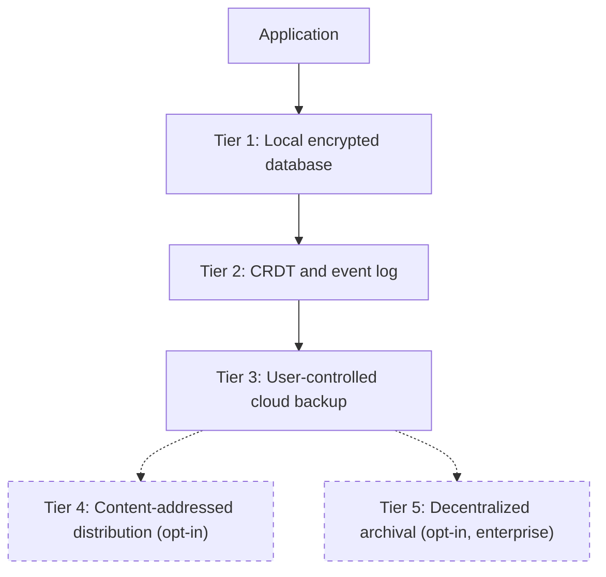
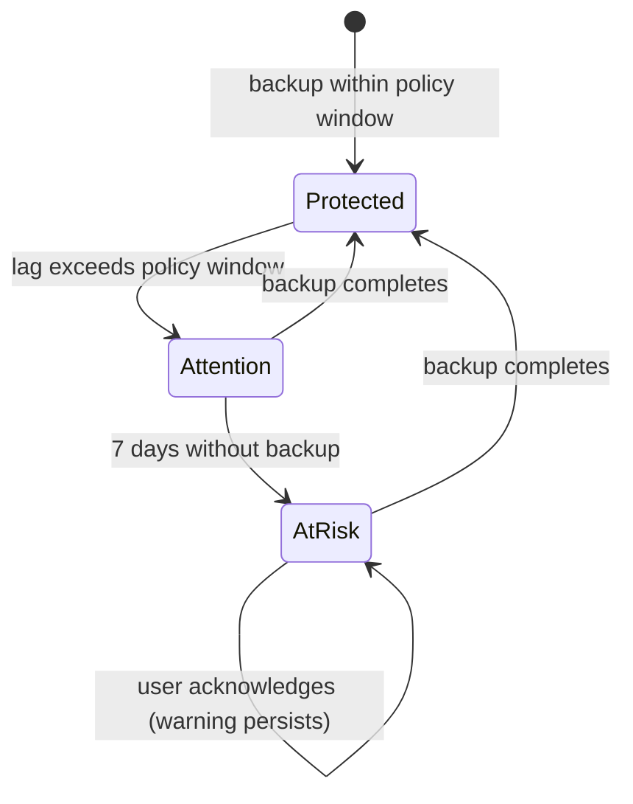
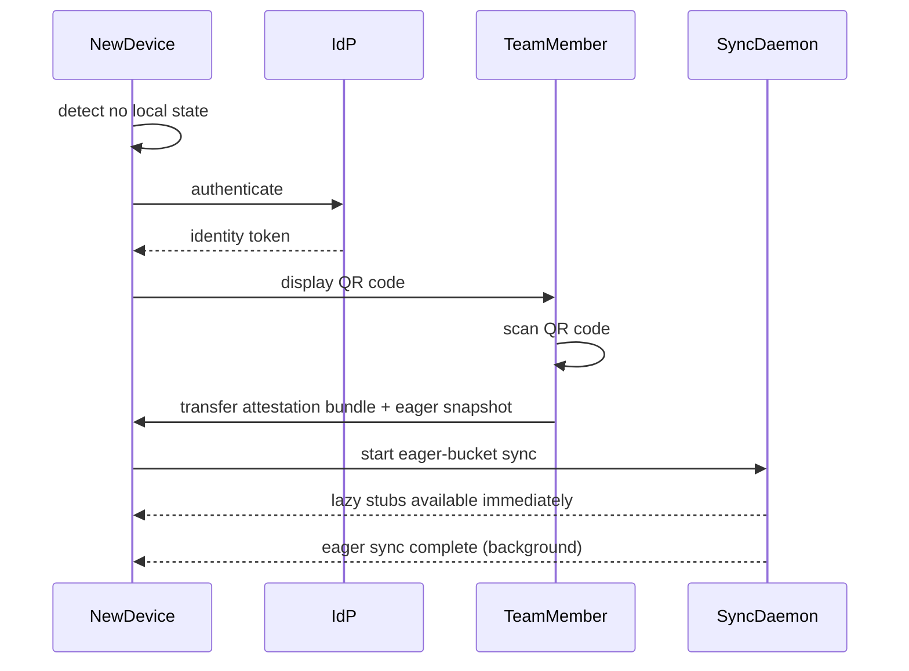

# Chapter 16 — Persistence Beyond the Node

<!-- icm/prose-review -->

<!-- Target: ~3,500 words -->
<!-- Source: v13 §2.4, §8, §9, §10, v5 §3.5 -->

---

## The Problem Single-Node Storage Cannot Solve

A node that stores data only on its local device fails in three ways. Drives fail, phones are lost, laptops are stolen. Multi-gigabyte local databases are reasonable for primary work data, not for every archive, every team member's history, every binary asset ever uploaded. Users move to new devices without expecting to lose their work. Local-first architecture does not mean data lives only on one machine. It means the node is the authority over the data it holds; the architecture must then specify how that data survives beyond it.

---

## Five-Layer Storage Architecture

The architecture composes five specialized storage tiers rather than relying on a single database system.

**Tier 1 — Local encrypted database.** The primary operational store. All reads and all writes hit this layer first.

**Tier 2 — CRDT and event log.** An append-only log of all CRDT operations and domain events. The event log is the source of truth for sync and for audit. The local database is derived from it; the log survives the database.

**Tier 3 — User-controlled cloud backup.** A configurable object storage adapter provides disaster recovery. The user controls the backup destination. The system does not assume any particular cloud provider.

**Tier 4 — Content-addressed distribution (opt-in).** Integrity-verified asset distribution and deduplication. Enabled when nodes need to share large binary assets with verified integrity without duplicating storage.

**Tier 5 — Decentralized archival (opt-in, enterprise tier).** Cryptographic proof-of-storage for regulated industries that require verifiable long-term retention. Not required by the core system.

Tiers 4 and 5 are opt-in. The core system is fully operational on tiers 1–3 alone. An implementation that skips tiers 4 and 5 is not a degraded implementation; it is the standard configuration for most deployments.



---

## Declarative Sync Buckets

Full replication to every node breaks at scale in two ways: as a storage problem and as a security problem. Multi-gigabyte local databases are impractical for devices with constrained storage. Nodes holding data they are not authorized to use — protected only by application-layer access control — create a security boundary that is one application bug wide.

The architecture solves both problems with declarative sync buckets. A bucket is a named, declaratively specified subset of the team dataset. Bucket membership is tied to role attestations, not to application-layer decisions made after data arrives at the node. Non-eligible nodes never receive bucket events because the sync daemon excludes them at capability negotiation, not because the application filters them afterward.

Buckets are declared in YAML:

```yaml
buckets:
  - name: team_core
    record_types: [projects, tasks, members, comments]
    filter: record.team_id = peer.team_id
    replication: eager
    required_attestation: team_member

  - name: financial_records
    record_types: [invoices, payments, budgets]
    filter: record.team_id = peer.team_id
    replication: eager
    required_attestation: financial_role

  - name: archived_projects
    record_types: [projects, tasks]
    filter: project.archived = true
    replication: lazy
    required_attestation: team_member
    max_local_age_days: 90
```

Each bucket specifies:

- **name** — unique identifier used in sync daemon routing and in backup manifests.
- **record_types** — the document types included in the bucket.
- **filter** — a predicate evaluated per record against peer attributes. Only records that satisfy the filter are replicated to a given peer.
- **replication** — `eager` or `lazy`. Eager buckets sync immediately on connect. Lazy buckets use demand-driven fetch.
- **required_attestation** — the role attestation a peer must present to receive bucket events. Attestation is verified cryptographically by the sync daemon before any data flows.
- **max_local_age_days** — for lazy buckets, the maximum age of locally cached records before eviction. Records older than this threshold are evicted; their stubs are retained.

Bucket eligibility is evaluated at capability negotiation — the initial handshake described in Chapter 14. The sync daemon constructs the minimal subscription set from the peer's verified attestations. A peer with only `team_member` receives `team_core` and `archived_projects`. A peer with `financial_role` receives all three. A peer with neither attestation receives nothing.

Data minimization operates at this layer. Each document schema defines a subscription scope — the minimal set of fields required for each role. The daemon enforces these scopes when responding to subscriptions. Unauthorized data never reaches a node that is not authorized to hold it, because the sync daemon never sends it.

---

## Lazy Fetch and Storage Budgets

Eager replication serves active working data. Lazy replication serves archives, large binary assets, and records with infrequent access.

A lazy-replicated record is represented locally as a stub. The stub contains:

- The record's identifier
- Metadata required for display and navigation (title, type, author, last-modified timestamp)
- A content hash

The stub enables the application to render navigation, search indexes, and list views without fetching full content. When the user opens a record, the application detects the stub, fetches full content from a peer or from the backup tier, verifies the content hash, and writes the full record to the local database.

Nodes enforce a configurable local storage budget. The default is 10 GB. When the node approaches the budget ceiling, the sync daemon evicts least-recently-used records from lazy buckets. Eviction converts a full record back to a stub — the identifier, metadata, and content hash are retained, and the content is released. The record is not deleted; it remains accessible on demand.

```mermaid
sequenceDiagram
    participant App
    participant LocalDB
    participant SyncDaemon
    participant Peer

    App->>LocalDB: read(record_id)
    LocalDB-->>App: stub (no content)
    App->>SyncDaemon: fetch_content(record_id)
    SyncDaemon->>Peer: request content
    Peer-->>SyncDaemon: content + hash
    SyncDaemon->>SyncDaemon: verify content hash
    SyncDaemon->>LocalDB: write full record
    SyncDaemon-->>App: content ready
    App->>LocalDB: read(record_id)
    LocalDB-->>App: full record
```



Content hash verification on re-fetch is mandatory. A fetched record whose hash does not match the stub's stored hash is rejected and re-requested from an alternate peer. This protects against both corruption and deliberate tampering by a compromised peer.

The storage budget, eviction policy, and minimum stub retention period are configurable via `Sunfish.Kernel.Buckets`. The defaults suit most deployments; teams with specialized storage constraints adjust them at the workspace level.

---

## Snapshot Format and Rehydration

Reading an aggregate's state from the raw event log becomes expensive as the log grows. Snapshots exist to bound that cost. A snapshot captures the current state of an aggregate at a point in time, indexed to the last event it incorporates.

**Snapshot structure:**

```json
{
  "aggregate_id":     "string",
  "epoch_id":         "string",
  "schema_version":   "string",
  "last_event_seq":   12847,
  "snapshot_payload": "<bytes: serialized state>",
  "created_at":       "2026-04-23T14:32:00Z"
}
```

Snapshots are stored separately from the event log. They can be deleted and regenerated at any point without affecting correctness — the event log is the source of truth; the snapshot is a performance optimization.

**Rehydration follows four steps:**

1. Load the most recent snapshot for the aggregate.
2. Verify that the snapshot matches the current epoch and schema version. Discard it if it does not match.
3. Replay events from the log after `last_event_seq`.
4. Apply any pending upcasters to events from older schema versions.

When no valid snapshot exists — on a fresh install, after a breaking schema migration, or after explicit snapshot deletion — rehydration replays from the beginning of the log. This is correct and complete; it is simply slower. The system writes a new snapshot after rehydration to avoid repeating the replay on the next load.

**Interaction with schema migrations.** Snapshots are epoch-scoped and schema-scoped. After a breaking migration, old snapshots are discarded. The system rehydrates from the most recent pre-migration snapshot that still falls within the log, applies schema lenses to bring events forward to the new schema shape, and writes a new snapshot tagged with the current epoch and schema version. The migration runbook in Chapter 13 specifies the sequencing required to keep this process safe under concurrent writes.

**Snapshot scheduling policy.** The system writes a new snapshot after three triggers: rehydration completes (to amortize future replay cost), the event log crosses a configurable operation-count threshold (default: 5,000 operations since the last snapshot), and explicit snapshot creation is requested via `Sunfish.Kernel.Buckets` at application shutdown. The operation-count threshold is the primary driver in practice. An aggregate that accumulates operations quickly generates snapshots frequently; a rarely-modified aggregate may hold a single snapshot for months. The threshold is per document type, not per deployment. Teams with high-frequency write patterns reduce the threshold; teams prioritizing storage efficiency raise it. The cost of an incorrect threshold is measured in rehydration latency, not correctness — the event log remains intact regardless of snapshot frequency.

---

## CRDT Growth and Garbage Collection

CRDT documents grow monotonically under naive storage. Every insert, every delete, and every concurrent edit leaves a trace in the internal structure — tombstones, historical vector clock entries, and retired operation identifiers accumulate without bound. The architecture names the problem and specifies three mitigation strategies.

**Strategy 1 — Library-level compaction.** Modern CRDT libraries perform internal garbage collection and use compact binary encodings that amortize historical state. Library selection treats compaction behavior as a first-class evaluation criterion alongside merge semantics and conflict resolution. `Sunfish.Kernel.Crdt` provides YDotNet as the current CRDT engine via `ICrdtEngine`, with Loro as the target for a future engine-agnostic transition. Both libraries expose compaction controls; the architecture leaves compaction scheduling to the engine.

**Strategy 2 — Application-level document sharding.** Large logical documents are split into sub-documents keyed under a parent map. When a section is archived or retired, its key is deleted from the parent map. The CRDT engine garbage-collects the sub-document without touching the rest of the document. This strategy applies to large structured documents — boards, wikis, large project hierarchies — where sections have well-defined lifecycles.

**Strategy 3 — Periodic shallow snapshots.** For document types with extreme write rates — programmatically generated logs, real-time sensor feeds, high-churn audit trails — the system periodically creates a shallow snapshot and discards old operation history. A shallow snapshot captures the current document state without the history required to merge with older versions. This strategy is reserved for document types where bounded storage takes priority over long-term mergeability. It is not a default.

The default policy is conservative: full history is retained, relying on library-level compaction. Application-level purging and shallow snapshots are opt-in per document type, configured in the document schema. Teams that enable them for a document type accept that nodes holding history older than the shallow snapshot cannot merge with nodes that have discarded that history — the tradeoff is explicit and schema-bound.

---

## Backup UX: Three-State Model

The backup system exposes three states to the user. Internal replication factors, CRDT vector clocks, and sync daemon health checks are not visible. The user sees a status, and the status demands a specific action or confirms that none is needed.

**Protected.** All nodes have synchronized within the configured backup policy window. The policy window is operator-defined per deployment. A green indicator confirms protection. No action is required.

**Attention.** Backup lag has exceeded the policy window on one or more nodes, but no data has been lost. The UI surfaces one actionable prompt: "Back up now." The prompt is dismissible once acknowledged.

**At Risk.** No successful backup has completed within the escalation threshold — a configurable multiple of the policy window. The UI displays a persistent warning — not a dismissible notification, not a banner that fades. The user must explicitly acknowledge the risk before the warning clears. Acknowledging records awareness; it does not resolve the risk. The warning returns each session until backup completes.



This model is intentionally non-technical. "Your data is protected" requires no understanding of sync daemons or replication factors. "You are at risk" requires only the user's attention. The three states map directly to the three things a user can do: nothing, back up now, or acknowledge an emergency.

The backup status is surfaced in `Sunfish.Foundation` as a typed state that the host application renders. The package provides the state machine; the application provides the UI. No backup UI is prescribed — the state model is the contract, not the presentation.

**BYOC backup destination.** The Tier 3 backup adapter is not bound to a specific cloud provider. The architecture specifies a generic object storage interface; operator deployments configure the destination. The backup object contains a full encrypted snapshot of the node's CRDT event log and the current snapshot tier — not a database file, not a ZIP archive, but the serialized event log the system already maintains as Tier 2. The encryption key for the backup is derived from the same DEK/KEK hierarchy that protects the local database. A backup stored in an untrusted object store is still encrypted under the user's key material. The storage provider cannot read it. If the user loses their key, they lose access to the backup — the same tradeoff that governs the local store. The adapter configuration accepts any object storage endpoint that speaks the S3 API, including self-hosted MinIO, Azure Blob via compatibility adapter, and Google Cloud Storage. Teams that cannot use any external storage configure the adapter to write to a network share or a locally mounted drive.

---

## Non-Technical Disaster Recovery

When a user loses their device, the architecture makes two guarantees: no data is lost if backups are current, and recovery requires no manual file management.

The recovery sequence on a new device:

1. The application detects no local CRDT state on first launch.
2. The user authenticates against the identity provider.
3. An existing team member opens the application on their own device and scans the new device's QR code. The QR code encodes a one-time key exchange for the role attestation bundle. The existing member's device transfers the attestation bundle and an initial CRDT snapshot of all eager-bucket records the new device is authorized to hold.
4. The sync daemon completes eager-bucket synchronization in the background. For most team workspaces, this completes within minutes.
5. Lazy-bucket stubs are present immediately after step 3. The user sees navigation and list views for all lazy records. Full content fetches on first access.

The user is in working state before background sync completes. The application continues to function normally during sync; the sync daemon's progress is visible in a status indicator, not in the application's primary navigation.



The QR-code attestation transfer is a cryptographic key exchange, not a file copy. The attestation bundle is signed by the team's identity authority. The new device cannot forge it, and the team member's device cannot transfer attestations it does not hold. The scope of what transfers is bounded by the existing member's own attestation set.

Recovery from backup — when no team member is available to perform the QR exchange — follows a different path: the user authenticates against the IdP, the system retrieves the most recent backup snapshot from the user-controlled object storage, and applies it to the local database. The sync daemon then re-synchronizes with peers to incorporate any changes that occurred after the backup. This path is slower than the peer-assisted path but requires no human coordination beyond the user's own credentials.

Both recovery paths produce the same end state: a node with full local authority over its data, synchronized with peers, and operating without dependency on any central server's availability. The recovery mechanism does not introduce a central point of failure that did not exist before the device was lost.

---

## Plain-File Export

All user data must be exportable as standard formats without running the application. This requirement is architectural, not aspirational. Export is a first-class feature, not an afterthought added to a compliance checkbox.

The export formats:

- **Relational data** — SQLite database file, readable with any SQLite client without application software.
- **Documents and text** — JSON with human-readable field names. No internal identifiers without corresponding human-readable labels.
- **Tabular data** — CSV for spreadsheet-compatible export. Column headers match the field names used in the JSON export.
- **Binary assets** — Original format, no transcoding. A file uploaded as PNG exports as PNG.

Export runs as a background task initiated from the application and produces a self-contained directory. The directory contains a `README.txt` that explains its structure in plain language — file names, what each format contains, and how to open each type without any specialized software. The README assumes the reader has no prior knowledge of the application's internal structure.

Export requirements:

- No network connectivity required. Export reads only from the local database and the local CRDT log.
- No telemetry. The export process produces no network requests.
- Deterministic. The same local state produces the same export directory structure and the same file contents. Timestamps in export filenames use UTC ISO 8601.
- Complete. Every record the local node holds is included. Export does not omit records based on their lazy-or-eager status — a full record in the local database is always exported; a stub is exported as its metadata, with the content hash recorded and the content field absent.

Stubs in the export represent data the local node does not hold. The README documents this explicitly: a stub export entry includes the record identifier, the metadata, and the content hash, with a note that full content is available from the application's backup or from team peers.

```
export-2026-04-23/
├── README.txt
├── data.sqlite
├── documents/
│   ├── project-alpha-brief.json
│   └── q1-planning-notes.json
├── tables/
│   ├── tasks.csv
│   └── invoices.csv
└── assets/
    ├── logo-v3.png
    └── architecture-diagram.pdf
```

The export directory is the user's data in a form that outlasts the application. If the application ceases to exist, the data remains in formats that any competent developer can parse. That distinguishes local-first from vendor-managed storage: the user's data belongs to them in a form they can actually use.

`Sunfish.Foundation` exposes the export pipeline as a background task. The host application provides a destination path and receives progress events; the package handles serialization, format selection, and README generation. The export format specification is versioned separately from the application — a document exported today must be parseable by any future export reader that supports the same format version.

The format version is recorded in the `README.txt` and in a machine-readable `manifest.json` at the root of the export directory. The manifest records the format version, the export timestamp, the node identifier, the list of included document types, and the count of stubs versus full records. A future import or recovery tool reads the manifest first to determine compatibility before touching the data files. This versioning contract makes the export durable across application updates — a reader built years from now can inspect the manifest version and apply the appropriate parsing logic without guessing at the structure.

Regulated industries treat the plain-file export as a retention artifact, not just a convenience. HIPAA requires patient record retention periods measured in years. GDPR Article 17 requires erasure on request — but only after the retention period expires. The export format must survive both obligations: it must be readable long after the application that produced it is gone, and the content hash in every exported stub must remain verifiable so that a regulator can confirm that no content was silently omitted. The hash is in the export; the format version is in the manifest; the manifest is in the directory. No application-specific tooling is required to verify any of it.

---

## Summary

<!-- PROSE REVIEW FLAG: Summary paragraph is 9 sentences that restate each section in sequence. Recommend cutting to the governing constraint + the user-facing consequence, e.g.: -->
Persistence beyond the node is a composition of decisions, not a single mechanism. Each layer resolves a distinct failure mode; together they ensure the user's data survives the device, the application, and the operator.

The governing constraint across all five layers is the same: the user's data must remain in the user's control and in a form the user can verify. Bucket access control enforces minimization at the protocol layer, not the application layer. Backup destinations are user-controlled and provider-agnostic. Snapshots are performance optimizations over an event log the user can read. Export produces formats that require no vendor cooperation to open. The three-state backup UX surfaces risk honestly rather than hiding it behind a perpetually green indicator. None of these properties are incidental. Each is a design decision made in favor of the person who owns the data.

---

*Chapter 17 applies these storage and sync primitives to the build sequence for a first local-first node.*
