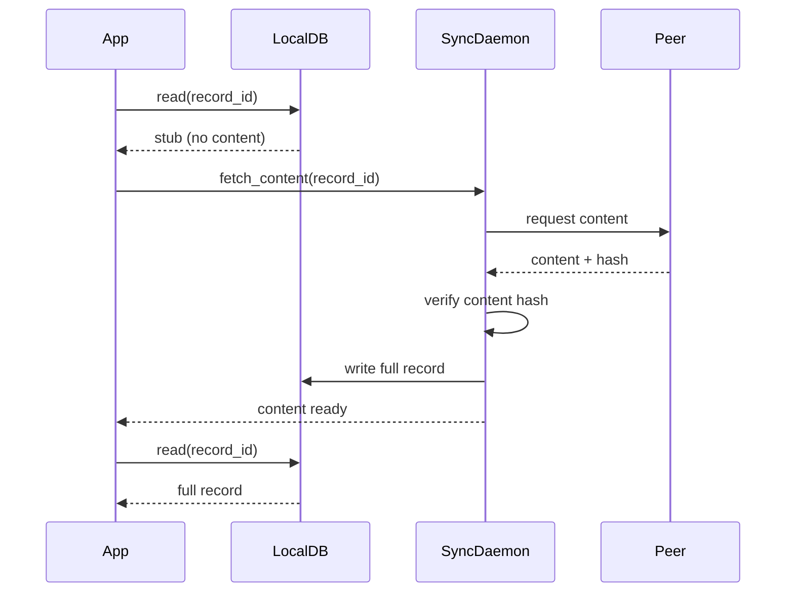
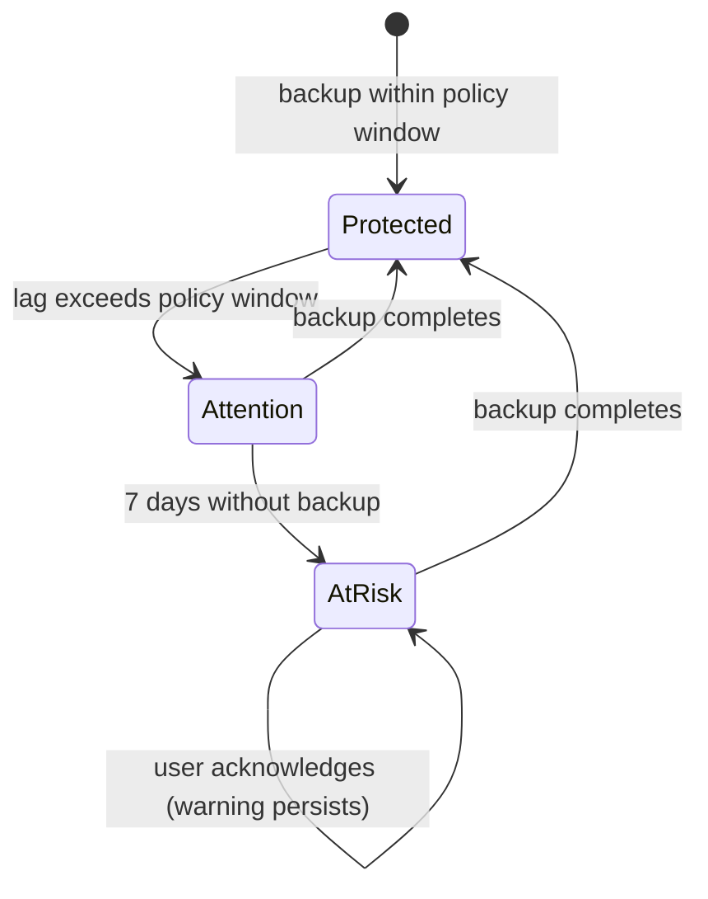
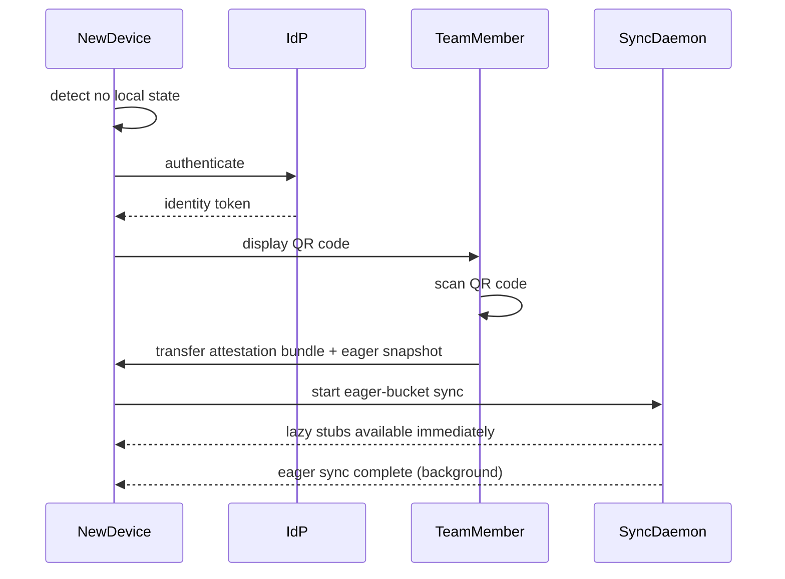

# Chapter 16 — Persistence Beyond the Node

<!-- icm/prose-review -->

<!-- Target: ~3,500 words -->
<!-- Source: v13 §2.4, §8, §9, §10, v5 §3.5 -->

---

## The Problem Single-Node Storage Cannot Solve

A node that stores data only on its local device fails in three ways. Drives fail. Phones are lost. Laptops are stolen. Multi-gigabyte local databases work for primary work data — not for every archive, every team member's history, every binary asset ever uploaded. Users move to new devices and expect their work to follow them.

Local-first architecture does not mean data lives only on one machine. It means the node is the authority over the data it holds. The architecture must then specify how that data survives beyond it.

---

## Five-Layer Storage Architecture

Persistence in the local-first architecture composes five tiers, specified in Chapter 12 §The Five-Layer Storage Architecture. This chapter focuses on what each tier owns operationally — bucket subscription, lazy fetch, snapshot rehydration, backup UX, relay metadata posture, and disaster recovery — assuming the reader has the five-tier model from Ch12. Tiers 4 and 5 are opt-in; the core system is fully operational on tiers 1–3 alone.

---

## Declarative Sync Buckets

Full replication to every node breaks at scale in two ways. As a storage problem, multi-gigabyte local databases overwhelm devices with constrained storage. As a security problem, nodes hold data they are not authorized to use, protected only by application-layer access control — a security boundary one application bug wide.

The architecture solves both problems with declarative sync buckets. A bucket is a named, declaratively specified subset of the team dataset. Bucket membership is tied to role attestations, not to application-layer decisions made after data arrives at the node. Non-eligible nodes never receive bucket events because the sync daemon excludes them at capability negotiation — not because the application filters them afterward.

Buckets are declared in YAML:

```yaml
buckets:
  - name: team_core
    record_types: [projects, tasks, members, comments]
    filter: record.team_id = peer.team_id
    replication: eager
    required_attestation: team_member

  - name: financial_records
    record_types: [invoices, payments, budgets]
    filter: record.team_id = peer.team_id
    replication: eager
    required_attestation: financial_role

  - name: archived_projects
    record_types: [projects, tasks]
    filter: project.archived = true
    replication: lazy
    required_attestation: team_member
    max_local_age_days: 90
```

Each bucket specifies:

- **name** — unique identifier used in sync daemon routing and in backup manifests.
- **record_types** — the document types included in the bucket.
- **filter** — a predicate evaluated per record against peer attributes. Only records that satisfy the filter are replicated to a given peer.
- **replication** — `eager` or `lazy`. Eager buckets sync immediately on connect. Lazy buckets use demand-driven fetch.
- **required_attestation** — the role attestation a peer must present to receive bucket events. Attestation is verified cryptographically by the sync daemon before any data flows.
- **max_local_age_days** — for lazy buckets, the maximum age of locally cached records before eviction. Records older than this threshold are evicted; their stubs are retained.

Bucket eligibility is evaluated at capability negotiation — the initial handshake described in Chapter 14. The sync daemon constructs the minimal subscription set from the peer's verified attestations. A peer with only `team_member` receives `team_core` and `archived_projects`. A peer with `financial_role` receives all three. A peer with neither attestation receives nothing.

Data minimization operates at this layer. Each document schema defines a subscription scope — the minimal set of fields required for each role. The daemon enforces these scopes when responding to subscriptions. Unauthorized data never reaches a node that is not authorized to hold it, because the sync daemon never sends it.

---

## Lazy Fetch and Storage Budgets

Eager replication serves active working data. Lazy replication serves archives, large binary assets, and records with infrequent access.

A lazy-replicated record is represented locally as a stub. The stub contains:

- The record's identifier
- Metadata required for display and navigation (title, type, author, last-modified timestamp)
- A content hash

The stub enables the application to render navigation, search indexes, and list views without fetching full content. When the user opens a record, the application detects the stub, fetches full content from a peer or from the backup tier, verifies the content hash, and writes the full record to the local database.

Nodes enforce a configurable local storage budget. The default is 10 GB. When the node approaches the budget ceiling, the sync daemon evicts least-recently-used records from lazy buckets. Eviction converts a full record back to a stub — the identifier, metadata, and content hash are retained, and the content is released. The record is not deleted. It remains accessible on demand.



Content hash verification on re-fetch is mandatory. A fetched record whose hash does not match the stub's stored hash is rejected and re-requested from an alternate peer. This protects against both corruption and deliberate tampering by a compromised peer.

The storage budget, eviction policy, and minimum stub retention period are configurable via `Sunfish.Kernel.Buckets`. The defaults suit most deployments; teams with specialized storage constraints adjust them at the workspace level.

---

## Per-Data-Class Device-Distribution

<!-- code-check: namespaces referenced — Sunfish.Kernel.Buckets (in canon, Ch16:128, extended for class-subscription manifest), Sunfish.Kernel.Sync (in canon, Ch14, extended for class-aware push filter), Sunfish.Kernel.Audit (in canon per cerebrum 2026-04-28, packages/kernel-audit/), Sunfish.Foundation.Fleet (forward-looking, Volume 1 extension roadmap from #11; not yet present in Sunfish reference implementation per Ch21:8). No new top-level namespace. Default to direct extension of Sunfish.Kernel.Buckets for the manifest; consider sub-namespace Sunfish.Kernel.Buckets.Subscription only if the manifest's surface area pulls in unrelated dependencies — confirm at code-check stage. APIs illustrative pending v1.0. -->

Device fleets in production are heterogeneous by design. A restaurant's floor tablet — handled by servers — holds customer orders and table assignments. The same restaurant's back-office laptop — held by the owner — holds payroll and vendor invoices. Uniform replication fails this fleet two ways at once: the floor tablet holds payroll records a server has no operational need for, and a constrained Android tablet's storage budget is consumed by classes it will never display.

The first failure is a security-surface problem. Application access controls prevent a server from executing a payroll lookup, but once payroll records sit in the local encrypted database the risk surface shifts to a decryption-key exposure, a debugger attach, or a future application bug. A record that is not on a device cannot be leaked from that device. The second failure is a storage-budget problem. The bucket model in §Declarative Sync Buckets already filters at bucket granularity, asking what attestations the user holds. Per-data-class device-distribution adds an orthogonal axis: not what the user is authorized to see, but what classes this physical device's operational role requires it to hold at all. The distinction matters in MDM (Mobile Device Management)-managed fleets where IT policy sets device class independently of the user's role.

### The class-subscription manifest

Each device carries a signed manifest declaring the data classes it accepts. The manifest is not an attestation. Role attestations are user-bound claims issued by the identity authority that authorize access to specific buckets; the class-subscription manifest is device-bound policy, set by the MDM operator or by the user in consumer deployments, declaring which classes the device's operational role requires. A device can hold a `financial_role` attestation and still exclude detailed customer-record classes through its manifest — the manifest restricts the attestation-granted set, never expands it.

The manifest is a signed CBOR (Concise Binary Object Representation) document under the device's own Ed25519 keypair, making it tamper-evident and attributable. It carries the device identifier, the issuer (an MDM authority key, or a self-signed user key in consumer deployments), the list of accepted data-class identifiers, an issued-at timestamp, an expiry, and the signature. The manifest travels with the device identity during the five-step handshake (Ch14 §Five-Step Handshake), where the sending peer reads it before constructing any outbound delta.

A data class is a higher-level abstraction over buckets. Each bucket entry in the YAML carries an optional `data_class` label; a class resolves to the union of bucket entries sharing that label. The manifest operates at the class level; `Sunfish.Kernel.Buckets` resolves class to bucket membership internally. Every manifest change produces a new signed version retained in the audit log for compliance reconstruction. PowerSync's bucket-definition model [5] influenced this shape with one inversion: PowerSync evaluates rules server-side per client parameter; the architecture evaluates the manifest client-side as device-declared policy and applies it on the sending peer.

### Sync-daemon push filter

`Sunfish.Kernel.Sync` on the sending node applies the receiver's manifest as a push filter before constructing outbound deltas. The filter sits at the same tier as the stream-level scope in Ch14 §Data Minimization at the Stream Level — after attestation verification, before delta construction. The two compose: the attestation filter removes streams the receiver lacks role authorization for; the class-subscription filter removes record-class operations within otherwise-authorized streams.

The send tier drops records of an excluded class silently. The receiving daemon never sees the operation. The filter emits no error, mirroring the existing field-level out-of-scope behavior. The filter operates on the data-class label attached at write time; classes are declared in the document schema and assigned at record creation. Reclassification at runtime is the domain of event-triggered escalation (Ch23 §Event-Triggered Re-classification) and composes with this filter through the eviction protocol below. Filter evaluation is O(1) per operation — a hash-set membership check against the receiver's accepted classes. ElectricSQL's shape filtering [4] is the closest production analogue at the WAN-sync level; the architecture differs in operating on schema-declared class labels rather than SQL `WHERE` predicates.

### Cross-class references: the policy-blocked placeholder

A record in class A that holds a reference to a record in class B presents a problem on a device subscribed to class A but not class B: the A-record arrives with a reference the device cannot resolve locally. Three responses are possible — refuse delivery of the A-record, deliver it with a reference that silently returns null, or deliver it with an explicit placeholder.

The architecture chooses the third. The placeholder follows the stub model from §Lazy Fetch and Storage Budgets, with one critical difference. **A lazy-evicted stub is fetchable on demand. A class-excluded placeholder is not.** The device's manifest excludes the referenced class, and the sync daemon will not retrieve it regardless of demand.

This is where consumer-software analogues mislead. OneDrive Files On-Demand [2] presents a placeholder identical to a downloaded file in Explorer; the file fetches transparently on first access. iCloud's Optimize Mac Storage [3] removes local content and re-materialises it on access. In both, the stub indicates deferred latency, not policy denial. Dropbox Selective Sync [1] comes closer — an excluded folder simply does not appear locally — but creates an untyped void rather than a typed placeholder, leaving applications with broken paths and no semantic signal.

The class-excluded placeholder differs in kind. Its structure carries the referenced record's identifier, its class label, an exclusion reason of `class_not_subscribed`, and no content. The application renders it as a restricted-reference indicator — not a missing-data error, not a broken link, but a policy-gated boundary the user can see and reason about. A task referencing a payroll record (class: financial) on a device excluding financial records does not render as "no data found." It renders as "restricted — not available on this device."

The UI layer enforces the rendering contract because the architecture cannot detect every misuse of a placeholder. The architecture guarantees that unresolvable cross-class references are detectable and labeled, not silent. A device holding class A verifies every class-A-internal reference; references to excluded classes carry explicit marks.

### MDM-driven manifest update and propagation

The class-subscription manifest changes by signed update. An IT administrator pushes a new manifest version through the OTA (Over-the-Air) update channel, signed under the MDM authority key. The receiving device's sync daemon loads the new manifest at the next capability negotiation cycle. The manifest version increments. The audit log records the change. Subscription change is a revocation-shaped event; cross-reference Ch23 §Collaborator Revocation for the analogous primitive at the user-attestation layer.

When a manifest tightens, the sync daemon evicts every record of the removed class from the local database. Eviction follows the stub-conversion mechanism from §Lazy Fetch and Storage Budgets: the daemon retains identifiers and metadata as class-excluded placeholders and purges content. The daemon logs the eviction to `Sunfish.Kernel.Audit` against the manifest version that triggered it. Composition with event-triggered class escalation (Ch23 §Event-Triggered Re-classification) reuses this path: when escalation moves a record into a class the device's manifest excludes, the daemon receives the class-change record, evaluates it against the current manifest, and schedules eviction. The two extensions compose at the manifest interface — escalation produces the class-change event; the manifest filter reacts to it.

When a manifest expands, backfill proceeds according to the bucket entry's replication mode. Eager buckets backfill on the next sync cycle. Lazy buckets produce stubs immediately and full content on demand. Expansion does not blanket-fetch every newly-accepted record. Cross-reference Ch21 §21.1 Why fleet management is a distinct discipline (and the §11a–§11d sub-patterns that follow) for the administrative workflow that governs manifest update authorization, approval, and rollout.

### Audit and observability

An administrator who cannot verify what a device actually holds cannot reason about the fleet's data-exposure surface. Each device maintains a signed class-inventory record listing the classes it currently holds, the count of full records and placeholders per class, and the manifest version under which each class was acquired or evicted. The inventory updates on every sync session and on every manifest change.

`Sunfish.Foundation.Fleet` aggregates per-device inventories into a fleet-level view. An administrator queries, per device, the subscribed classes, the actual held counts, the last manifest version, and the last sync timestamp. When a device's actual held classes diverge from its current manifest — the window that opens during an offline manifest update before eviction completes — the fleet dashboard flags the discrepancy; the device resolves it at the next sync cycle. Every manifest change, every eviction, and every class backfill produces a signed, attributable, append-only entry in `Sunfish.Kernel.Audit`, reusing the substrate Ch23 specifies for collaborator revocation and Ch22 specifies for key-loss recovery. Bayou's subscription model [6] is the academic precedent — device-level partial replication with explicit subscription declarations dates to 1995. The architecture's contribution is the policy-blocked placeholder semantics and the MDM-signed manifest as a first-class fleet artifact.

### Failure modes

**Manifest conflated with attestation.** The manifest is device-bound operator policy. Attestation is user-bound identity claim. Conflating them collapses the security model — a user with `financial_role` attestation on a device whose MDM manifest excludes financial classes must not receive financial records. The manifest restricts; attestation does not override.

**Placeholder treated as error state.** A class-excluded placeholder is a visible policy boundary, not a missing record, not a sync failure, not a data-integrity defect. Applications that render it as "data not found" mislead users about whether the data exists or simply is unreachable from this device.

**Manifest expansion treated as eager backfill.** The bucket's replication mode governs backfill rate. Eager backfills on the next sync cycle; lazy produces stubs and fetches on demand. Treating every expansion as eager saturates network and storage budgets.

**Eviction-on-tightening skipped.** When a class is removed, every record of that class on the device must convert to a class-excluded placeholder. Skipping eviction leaves orphaned content on the device after the policy change — the security benefit the manifest exists to provide collapses.

**Forward-secrecy boundary at mid-stream subscription.** A device added to a class subscription mid-stream may not be able to decrypt historical operations encrypted under earlier session key material. Ch22 §Forward Secrecy and Post-Compromise Security specifies a per-message ratchet between session pairs (sub-pattern 46a-46b), not a per-class key chain — so the boundary the manifest expansion creates depends on whether the architecture chooses to derive class-scoped session keys from the per-message ratchet or to ship a one-time key bundle to newly-subscribing devices. The newly-subscribed device receives operations from the manifest's effective date forward in either case. <!-- CLAIM: source? — Ch22 §Forward Secrecy specifies per-message session-pair ratcheting, not per-class key chains; the mid-stream subscription onboarding behavior must be specified jointly with #46 (key-bundle delivery vs. forward-only boundary). Tech-review to resolve against the current #46 spec or escalate to a #46 follow-up. -->

**Kill trigger.** If technical review determines that the class-subscription manifest cannot coexist with the existing bucket YAML schema without a breaking change to the `required_attestation` field's role-driven semantics, escalate before continuing. The manifest's device-policy axis and the attestation's user-role axis must compose in a single bucket evaluation; if they cannot, the extension's scope changes and the present specification requires redesign.

---

## Snapshot Format and Rehydration

Reading an aggregate's state from the raw event log becomes expensive as the log grows. Snapshots exist to bound that cost. A snapshot captures the current state of an aggregate at a point in time, indexed to the last event it incorporates.

**Snapshot structure:**

```json
{
  "aggregate_id":     "string",
  "epoch_id":         "string",
  "schema_version":   "string",
  "last_event_seq":   12847,
  "snapshot_payload": "<bytes: serialized state>",
  "created_at":       "2026-04-23T14:32:00Z"
}
```

Snapshots are stored separately from the event log. They can be deleted and regenerated at any point without affecting correctness — the event log is the source of truth; the snapshot is a performance optimization.

**Rehydration follows four steps:**

1. Load the most recent snapshot for the aggregate.
2. Verify that the snapshot matches the current epoch and schema version. Discard it if it does not match.
3. Replay events from the log after `last_event_seq`.
4. Apply any pending upcasters to events from older schema versions.

When no valid snapshot exists — on a fresh install, after a breaking schema migration, or after explicit snapshot deletion — rehydration replays from the beginning of the log. This is correct and complete. It is simply slower. The system writes a new snapshot after rehydration to avoid repeating the replay on the next load.

**Interaction with schema migrations.** Snapshots are epoch-scoped and schema-scoped. After a breaking migration, old snapshots are discarded. The system rehydrates from the most recent pre-migration snapshot that still falls within the log, applies schema lenses to bring events forward to the new schema shape, and writes a new snapshot tagged with the current epoch and schema version. The migration runbook in Chapter 13 specifies the sequencing required to keep this process safe under concurrent writes.

**Snapshot scheduling policy.** The system writes a new snapshot after three triggers: rehydration completes (to amortize future replay cost); the event log crosses a configurable operation-count threshold (default 5,000 operations since the last snapshot); and explicit snapshot creation is requested via `Sunfish.Kernel.Buckets` at application shutdown. The operation-count threshold is the primary driver in practice. An aggregate that accumulates operations quickly generates snapshots frequently. A rarely-modified aggregate may hold a single snapshot for months. The threshold is per document type, not per deployment. Teams with high-frequency write patterns reduce the threshold; teams prioritizing storage efficiency raise it. The cost of an incorrect threshold is measured in rehydration latency, not correctness — the event log remains intact regardless of snapshot frequency.

---

## CRDT Growth and Garbage Collection

CRDT growth and the three-tier garbage collection policy are specified in Chapter 12 §CRDT Growth and Garbage Collection. The garbage collection tier assignment lives in the bucket's `IStreamDefinition`; Ch12 specifies the GC policy itself. Teams that enable application-level purging or shallow snapshots for a document type accept the tradeoff: nodes holding history older than the shallow snapshot cannot merge with nodes that have discarded that history. The tradeoff is explicit and schema-bound.

---

## Backup UX: Three-State Model

The backup system exposes three states to the user. Internal replication factors, CRDT vector clocks, and sync daemon health checks are not visible. The user sees a status, and the status demands a specific action or confirms that none is needed.

**Protected.** All nodes have synchronized within the configured backup policy window. The policy window is operator-defined per deployment. A green indicator confirms protection. No action is required.

**Attention.** Backup lag has exceeded the policy window on one or more nodes, but no data has been lost. The UI surfaces one actionable prompt: "Back up now." The prompt is dismissible once acknowledged.

**At Risk.** No successful backup has completed within the escalation threshold — a configurable multiple of the policy window. The UI displays a persistent warning. Not a dismissible notification. Not a banner that fades. The user must explicitly acknowledge the risk before the warning clears. Acknowledging records awareness; it does not resolve the risk. The warning returns each session until backup completes.



This model is intentionally non-technical. "Your data is protected" requires no understanding of sync daemons or replication factors. "You are at risk" requires only the user's attention. The three states map directly to the three things a user can do: nothing, back up now, or acknowledge an emergency.

The backup status is surfaced in `Sunfish.Foundation` as a typed state that the host application renders. The package provides the state machine; the application provides the UI. No backup UI is prescribed — the state model is the contract, not the presentation.

**BYOC (Bring Your Own Cloud) backup destination.** The Tier 3 backup adapter is not bound to a specific cloud provider. The architecture specifies a generic object storage interface; operator deployments configure the destination. The backup object contains a full encrypted snapshot of the node's CRDT event log and the current snapshot tier — not a database file, not a ZIP archive, but the serialized event log the system already maintains as Tier 2. The encryption key for the backup is derived by HKDF (HMAC-based Key Derivation Function)-SHA256 from the same DEK (Data Encryption Key)/KEK (Key Encryption Key) hierarchy specified in Chapter 15: the same root seed protects both the local database and its off-node backup. A backup stored in an untrusted object store is still encrypted under the user's key material. The storage provider cannot read it. If the user loses their key, they lose access to the backup — the same tradeoff that governs the local store. The adapter configuration accepts any endpoint that speaks the S3 API (Application Programming Interface): hyperscaler services (Azure Blob via compatibility adapter, Google Cloud Storage, AWS S3); EU-resident providers (Hetzner Object Storage, OVHcloud, Scaleway) for post-Schrems II compliance; GCC (Gulf Cooperation Council) and Indian sovereign cloud providers for UAE DPL (Data Protection Law), DIFC (Dubai International Financial Centre) DPL 2020, and RBI (Reserve Bank of India) obligations (see Appendix F); domestic providers in Japan (IDCFrontier, NTT Object Storage, Sakura), China (Aliyun OSS with PIPL (Personal Information Protection Law)-compliant configuration), and South Korea; domestically hosted endpoints for Russia's Federal Law 242-FZ and parallel CIS (Commonwealth of Independent States) data localization regimes; and on-premise object storage (self-hosted MinIO (self-hosted S3-compatible object storage), Ceph RGW, network shares) for air-gapped or import-substitution-mandated deployments. The BYOC model is the architectural answer to the 2022 SaaS (Software as a Service) terminations — when Adobe, Autodesk, Figma ([figma.com](https://www.figma.com/), the design tool), and dozens of other Western SaaS vendors suspended service across Russia and CIS markets under sanctions enforcement, organizations whose backup endpoints lived in vendor cloud infrastructure lost access to their own data. A backup endpoint the user controls survives that failure mode. The architecture makes it a structural property, not a configuration choice.

---

## Relay Architecture

The relay is the architecture's most structurally ambiguous component: an external service the node depends on for WAN peer reachability when direct peer-to-peer connectivity is not viable. Chapter 14 specified the sync protocol that peers use across the relay. This section specifies the relay itself.

**Ciphertext-only invariant.** The relay routes encrypted CRDT operation frames between authenticated peers. It does not hold decryption keys. It cannot read payload content. Every frame the relay forwards is encrypted end-to-end under keys that never leave originating devices — the relay sees peer identities (Ed25519 public keys), workspace identifiers, and frame envelopes, but no plaintext data. This is the guarantee Chapter 7's Okonkwo council established as inviolable and Chapter 15's security architecture specified cryptographically. A compromised relay exposes connection metadata — who communicates with whom, at what times, at what volume — not content.

**Managed relay deployment.** The managed relay is a horizontally-scaled service accepting WebSocket connections over TLS (Transport Layer Security) 1.3 on port 443. The service terminates TLS at an edge proxy, authenticates each connection against the Ed25519 public key presented in the handshake, and forwards CRDT operation frames to subscribing peers. Horizontal scaling is stateless at the forwarding layer: any relay node can route any frame. Per-peer connection affinity is handled by consistent hashing on node_id for subscription routing. The managed relay operates per jurisdiction; teams select the relay endpoint at onboarding to satisfy data-residency obligations (Appendix F maps jurisdictional endpoints to regulatory frameworks). Cross-jurisdiction deployments configure multiple endpoints with relay-to-relay interconnect over TLS 1.3, authenticated by operator-held relay keys.

**Self-hosted relay.** The relay is a single binary distributed as both a native executable and an OCI container image. Resource profile for a fifty-person team: 512 MiB RAM, 2 vCPU, 10 GiB disk for operational logs, no persistent state required beyond the subscription routing table. The self-hosted relay implements the same protocol as the managed relay; a node cannot distinguish them at the protocol level. Organizations operating under compelled-access threat models — CIS jurisdictions, regulated financial services, public sector — deploy the self-hosted relay on infrastructure they control, or on sovereign-cloud infrastructure within their jurisdiction, and point their nodes' `relayEndpoint` configuration at it. The protocol specification (Chapter 14) is published under the same license as the kernel; any organization can implement a compatible relay.

**Protocol openness.** The relay protocol is specified in Chapter 14 with sufficient precision for third-party implementation. There is no proprietary wire format. There is no vendor-specific handshake extension. A relay written from scratch by a third party that conforms to the protocol is indistinguishable to nodes from a first-party relay. This prevents vendor lock-in at the relay layer — the architecture's most SaaS-like component cannot become a vendor trap because any competent infrastructure team can replace it.

**Multi-tenant isolation for Bridge (the Zone C hybrid SaaS accelerator).** The Bridge accelerator deploys per-tenant hosted nodes alongside the shared relay. Each tenant's relay traffic is isolated at the subscription routing layer: node identity carries tenant scope, and the relay enforces that a frame destined for tenant A's nodes is never delivered to a node whose identity is scoped to tenant B. Cross-tenant data exchange — when it occurs by design — is an application-layer decision executed through explicit sharing primitives, not a default relay behavior. Chapter 18 specifies the Bridge tenant model in full.

**Compelled access.** The relay cannot produce decryptable content under legal compulsion because the relay does not possess decryptable content. A subpoena to the relay operator yields connection logs and message envelopes — never payload plaintext. This is the structural answer to the compelled-access threat model across CIS jurisdictions (242-FZ + import substitution), the EU (post-Schrems II transfer safeguards), the GCC (DIFC Data Protection Law 2020), China (PIPL + MLPS (Multi-Level Protection Scheme) 2.0), and every other regulatory regime where cloud-operator data access is a live procurement concern. Chapter 15 specifies the cryptographic mechanism; Chapter 16 specifies the operational configuration that activates it.

---

---

## Non-Technical Disaster Recovery

When a user loses their device, the architecture makes two guarantees: no data is lost if backups are current, and recovery requires no manual file management.

The recovery sequence on a new device:

1. The application detects no local CRDT state on first launch.
2. The user authenticates against the identity provider.
3. An existing team member opens the application on their own device and scans the new device's QR code. The QR code encodes a one-time key exchange for the role attestation bundle. The existing member's device transfers the attestation bundle and an initial CRDT snapshot of all eager-bucket records the new device is authorized to hold.
4. The sync daemon completes eager-bucket synchronization in the background. For most team workspaces, this completes within minutes.
5. Lazy-bucket stubs are present immediately after step 3. The user sees navigation and list views for all lazy records. Full content fetches on first access.

The user is in working state before background sync completes. The application continues to function normally during sync; the sync daemon's progress is visible in a status indicator, not in the application's primary navigation.



The QR-code attestation transfer is a cryptographic key exchange, not a file copy. The attestation bundle is signed by the team's identity authority. The new device cannot forge it, and the team member's device cannot transfer attestations it does not hold. The scope of what transfers is bounded by the existing member's own attestation set.

Recovery from backup — when no team member is available to perform the QR exchange — follows a different path. The user authenticates against the IdP (Identity Provider), the system retrieves the most recent backup snapshot from the user-controlled object storage, and applies it to the local database. The sync daemon then re-synchronizes with peers to incorporate any changes that occurred after the backup. This path is slower than the peer-assisted path but requires no human coordination beyond the user's own credentials.

Both recovery paths produce the same end state: a node with full local authority over its data, synchronized with peers, and operating without dependency on any central server's availability. The recovery mechanism does not introduce a central point of failure that did not exist before the device was lost.

**Offline recovery fallback.** For deployments where IdP availability at the moment of recovery cannot be assumed — Sub-Saharan African field operations during outage windows, rural Indian BFSI (Banking, Financial Services, and Insurance) field teams on VSAT links, GCC construction sites during load-shedding, LATAM (Latin America) rural secondary cities — a third recovery path operates without network connectivity. At onboarding, each node generates an optional offline recovery bundle: a one-time-use cryptographic blob containing a wrapped recovery key plus the minimum attestation the node needs to bootstrap its local database from a backup without contacting the IdP. The bundle is stored out-of-band by the user — printed QR code in a sealed envelope, secondary device, organizational escrow. Recovery from the offline bundle restores the node to a read-write local state; sync with peers resumes when connectivity returns, at which point the recovered node re-attests against the IdP and rotates to a fresh recovery bundle. The offline bundle expires on use or on a configurable wall-clock timeout (default 12 months) to bound the exposure window. This path is the architecture's honest answer to the recovery scenario the deployment contexts most demand it for: a user who has just lost their device at a remote site with no network access needs to resume work before they can return to a connected environment.

---

## Plain-File Export

All user data must be exportable as standard formats without running the application. This requirement is architectural, not aspirational. Export is a first-class feature, not an afterthought added to a compliance checkbox.

The export formats:

- **Relational data** — SQLite database file, readable with any SQLite client without application software.
- **Documents and text** — JSON with human-readable field names. No internal identifiers without corresponding human-readable labels.
- **Tabular data** — CSV for spreadsheet-compatible export. Column headers match the field names used in the JSON export.
- **Binary assets** — Original format, no transcoding. A file uploaded as PNG exports as PNG.

Export runs as a background task initiated from the application and produces a self-contained directory. The directory contains a `README.txt` that explains its structure in plain language — file names, what each format contains, and how to open each type without any specialized software. The README assumes the reader has no prior knowledge of the application's internal structure.

Export requirements:

- No network connectivity required. Export reads only from the local database and the local CRDT log.
- No telemetry. The export process produces no network requests.
- Deterministic. The same local state produces the same export directory structure and the same file contents. Timestamps in export filenames use UTC ISO 8601.
- Complete. Every record the local node holds is included. Export does not omit records based on their lazy-or-eager status — a full record in the local database is always exported; a stub is exported as its metadata, with the content hash recorded and the content field absent.

Stubs in the export represent data the local node does not hold. The README documents this explicitly: a stub export entry includes the record identifier, the metadata, and the content hash, with a note that full content is available from the application's backup or from team peers.

```
export-2026-04-23/
├── README.txt
├── data.sqlite
├── documents/
│   ├── project-alpha-brief.json
│   └── q1-planning-notes.json
├── tables/
│   ├── tasks.csv
│   └── invoices.csv
└── assets/
    ├── logo-v3.png
    └── architecture-diagram.pdf
```

The export directory is the user's data in a form that outlasts the application. If the application ceases to exist, the data remains in formats that any competent developer can parse. That distinguishes local-first from vendor-managed storage: the user's data belongs to them in a form they can actually use.

`Sunfish.Foundation` exposes the export pipeline as a background task. The host application provides a destination path and receives progress events; the package handles serialization, format selection, and README generation. The export format specification is versioned separately from the application — a document exported today must be parseable by any future export reader that supports the same format version.

The format version is recorded in the `README.txt` and in a machine-readable `manifest.json` at the root of the export directory. The manifest records the format version, the export timestamp, the node identifier, the list of included document types, and the count of stubs versus full records. A future import or recovery tool reads the manifest first to determine compatibility before touching the data files. This versioning contract makes the export durable across application updates — a reader built years from now can inspect the manifest version and apply the appropriate parsing logic without guessing at the structure.

Regulated industries treat the plain-file export as a retention artifact, not just a convenience. HIPAA (Health Insurance Portability and Accountability Act) requires patient record retention periods measured in years. GDPR (General Data Protection Regulation) Article 17 requires erasure on request — but only after the retention period expires. The export format must survive both obligations. It must be readable long after the application that produced it is gone. The content hash in every exported stub must remain verifiable so that a regulator can confirm that no content was silently omitted. The hash is in the export. The format version is in the manifest. The manifest is in the directory. No application-specific tooling is required to verify any of it.

The export pipeline emits four formats: JSON for structured records, CSV for tabular collections, SQLite for complete per-node database snapshots, and Markdown for long-form document content (notes, project descriptions, inline text content). Markdown's inclusion is deliberate — Chapter 9's Ferreira named it as non-negotiable precisely because it is the one format that is simultaneously human-readable, machine-parseable, and version-control friendly. A user who has not opened the application in five years can still read a Markdown file in any text editor. A developer can still parse it with any competent library. A version control system can still diff it without specialized tooling. The four formats together close Property 5 (the long now) and Property 7 (ultimate ownership and control) as structural properties rather than contractual promises.

---

## Layer 5 — Decentralized Archival (Phase 2)

Layer 5 was introduced in the five-layer architecture as an optional enterprise tier providing cryptographic proof-of-storage for regulated industries with long-term retention obligations. The operational mechanism — whether implemented via Filecoin's Proof of Replication and Proof of Spacetime, Arweave's Succinct Proofs of Random Access, or a Merkle-tree-based challenge-response against a known-responsive archival provider — is under active specification work and is not part of the 1.0 specification. Organizations with regulatory retention obligations satisfy them today through Layer 3's BYOC backup with long-term retention policies on user-controlled object storage. Layer 5's decentralized archival is a planned Phase 2 component for deployments where proof-of-storage auditability — rather than backup presence alone — is a compliance requirement. The five-layer diagram retains Tier 5 to signal the architectural extension point; the specification for that tier is deferred to v2.0 of this book.

---

## Summary

Persistence beyond the node is a composition of decisions, not a single mechanism. Each layer resolves a distinct failure mode. Together they ensure the user's data survives the device, the application, and the operator.

The governing constraint across all five layers is the same: the user's data must remain in the user's control and in a form the user can verify. Bucket access control enforces minimization at the protocol layer. Backup destinations are user-controlled and provider-agnostic, with named jurisdictional endpoints satisfying every major data sovereignty regime. The relay routes ciphertext only, is protocol-open and self-hostable, and cannot produce decryptable content under legal compulsion because it does not possess decryptable content. Snapshots are performance optimizations over an event log the user can read. Export produces four formats — JSON, CSV, SQLite, Markdown — that require no vendor cooperation to open, closing Property 5 (the long now) and Property 7 (ultimate ownership) as structural guarantees. The offline recovery bundle ensures that device loss at a site without connectivity is recoverable without IdP availability. The three-state backup UX surfaces risk honestly rather than hiding it behind a perpetually green indicator. None of these properties are incidental. Each is a design decision made in favor of the person who owns the data.

---

---

## References

[1] Dropbox, "Selective Sync overview," *Dropbox Help Center*, 2024. [Online]. Available: https://help.dropbox.com/sync/selective-sync-overview. [Accessed: Apr. 2026].

[2] Microsoft, "Save disk space with OneDrive Files On-Demand for Windows," *Microsoft Support*, 2024. [Online]. Available: https://support.microsoft.com/en-us/office/save-disk-space-with-onedrive-files-on-demand-for-windows-0e6860d3-d9f3-4971-b321-7092438fb38e. [Accessed: Apr. 2026].

[3] Apple Inc., "Optimise Mac storage in iCloud," *Apple Support*, 2024. [Online]. Available: https://support.apple.com/guide/mac-help/optimise-storage-space-mh35873/mac. [Accessed: Apr. 2026].

[4] ElectricSQL, "ElectricSQL v0.10 released — shape-based partial replication," *electric-sql.com Blog*, Apr. 10, 2024. [Online]. Available: https://electric-sql.com/blog/2024/04/10/electricsql-v0.10-released. [Accessed: Apr. 2026].

[5] PowerSync, "Sync Rules — Bucket Definitions," *PowerSync Documentation*, 2024. [Online]. Available: https://docs.powersync.com/usage/sync-rules. [Accessed: Apr. 2026].

[6] D. B. Terry, M. M. Theimer, K. Petersen, A. J. Demers, M. J. Spreitzer, and C. H. Hauser, "Managing update conflicts in Bayou, a weakly connected replicated storage system," in *Proc. 15th ACM Symp. Operating Systems Principles (SOSP '95)*, Copper Mountain, CO, USA, Dec. 1995, pp. 172–182, doi: 10.1145/224056.224070.

---

*Chapter 17 applies these storage and sync primitives to the build sequence for a first local-first node.*
