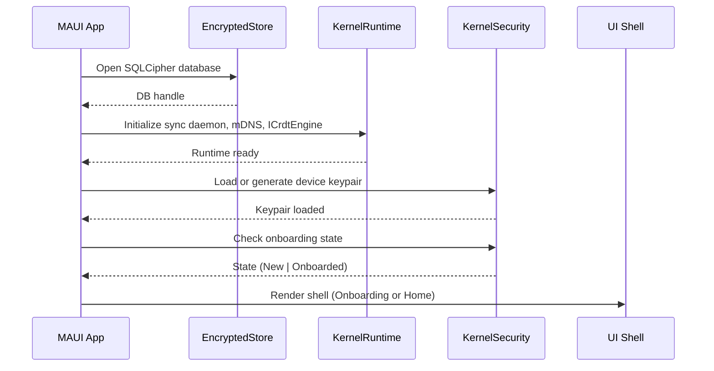
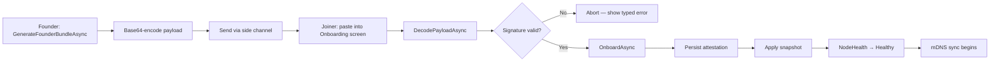
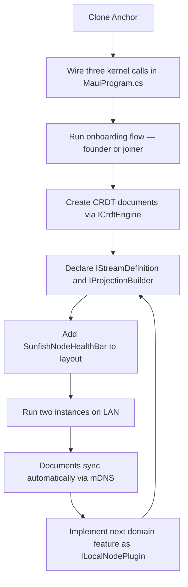

# Chapter 17 — Building Your First Node

<!-- Target: ~4,000 words -->
<!-- Source: v13 §5, §13, §18; Sunfish accelerators/anchor/README.md -->

---

## What This Chapter Gets You

By the end of this chapter, you have a running local-first node on your development machine. It holds a device-bound Ed25519 keypair, completes the three-step onboarding flow, exchanges a CRDT document with a second instance over LAN, and shows live sync status in the UI. Nothing is placeholder by the time you finish section 6. Section 7 points you forward.

This chapter is a playbook, not a specification. When you need to understand *why* a component exists — what the CRDT engine abstraction does, how the sync daemon protocol works, what the role attestation model guarantees — read Part III. Chapter 11 covers node architecture. Chapter 12 covers the CRDT engine and data layer. Chapter 15 covers the security model. Here, you follow the minimal path from zero to running.

---

## 1. Start with Sunfish Anchor

Anchor is the canonical Zone-A local-first node. It is a .NET MAUI Blazor Hybrid application — Windows, macOS, iOS, and Android from a single codebase. It ships as a placeholder shell by design: the kernel is wired, the onboarding flow is real, and the CRDT engine is live. The report catalog, sync toggle, and platform packaging are deferred. That is not a deficit; it is the point. You get the hard parts — the security and sync infrastructure — without a pre-baked application domain baked on top.

Clone the repository and build for Windows:

```bash
git clone https://github.com/your-org/sunfish.git
cd sunfish/accelerators/anchor
dotnet build Sunfish.Anchor.csproj -f net10.0-windows10.0.19041.0
```

Run it:

```bash
dotnet run --project Sunfish.Anchor.csproj -f net10.0-windows10.0.19041.0
```

The app opens. You see a three-step onboarding surface and a status bar with three indicators. No data, no peers, no reports — that is correct. The shell is intentionally empty. You fill it with your domain in later sections.

If you are on macOS, build and run with the catalyst target:

```bash
dotnet build Sunfish.Anchor.csproj -f net10.0-maccatalyst
dotnet run --project Sunfish.Anchor.csproj -f net10.0-maccatalyst
```

iOS and Android targets must also be built on macOS. Windows is the fastest path for first contact. Use it unless you have a specific reason not to.

---

## 2. What Anchor Gives You Today

Before you write a line of domain code, know exactly what the platform has already delivered. Wave 3.3 and 3.4 landed the following.

**Working now:**

- **Kernel security and runtime wired.** `MauiProgram.cs` registers the three core packages. The kernel starts, the encrypted local database opens, and the device keypair loads on every subsequent launch.
- **Device-bound Ed25519 keypair.** Generated at first launch and stored in the OS keystore. Every attestation the node produces is signed with this key. The private key never leaves the device.
- **Founder/joiner attestation flow.** A founder generates a self-signed bundle. A joiner receives a bundle signed by the founder's key and verified at decode time. Both paths are live in `QrOnboardingService`.
- **Three-step onboarding surface.** `Components/Pages/Onboarding.razor` renders all three steps: install (implicit — the app is running), authenticate (paste bundle or generate founder team), sync (apply attestation and transition node health to Healthy).

**Still placeholder:**

- Bundle selection UI — you paste a base64 string directly; camera/QR-scan is a TODO.
- Report catalog — no domain content yet.
- Sync toggle — the sync daemon wires up but has no UI control.
- Platform packaging — no installer, no code-signing pipeline.
- Auto-update — not wired.

These items appear on the v1 and v2 roadmaps. They do not block the work in this chapter.

**The deliverable checklist.** After completing this chapter, verify each item:

```
[ ] App builds and runs without errors
[ ] First launch generates a device keypair
[ ] Founder bundle generates and base64-encodes without error
[ ] Joiner bundle decodes and verifies signature
[ ] NodeHealth transitions to Healthy after OnboardAsync
[ ] A CRDT document creates, updates, and persists across restarts
[ ] Two instances on the same LAN discover each other via mDNS
[ ] SunfishNodeHealthBar shows all three indicators
```

Tick each item before moving to the next chapter.

---

## 3. Wiring the Kernel Stack

Open `MauiProgram.cs`. The local-first kernel wires with three calls:

```csharp
// illustrative — not runnable (pre-1.0 API)
builder.Services.AddSunfishEncryptedStore();
builder.Services.AddSunfishKernelRuntime();
builder.Services.AddSunfishKernelSecurity();
```

Each call registers a distinct layer. Their order matters.

`AddSunfishEncryptedStore()` — from `Sunfish.Foundation.LocalFirst` — opens the SQLCipher database. The database file is device-local and encrypted with a key derived from the device keypair. No data leaves storage unencrypted. This call must come first because both the runtime and the security layer depend on the store.

`AddSunfishKernelRuntime()` — from `Sunfish.Kernel.Sync` — wires the sync daemon, the mDNS peer discovery service, and the gossip anti-entropy loop. It also registers the CRDT engine abstraction (`ICrdtEngine`). The current implementation uses YDotNet; the architecture is engine-agnostic and the interface accepts Loro when Sunfish reaches that milestone. This call must come before security registration because the runtime owns the session context that security decorates.

`AddSunfishKernelSecurity()` — from `Sunfish.Kernel.Security` — registers the attestation verifier (`IAttestationVerifier`), the key management service, and the onboarding state machine. It loads the device keypair from the OS keystore on startup. If no keypair exists — first launch — it generates one and persists it before continuing.

The startup sequence after these three calls runs in this order:



If `OnboardingState` is `New`, the UI shell renders `Onboarding.razor`. If it is `Onboarded`, the shell renders the main workspace. You cannot reach the workspace without a valid attestation. The kernel enforces this; the UI reflects it.

No other bootstrapping is required for the kernel itself. Plugin registration — your domain code — comes after these three calls and is covered in section 7.

---

## 4. Your First CRDT Document and Two-Device Sync

Create a document. Register it with the engine. Subscribe to changes. This is the loop every local-first feature runs.

```csharp
// illustrative — not runnable (pre-1.0 API)
var engine = services.GetRequiredService<ICrdtEngine>();

// Create a new document and open it
var docId = DocumentId.NewId();
var doc = await engine.OpenAsync(docId, cancellationToken);

// Apply a local update
await doc.ApplyAsync(new SetFieldUpdate("title", "Q1 Plan"), cancellationToken);

// Subscribe to remote updates
doc.OnUpdate += (sender, update) =>
{
    // update.Origin == UpdateOrigin.Remote when a peer sent this
    RefreshUI(doc.GetField<string>("title"));
};
```

The document persists in the encrypted store automatically. Close the app and reopen it — `engine.OpenAsync(docId, ct)` returns the same document with all prior updates intact. You do not call save. The engine is the database.

**Running two instances on LAN.** Open a second terminal and run a second instance of the app — either on the same machine with a different profile directory or on a second device on the same network:

```bash
# Second instance on the same machine (Windows — different data path)
dotnet run --project Sunfish.Anchor.csproj -f net10.0-windows10.0.19041.0 \
    --sunfish-data-dir "%LOCALAPPDATA%\SunfishAnchor2"
```

The mDNS peer discovery service in `Sunfish.Kernel.Sync` broadcasts a service record the moment the runtime starts. The second instance picks it up within a few seconds. No configuration, no IP address, no port number. Watch the `LinkStatus` indicator in the status bar — it transitions from `Offline` to `Linked` when the peer handshake completes.

Once linked, apply an update in the first instance. The second instance receives it via gossip anti-entropy and fires `doc.OnUpdate` with `UpdateOrigin.Remote`. The document converges. The order of updates does not matter — the CRDT merge is commutative. If both instances write the same field simultaneously, the engine picks a deterministic winner and both nodes arrive at the same value without coordination.

This is the core primitive. Everything else in the platform — stream subscriptions, projections, schema migration — runs on top of this document sync loop. Chapter 12 defines the full data modeling contract.

---

## 5. The QR-Code Onboarding Flow

The onboarding flow establishes trust before the first document sync. Two devices cannot exchange data until both hold compatible attestations. This section walks the wire format and both code paths.

### Wire Format

Every onboarding payload is a binary blob with four fields concatenated in this order:

```
[4 bytes: CBOR bundle length, little-endian uint32]
[N bytes: CBOR-encoded AttestationBundle]
[4 bytes: snapshot length, little-endian uint32]
[M bytes: raw snapshot bytes]
```

The 4-byte length prefix for each section lets the decoder know how many bytes to read before moving to the next field. There are no delimiters, no version byte at the outer envelope — the CBOR bundle carries its own version field inside.

The snapshot section carries the initial state of all CRDT documents the new member needs to bootstrap with. On a fresh team, this is empty or minimal. On an established team with months of history, this is a compacted snapshot of current state — not the full event log, just the merged head. Chapter 16 covers snapshot rehydration in detail.

### Founder Bundle

The founder creates the team and generates the first attestation:

```csharp
// illustrative — not runnable (pre-1.0 API)
var onboardingService = services.GetRequiredService<QrOnboardingService>();
var bundle = await onboardingService.GenerateFounderBundleAsync(
    teamId: TeamId.NewId(),
    displayName: "Acme Corp",
    cancellationToken
);

// Encode for transport
string base64Payload = Convert.ToBase64String(bundle.ToWireBytes());
```

A founder bundle is self-signed: `issuer == subject`. The `IssuerPublicKey` in the bundle is the founder device's Ed25519 public key. When the joiner verifies the bundle, `IAttestationVerifier` checks the signature against that embedded public key. No external certificate authority is involved. Trust starts with the founder's device.

### Joiner Bundle

The founder generates a joiner bundle for each new member:

```csharp
// illustrative — not runnable (pre-1.0 API)
var joinerBundle = await onboardingService.GenerateJoinerBundleAsync(
    joinerPublicKey: incomingPublicKey,     // from the joining device
    role: TeamRole.Member,
    cancellationToken
);
```

The joiner bundle is signed by the founder's Ed25519 private key. `IssuerPublicKey` is the founder's key. The joining device verifies the signature at decode time — if the signature does not verify, the bundle is rejected and onboarding aborts. The joining device's public key is embedded as `SubjectPublicKey`, which the team uses to validate future documents from that device.

### Paste-Bundle Fallback

Camera-based QR scanning is a TODO in Wave 3.4. The reference transport is paste: the founder copies the base64 string, sends it via any side channel (email, Slack, a shared document), and the joiner pastes it into the Onboarding screen.

The paste field in `Onboarding.razor` calls `DecodePayloadAsync` on submit:

```csharp
// illustrative — not runnable (pre-1.0 API)
var rawBytes = Convert.FromBase64String(pastedBase64);
var (attestation, snapshot) = await onboardingService.DecodePayloadAsync(
    rawBytes,
    cancellationToken
);
```

`DecodePayloadAsync` reads the 4-byte length prefix, extracts the CBOR bundle, verifies the attestation signature via `IAttestationVerifier`, then reads the snapshot section. If any step fails — malformed length prefix, CBOR parse error, signature mismatch — it throws a typed exception. The UI catches it and surfaces a specific error message. "Invalid bundle" tells the user nothing; the exception types tell your error handler exactly what went wrong.

### Completing Onboarding

Once the bundle decodes and verifies, apply it:

```csharp
// illustrative — not runnable (pre-1.0 API)
var sessionService = services.GetRequiredService<AnchorSessionService>();
await sessionService.OnboardAsync(attestation, snapshot, cancellationToken);
```

`OnboardAsync` does three things in order: persists the attestation to the encrypted store, applies the snapshot to the CRDT engine (rehydrating all bootstrapped documents), and transitions `NodeHealth` and `DataFreshness` to `Healthy`. After this call returns, the node is a full team member. The next mDNS discovery cycle finds other team members on the LAN and begins syncing.

The full flow:



---

## 6. Local-First UX Basics

The status bar in Anchor always shows three indicators. They are not optional. They are not hidden behind a settings panel. Every user sees them at all times because the system's behavior changes depending on network and sync state, and the user deserves to know.

`SunfishNodeHealthBar` from `Sunfish.Foundation.LocalFirst` implements all three:

| Indicator | What it measures | States |
|-----------|-----------------|--------|
| **Node Health** | Kernel runtime — DB open, keypair loaded, onboarding complete | Healthy / Degraded / Error |
| **Link Status** | Active peer connections | Linked / Searching / Offline |
| **Data Freshness** | Age of last confirmed sync with at least one peer | Fresh / Stale / Unknown |

Add it to your Blazor layout:

```razor
<!-- illustrative — not runnable (pre-1.0 API) -->
<SunfishNodeHealthBar ShowLabels="true" />
```

`ShowLabels="true"` renders text alongside the icons. Use it during development. In production, icons alone are sufficient once users learn the visual language — but always keep the bar visible. Hiding sync state from users trains them to distrust the application.

### Reading the States

**Node Health** reflects the kernel runtime. `Healthy` means the database opened, the keypair loaded, and onboarding is complete. `Degraded` means the kernel started but one subsystem reported a non-fatal error — check the runtime log. `Error` means the node cannot function; surface an actionable message, not a generic "something went wrong."

**Link Status** reflects peer connectivity. `Linked` means at least one peer completed the sync handshake. `Searching` means mDNS is broadcasting but no peer has responded. `Offline` means the sync daemon is not running or the network interface is unreachable. A node in `Searching` or `Offline` still accepts local writes — that is the point of local-first. It cannot sync them yet, but it does not lose them.

**Data Freshness** reflects the last confirmed sync event. `Fresh` means a peer acknowledged a state exchange within the staleness threshold (configurable; default five minutes). `Stale` means the threshold elapsed without a confirmed exchange. `Unknown` means the node has never completed a sync — it just onboarded, or it has been offline since install.

### Optimistic Write Button States

Every write in a local-first application is optimistic: apply locally first, sync asynchronously. Your UI should reflect this honestly with three states:

```razor
<!-- illustrative — not runnable (pre-1.0 API) -->
@if (writeState == WriteState.Pending)
{
    <button disabled>Saving locally…</button>
}
else if (writeState == WriteState.Confirmed)
{
    <button>Saved</button>
}
else if (writeState == WriteState.Failed)
{
    <button class="error" @onclick="RetryWrite">Save failed — retry</button>
}
```

`Pending` appears immediately when the user submits. The write goes to the CRDT engine and the local store. The UI does not wait for peer acknowledgment. `Confirmed` appears when the local store write completes — not when a peer syncs the change. The change is already durable on the local device. `Failed` appears only when the local write itself fails — typically a storage error, not a network error.

A network error is not a write failure in a local-first system. It is a sync delay. The data is safe on the local device. Do not surface sync delays as write errors. Users who have experienced cloud save failures read "save failed" as data loss. Distinguish between "could not write to local storage" (actual failure) and "not yet synced to peers" (normal operation). The `DataFreshness` indicator carries the sync-delay communication. The write button carries the local-durability communication. These are different signals; they belong in different places.

---

## 7. What to Build Next

Anchor's shell is ready. Now you add your domain.

Every domain feature in a local-first node registers as a plugin. The plugin system is the boundary between the platform and your application. Do not bypass it by writing directly against the kernel services — the plugin contract is the stability boundary; the kernel services below it are pre-1.0 and will change.

### Registering Your First Plugin

Implement `ILocalNodePlugin` from `Sunfish.Kernel.Sync`:

```csharp
// illustrative — not runnable (pre-1.0 API)
public class ReportsPlugin : ILocalNodePlugin
{
    public string PluginId => "com.yourorg.reports";
    public Version Version => new Version(0, 1, 0);

    public IEnumerable<Type> DependsOn => Enumerable.Empty<Type>();

    public void Register(ILocalNodeBuilder builder)
    {
        builder.AddStream<ReportStream>();
        builder.AddProjection<ReportListProjection>();
    }
}
```

Register it in `MauiProgram.cs` after the three kernel calls:

```csharp
// illustrative — not runnable (pre-1.0 API)
builder.Services.AddSunfishPlugin<ReportsPlugin>();
```

The kernel discovers the plugin at startup, validates its dependencies, and calls `Register`. The streams and projections the plugin declares become available immediately.

### Declaring a Stream

A stream is the unit of sync. It groups related CRDT documents into a sync bucket that peers replicate together. Implement `IStreamDefinition`:

```csharp
// illustrative — not runnable (pre-1.0 API)
public class ReportStream : IStreamDefinition
{
    public StreamId StreamId => StreamId.Parse("reports.v1");

    public IEnumerable<CrdtDocumentType> DocumentTypes =>
        new[] { CrdtDocumentType.For<ReportDocument>() };

    public SyncBucketPolicy BucketPolicy =>
        SyncBucketPolicy.ReplicateAll;
}
```

`BucketPolicy.ReplicateAll` means every peer with access to this stream gets every document in it. For coarser replication — per-team, per-user, per-record — see Chapter 16, which covers declarative sync buckets and lazy fetch in detail.

### Building a Projection

A projection is a read model rebuilt from the event log. It answers queries without touching the CRDT engine on every read. Implement `IProjectionBuilder`:

```csharp
// illustrative — not runnable (pre-1.0 API)
public class ReportListProjection : IProjectionBuilder
{
    public ProjectionId ProjectionId => ProjectionId.Parse("report-list.v1");

    public void Build(IProjectionRegistry registry)
    {
        registry.On<ReportCreated>((state, evt) =>
        {
            state.Reports.Add(new ReportSummary(evt.Id, evt.Title, evt.CreatedAt));
        });

        registry.On<ReportArchived>((state, evt) =>
        {
            state.Reports.RemoveAll(r => r.Id == evt.ReportId);
        });
    }
}
```

The kernel rebuilds projections from the event log on startup. After rebuild, it keeps them current as new events arrive — both local writes and remote syncs. Your UI reads from the projection, not from the raw CRDT document. This keeps render paths fast and type-safe.

### The Full Extension-Point Map

Five extension points define the complete plugin surface. You have seen three here:

| Extension Point | What it does | When you need it |
|----------------|-------------|-----------------|
| `ILocalNodePlugin` | Registration and lifecycle | Always — it is the entry point |
| `IStreamDefinition` | Declares CRDT streams and sync buckets | When you have documents to sync |
| `IProjectionBuilder` | Registers read-model projections | When you need fast, typed queries |
| `ISchemaVersion` | Declares schema versions and upcasters | When your document shape changes |
| `IUiBlockManifest` | Registers UI blocks with the UI kernel | When you add plugin-specific Blazor components |

Chapter 11 defines the full plugin contract, including lifecycle hooks, dependency ordering, and error isolation. Read it before you add a second plugin or add production error handling to the first.

Chapter 12 covers CRDT document modeling in depth — how to choose the right CRDT type for each field, how to model lists and maps, and how to avoid the pitfalls of naively mapping relational schemas onto CRDT documents.

### What You Are Not Building Yet

Three topics are intentionally deferred from this chapter.

**Bridge integration.** Anchor is a Zone-A node. If your architecture includes a Zone-C cloud relay, see Chapter 18, which covers the sync boundary between the local node and the cloud. Do not add Bridge calls to Anchor until you have read the relay trust model in Chapter 15.

**Multi-team support.** Anchor v1 ships single-team per install. V2 adopts a workspace-switcher model — one installation, multiple teams, per-team HKDF subkeys, per-workspace state isolation. Build for single-team in v1; the v2 migration path is additive, not a rewrite.

**Platform packaging.** Installers, code signing, and auto-update are deferred. During development, `dotnet run` is sufficient. Chapter 19 covers the packaging and enterprise deployment pipeline when you are ready to ship.

### The Minimal Loop

Everything you need for a working first node reduces to this sequence:



The cycle from step E to I is the development loop for every feature you add. Declare the stream. Build the projection. Add the UI. The platform handles discovery, encryption, merge, and persistence. You handle the domain.

---

## Summary

You built a local-first node from zero. You wired the kernel, ran the onboarding flow, created a CRDT document, and watched two instances sync over LAN without configuration. You added status indicators that show the user exactly what the system is doing. And you registered your first domain plugin — the boundary between Anchor's platform and your application logic.

The shell is no longer empty. What you put in it is up to you.

Chapter 18 covers the other direction: migrating an existing SaaS application to co-exist with local nodes. If you are greenfield, skip to Chapter 19 for enterprise packaging. If you have existing users on a cloud service and need to introduce local-first incrementally, Chapter 18 is your next read.
