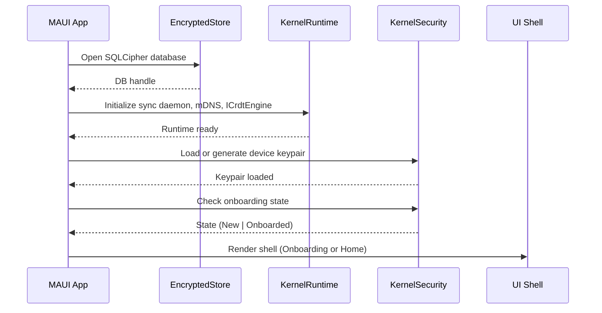
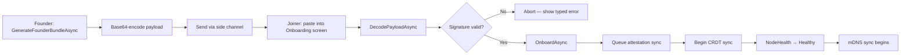
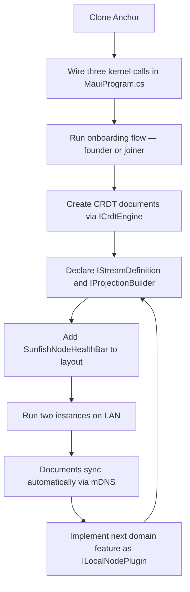

# Chapter 17 — Building Your First Node

<!-- icm/prose-review -->

<!-- Target: ~4,000 words -->
<!-- Source: v13 §5, §13, §18; Sunfish accelerators/anchor/README.md -->

---

## What This Chapter Gets You

By the end of this chapter, a local-first node is running on your development machine. A device-bound Ed25519 keypair. A three-step onboarding flow completed. A CRDT (Conflict-free Replicated Data Type) document exchanged with a second instance over LAN. Live sync status in the UI. Nothing is placeholder by the time you finish section 6. Section 7 points you forward.

This chapter is a playbook, not a specification. When you need to understand *why* a component exists — what the CRDT engine abstraction does, how the sync daemon protocol works, what the role attestation model guarantees — read Part III. Chapter 11 covers node architecture. Chapter 12 covers the CRDT engine and data layer. Chapter 15 covers the security model. Here, you walk the minimal path from zero to running.

---

## 1. Start with Sunfish (the open-source reference implementation, [github.com/ctwoodwa/Sunfish](https://github.com/ctwoodwa/Sunfish)) Anchor (the Zone A local-first desktop accelerator)

Marcus lost his bid data. Not because it was destroyed. He lost it because someone else controlled the infrastructure it lived on. Everything you wire up in this chapter inverts that arrangement. The data stays on the device that needs it. The infrastructure answers to you.

### Before You Begin

You need: .NET SDK 11.0 or later (`dotnet --version` returns `11.0.x`); the MAUI (.NET Multi-platform App UI) workloads installed (`dotnet workload install maui`); Git; and access to NuGet.org or your organization's internal package mirror. If your network restricts public package access — common in GCC (Gulf Cooperation Council) enterprise, Indian BFSI (Banking, Financial Services, and Insurance), CIS (Commonwealth of Independent States) import-substitution, and proxied Latin American environments — configure a mirrored `nuget.config` pointing at your internal feed before running any `dotnet` command in this chapter.

A local-first node is a desktop application that holds the authoritative copy of its own data and synchronizes with peers through a CRDT engine. A CRDT (Conflict-free Replicated Data Type) is a data structure that merges concurrent edits deterministically without a central coordinator. Zone A is the deployment profile where every user runs a full local-first node — as distinct from Zone C, where a hosted node participates alongside local nodes (Chapter 18). Chapters 1–4 establish why this matters. Chapter 17 gets you running.

Anchor (the Zone A local-first desktop accelerator) is the canonical Zone-A local-first node. A .NET MAUI Blazor Hybrid application — Windows, macOS, iOS, and Android from a single codebase. It ships as a placeholder shell *by design*. The kernel is wired. The onboarding flow is real. The security primitives are live. The report catalog, sync toggle, and platform packaging are deferred. The CRDT engine currently ships as `StubCrdtEngine` — a total-order-replay fallback marked "DO NOT SHIP TO PRODUCTION" — pending the YDotNet (the .NET CRDT engine port of Yjs ([github.com/yjs/yjs](https://github.com/yjs/yjs), the JavaScript CRDT library) via Rust FFI (Foreign Function Interface)) (the .NET CRDT engine port of Yjs ([github.com/yjs/yjs](https://github.com/yjs/yjs), the JavaScript CRDT library) via Rust FFI (Foreign Function Interface)) integration in an upcoming Sunfish (the open-source reference implementation, [github.com/ctwoodwa/Sunfish](https://github.com/ctwoodwa/Sunfish)) wave. That is not a deficit. That is the point. You inherit the hard parts — the security and sync scaffolding — without a pre-baked application domain on top, and with honest visibility into which subsystems are production-ready today and which are specification-ahead-of-implementation.

Clone the repository and build for Windows:

```bash
git clone https://github.com/[PUBLISHER PLACEHOLDER — resolve before print]/sunfish.git
cd sunfish/accelerators/anchor
dotnet build Sunfish.Anchor.csproj -f net11.0-windows10.0.19041.0
```

Run it:

```bash
dotnet run --project Sunfish.Anchor.csproj -f net11.0-windows10.0.19041.0
```

The app opens. You see a three-step onboarding surface and a status bar with three indicators. No data, no peers, no reports — that is correct. You fill it with your domain in later sections.

If you are on macOS, build and run with the catalyst target:

```bash
dotnet build Sunfish.Anchor.csproj -f net11.0-maccatalyst
dotnet run --project Sunfish.Anchor.csproj -f net11.0-maccatalyst
```

Build iOS and Android targets on macOS. Windows is the fastest path for first contact. Use it unless you have a specific reason not to.

---

## 2. What Anchor Gives You Today

Before you write a line of domain code, know what the Anchor accelerator provides and what you build yourself. The accelerator delivers the security and sync infrastructure — the parts that are hardest to get right. The application domain is yours.

**The accelerator provides:**

- **Kernel security and runtime wired.** `MauiProgram.cs` registers the three core packages. The kernel starts, the encrypted local database opens, and the device keypair loads on every subsequent launch.
- **Device-bound Ed25519 keypair.** Generated at first launch and stored in the OS keystore. Every attestation the node produces is signed with this key. The private key never leaves the device.
- **Founder/joiner attestation flow.** A founder generates a self-signed bundle. A joiner receives a bundle signed by the founder's key and verified at decode time. Both paths are live in `QrOnboardingService`.
- **Three-step onboarding surface.** `Components/Pages/Onboarding.razor` renders all three steps: install (implicit — the app is running), authenticate (paste bundle or generate founder team), sync (apply attestation and transition node health to Healthy).

**You build on top:**

- Bundle selection UI for your deployment context — the reference transport uses paste; camera/QR-scan and deep-link options suit different deployment models.
- Domain content — report catalog, document views, and application-specific screens.
- Sync UI — the sync daemon is wired; the toggle and status surface are yours to design per Chapter 20.
- Platform packaging and code-signing pipeline for your distribution channel.
- Auto-update strategy appropriate to your deployment model.

This division is by design. You inherit the hard parts without a pre-baked application domain on top.

**The deliverable checklist.** After completing this chapter, verify each item:

```
[ ] App builds and runs without errors
[ ] First launch generates a device keypair
[ ] Founder bundle generates and base64-encodes without error
[ ] Joiner bundle decodes and verifies signature
[ ] NodeHealth transitions to Healthy after OnboardAsync
[ ] A CRDT document creates, updates, and persists across restarts
[ ] Two instances on the same LAN discover each other via mDNS
[ ] SunfishNodeHealthBar shows all three indicators
```

Tick each item before moving to the next chapter.

---

## 3. Wiring the Kernel Stack

Open `MauiProgram.cs`. The local-first kernel wires with three calls:

```csharp
// illustrative — not runnable (pre-1.0 API)
builder.Services.AddSunfishEncryptedStore();
builder.Services.AddSunfishKernelRuntime();
builder.Services.AddSunfishKernelSecurity();
```

Each call registers a distinct layer. Their order matters.

`AddSunfishEncryptedStore()` — from `Sunfish.Foundation.LocalFirst` — registers the encrypted store with the DI container. Key derivation and store initialization happen as part of the node startup sequence managed by the Sunfish kernel. This call comes first because both the runtime and the security layer depend on the store.

`AddSunfishKernelRuntime()` — from `Sunfish.Kernel.Runtime` — registers `INodeHost` and `IPluginRegistry` only. It does not wire the sync daemon, mDNS discovery, or the CRDT engine. Each of those is registered by its own extension method (`AddSunfishKernelSync()`, `AddSunfishCrdtEngine()`, `AddSunfishKernelSecurity()`, `AddSunfishLocalFirst()`, `AddSunfishKernelSchemaRegistry()`) called in the composition root. This separation lets a test harness swap any subsystem independently — `TryAddSingleton` semantics mean a preceding registration takes precedence. `AddSunfishKernelRuntime()` must come before security registration because the runtime owns the session context that security decorates.

`AddSunfishKernelSecurity()` — from `Sunfish.Kernel.Security` — registers the cryptographic services: signing, key agreement, attestation issuance and verification, and role key management.

The startup sequence after these three calls runs in this order:



If `AnchorSessionService.IsOnboarded` is false, the UI shell renders `Onboarding.razor`. If it is true, the shell renders the main workspace. You cannot reach the workspace without a valid attestation. The kernel enforces this; the UI reflects it.

The kernel needs no other bootstrapping. Plugin registration — your domain code — comes after these three calls and is covered in section 7.

---

## 4. Your First CRDT Document and Two-Device Sync

Create a document. Register it with the engine. Subscribe to changes. This is the loop every local-first feature runs.

```csharp
// illustrative — not runnable (pre-1.0 API)
var engine = services.GetRequiredService<ICrdtEngine>();

// Create a new document. ICrdtEngine.CreateDocument and OpenDocument are
// synchronous per the current interface (Ch12 specifies the full surface).
var docId = "doc-" + Guid.NewGuid().ToString("N");
var doc = engine.CreateDocument(docId);

// Apply a local update
await doc.ApplyAsync(new SetFieldUpdate("title", "Q1 Plan"), cancellationToken);

// Subscribe to remote updates
doc.OnUpdate += (sender, update) =>
{
    // update.Origin == UpdateOrigin.Remote when a peer sent this
    RefreshUI(doc.GetField<string>("title"));
};
```

The document persists in the encrypted store automatically. Close the app and reopen it — the engine returns the same document with all prior updates intact. You do not call save. The engine *is* the database.

**Running two instances on LAN.** Open a second terminal and run a second instance — either on the same machine with a different profile directory or on a second device on the same network:

```bash
# Second instance on the same machine (Windows — different data path)
# illustrative — exact CLI flags depend on your Sunfish milestone
dotnet run --project Sunfish.Anchor.csproj -f net11.0-windows10.0.19041.0 \
    --sunfish-data-dir "%LOCALAPPDATA%\SunfishAnchor2"
```

The mDNS peer discovery service in `Sunfish.Kernel.Sync` broadcasts a service record the moment the runtime starts. The second instance picks it up within a few seconds. No configuration. No IP address. No port number. Watch the `LinkStatus` indicator in the status bar — it transitions from `Offline` to `Healthy` when the peer handshake completes.

Once linked, apply an update in the first instance. The second instance receives it via gossip anti-entropy and the document update handler fires with the remote change. The document converges.

> **Implementation status.** Today's Anchor ships `StubCrdtEngine` — a total-order-replay fallback marked "DO NOT SHIP TO PRODUCTION" that converges only for sequentially-issued updates on a single writer. True CRDT merge — commutative, associative, idempotent, concurrent-write-safe — arrives with the YDotNet integration specified in Chapter 12 and tracked on the Sunfish roadmap. Until YDotNet lands, concurrent writes in this tutorial will not converge deterministically. You are exercising the wire format and the handler plumbing, not the merge semantics. When the architectural claims in this chapter reach field-proven behavior, the tutorial will be updated. For now, you see exactly what works and what is specified ahead of implementation.

When true CRDT merge is in place, the order of concurrent updates will not matter — the merge is commutative. If both instances write the same field simultaneously, the engine picks a deterministic winner and both nodes arrive at the same value without coordination.

Deterministic does not mean user-intentional. Two peers typing into the same text field simultaneously will see their characters interleaved — both contributions preserved, neither peer's original text intact. Chapter 12 explains when to use a CRDT and when a CP-class record is the better model.

This is the core primitive. Everything else in the platform — stream subscriptions, projections, schema migration — runs on top of this document sync loop. Chapter 12 defines the full data modeling contract.

---

## 5. The QR-Code Onboarding Flow

The onboarding flow establishes trust before the first document sync. Two devices cannot exchange data until both hold compatible attestations. The wire format and both code paths follow.

### Wire Format

Every onboarding payload is a binary blob with four fields concatenated in this order:

```
[4 bytes: CBOR bundle length, little-endian uint32]
[N bytes: CBOR-encoded AttestationBundle]
[4 bytes: snapshot length, little-endian uint32]
[M bytes: raw snapshot bytes]
```

The 4-byte length prefix for each section lets the decoder know how many bytes to read before moving to the next field. The format uses no delimiters and no version byte at the outer envelope — the CBOR (Concise Binary Object Representation) bundle carries the attestation records for all team members.

The snapshot section carries the initial state of all CRDT documents the new member needs to bootstrap with. On a fresh team, this is empty or minimal. On an established team with months of history, this is a compacted snapshot of current state — not the full event log, just the merged head. Chapter 16 covers snapshot rehydration in detail.

### Founder Bundle

The founder creates the team and generates the first attestation:

```csharp
// illustrative — not runnable (pre-1.0 API)
var onboardingService = services.GetRequiredService<QrOnboardingService>();
var bundle = await onboardingService.GenerateFounderBundleAsync(
    teamId: TeamId.NewId(),
    displayName: "Acme Corp",
    cancellationToken
);

// Encode for transport
string base64Payload = Convert.ToBase64String(bundle.ToWireBytes());
```

A founder bundle is self-signed: `issuer == subject`. The `IssuerPublicKey` in the bundle is the founder device's Ed25519 public key. When the joiner verifies the bundle, `IAttestationVerifier` checks the signature against that embedded public key. No external certificate authority is involved. Trust starts with the founder's device.

### Joiner Bundle

The founder generates a joiner bundle for each new member:

```csharp
// illustrative — not runnable (pre-1.0 API)
byte[] attestation = await attestationIssuer.IssueJoinerAttestationAsync(
    teamId,
    incomingPublicKey,       // from the joining device
    founderPrivateKey,
    cancellationToken
);
```

The joiner bundle is signed by the founder's Ed25519 private key. `IssuerPublicKey` is the founder's key. The joining device verifies the signature at decode time — if the signature does not verify, the bundle is rejected and onboarding aborts. The joining device's public key is embedded as `SubjectPublicKey`, which the team uses to validate future documents from that device.

### Paste-Bundle Fallback

The reference transport is paste. The founder copies the base64 string, sends it via any side channel — email, Slack, a shared document — and the joiner pastes it into the Onboarding screen. Camera-based QR scanning and deep-link activation are architectural options the onboarding flow supports for production deployment.

Sending the payload over an unsecured side channel is acceptable. The security of the handshake does not depend on channel confidentiality — it depends on signature verification. An intercepted bundle is useless without the founder's Ed25519 private key. A tampered bundle fails signature verification before onboarding proceeds. The side channel is a convenience mechanism. The cryptography is the trust mechanism. Chapter 15 covers the key hierarchy in detail.

The paste field in `Onboarding.razor` calls `DecodePayloadAsync` on submit:

```csharp
// illustrative — not runnable (pre-1.0 API)
var rawBytes = Convert.FromBase64String(pastedBase64);
var (attestation, snapshot) = await onboardingService.DecodePayloadAsync(
    rawBytes,
    cancellationToken
);
```

`DecodePayloadAsync` reads the 4-byte length prefix, extracts the CBOR bundle, verifies the attestation signature via `IAttestationVerifier`, then reads the snapshot section. If any step fails — malformed length prefix, CBOR parse error, signature mismatch — it throws a typed exception. The UI catches it and surfaces a specific error message. "Invalid bundle" tells the user nothing. The exception types tell your error handler exactly what went wrong.

### Completing Onboarding

Once the bundle decodes and verifies, apply it:

```csharp
// illustrative — not runnable (pre-1.0 API)
var sessionService = services.GetRequiredService<AnchorSessionService>();
await sessionService.OnboardAsync(attestation, snapshot, cancellationToken);
```

`OnboardAsync` updates the node's onboarding state and coordinates the initial sync. Full attestation persistence and CRDT snapshot application complete during the subsequent sync phases. After this call returns, the node transitions to `NodeHealth` `Healthy`. The next mDNS discovery cycle finds other team members on the LAN and begins syncing.

The full flow:



---

## 6. Local-First UX Basics

The status bar in Anchor always shows three indicators. They are not optional. They are not hidden behind a settings panel. Every user sees them at all times — because the system's behavior changes depending on network and sync state, and the user deserves to know.

`SunfishNodeHealthBar` from `Sunfish.UIAdapters.Blazor` implements all three:

| Indicator | What it measures | States |
|-----------|-----------------|--------|
| **Node Health** | Kernel runtime — DB open, keypair loaded, onboarding complete | `Healthy` / `Stale` / `Offline` |
| **Link Status** | Active peer connections | network connectivity — no dedicated `SyncState` value; inferred from sync behavior |
| **Data Freshness** | Age of last confirmed sync with at least one peer | `Stale` / `ConflictPending` |

Add it to your Blazor layout:

```razor
@* illustrative — not runnable (pre-1.0 API) *@
<SunfishNodeHealthBar ShowLabels="true" />
```

`ShowLabels="true"` renders text alongside the icons. Use it during development. In production, icons alone work once users learn the visual language — but always keep the bar visible. Hiding sync state from users trains them to distrust the application.

### Reading the States

**Node Health** reflects the kernel runtime. `Healthy` means the database opened, the keypair loaded, and onboarding is complete. `Stale` means the kernel started but the last confirmed sync exchange has aged past the staleness threshold — check the runtime log. `Offline` means the node cannot reach peers. Surface an actionable message, not a generic "something went wrong."

**Link Status** reflects peer connectivity. When at least one peer has completed the sync handshake, link health is `Healthy`. When mDNS is broadcasting but no peer has responded, the node shows `Offline` for this indicator. A node with no active peers still accepts local writes and queues them for the next sync cycle.

**Data Freshness** reflects the last confirmed sync exchange. A data-fresh node shows `Healthy` — a peer acknowledged a sync exchange within the staleness threshold (configurable; default five minutes). `Stale` means the threshold elapsed without a confirmed exchange. `ConflictPending` means the node has unresolved conflicts that require attention before the next sync exchange can complete cleanly.

The staleness threshold deserves deliberate configuration. Five minutes is the conservative default — suitable for low-frequency collaborative workflows where document freshness is not time-critical. For applications where peers write to shared records frequently, a sixty-second threshold makes the UI more responsive to connectivity changes. For applications used in intermittent-connectivity environments — field crews, remote sites — a longer threshold (thirty or sixty minutes) prevents the indicator from flashing amber every time a user steps away from the office. The threshold is a product decision, not a system constraint. Set it before your first user-facing deploy. Changing it mid-deployment changes what users have learned to expect from the indicator.

When `Node Health` is `Healthy` but `Data Freshness` is persistently `Stale`, the node is running and the local database is open, but no peer has responded to gossip. The most common cause is a firewall or network policy blocking the mDNS multicast address. Check that UDP port 5353 is open on the local network segment. The second most common cause is two instances running on the same machine sharing the same mDNS service record — the second instance suppresses the first's advertisement. Use separate `--sunfish-data-dir` paths when running multiple instances on a single machine.

### Optimistic Write Button States

Every write in a local-first application is optimistic: apply locally first, sync asynchronously. Your UI should reflect this honestly with three states:

```razor
@* illustrative — not runnable (pre-1.0 API) *@
@* Local component state — "pending/confirmed/failed" is the reader's local enum, *@
@* not a framework-provided type. Sunfish does not expose a WriteState enum. *@
@if (localWriteState == LocalWriteState.Pending)
{
    <button disabled>Saving locally…</button>
}
else if (localWriteState == LocalWriteState.Confirmed)
{
    <button>Saved</button>
}
else if (localWriteState == LocalWriteState.Failed)
{
    <button class="error" @onclick="RetryWrite">Save failed — retry</button>
}
```

Define `LocalWriteState` as a local component enum (`Pending`, `Confirmed`, `Failed`) — it is UI state, not a framework type, and Sunfish deliberately does not expose one because the taxonomy is application-specific. `Pending` appears immediately when the user submits. The write goes to the CRDT engine and the local store. The UI does not wait for peer acknowledgment. `Confirmed` appears when the local store write completes — not when a peer syncs the change. The change is already durable on the local device. `Failed` appears only when the local write itself fails — typically a storage error, not a network error.

Do not surface sync delays as write errors. Users who have experienced cloud save failures read "save failed" as data loss. Distinguish between "could not write to local storage" (actual failure) and "not yet synced to peers" (normal operation). The `DataFreshness` indicator carries the sync-delay signal. The write button carries the local-durability signal. Keep them separate.

---

## 7. What to Build Next

Anchor's shell is ready. Now you add your domain.

Every domain feature in a local-first node registers as a plugin. The plugin system is the boundary between the platform and your application. Do not bypass it by writing directly against the kernel services — the plugin contract is the stability boundary. The kernel services below it are pre-1.0 and will change.

The plugin lifecycle has two phases. In the load phase, the kernel calls `OnLoadAsync` on every registered plugin in dependency order. A plugin that declares dependencies in `Dependencies` does not load until its dependencies have loaded successfully — the registry performs a topological sort and raises `PluginMissingDependencyException` if a declared dependency is not registered. If a plugin's `OnLoadAsync` throws, the exception propagates and the node fails to start. All plugins load or none do. In the unload phase, when the node shuts down cleanly, the kernel calls `OnUnloadAsync` in reverse load order so that downstream plugins tear down before the services they depend on. Unload failures are logged and swallowed — partial unload does not block subsequent restarts. This sequencing is automatic. You do not call it.

The `Id` and `Version` properties on `ILocalNodePlugin` are logged at load time for diagnostics. Use a reverse-DNS style identifier (e.g., `com.yourorg.reports`) — `Id` is the key the dependency system uses to resolve `Dependencies` declarations. Use semantic versioning for `Version` so that log output identifies exactly which plugin build is running when diagnosing a startup failure.

### Registering Your First Plugin

Implement `ILocalNodePlugin` from `Sunfish.Kernel.Runtime`. The real interface has four members: `Id` (string, reverse-DNS style), `Version` (string, semver), `Dependencies` (a read-only collection of plugin-id strings to resolve), and the lifecycle method `OnLoadAsync(IPluginContext context, CancellationToken ct)`:

```csharp
// illustrative — not runnable (pre-1.0 API)
public class ReportsPlugin : ILocalNodePlugin
{
    public string Id => "com.yourorg.reports";
    public string Version => "0.1.0";
    public IReadOnlyCollection<string> Dependencies => Array.Empty<string>();

    public Task OnLoadAsync(IPluginContext context, CancellationToken ct)
    {
        // Register streams and projections through the context surface.
        // The exact registration API is Chapter 11 territory; this call is
        // where your domain wiring begins.
        return Task.CompletedTask;
    }
}
```

Plugin registration in the composition root follows the DI pattern the Sunfish kernel exposes. The exact extension method is specified in Chapter 11 (Node Architecture) alongside the full plugin lifecycle contract. The kernel discovers the plugin at startup, validates its `Dependencies` through the plugin registry's topological sort, and invokes `OnLoadAsync` in dependency order.

### The Full Extension-Point Map

Five extension points define the complete plugin surface. This chapter shows `ILocalNodePlugin`. The remaining four are covered where they are specified in full:

| Extension Point | What it does | When you need it | Specified in |
|----------------|-------------|-----------------|---|
| `ILocalNodePlugin` | Registration and lifecycle | Always — it is the entry point | Ch11 |
| `IStreamDefinition` | Declares CRDT streams and sync buckets (fields: `EventTypes`, `BucketContributions`) | When you have documents to sync | Ch11, Ch14 |
| `IProjectionBuilder` | Registers read-model projections (`RebuildAsync(CancellationToken)`) | When you need fast, typed queries | Ch12 |
| `ISchemaVersion` | Declares schema versions and upcasters | When your document shape changes | Ch13 |
| `IUiBlockManifest` | Registers UI blocks with the UI kernel | When you add plugin-specific Blazor components | Ch11, Ch20 |

Chapter 11 defines the full plugin contract, including lifecycle hooks, dependency ordering, and error isolation. Read it before you add a second plugin or add production error handling to the first. Chapter 12 covers CRDT document modeling in depth — how to choose the right CRDT type for each field, how to model lists and maps, and how to avoid the pitfalls of naively mapping relational schemas onto CRDT documents.

### What You Are Not Building Yet

Three topics are deferred.

**Bridge (the Zone C hybrid SaaS accelerator) (the Zone C hybrid SaaS (Software as a Service) accelerator) integration.** Anchor is a Zone-A node. If your architecture includes a Zone-C cloud relay, see Chapter 18, which covers the sync boundary between the local node and the cloud. Do not add Bridge calls to Anchor until you have read the relay trust model in Chapter 15.

**Multi-team support.** Anchor v1 ships single-team per install. V2 adopts a workspace-switcher model — one installation, multiple teams, per-team HKDF (HMAC-based Key Derivation Function) subkeys, per-workspace state isolation. Build for single-team in v1. The v2 migration path is additive, not a rewrite.

**Platform packaging.** Installers, code signing, and auto-update are deferred. During development, `dotnet run` is sufficient. Chapter 19 covers the packaging and enterprise deployment pipeline when you are ready to ship.

### The Minimal Loop

Everything you need for a working first node reduces to this sequence:



The cycle from step E to I is the development loop for every feature you add. Declare the stream. Build the projection. Add the UI. The platform handles discovery, encryption, merge, and persistence. You handle the domain.

---

## Summary

The shell is no longer empty. What you put in it is up to you.

Chapter 18 covers the other direction: migrating an existing SaaS (Software as a Service) application to co-exist with local nodes. If you are greenfield, skip to Chapter 19 for enterprise packaging. If you have existing users on a cloud service and need to introduce local-first incrementally, Chapter 18 is your next read.
