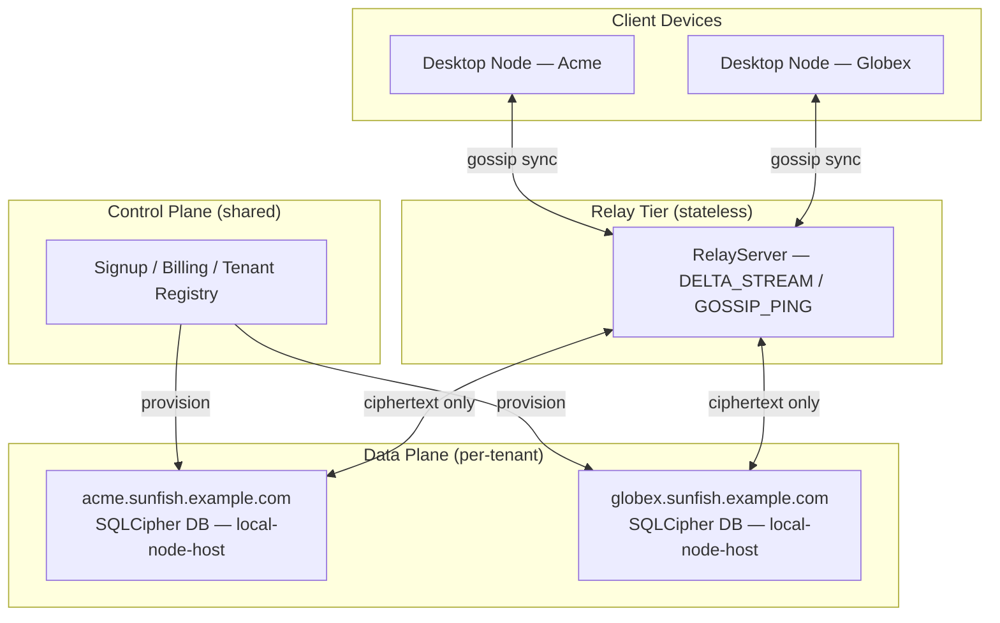

# Chapter 18 — Migrating an Existing SaaS

<!-- Target: ~3,500 words -->
<!-- Source: v5 §8, Sunfish accelerators/bridge/README.md, Sunfish docs/zone-b-migration-path.md -->

---

## Determine Your Zone Before You Write a Line of Code

Run the five-filter framework from Chapter 4. Every filter asks the same underlying question: does the value of this feature depend on coordinating state across users simultaneously, or does it depend on a single team managing their own data well?

Filter 1 asks whether your data is user-owned or platform-owned. If the records belong to a specific team and that team's members are the only people who need to read and write them, the data passes Filter 1. Shared public feeds, aggregated analytics across all customers, and anonymized usage data do not pass.

Filter 2 asks whether the acceptable staleness window is minutes or milliseconds. A task board that reflects changes within 30 seconds is still useful. A financial exchange that reflects prices from 30 seconds ago is dangerous. If your staleness window is measured in minutes, you are eligible for local-first. If it is milliseconds, you are not — for that record class.

Filter 3 asks whether conflicts are resolvable without human coordination. Text edits, task status, attachments, and user preferences all have natural CRDT semantics. Inventory reservations and seat assignments do not.

Filter 4 asks whether offline operation has value. A field team that loses connectivity mid-project still needs to record work. A real-time trading terminal without connectivity is simply broken. Offline value correlates directly with local-first fit.

Filter 5 asks whether your compliance posture allows data to leave the server. Some customers require data residency on their own hardware. Local-first delivers that naturally. Some regulations require server-side audit trails for every write — that constraint must be modeled carefully against your AP-class domain boundaries.

**Reading the results.** If every record class in your product fails Filter 1 or Filter 2, you are in Zone B. Use Sunfish packages up through the Blocks layer and stop there — the local-first kernel is not your migration target. If your product has some record classes that pass all five filters and others that do not, you are in Zone C. This chapter is for Zone C. If you are building greenfield and the framework returns Zone C, skip straight to cloning `accelerators/bridge/` — you do not need this chapter's migration path.

---

## Bridge Is Your Zone C Reference Implementation

Clone `accelerators/bridge/` before your first planning meeting. Bridge is the Sunfish Zone C Hybrid accelerator. It runs a working hosted-node-as-SaaS implementation: a traditional web layer handles signup, billing, and a browser-accessible shell per tenant, while per-tenant local-node-host processes hold the data plane. Study the three logical planes Bridge separates before you touch your existing schema.

**Control plane — shared across all tenants.** The control plane handles signup, billing, subscription-tier enforcement, admin backoffice, support tickets, and system status. It holds a tenant registry with exactly this shape per tenant: `{tenant_id, plan, billing, support_contacts, team_public_key}`. No team data lives in the control plane. This is not a convention — it is a hard constraint. If you find a content record in the control plane, stop and ask why.

**Data plane — isolated per tenant.** Each tenant gets a dedicated local-node-host process, a dedicated SQLCipher database at a per-tenant path, and a subdomain (`acme.sunfish.example.com`). The hosted-node peer participates as a ciphertext-only peer: it holds encrypted deltas for catch-up-on-reconnect but cannot decrypt without a team-issued role attestation. The team holds the keys. The server holds ciphertext.

**Relay tier — shared and stateless.** One RelayServer process (scaled horizontally) accepts sync-daemon transport connections from all tenants. It fans `DELTA_STREAM` and `GOSSIP_PING` frames scoped by team ID. It persists nothing. The relay is a message bus, not a database.



Bridge also defines three tenant trust levels. The default — relay-only — means the operator never holds plaintext. An attested hosted peer is opt-in: the tenant admin issues a role attestation to the hosted peer, enabling backup verification and admin-assisted recovery. Some enterprise tenants run self-hosted nodes and use Bridge only for the control plane. Know which trust level your product needs before you design the migration.

---

## Five Architectural Decisions to Make Before You Start

These five decisions are cheap to make now and expensive to undo after Phase 2. Make them before your first migration sprint.

**Decision 1: Per-tenant data isolation.** If your current product uses a shared Postgres schema with tenant-ID filter columns, you cannot migrate to Bridge's per-tenant data plane without first separating the data planes. This is surgery — it touches every query, every index, and every backup job. Do it first, before any local-first work begins. Wire every query through `ITenantContext` from `Sunfish.Foundation`. This interface becomes the migration seam; it is how you swap a Postgres-backed projection for a CRDT-backed one without rewriting your UI.

**Decision 2: Event tables over mutable fields.** A schema that stores domain state as last-write-wins field mutations has no natural path to CRDT-backed documents. A schema with append-only event tables for mutable aggregates has a mechanical migration path: read the event rows, emit equivalent CRDT operations, validate the merged state against the prior projection. Decide now. Every week you add new mutable field columns is a week of migration debt. Prefer `TaskBody`, `TaskStatus`, `TaskAuditLog` over a single `Tasks` table with ten nullable columns.

**Decision 3: Separate AP data from CP data by table.** Zone C puts AP-class data (user-owned, eventually consistent) on CRDT documents on local nodes, and CP-class data (server-coordinated, strongly consistent) on Postgres. If your schema intermingles the two, you need a decomposition pass before you can migrate either. Name tables by aggregate and class: `ProjectBody` is AP, `ProjectBillingRecord` is CP. Never store both in the same table.

**Decision 4: Wire UI against block contracts.** `Sunfish.Blocks.*` components are CRDT-state-aware by design. A task list backed by `Sunfish.Blocks.Tasks` works identically whether the underlying data comes from a Postgres-backed projection or a CRDT-backed local document — the block's data contract is the same; only the backing store changes. If you wire your UI directly against your ORM models or custom DTOs, every migration phase requires a UI rewrite. Wire against block contracts now and the UI follows the data layer for free.

**Decision 5: Move business logic out of stored procedures.** Stored procedures execute in the database process. The local node kernel executes in the application process. Any business logic in a stored procedure cannot replicate to a local node. Audit your stored procedures now. Move validation, computation, and workflow logic into application-layer domain services. Leave only set-based data operations in the database. This step unblocks Phase 3.

---

## Four Migration Phases

The migration runs in four phases. You can pause at the end of any phase indefinitely. Phases 1 through 3 are individually reversible. Phase 4 is a one-way door per workspace — run it incrementally.

### Phase 1 — Shadow Mode (Weeks 1–8)

**What.** Deploy a local node alongside your existing SaaS. The local node mirrors all data read-only. Writes still flow through the server API. Users see faster reads; the server remains authoritative for everything.

**How.** Add `Sunfish.Foundation.LocalFirst` to your service registration with shadow-read-only mode:

```csharp
builder.Services.AddSunfishLocalFirst(options =>
{
    options.Mode = LocalFirstMode.ShadowReadOnly;
});
```

The foundation layer populates a local SQLite replica from your existing Postgres read model. Shift UI read paths to the local replica. Write paths stay on the server API unchanged.

Wire a feature flag before shipping to production:

```csharp
builder.Services.AddSunfishFeatureManagement(options =>
{
    options.RegisterFlag("LocalFirst.ShadowMode", defaultEnabled: false);
});
```

This flag is your instant rollback path. If shadow mode causes a performance regression or data inconsistency, flip it off without a deployment.

**Success criteria.** P95 read latency improves measurably. No regressions in write consistency. The local replica stays within your AP staleness window — 30 seconds is a reasonable baseline for most task-management domains.

**Reversible.** Remove the `AddSunfishLocalFirst` registration. UI read paths fall back to the server. No data migration required.

---

### Phase 2 — Local Writes for Non-Conflicting Domains (Weeks 4–16)

**What.** Enable local writes for AP-class record classes: personal notes, drafts, task body, user preferences, attachments. The server remains authoritative for CP-class records — billing state, subscription limits, role membership, audit logs.

**How.** Introduce `Sunfish.Kernel.Crdt` for your AP-class aggregates. Route AP-class block writes through the CRDT engine. The server transitions to a relay role for AP-class data: it propagates CRDT deltas between nodes but does not own them.

```csharp
builder.Services.AddSunfishKernelCrdt(options =>
{
    options.Domains.Add("tasks", CrdtDomainMode.LocalAuthority);
    options.Domains.Add("notes", CrdtDomainMode.LocalAuthority);
    options.Domains.Add("attachments", CrdtDomainMode.LocalAuthority);
    // billing and roles remain server-authoritative — omit them here
});
```

Identify AP-class domains by asking: if two users edit this record concurrently and both edits are preserved via merge, is the result acceptable? Task body edits merge cleanly. Seat reservation conflicts do not.

**Success criteria.** AP-class edits apply without a server round-trip — users see instant local feedback. CRDT merge resolves concurrent edits without data loss. CP-class records show no correctness regressions. Run your existing integration tests unchanged against the CP-class write paths.

**Reversible.** Disable CRDT writes per domain; the server API resumes authority. The CRDT event log is preserved and can be replayed if you re-enable local authority. You can pause here indefinitely — many products stabilize at Phase 2 and treat Phase 3 as a future option.

---

### Phase 3 — Full Local Authority for New Projects (Weeks 12–24)

**What.** New projects or workspaces create as fully local-first nodes. Existing infrastructure becomes a relay peer. Existing workspaces stay at Phase 2 until their teams opt in to Phase 4.

This phase introduces the full local-node stack: gossip sync daemon, local SQLCipher database per workspace, and device keypair issuance. It does not touch existing workspaces.

**How.** When a user creates a new workspace, provision the full kernel stack:

```csharp
// New workspace provisioning
services.AddSunfishKernelSync(options =>
{
    options.GossipInterval = TimeSpan.FromSeconds(30);
    options.AntiEntropyEnabled = true;
});

services.AddSunfishKernelSecurity(options =>
{
    options.KeyStorage = KeyStorageLocation.LocalDevice;
    options.RoleAttestationRequired = true;
});
```

`Sunfish.Kernel.Security` issues device keypairs at first launch. Role attestations govern what the hosted-node peer can access. The hosted-node peer holds ciphertext for catch-up-on-reconnect but cannot decrypt without a team-issued attestation. Configure BYOC backup for new workspaces at provisioning time. The hosted-node peer is not a backup; it is a relay cache. Teams that skip BYOC backup configuration discover this only during an incident.

**Success criteria.** New workspaces operate at full fidelity without server connectivity. Gossip anti-entropy converges within the 30-second interval under your test topology. The hosted-node peer holds ciphertext-only — verify this with the Bridge audit tooling before shipping.

**Reversible at the workspace level.** Individual workspaces that reach Phase 3 can be held there indefinitely. Phase 3 workspaces and Phase 2 workspaces coexist on the same infrastructure without conflict.

---

### Phase 4 — Gradual Backfill of Legacy Records (Weeks 20–Ongoing)

**What.** Progressively migrate existing Phase 2 workspaces to full Phase 3 local authority. This is opt-in per workspace. It is a one-way door — do not run it fleet-wide.

**How.** For each domain aggregate, run the copy-transform migration job:

```csharp
// Illustrative — not runnable; validate against your Sunfish milestone
public class TaskBodyMigrationJob : IWorkspaceMigrationJob
{
    public async Task RunAsync(Guid workspaceId, CancellationToken ct)
    {
        var postgresEvents = await _eventStore
            .GetDomainEventsAsync(workspaceId, "TaskBody", ct);

        foreach (var evt in postgresEvents)
        {
            var crdtOperation = _transformer.Transform(evt);
            await _crdtLog.AppendAsync(workspaceId, crdtOperation, ct);
        }

        var postgresProjection = await _projections
            .GetCurrentAsync(workspaceId, "TaskBody", ct);
        var crdtProjection = await _crdtLog
            .ProjectAsync(workspaceId, "TaskBody", ct);

        _differ.AssertEquivalent(postgresProjection, crdtProjection);
    }
}
```

Run the diff validation before switching the write path. Switch only after the diff passes. Disable the Postgres write path for that workspace's AP-class domains. Run the workspace on Phase 3 for 30 days before treating the migration as stable.

**Success criteria.** Zero data loss confirmed by projection diff. The team self-reports equivalent capability — no features they relied on are missing. The Postgres write path stays disabled for 30 days without rollback requests.

**Not reversible without re-migration.** The CRDT event log becomes the system of record. Re-migration to Phase 2 requires running the copy-transform in reverse — expensive and error-prone. Run Phase 4 on a pilot workspace first. Wait 30 days. Then expand.

---

## Phase Transition Gates

Each phase transition needs an explicit decision — not a calendar event. Use this framing with your change advisory board.

| Transition | Gate question | Hard stop |
|---|---|---|
| Phase 1 → Phase 2 | Is P95 read latency improved with no write regressions? | Any CP-class write regression blocks the transition |
| Phase 2 → Phase 3 | Do all AP-class domains pass CRDT merge correctness tests? | Any data loss in merge testing blocks the transition |
| Phase 3 → Phase 4 | Does the projection diff pass for the pilot workspace? | Any diff failure blocks fleet rollout |

**You can pause at Phase 2 indefinitely.** Phase 2 delivers real value: instant local writes, offline capability for non-conflicting domains, no server round-trip for the majority of user actions. Many teams reach Phase 2 and decide Phase 3 is not worth the operational complexity for their current customer base. That is a valid product decision. The architecture supports it. Phases 3 and 4 are on the table when the business case arrives.

---

## Common Failure Modes

Five failure modes recur across Zone C migrations. Name them in your planning sessions so your team can recognize them early.

**Failure mode 1: Server-side feature gates re-centralizing the architecture.** This is the most common drift pattern. Phase 2 ships. A product manager asks for a feature gate to roll out a new AP-class feature. An engineer adds a server call to evaluate the gate. Six months later the server is load-bearing for every write because the feature gate call became the pattern for analytics, A/B tests, and rate limiting. Wire feature flags through `Sunfish.Foundation.FeatureManagement` from Phase 1. It evaluates flags locally against the node's role attestations — no server call required. If you route any AP-class decision through a server call, you have re-centralized that decision.

**Failure mode 2: Shared Postgres schema blocking per-tenant isolation permanently.** A shared schema with tenant-ID filter columns looks harmless at a few dozen tenants. At a few hundred tenants, the migration cost to per-tenant isolation is disproportionate — data volume, index rebuild time, and cutover risk multiply together. Once you commit to a shared schema, reaching Bridge's per-tenant data plane requires a migration project that rivals the original migration. Make this decision in week one.

**Failure mode 3: Relay mistaken for a backup.** The hosted-node peer stores ciphertext for catch-up. Teams that skip BYOC backup configuration assume the relay holds their data durably. It does not. The relay is a cache. It evicts. It does not guarantee retention. When a device is destroyed and the team tries to recover from the relay, they discover this constraint during the incident. Configure BYOC backup at workspace provisioning time in Phase 3. Make it non-optional in your provisioning workflow.

**Failure mode 4: Phase 1 shadow mode without a feature flag.** Shadow mode adds a read path. If that read path introduces a performance regression — a slow SQLite query, a deserialization bug, a race condition on startup — you need to turn it off without a deployment. Without the feature flag, you are rolling back code under pressure. Wire `LocalFirst.ShadowMode` as a `Sunfish.Foundation.FeatureManagement` flag before Phase 1 goes to production. This takes 30 minutes and buys you a 30-second rollback window.

**Failure mode 5: Business logic in stored procedures discovered in Phase 3.** Stored procedures execute in the database process. The local node kernel executes in the application process. If you reach Phase 3 provisioning and discover that your workspace creation workflow calls a stored procedure that validates subscription limits and enforces naming rules, you have a problem. That logic cannot replicate to a local node. You are now doing stored-procedure extraction under migration pressure rather than before the migration started. Run the stored-procedure audit during Decision 5, before any migration sprint begins.

---

## What Sunfish Provides at Each Phase

Know which packages become available as you advance through phases. Do not reach for a package before your architecture is ready for it.

| Package | Phase 1 | Phase 2 | Phase 3 | Phase 4 |
|---|---|---|---|---|
| `Sunfish.Foundation` | Yes | Yes | Yes | Yes |
| `Sunfish.UI.Core` | Yes | Yes | Yes | Yes |
| `Sunfish.UI.Adapters.Blazor` | Yes | Yes | Yes | Yes |
| `Sunfish.Blocks.*` | Yes | Yes | Yes | Yes |
| `Sunfish.Foundation.LocalFirst` | Shadow read-only | Shadow + local writes | Full | Full |
| `Sunfish.Kernel.Crdt` | No | Yes (AP domains) | Yes | Yes |
| `Sunfish.Kernel.Sync` | No | No | Yes | Yes |
| `Sunfish.Kernel.Security` | No | No | Yes | Yes |

`Sunfish.Foundation.FeatureManagement` belongs in every phase from Phase 1 onward. Wire it first.

---

## The Greenfield Case

If your product is greenfield — no existing data, no existing tenants, no migration debt — and the five-filter framework from Chapter 4 returns Zone C, you do not need this migration path. Clone `accelerators/bridge/`. It ships Zone C out of the box. The control plane, relay tier, and per-tenant data plane are already separated. The hosted-node peer is already configured ciphertext-only. Your work is product configuration, not architecture construction.

The migration path in this chapter exists for teams with production workloads, existing schemas, and customers who cannot tolerate a flag-day cutover. Every phase delivers value independently. Phase 1 is deployable in a sprint. Phase 2 is deployable in a quarter. Phases 3 and 4 are available when the business case justifies them.

That is the point of the phased approach: you adopt as much local-first behavior as your product and customers can absorb, at the pace that makes sense, without betting everything on a single rewrite.

---

## Next Steps

Chapter 19 covers what happens when your Zone C product reaches an enterprise customer with a security review, a procurement process, and a change advisory board. The migration phases in this chapter give you the architectural story. Chapter 19 gives you the language to tell it.

For the full specification of the sync daemon protocol, gossip anti-entropy, and the CRDT engine internals referenced in Phases 3 and 4, see Chapters 12, 13, and 14. For key hierarchy, role attestation, and the ciphertext-only invariant, see Chapter 15.
