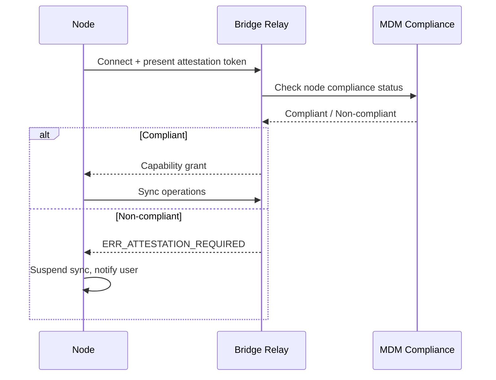
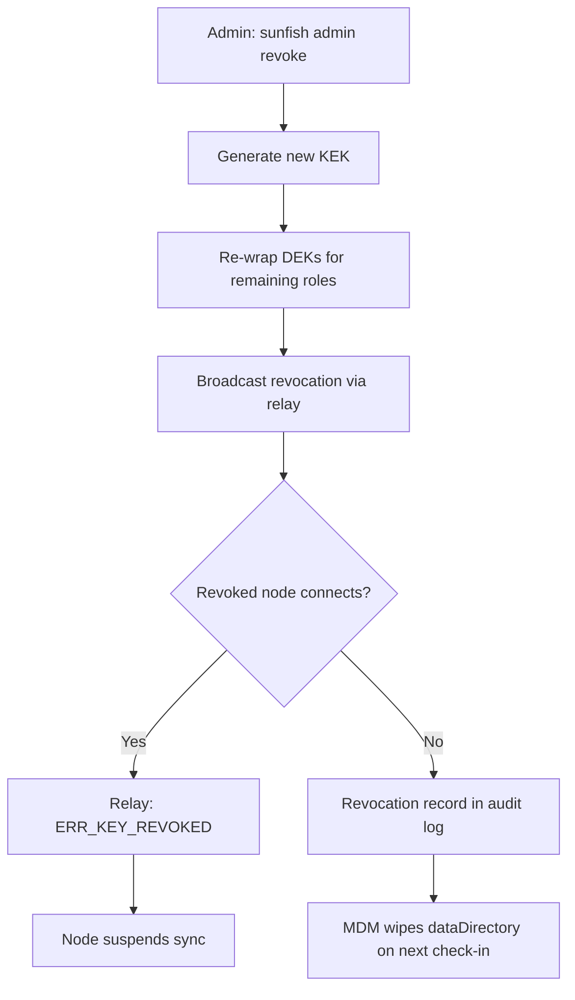

# Chapter 19 — Shipping to Enterprise

<!-- icm/prose-review -->

<!-- Target: ~3,500 words -->
<!-- Source: v13 §16, v5 §5, Sunfish docs/specifications/mdm-config-schema.md, Sunfish docs/specifications/air-gap-deployment.md -->

---

You have a working local-first node. Now you have to ship it to an organization with managed endpoints, a security team, and a procurement team that has been burned by vendor lock-in before. Enterprise IT evaluates software through three gates — a procurement checklist, a security review, and a legal sign-off. Each gate has a specific requirement. Each requirement has a concrete resolution.

---

## The Procurement Conversation

The first conversation with enterprise legal will focus on licensing. Open-source core sounds attractive — until the legal team runs it against their approved-licenses list and finds AGPLv3. The network-use clause requires you to publish modifications when you run the software as a service, even for internal use. That clause triggers a categorical block at many corporate legal shops. This is not negotiable on their side. It is, however, solvable on yours.

AGPLv3 plus a managed relay subscription produces one predictable line item: the relay subscription fee. No per-seat count to audit. No usage-based surprise. The open-source core removes the vendor lock-in objection that killed the last three SaaS (Software as a Service) proposals the CTO (Chief Technology Officer) sat through. That story is genuinely compelling.

The resolution to the AGPLv3 block is a dual-license structure. Publish the core under AGPLv3 as the default. Offer a commercial license exception to organizations that cannot accept the network-use clause. The commercial license is a standard negotiated agreement: it permits internal modification without publishing obligation, grants a warranty, and specifies SLA (Service Level Agreement) terms for security patches.

Two decisions you must make before the first enterprise conversation, not after:

**First:** Specify the dual-license structure in your repository. Add a `LICENSES/` directory with both the AGPLv3 text and the commercial license template. Make the offering visible without requiring a sales call to discover it. Enterprise legal will check your GitHub before they email you.

**Second:** Put a Contributor License Agreement (CLA) in place before the first external contributor opens a pull request. Without a CLA, you cannot legally offer the commercial exception on code contributed by third parties. The CLA does not need to be elaborate — a simple inbound=outbound agreement is sufficient — but it must exist before you accept outside contributions, not after. Missing this step invalidates the dual-license offering retroactively.

---

## Build and Packaging

Enterprise IT deploys software. It does not unzip archives and run scripts. Your installer must integrate silently with the tools the IT team already manages.

The reference implementation targets two packaging formats, one per major managed-endpoint platform:

**Windows: MSIX or signed MSI.** The installer provisions the MAUI (.NET Multi-platform App UI) host application and registers the sync daemon as a Windows Service. Service registration means the daemon starts before any user logs in, survives user logoff, and can be restarted by the Service Control Manager on failure. Use the `<ServiceInstall>` element in a WiX installer to declare the service, or the MSIX `<uap5:StartupTask>` extension for store-distributed packages. Silent install with no UI:

```bash
msiexec /i Sunfish.msi /qn /norestart INSTALLFOLDER="C:\ProgramData\Sunfish" SERVICESTART=1
```

**macOS: signed and notarized .pkg or .dmg.** The package installs a `.app` bundle for the MAUI foreground application and a `launchd` launch agent for the sync daemon. The launch agent plist goes to `/Library/LaunchDaemons/` (system context, no user login required) rather than `~/Library/LaunchAgents/`. The distinction matters for enterprise deployment: system-context daemons run under MDM (Mobile Device Management) supervision, which is where the compliance hooks live.

Both formats integrate with Intune and Jamf for policy-driven deployment. Neither format requires user interaction during install. Neither format modifies PATH or installs global developer tooling.

For the multi-target MAUI build, add explicit build targets to your project file:

```xml
<PropertyGroup>
  <TargetFrameworks>net11.0-windows10.0.19041.0;net11.0-maccatalyst</TargetFrameworks>
</PropertyGroup>

<Target Name="PublishMsi" AfterTargets="Publish" Condition="$([MSBuild]::IsOSPlatform('Windows'))">
  <!-- Invoke WiX or heat.exe to produce Sunfish.msi -->
</Target>

<Target Name="PublishPkg" AfterTargets="Publish" Condition="$([MSBuild]::IsOSPlatform('OSX'))">
  <!-- Invoke pkgbuild + productbuild to produce Sunfish.pkg -->
</Target>
```

Build both targets in CI. Enterprise IT will ask for both on the same ticket.

---

## Code Signing and Notarization

Unsigned software does not run on managed endpoints. This is not a configuration option. Windows Defender and macOS Gatekeeper both treat unsigned executables as hostile by default, and enterprise policy layers stack on top of those defaults.

### macOS

Gatekeeper enforces that all software distributed outside the Mac App Store must be signed with a Developer ID certificate and notarized by Apple before it will execute without intervention. Notarization is Apple's automated malware scan. Without it, macOS quarantines the binary on download.

The distribution pipeline for macOS:

```bash
# Step 1 — Sign the app bundle and all helpers
codesign --deep --force --options runtime \
  --sign "Developer ID Application: Your Org (TEAMID)" \
  Sunfish.app

# Step 2 — Submit for notarization
xcrun notarytool submit Sunfish.pkg \
  --apple-id "ci@yourorg.com" \
  --password "$APP_SPECIFIC_PASSWORD" \
  --team-id "TEAMID" \
  --wait

# Step 3 — Staple the ticket into the package
xcrun stapler staple Sunfish.pkg
```

Sign both the foreground MAUI app and the background sync daemon. They ship together, but Gatekeeper evaluates each binary independently. An unsigned helper will block the entire package from launching on endpoints that run XProtect Remediator.

Use the `--options runtime` flag on all `codesign` calls. Hardened runtime is required for notarization; without it, `notarytool` rejects the submission.

### Windows

App Control for Business (formerly WDAC) is the enterprise enforcement layer that replaces the older Software Restriction Policies and AppLocker. App Control lets organizations restrict execution to signed code from approved publishers.

The product requirement: Authenticode-sign every executable and DLL with an organization-owned certificate. Not a self-signed certificate. Not a free certificate authority. A certificate that chains to a trusted commercial CA, such as DigiCert or Sectigo.

```powershell
# Sign all binaries before packaging
Get-ChildItem -Recurse -Include *.exe,*.dll -Path .\publish\ |
  ForEach-Object {
    signtool sign /fd sha256 /tr http://timestamp.digicert.com /td sha256 `
      /f cert.pfx /p $env:CERT_PASSWORD $_.FullName
  }

# Verify
signtool verify /pa /v Sunfish.exe
```

Guide customers to configure App Control rules based on **trusted publisher**, not individual file hashes. A publisher-based rule covers every current and future file from your certificate without requiring a policy update on every release. A hash-based rule breaks on every update and generates a support ticket every time. Put this in your deployment guide explicitly: "Configure your App Control policy to trust publisher CN=Your Org, O=Your Org. Do not configure per-hash rules."

---

## MDM Deployment

MDM deployment is where the procurement promise becomes operational reality. The IT team needs to push your application to endpoints without touching each machine manually, pre-configure it with organization-specific settings, and verify compliance before granting data access.

### Intune

Publish the `.msi` or `.intunewin` package to Intune. Add a detection rule that checks for the Windows Service registration:

```
Detection type: Registry
Key path: HKLM\SYSTEM\CurrentControlSet\Services\SunfishLocalNode
Value name: (exists)
```

Assign the app to a device group, not a user group. Device-group assignment means the daemon installs before the first user logs in, which is when you want it running.

### Jamf

Upload the `.pkg` to Jamf Pro as a package. Create a policy scoped to a smart computer group. Use a script to verify the launch daemon is loaded after install:

```bash
#!/bin/bash
launchctl list | grep com.sunfish.local-node-host && echo "installed" || exit 1
```

### SOTI MobiControl

SOTI MobiControl is the dominant MDM platform in GCC (Gulf Cooperation Council) enterprise fleets — UAE/DIFC (Dubai International Financial Centre)-licensed financial firms, Saudi Arabian public sector, Qatari telecoms — and a significant presence in Sub-Saharan African enterprise. Create a SOTI Advanced Application Package (AAP) from the `.msi` payload. Add the same Windows Service registry detection rule as Intune (SOTI reads it identically). Target by device group. SOTI profiles deploy `node-config.json` to `%ProgramData%\Sunfish\` using the File Sync component; mark the file as MDM-managed so subsequent node reads pick up the pre-seeded configuration rather than generating a default.

### IBM MaaS360

IBM MaaS360 covers GCC, Indian BFSI (Banking, Financial Services, and Insurance) (RBI (Reserve Bank of India)-regulated entities), APAC (Asia-Pacific) enterprise, and African financial services. Upload the `.msi` as a Windows app distribution. Configure the same Service detection check. Scope to a Smart Group by device. Pre-seeded configuration deploys through MaaS360's Corporate Doc Content module, which handles the same `node-config.json` file placement with MDM-managed read-only attributes.

### Ivanti Endpoint Manager

Ivanti EPM is common in APAC (Japan excluded) and in African financial services. Package the `.msi` as an Ivanti Application with the standard detection method. Pre-seeded configuration deploys via Ivanti Environment Manager Policy to `%ProgramData%\Sunfish\node-config.json`.

The underlying attestation mechanism is MDM-platform-agnostic. `Sunfish.Kernel.Security` verifies the enterprise attestation issuer public key against the value pre-seeded in `node-config.json` regardless of which platform deployed the config. Adding a new MDM platform is a packaging and detection-rule exercise. It does not require changes to the architecture or the kernel.

### Pre-Seeded Configuration

All six MDM platforms can deploy configuration files alongside the package. Use this to pre-seed `node-config.json` before the application first runs. The config file location by platform:

| Platform | Path |
|---|---|
| Windows | `%PROGRAMDATA%\Sunfish\node-config.json` |
| Linux | `/etc/sunfish/node-config.json` |
| macOS | `/Library/Application Support/Sunfish/node-config.json` |

The schema is versioned. The current schema is `v1`:

```json
{
  "schemaVersion": "v1",
  "teamId": "7cf5b3de-8e4a-4b18-b2aa-1c0f2e3d5f90",
  "relayEndpoint": "https://bridge.internal.corp/relay",
  "allowedBuckets": ["corp.general", "eng.platform"],
  "dataDirectory": "C:\\ProgramData\\Sunfish\\TeamData",
  "logLevel": "Information",
  "updateServerUrl": "https://sunfish-mirror.internal.corp",
  "enterpriseAttestationIssuerPublicKey": "MCowBQYDK2VwAyEAl5pX2h3PnfKzF1N..."
}
```

The `enterpriseAttestationIssuerPublicKey` field is the base64-encoded Ed25519 public key your organization uses to issue role attestation tokens. Generate this keypair once, store the private key in your secrets vault, and distribute the public key through this config field. Nodes use it to validate attestation tokens without calling home.

The host refuses to start if the config file fails schema validation. It does not silently ignore invalid configuration. It does not fall back to defaults. It logs the validation error and exits. This is intentional. A misconfigured node that starts anyway and fails at runtime is harder to diagnose than a node that refuses to start with a clear error message.

### Post-Install Health Verification

After the MDM push completes, verify installation health before declaring the deployment successful. The two failure modes to check immediately:

**Daemon not running.** A silent MSI install can succeed at the OS level while the Windows Service fails to start — typically because the service account lacks read access to the `dataDirectory` path. Check the Event Viewer under `Windows Logs > Application` for `SunfishLocalNode` source errors. The most common resolution is granting `NT AUTHORITY\NetworkService` (or your chosen service account) full control over `C:\ProgramData\Sunfish`.

**Config file not found.** The application reads `node-config.json` at startup and fails fast if it is missing or malformed. Pre-seeded config deployment via Intune is a separate assignment from the application package; if the sequencing is wrong, the app installs before the config arrives. Use an Intune Proactive Remediation script to verify the file exists and contains valid JSON before the app assignment runs. On Jamf, use a policy ordering dependency: the configuration policy must succeed before the app policy triggers.

Both failure modes produce clear error logs. Neither requires a technician visit to diagnose once you know what to look for. A remote log pull via MDM resolves both within minutes.

### Compliance Check at Capability Negotiation

MDM compliance is not a one-time installation gate. A node that was compliant at install time can fall out of compliance mid-session. The MDM policy updates. The certificate expires. The config file is modified outside the MDM channel. The compliance check runs at capability negotiation — the handshake that happens before a node touches any data. A node that fails the compliance check during an active session receives a rejection at the next handshake boundary. It does not retain access until the session ends.

Revoking MDM compliance propagates to data access within minutes, not at the next reboot.



---

## SBOM Generation and CVE Response

Security teams require a Software Bill of Materials with every release. NTIA minimum elements and CISA guidance both point to CycloneDX format as the current standard. Generate the SBOM at build time from source, not assembled post-install. Post-install assembly misses build-time dependencies and produces an incomplete picture.

The toolchain:

```bash
# Generate SBOM from source using Syft
syft packages dir:./src --output cyclonedx-json > Sunfish.cdx.json

# Scan for known CVEs using Grype
grype sbom:Sunfish.cdx.json --output table --fail-on high
```

Run both commands in CI as a required gate before producing a release artifact. The `--fail-on high` flag causes the build to fail if Grype finds a high or critical CVE without a suppression entry. Suppression entries require a documented justification and an expiry date. Do not accumulate suppressions without review.

Publish the SBOM alongside the release artifact. The internal update server serves it at a predictable URL (see Air-Gap Deployment below). Enterprise security teams will fetch it automatically. Make that fetch reliable.

**CVE Response SLA.** State this explicitly in your security policy document and reference it in the procurement response. These commitments match the architecture's security policy as specified in Chapter 5:

| Severity | Response commitment |
|---|---|
| Critical (CVSS ≥ 9.0) | Public advisory within 48 hours of disclosure; patch released within 14 days |
| High (CVSS 7.0–8.9) | Patch released within 30 days |
| Medium (CVSS 4.0–6.9) | Included in next scheduled release |
| Low | Tracked; addressed in maintenance releases |

Enterprise security teams do not negotiate the SLA. They compare it to their internal policy. The 14-day critical patch window with a 48-hour advisory is defensible for a supported open-source core because it is achievable in practice — open-source maintainers who promise 24-hour critical patches either have dedicated security-engineering capacity most projects cannot sustain, or they are setting a bar they will miss. Publish the SLA before anyone asks. Meet it reliably. Escalate to emergency out-of-band releases when critical CVEs land in widely-used transitive dependencies (these cases justify advisory-plus-workaround within 48 hours and patch-released in under 7 days).

When a critical CVE lands between releases, rehearse the patch-release process before you need it. The sequence is: fix the affected dependency, rebuild all targets, regenerate the SBOM, run Grype against the new SBOM to confirm the CVE is resolved, sign and notarize the artifacts, mirror to the internal update server, and push via MDM to canary before full rollout. That sequence has at least six steps and touches at least three teams — engineering, security, IT operations. If the first time you run it is during a live incident, you will miss the 14-day window. Run a dry-fire drill during your first sprint after GA. Create a test release. Promote it through the entire pipeline. Measure the elapsed time. Shorten every step that takes longer than it should.

---

## Admin Tooling for Revocation

The section of your deployment guide titled "Revoking User Access" cannot say "the system propagates revocation automatically." IT administrators need a named command they can run, a confirmation that it worked, and an audit trail.

The revocation command:

```bash
# illustrative — CLI interface is pre-1.0; validate against your Sunfish milestone
sunfish admin revoke --user <user-id> --team <team-id>
```

What the command does on execution:

1. Generates a new Key Encryption Key (KEK) for the affected user's role.
2. Re-wraps all Data Encryption Keys (DEKs) under the new KEK, excluding the revoked user's key material.
3. Broadcasts the revocation through the relay as a signed revocation message.
4. Writes a revocation record to the audit log with timestamp and operator identity.

The affected node receives `ERR_KEY_REVOKED` on its next handshake with the relay. The node can no longer decrypt existing data or participate in sync. The local data directory remains on disk — MDM handles the wipe of the `dataDirectory` path specified in `node-config.json`.

On revocation, the relay propagates the new KEK to all remaining nodes on the next sync cycle and permanently rejects the revoked node's attestation token. The relay does not need to reach the revoked node proactively. It simply stops accepting connections from that node's identity.



Include the revocation command, the expected output, and a sample audit log entry in your IT administrator runbook. Do not assume administrators will infer the procedure from architecture documentation.

---

## Air-Gap Deployment

Some enterprise customers have endpoints that cannot reach the public internet. Air-gap deployment is not a separate product or a special build. The same binary runs in all three network postures: connected, proxied, and air-gap strict.

| Posture | Public internet | Internal update server | Internal relay |
|---|---|---|---|
| Connected | Allowed | Optional | Optional |
| Proxied | Through proxy | Optional | Optional |
| Air-gap (strict) | Denied | Required | Required |

Four configuration steps produce strict posture, all in `node-config.json` and the surrounding infrastructure:

1. Set `updateServerUrl` to the internal mirror URL.
2. Set `relayEndpoint` to the self-hosted Bridge relay.
3. Omit any outbound telemetry endpoint.
4. Apply operator-level firewall rules denying egress to the public internet.

The internal update server implements a minimal REST contract:

```
GET  /releases/latest.json
GET  /releases/{version}/artifacts/{name}
GET  /releases/{version}/Sunfish.cdx.json
GET  /releases/{version}/Sunfish.cdx.sha256
```

The `latest.json` response:

```json
{
  "version": "0.4.2",
  "published_at": "2026-04-22T18:30:00Z",
  "artifacts": [
    {
      "name": "Sunfish.msi",
      "platform": "windows",
      "arch": "x64",
      "url": "https://mirror.internal/releases/0.4.2/artifacts/Sunfish.msi",
      "sha256": "b3a1…"
    }
  ],
  "sbom_url": "https://mirror.internal/releases/0.4.2/Sunfish.cdx.json",
  "sbom_sha256": "d41d…"
}
```

Nodes verify the SHA-256 of every artifact before installing. They fetch and archive the SBOM alongside the artifact for audit. These are not optional behaviors. Nodes that skip verification are a supply chain attack surface.

**One network destination you must not block:** OCSP and CRL responders. Blocking certificate revocation checking breaks TLS (Transport Layer Security) certificate chain validation across the entire node, not just update checks. Configure an internal OCSP responder and point nodes to it, or use certificate pinning with a sufficiently long-lived cert. Do not leave OCSP blocked with no alternative.

The safe-to-block list for air-gap environments:

| Destination | Used by | Safe to block |
|---|---|---|
| Public package feeds (nuget.org) | Dev build only | Yes |
| Public update feed | Auto-update | Yes — use internal mirror |
| Managed relay SaaS | Sync | Yes — use internal Bridge |
| Telemetry endpoint | Diagnostics | Yes |
| OCSP / CRL responders | TLS validation | **No — configure internal OCSP** |

### Self-Hosted Bridge Relay — Deployment Details

Ch16 specifies the Bridge relay architecture in full; this section covers the operational details an enterprise IT team needs to deploy it. The relay ships as a single statically-compiled binary and as an OCI container image (`sunfish/bridge-relay`). Resource profile for a 50-person team: 512 MiB RAM, 2 vCPU, 10 GiB disk for operational logs, no persistent state required beyond the subscription routing table. A 500-person enterprise deployment runs on 2 GiB RAM, 4 vCPU with a horizontal-scaling configuration behind a TLS-terminating load balancer. The relay listens on port 443 (TLS 1.3 required), authenticates connections against Ed25519 public keys registered in `enterpriseAttestationIssuerPublicKey`, and forwards CRDT (Conflict-free Replicated Data Type) operation frames at the network layer without access to payload content.

Jurisdictional deployment matters. For compliance-mandated markets — DIFC-licensed firms under UAE DPL (Data Protection Law) 2022 and DIFC DPL 2020, Indian BFSI under RBI data localization, EU organizations under Schrems II, CIS (Commonwealth of Independent States) organizations under Russia Federal Law 242-FZ and import substitution mandates, and the broader compliance matrix in Appendix F — the self-hosted Bridge relay must run on infrastructure within the required jurisdiction (on-premise VM, sovereign cloud, or domestic data center). This is not a preference. It is the compliance configuration that makes the relay-sovereignty guarantee legally defensible. Two-node HA deployment is the minimum for production use; three-node with automatic failover is the recommended profile for enterprise SLAs.

The 2022 SaaS service terminations are the documented historical demonstration of why self-hosted relay matters. Adobe. Autodesk. Microsoft. Figma ([figma.com](https://www.figma.com/), the design tool). Dozens of others suspended service across Russia and CIS markets under sanctions enforcement. Organizations whose relay infrastructure was a vendor-operated SaaS lost access to their own data when the vendor was directed to stop serving them. The self-hosted Bridge relay is the architectural answer — not a theoretical safeguard, but the specific infrastructure deployment posture that converts a survivable-by-SLA problem into a non-problem.

### Power-Interruption Resilience

Chapter 5's Voss checklist names power-interruption resilience as a non-negotiable: "abrupt power loss — load-shedding in Lagos, a grid event in rural Chennai, a generator transfer failure in Nairobi — does not corrupt the local data store." Enterprise deployments in Sub-Saharan Africa, rural India, parts of the GCC during peak summer load, and anywhere with daily scheduled load-shedding must operationalize this property explicitly.

On abrupt power loss, the sync daemon's in-flight writes are durable. Layer 2's append-only event log fsync's (POSIX) or FlushFileBuffers's (Windows) each append before acknowledging to the application — see Chapter 12 for the durability specification. On cold restart, the sync daemon reads the event log, reconstructs the in-memory state, resumes gossip, and replays any buffered outbound deltas. MDM compliance re-attests on first successful handshake with the relay, using the attestation bundle pre-seeded in `node-config.json`. The deployment requirement: endpoints in load-shedding environments should be specified with local UPS (30-minute runtime minimum to cover brief grid events and allow graceful shutdown on extended outages) and SSDs with power-loss-protection (PLP) capacitors for the local SQLCipher database path. Enterprise MDM fleets in Lagos, Nairobi, rural Indian BFSI branches, and GCC construction sites specify this as a hardware baseline, not an optional upgrade.

### Compliance Documentation Pipeline

Producing the documentation enterprise regulators require is itself an operational workflow. The architecture provides the raw evidence; the pipeline assembles it into the specific artifacts each compliance regime accepts.

**SOC 2 Type II evidence package.** The node's audit log (Chapter 15 specifies the tamper-evident structure) is the operational evidence source for access-control and data-handling SOC 2 controls. Export the audit log monthly with the `sunfish admin audit-export --from <date> --to <date>` command; the export produces a CSV-and-JSON bundle that maps directly onto the SOC 2 Trust Services Criteria (CC6 for logical access, CC7 for system operations, CC8 for change management). The SBOM, the Grype CVE report, and the MDM compliance attestation report together satisfy CC7.2 vulnerability management.

**GDPR (General Data Protection Regulation) Article 30 records of processing activities.** Assemble from the bucket definitions (what categories of personal data the node processes), the node-config.json (where data is stored and for what purpose), the SBOM (what processing tools are used), and the MDM deployment manifest (which endpoints hold which data categories). A quarterly rollup of these into a GDPR Article 30 document satisfies EU controller obligations. Add the Bridge relay's data processing agreement — naming the relay operator as an Article 28 processor and stating the supplementary measures under Schrems II — for any cross-border deployment.

**EU Cyber Resilience Act SBOM obligations.** The CRA entered into force October 2024 with a 36-month transition for product-specific SBOM obligations. Syft-generated CycloneDX SBOMs signed and attested under SLSA Level 3 satisfy the operative CRA requirements for software products sold in EU markets. Publish the signed SBOM at a predictable URL so EU enterprise buyers can verify before procurement completes.

**Major regulatory regimes (Appendix F coverage matrix).** Each regime has its own documentation format but shares a common evidence substrate: what data the architecture handles, where it lives jurisdictionally, who has access, and what happens on incident. The artifacts above — audit log export, SBOM, MDM compliance manifest, Bridge relay jurisdictional configuration — compose into every regime's required documentation with regime-specific formatting. The underlying evidence is the same because the architecture is the same.

---

## The Operational Runbook Minimum

Enterprise customers require runbooks before they sign. Deliver three runbooks before enterprise GA. Without them, the security review blocks on each undocumented procedure.

### Runbook 1: Node Deprovisioning

**Trigger:** A user leaves the organization.

**Steps:**

1. Run `sunfish admin revoke --user <user-id> --team <team-id>`. Record the output.
2. Verify the revocation record appears in the relay audit log.
3. Issue the MDM wipe command targeting the `dataDirectory` path from `node-config.json`.
4. Confirm the wipe completed via MDM compliance report.
5. Remove the user from the team's identity provider. This invalidates future attestation token issuance.
6. Archive the audit log entries for this user for the retention period required by your compliance framework.

**Expected duration:** Under 15 minutes from trigger to confirmed wipe.

### Runbook 0: Node Onboarding (New Employee)

**Trigger:** A new employee joins the organization and needs a provisioned Sunfish (the open-source reference implementation, [github.com/ctwoodwa/Sunfish](https://github.com/ctwoodwa/Sunfish)) node.

**Steps:**

1. Confirm the employee's role and team membership in the identity provider. The role determines which attestation bundle the administrator issues.
2. The administrator runs the founder-to-joiner attestation issuance — per the `Sunfish.Kernel.Security` surface, this is `IssueJoinerAttestationAsync(teamId, joinerPublicKey, founderPrivateKey, ct)`. The joiner public key comes from the node's first-run key generation; the administrator receives it through the onboarding QR code or paste-bundle flow specified in Chapter 17.
3. Pre-seed `node-config.json` on the target device via MDM, with `teamId`, `relayEndpoint` (pointing at the jurisdictional self-hosted Bridge relay), `allowedBuckets` scoped to the role's authorized record types, and `enterpriseAttestationIssuerPublicKey` set to the team's issuer public key.
4. Deploy the signed installer through Intune, Jamf, SCCM, SOTI, MaaS360, or Ivanti per the MDM section above. The daemon starts automatically on install, reads the pre-seeded config, and presents the onboarding paste-bundle surface on first user login.
5. The new employee pastes the attestation bundle. The node validates the signature against the `enterpriseAttestationIssuerPublicKey`, stores role keys in the OS-native keystore, and initiates first sync with the relay.
6. Verify successful onboarding: the administrator checks the team audit log for a `NodeJoined` event with the correct role attestation and the expected peer node identity. Expected output:

   ```
   $ sunfish admin audit-tail --team acme --filter NodeJoined
   [2026-04-24T14:32:11Z] NodeJoined team=acme role=member node=ed25519:a3f1…
     attestation-issuer=a7b2…  buckets=[reports.v1, notes.v1]  first-sync=2.3s
   ```

**Expected duration:** Under 30 minutes from IdP (Identity Provider) provisioning to first successful sync, dominated by MDM deployment latency rather than Sunfish operations.

**Failure modes:** If the paste-bundle fails signature verification, the node surfaces `ERR_ATTESTATION_REQUIRED` and does not proceed to first sync. If the administrator's private key is not correctly scoped to issue the role, `IssueJoinerAttestationAsync` returns an authorization error before emitting a bundle. Check the administrator's own attestation scope in the team audit log before retrying.

### Runbook 2: Incident Response — Node or Key Compromise

**Trigger:** Suspected compromise of a node or of key material.

**Steps:**

1. Immediately run `sunfish admin revoke` for the affected user and team. Do not wait for confirmation of the compromise — revoke on suspicion.
2. Preserve the local data directory on the affected node before issuing the MDM wipe. Use MDM to lock the device while forensic hold is evaluated.
3. If a forensic hold is required, coordinate with the HR and legal notification path before wiping. The `dataDirectory` is the forensic target. Do not wipe it until legal clears the hold.
4. After the hold or no-hold decision, issue the MDM wipe as in Runbook 1.
5. Rotate the team's `enterpriseAttestationIssuerPublicKey` if key material on the compromised node may have included the private signing key. Push the new public key via MDM config update.
6. Notify affected users that their local data was involved in a security event, per your incident notification obligations.

**Expected duration:** Revocation within 5 minutes. Forensic hold decision within 24 hours.

### Runbook 3: Container Update Rollout

**Trigger:** A new Sunfish release is available and has passed your internal security scan.

**Steps:**

1. Mirror the new artifacts and SBOM to the internal update server. Verify SHA-256 before publishing to the mirror.
2. Scan the SBOM against Grype. Resolve or document-suppress any new findings before proceeding.
3. Stage the rollout. Push to a canary group — 5 to 10 percent of endpoints — via MDM or Intune deployment ring.
4. Monitor the canary group for 24 hours. Health check criteria: sync daemon running, no `ERR_` events in relay logs, no MDM compliance failures.
5. If health check passes, expand to 50 percent, then 100 percent, with 24-hour holds at each stage.
6. If health check fails at any stage, trigger the rollback: push the previous artifact version to the affected deployment ring via the same MDM policy. The update server continues serving the previous version from `latest.json` until rollback is confirmed complete.
7. File an incident report documenting the failure and the rollback. Do not repeat the rollout until the root cause is identified and the artifact is patched.

**Expected duration for full rollout:** 72 hours minimum across three stages. Accelerate only for critical security patches, and only after canary validation passes.

---

## Putting It Together

Here is the checklist in the order it will arrive:

```
[ ] License: dual-license structure documented, CLA in place
[ ] Packaging: signed MSI (Windows) + notarized PKG (macOS)
[ ] Code signing: Authenticode (Windows) + Developer ID + notarization (macOS)
[ ] MDM: Intune and Jamf deployment tested with pre-seeded config
[ ] SBOM: CycloneDX, generated at build time, published with every release
[ ] CVE SLA: critical 24h, high 7 days — in writing
[ ] Revocation: named CLI command, documented behavior, audit trail
[ ] Air-gap: internal update server and internal relay, tested end-to-end
[ ] Runbooks: node deprovisioning, incident response, container update rollout
```

Satisfy each item before your first enterprise conversation. Do not negotiate the checklist. Close the gaps, ship the evidence, and let IT say yes.
