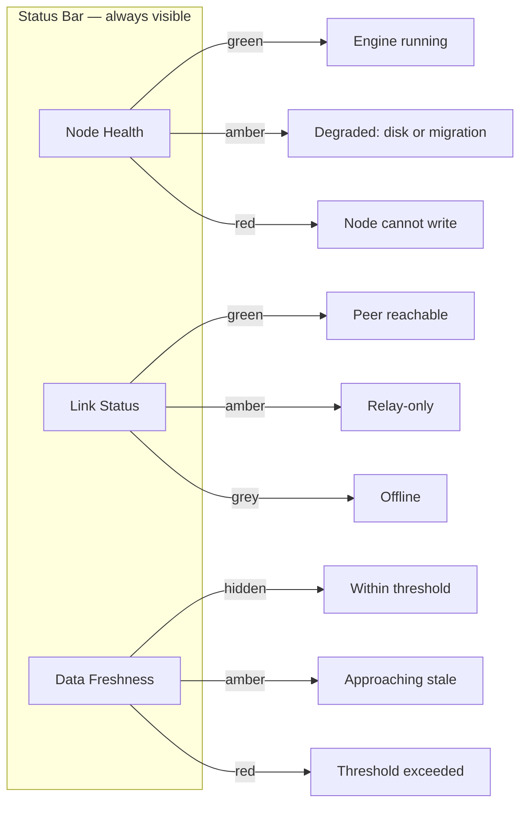
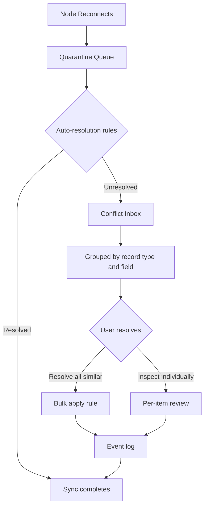
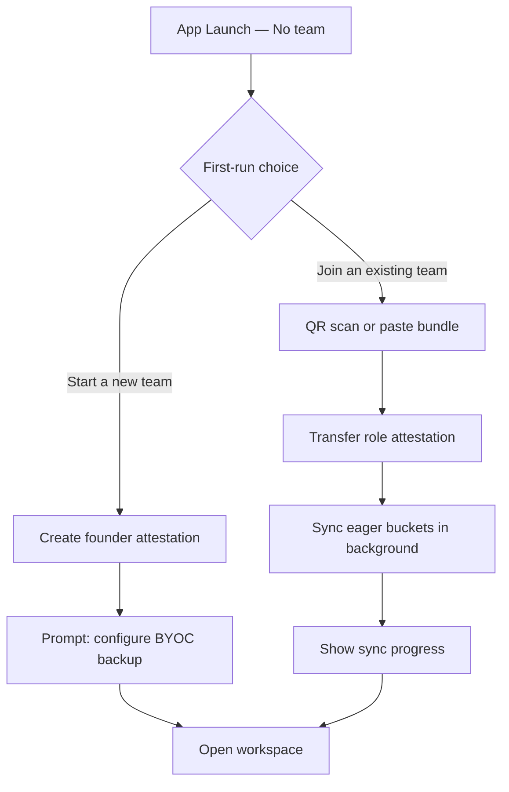

# Chapter 20 — UX, Sync, and Conflict

<!-- icm/prose-review -->

<!-- Target: ~3,000 words -->
<!-- Source: v13 §13, §14, v5 §6 -->

---

The architecture handles consistency. The UX handles trust. Get the UX wrong and users distrust the application the moment they see something unexpected — a spinner, a warning badge, a conflict dialog. Get it right and they experience a fast, reliable desktop application that happens to collaborate seamlessly.

## The Complexity Hiding Standard

Apply this test to every UX decision in a local-first application. Can a non-technical user determine, from normal use, whether the app is local-first or cloud-first? If the answer is yes, the UX has failed. The only visible difference between the two should be that the local-first app keeps working when the internet does not.

This standard has teeth. It rules out "offline mode" banners — there is no mode. It rules out terminology like "peer sync" or "gossip protocol" anywhere a user can see it. It rules out empty loading states when the node already holds authoritative local data on the same machine the user is sitting in front of. Users experience the application as installed software that occasionally synchronises. Not as a web app with a desktop wrapper.

The standard does not mean hiding status. It means surfacing status in terms users understand without training. "Last updated 3 minutes ago" is acceptable. "Gossip round incomplete" is not. "Your connection to the team server is limited" is acceptable. "Relay-only mode active" is not. Clear is kind. Unclear is unkind. Every string the user reads should pass a plain-language test: would a practitioner with no knowledge of distributed systems understand it?

## The Three Always-Visible Indicators

Three indicators sit in the application status bar at all times: node health, link status, and data freshness. Under normal conditions they are non-intrusive — icons with no label, no colour emphasis. Under degraded conditions they expand into a short plain-language label and shift to amber or red.

**Node health** signals whether the local node is operating normally. Green means the CRDT (Conflict-free Replicated Data Type) engine and sync daemon are running and the last self-check passed. Amber means a degraded condition — disk near capacity, sync daemon restarting, or a schema migration in progress. Red means the node cannot accept writes. A red node health indicator is rare and always requires user action. The most common cause is credential revocation under the Chapter 15 rekeying flow. When revocation fires, the node displays a plain-language prompt rather than a technical error: "Your access credentials have been updated. Sign in again to continue syncing." The message names neither the rekeying epoch nor the joiner attestation nor the underlying cryptographic state. The user needs to act, not to understand the protocol.

**Link status** signals the state of connectivity to the team. Green means at least one peer is reachable and gossip is flowing. Amber means the relay is reachable but no peers are directly connected — gossip continues via relay, but peer-to-peer operations are unavailable. Grey means the node is fully offline. Red is not a link status state; connectivity failure is not an error condition for a local-first node.

**Data freshness** signals whether the locally held state meets the freshness thresholds for the data classes in use. Under normal conditions this indicator is invisible. It appears only when a threshold is close to expiring or has expired. The staleness thresholds are not arbitrary; they reflect the AP/CP classification from Chapter 12.

`Sunfish.UIAdapters.Blazor` provides `SunfishNodeHealthBar`, which implements all three indicators. Wire it into your application shell and configure the thresholds; the component handles the rest. Do not build a custom status bar from scratch. The platform component has been hardened against edge cases that a bespoke implementation will miss.



Place `SunfishNodeHealthBar` at the bottom of the application shell. Keep it compact — a single row, 24px high. Aim for ambient awareness, not a dashboard.

## AP/CP Visibility by Data Class

Not all data in a local-first application has the same consistency requirements. Chapter 12 classifies data as AP (available, partition-tolerant) or CP (consistent, partition-tolerant). Staleness thresholds and UX treatment for the four standard data classes:

| Data class | Staleness threshold | UX treatment |
|---|---|---|
| Resource availability | 5 minutes | Amber indicator on the resource; booking blocked if offline |
| Financial balances | 15 minutes | "As of [timestamp]" label; writes require online |
| Scheduled appointments | 10 minutes | Calendar freshness badge; conflicts surfaced on reconnect |
| Team membership | 24 hours | Silent; surfaced only at a role-dependent action |

`Sunfish.UIAdapters.Blazor.SunfishFreshnessBadge` renders the per-record freshness indicator for any data class. Bind it to the AP/CP classification configured in `Sunfish.Kernel.Sync`; the badge computes staleness against the configured threshold and updates its state without additional application code. Do not hand-roll freshness timers. The stale-window edge cases — clock skew, daylight-saving boundaries, suspend/resume — are handled by the component.

Resource availability is the tightest threshold because double-booking a resource causes immediate, concrete harm. The kind of harm a user feels in the next ten minutes, not the next quarter. When the node cannot confirm freshness within the 5-minute window, the booking UI shows an amber indicator on the affected resource and blocks the confirm action with a short explanation: "Availability not confirmed. Reconnect to complete this booking." This is not an error. It is a CP constraint made visible.

Financial balances never accept writes while offline. The "As of [timestamp]" label appears whenever the balance is older than 15 minutes. The label is not a warning; it is a factual statement. Users who understand the label know to reconnect before acting on the figure. Users who do not understand the label see no apparent problem — which is the correct experience when the balance is fresh.

Appointment conflicts surface on reconnect, not at write time. The node accepts the write locally and gossips it when connectivity is restored. If two nodes wrote conflicting appointments for the same resource during a disconnected period, the conflict inbox receives the item. Do not show a conflict dialog at write time. The user has no conflicting information available at that moment, and the interruption serves no purpose.

Team membership changes propagate within 24 hours under normal connectivity. The UX surfaces a membership change only when the user attempts an action that depends on a role the change affects. Silent propagation is correct for this data class because role changes are rare, deliberate events — not transient edits.

## Optimistic UI and Confirmed States

AP-class writes are optimistic. They apply locally the moment the user confirms them and propagate to peers asynchronously (Chapter 12). Three button states communicate the lifecycle of a write to the user:

**Pending** — the write has been applied locally and submitted to the sync queue, but has not reached any peer. Show a spinner or a muted button state. The record is visible and editable; the muted state signals that sync is in progress. Do not use the word "pending" in the label — use a visual indicator only.

**Confirmed** — the write has been received by at least one peer. Remove the pending indicator. The record now shows its normal state. Most writes transition from pending to confirmed within seconds under normal connectivity.

**Failed** — the circuit breaker rejected the write on reconnect. This is not a sync delay. A failed write means the offline edit conflicted with team state in a way the auto-resolution rules could not handle, and the circuit breaker rejected the merge. Show a red state on the record with a "Review" action that opens the conflict inbox. The user must act.

The distinction between pending and failed matters enormously. A user who sees a persistent spinner waits. A user who sees a red "Review" indicator knows they have a decision to make. Never leave a failed write in the pending visual state. The circuit breaker result is deterministic and arrives the moment the node reconnects.

`Sunfish.UIAdapters.Blazor.SunfishOptimisticButton` implements the three-state lifecycle. Wire it to a write action; it handles the transition from idle to pending to confirmed, and opens the conflict inbox on a failed state. Do not implement button-state transitions by hand. The component handles the circuit-breaker signalling and the timeout recovery that a bespoke implementation will miss.

```
// Illustrative — not runnable (pre-1.0 API)
// Wired via Sunfish.Foundation.LocalFirst write pipeline

writeResult = crdtEngine.ApplyLocalWrite(document, edit);

switch (writeResult.Status)
{
    case WriteStatus.Pending:
        SetButtonState(ButtonState.Pending);
        break;
    case WriteStatus.Confirmed:
        SetButtonState(ButtonState.Confirmed);
        break;
    case WriteStatus.CircuitBreakerRejected:
        SetButtonState(ButtonState.Failed);
        OpenConflictInbox(writeResult.ConflictId);
        break;
}
```

## The Conflict Inbox and Bulk Resolution

Conflicts are inevitable in a collaborative system. The goal is not to prevent them. The goal is to make them manageable. The conflict inbox is the single place in the application where the user resolves conflicts. It is not a modal dialog. It is not an interstitial. It is a dedicated panel, accessible from the status bar and from any failed-write indicator.

The inbox groups conflicts by record type and field. A user who edited a task's status field offline, while a colleague edited the same field, sees "Status conflict on task: Design Review". They do not see a raw CRDT diff. The grouping turns an undifferentiated list of merge failures into a structured review queue that a non-technical user can navigate.

For each conflict group, the inbox offers three resolution options: prefer my version, prefer the remote version, or merge using a configurable rule. You define merge rules per record type in the application configuration. A numeric field offers "keep the higher value"; a set field offers "combine both". The data model determines the available rules, not the user.

The "resolve all similar" affordance applies a chosen rule to every conflict of the same shape in a single operation. A user with 40 status conflicts from a weekend offline period resolves all of them in two clicks: select the rule, apply to all. Outliers that do not match the rule remain in the inbox for individual review. This affordance scales conflict resolution from a tedious chore to a brief decision.

Every resolution is logged as an event. The log is not user-visible under normal conditions, but it is available for audit. The log entry records the conflict shape, the rule applied, the user who resolved it, and the timestamp. Do not let any conflict resolution pass through the system without a corresponding log entry. The audit requirement is non-negotiable for the enterprise customers Chapter 19 describes.

`Sunfish.UIAdapters.Blazor.SunfishConflictList` renders the grouped inbox, the per-group resolution affordances, and the "resolve all similar" bulk action. It logs every resolution via `Sunfish.Kernel.Sync` without additional wiring. Configure merge rules per record type through the component's manifest; the component enforces that the user chooses from declared rules only — preventing the common mistake of letting end-users select arbitrary merge strategies that the data model does not support.



## Designing for Failure Modes

Three failure modes require distinct UX treatment. Treating them as a single "offline" state is a common mistake. Each mode has a different implication for what the user can do and what the system is doing on their behalf.

**Full offline** — the node has no connectivity to peers or relay. The node operates at full fidelity. This is not an exception state. Picture a rural clinic at the end of a long road in sub-Saharan Africa, a legal practice in a tier-3 Indian city, a field office in the Andes — for many deployments, full offline is the normal operating condition, and connectivity is the exception. The UX treatment must reflect that reality. No degraded banner. No "offline mode" label. No implied apology for the state the user is most often in. AP-class edits apply immediately. CP-class edits are blocked with a clear explanation that avoids technical terminology: "This action requires a connection to your team. Your other changes are saved locally and will sync when you reconnect." The application does not enter a special mode. The data freshness indicator shifts to amber or red depending on how long the node has been offline, but the application chrome is otherwise unchanged.

**Partial connectivity** — the relay is reachable but no peers are directly connected. Gossip continues via relay, so writes propagate eventually. The link status indicator shifts to amber. If the user attempts an operation that requires direct peer connectivity — a live co-editing session, an in-person QR device join — the application surfaces a specific explanation: "This action requires a direct connection to your teammate's device. The relay is available for other operations." Do not silently fail peer-to-peer operations in relay-only mode. The failure is real; name it.

**Quarantine queue** — offline writes have been locally accepted but are waiting for validation against current team state. This mode is distinct from both of the above because it involves writes that are locally committed but not yet cleared. When the node reconnects, surface the quarantine count before sync completes: "3 edits made offline are pending validation. Review before syncing?" Give the user the option to inspect the queue. Do not complete the sync silently and present a conflict inbox after the fact. The user should understand what is about to happen before it happens.

The quarantine queue surface is a one-sentence count with a single review action. It is not a modal. It is not a blocker. If the user dismisses it, sync completes and any conflicts land in the conflict inbox. The count is a courtesy, not a gate.

**Unexpected shutdown** — the node was terminated by power loss or OS kill rather than a clean shutdown. On next launch, the node validates the last write-ahead checkpoint and replays any pending writes from the CRDT log. The UX surfaces this as a short one-sentence status during relaunch — "Restoring your work from the last session" — and opens the workspace as soon as replay completes. Do not show a progress bar unless the replay takes more than two seconds. Do not present a crash dialog. The CRDT log is the source of truth and the session resumes exactly where it stopped. This failure mode matters most in markets with unreliable grid power — Nigeria, Pakistan, parts of Southeast Asia — where users experience unexpected shutdowns often enough that a crash dialog would become a recurring irritation. The correct treatment is invisible recovery, surfaced only when recovery takes long enough to notice.

## The First-Run Experience

A new user who has never run the application sees the application shell with no data, no context, and no team. This is the most dangerous moment in adoption. The moment before the user has a single reason to trust the application, when an empty screen reads as broken. An empty application with no guidance loses users. The first-run experience answers two questions immediately: what do I do first, and is my data safe?

Show two options and nothing else: **Start a new team** and **Join an existing team**. No onboarding tour. No feature callout cards. No "you can also do X" links. The user has one decision to make, and that decision determines everything that follows.

**Start a new team** creates the founder attestation — the root trust anchor described in Chapter 15. Before showing the application, prompt for the first BYOC (Bring Your Own Cloud) backup configuration. This is not optional, and it is not a later step. A team without a configured backup is one device failure away from data loss. The prompt is concrete: "Where should your backup be stored? Choose a folder on this computer or connect cloud storage." After the user completes the backup configuration, the application opens with an empty but ready workspace.

**Join an existing team** initiates the three-step onboarding flow from Chapter 16: the user scans a QR code displayed on an existing team member's device (or pastes the bundle if QR is unavailable), the role attestation transfers, and the new node begins syncing eager buckets in the background. Show a sync progress indicator while the initial download completes. Do not open the full application until enough data has landed that the user can see a meaningful state. "Setting up your workspace — this takes about 30 seconds" is the correct surface during this period.



The backup prompt for new team founders deserves care. Technical users will understand "cloud backup". Non-technical users will not know what "BYOC" means. Use plain language: "Your team's data lives on this computer. To protect it from hardware failure, we recommend connecting a backup. This takes about 2 minutes." Offer the most common options — a local folder, OneDrive, Dropbox — as concrete choices. Do not present a generic file-picker and expect the user to navigate to the right place.

For regulated markets the backup target carries jurisdictional weight. Russian deployments under 242-FZ require a backup inside Russian territory. Indian deployments under the DPDP (Digital Personal Data Protection) Act require defensible classification of personal data crossing borders. UAE deployments under DPL (Data Protection Law) 2022 require clarity on whether the chosen location sits inside or outside a free zone. Surface the chosen target's jurisdiction alongside the path — "Backup location: OneDrive (Microsoft, United States)" rather than a raw file URL — and, when the team's declared jurisdiction requires in-country storage, present a labelled list of in-country targets and block selection of out-of-jurisdiction options with a short explanation: "This location stores data outside [jurisdiction]. Your team's policy requires a local target." A silent failure at this step is a compliance incident, not a UX inconvenience.

## Key-Loss Recovery UX

<!-- code-check: this section references two forward-looking Sunfish namespaces — `Sunfish.Foundation.Recovery` and `Sunfish.Kernel.Audit` — that are part of the Volume 1 extension roadmap and not yet present in the Sunfish reference implementation. They are illustrative in the same sense the book's existing pre-1.0 Sunfish references are illustrative. `Sunfish.Kernel.Security` is in the current Sunfish package canon. -->

Key-loss recovery has a policy layer and a UX layer. Ch15 §Key-Loss Recovery specifies the six mechanisms, the threat model, and the recommended deployment combinations.

Get the UX wrong and users skip setup. A user who skipped recovery setup faces permanent data loss at the first forgotten password. Get it right and users complete setup without distress and know exactly what to do when recovery becomes necessary.

### First-Run Prompt: Setting Up Recovery

Recovery setup is part of the first-run experience described in §The First-Run Experience. It is not an optional step reserved for advanced users. Every new user encounters it. Skipping is allowed, but skipping requires an explicit acknowledgment that permanent data loss is the consequence — not a checkbox buried in settings, but a prominent one-sentence statement the user must actively confirm: "I understand that without recovery setup, I cannot recover my data if I lose access to this device."

The choice screen presents the three primary mechanisms in plain language, without cryptographic terminology. "Trust three friends" describes multi-sig social recovery. "Trust your bank or lawyer" describes custodian-held backup. "Trust a piece of paper in a safe" describes paper-key fallback. Each option includes a one-sentence tradeoff: social recovery is easy to set up and depends on your relationships staying intact; custodian backup requires an existing institutional relationship but provides the strongest audit trail; paper-key is always available as long as the paper is safe.

The user selects one mechanism. The setup flow for that mechanism opens inline — the user does not leave the application. Trustee invitation, custodian enrollment, or mnemonic display all complete within the first-run context. The user sees a completion confirmation before the application opens its workspace: "Recovery is set up. You've chosen 3-of-5 social recovery. Write down the backup code below in case all five trustees become unavailable."

Cross-reference to §The First-Run Experience for the full onboarding flow. Recovery setup occupies the third step in that flow, after team creation and backup configuration.

### Trustee Designation Flow

For users who choose multi-sig social recovery, the designation flow walks them through naming five trustees, sending each an out-of-band invitation, and confirming each acceptance before the flow completes.

The UX surfaces the threshold semantics in plain language before the user names anyone: "3 of your 5 trustees must agree before your data can be recovered. Pick 5 people you trust who don't all know each other and who are unlikely to all become unreachable at the same time." The guidance is practical, not cryptographic. The phrase "don't all know each other" operationalizes geographic and social diversity without requiring the user to understand collusion attacks.

Each trustee invitation is a short message — email or SMS, depending on the user's preference — that explains what they are agreeing to: "You've been asked to be a recovery trustee for [user]. If they ever lose access to their data, you'll receive a request to help. You won't be able to access their data on your own."

Trustee acceptance is an event in the user's audit log, maintained by `Sunfish.Kernel.Audit`. The designation screen updates in real time as each trustee completes acceptance: "Trustee 1: confirmed. Trustee 2: confirmed. Trustees 3–5: pending." The user sees the state of their recovery arrangement before they leave the setup flow. The application flags an arrangement with fewer than the threshold confirmed: "You need at least 3 confirmed trustees before this recovery method is active. You can continue setup and return to confirm the remaining trustees later — your data is safe, but recovery is not yet available."

### Recovery Initiation UX

The user is on a fresh device. Their original device is gone — lost, stolen, destroyed, or factory-reset. They open the application for the first time on the new device and select "Recover my account" rather than creating or joining a team.

The recovery flow begins with identity claim. The user enters the email or identifier associated with their account. The application retrieves the recovery arrangement — mechanism type, trustee count, custodian identifier — and displays it without displaying any key material. The user selects their recovery method and initiates the claim.

The grace-period timer appears immediately and stays visible throughout the process: "Your recovery will complete in 14 days unless your existing device or account disputes this request. If this is not you, contact your trustees immediately." The plain-language message serves both the legitimate user — who understands that the wait is protection, not bureaucracy — and anyone who might see the message on a shared screen.

As trustees sign their shares, the progress display updates: "Trustee 1: confirmed. Trustee 2: confirmed. Trustee 3: pending. 2 more needed." The user can check progress without refreshing. They do not need to contact trustees directly to monitor the state.

### Time-Locked Grace Period UX

The original holder's existing devices — every device associated with the account — receive a high-priority notification the moment the user submits a recovery claim: "Someone is requesting recovery of your account. If this is not you, dispute this request now." The notification appears through every channel the user has opted into: in-app banner on any running instance, OS push notification, email, SMS.

The dispute action is one tap or one click. Tapping "This is not me" halts the recovery immediately, logs the dispute as a signed event in the audit trail, and alerts the user's trustees. A confirmed dispute triggers the compromise response procedure from Ch15 §Key Compromise Incident Response — because an unauthorized recovery attempt is evidence of credential compromise, not just a false claim.

Multi-channel notification is not optional. Routing recovery claims through a single channel is defeatable by an adversary who controls that channel. `Sunfish.Foundation.Recovery` sends through every configured channel simultaneously and logs each delivery. An undisputed claim in a channel the user does not monitor is the architecture's honest limitation; the application prompts users during setup to configure at least two independent notification channels.

If the original holder has genuinely lost all notification channels — no running devices, no email access, no SMS — the silence is the signal. The grace period elapses, and recovery completes. The architecture cannot distinguish a user who has truly lost everything from a user who is simply not checking. The grace period is the only gate between those two states.

### Recovery Completion Confirmation

When the grace period elapses without dispute and the recovery threshold is met — trustees have signed, or the custodian has released the wrapped key — recovery completes. The new device receives the wrapped KEKs (Key Encryption Keys) for the user's roles, as defined in Ch15 §Key Hierarchy. `Sunfish.Kernel.Security` unwraps the KEKs using the recovered root seed and stores them in the new device's OS keystore. Sync resumes through the normal attestation flow.

The completion screen is concrete about what happens next: "Recovery complete. Your data is being decrypted on this device. Documents will appear as they decrypt — a large library may take several minutes. Your recovery arrangement is still active. You may want to update your trustees if anything has changed."

That last sentence is the transition to ongoing maintenance. A recovery that succeeds is also a signal that the arrangement worked — and that it may be time to review whether the trustees are still the right people, whether the custodian relationship is current, and whether the paper key is still in the safe.

`Sunfish.Foundation.Recovery` schedules a recovery-readiness audit reminder 12 months after setup or after the last confirmed recovery event. The reminder is a short prompt: "Your recovery arrangement was last verified 12 months ago. Verify that your trustees are still reachable and that your backup key is where you left it." The reminder is calibrated to appear once per year, not once per month. A recovery prompt that appears every 30 days becomes ambient noise. One that appears annually is specific enough to act on. See Ch15 §Key-Loss Recovery — What This Section Does Not Solve for the boundary the periodic audit does and does not protect against.

## Accessibility as a Contract

Every indicator, badge, and status surface above carries an accessibility contract that the local-first architecture must honour as rigorously as it honours the write path. Every UX surface in this chapter — from the always-visible indicators to the first-run flow — conveys state to users whose primary access channel may be a screen reader, a keyboard, or a high-contrast display. Four contracts apply across every component in the Sunfish (the open-source reference implementation, [github.com/ctwoodwa/Sunfish](https://github.com/ctwoodwa/Sunfish)) UI adapter library and any custom UI a node author ships.

**Status surfaces announce semantically.** Every indicator component exposes its state through ARIA: `role="status"` with `aria-live="polite"` for ambient changes such as freshness transitions and optimistic-write confirmations; `role="alert"` with `aria-live="assertive"` for states the user must act on, such as a red node health indicator or a revoked-credential message. Do not use colour alone to signal state. Every indicator pairs colour with a text equivalent surfaced through `ISunfishIconProvider`, and the text equivalent ships in the active locale's language — not the development locale.

**Interactive elements are keyboard-reachable.** The conflict inbox, the optimistic buttons, and the first-run flow all support tab order, Enter and Space activation, and Escape-to-dismiss where dismissal is allowed. The "resolve all similar" affordance reaches without a pointer device. Focus management after a conflict resolution returns focus to the next pending group, not to the page header. A keyboard user resolves an inbox without re-tabbing through application chrome on every action.

**Component metadata declares accessibility commitments.** `IUiBlockManifest` exposes each component's ARIA role, announced state transitions, and keyboard contract. A node author who embeds `SunfishConflictList` inherits the contract without re-declaring it. Custom components that replace a Sunfish UI adapter implement `IUiBlockManifest` with equivalent commitments — the platform refuses to register a component declaring a weaker accessibility contract than the component it replaces.

**Freshness and failure messages read as plain language.** Text equivalents surfaced to assistive technology use the same plain-language register as the visible text. A screen-reader user hearing "Availability not confirmed. Reconnect to complete this booking" receives the same information, in the same register, as a sighted user. Do not let visible text read as plain-language while the ARIA label falls back to technical terminology. The accessibility channel is not a second-class surface, and a dual-track UX fails the Complexity Hiding Standard as surely as a technical banner would.

These contracts operationalise the Chapter 11 UI block framing. The UI adapter library enforces them by default; a custom component that bypasses the adapter implements them explicitly or fails manifest validation at registration time.

## UX for the Non-Technical Adopter

The UX decisions above assume a user who can interpret indicators, freshness labels, and conflict inboxes. Non-technical buyers — legal practices, medical clinics, architecture studios — evaluate software through a different lens. The adoption barriers are trust, perceived complexity, and uncertainty about support [1]. These are UX problems before they are marketing problems, and the UX surfaces above do not automatically close them. Four UX commitments do.

**A champion.** One technically-inclined team member who understands the model and can explain it to colleagues in terms they trust. Design the product onboarding to identify and cultivate the champion early. Design the first-run experience for the champion, not for every team member — the champion sets up the team and then invites the others.

**A comparison.** The champion needs one sentence: "It's like a cloud app, but it runs on your own computer." This sentence is not technically precise. It is functionally accurate for the audience. Do not offer a more accurate description at the expense of a comprehensible one. Clear is kind. Unclear is unkind.

**A fallback story.** Non-technical buyers fear lock-in more than they fear data loss — because they understand the former and abstract away the latter. The answer to "what happens if we stop using it?" must be immediate and concrete: "You can export everything at any time. It's your data, in a format you can open in any spreadsheet application." The plain-file export capability from Chapter 16 is the technical foundation for this story.

**A support path.** The question "who do I call when it breaks?" must have an answer that sounds like a person, not a GitHub issue. The managed relay offering provides a support contact. Make it visible in the application: a "Contact support" link that opens an email draft or a support chat. Non-technical users will not file tickets; they will abandon the application if they cannot find a human.

Three sentences replace every infrastructure term in every user-facing surface a non-technical user sees:

> Your data lives on your computers, in your office.
> The app keeps working when your internet is out.
> If we shut down, your software and your data are still yours.

Surface them on the first-run welcome screen and in the help documentation — not in the application chrome. A team member who asks a question the champion cannot answer must be able to find them.

The trust gap does not close in the first session. It closes over the first three weeks of use, as the team experiences the application working offline, as conflicts resolve without drama, and as the champion fields fewer and fewer questions. The UX supports that arc by staying out of the way — surfacing state when it matters, silent when it does not, plain-language wherever the user reads it. An application that meets the Complexity Hiding Standard is one the non-technical team stops thinking about. That absence of thought is the sign the UX has done its work.


---

## References

[1] E. M. Rogers, *Diffusion of Innovations*, 5th ed. New York: Free Press, 2003, ch. 6.
