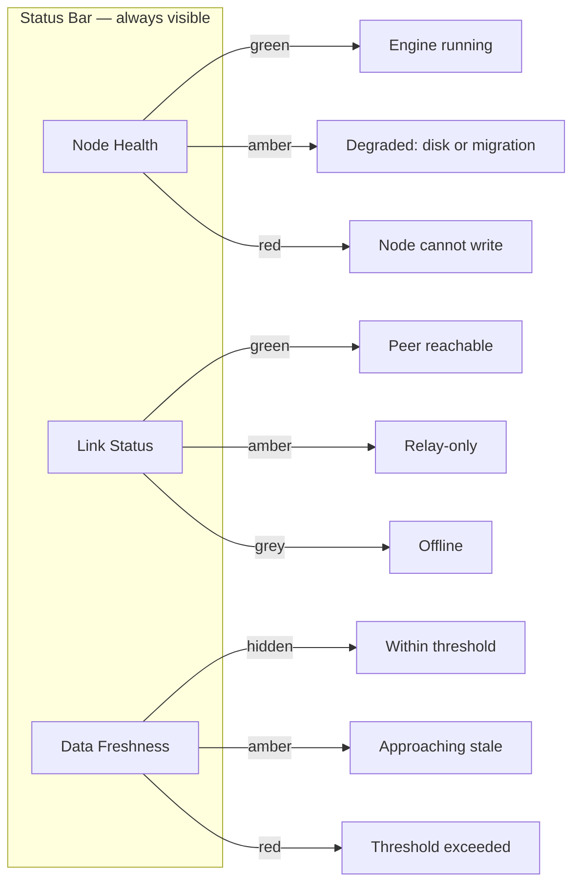
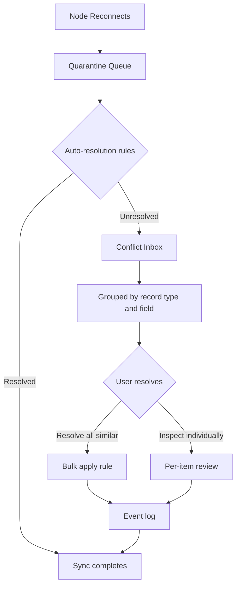
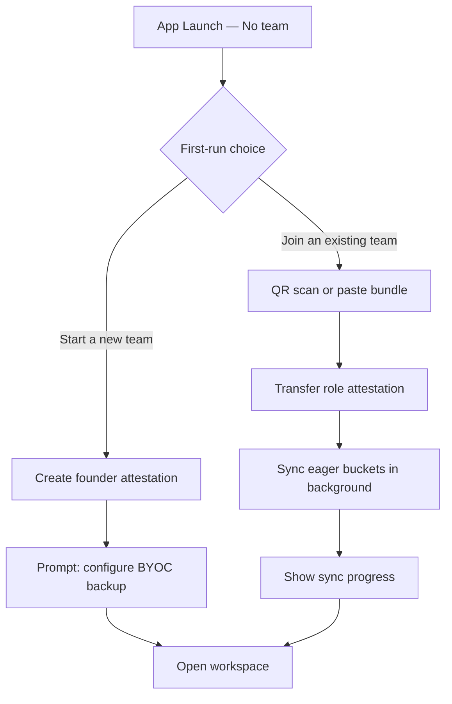

# Chapter 20 — UX, Sync, and Conflict

<!-- icm/prose-review -->

<!-- Target: ~3,000 words -->
<!-- Source: v13 §13, §14, v5 §6 -->

---

The architecture handles consistency. The UX handles trust. Get the UX wrong and users will
distrust the application the moment they see anything unexpected — a spinner, a warning badge,
a conflict dialog. Get it right and they experience a fast, reliable desktop application that
happens to collaborate seamlessly.

## The Complexity Hiding Standard

Apply this test to every UX decision in a local-first application: can a non-technical user
determine, from normal use, whether the app is local-first or cloud-first? If the answer is
yes, the UX has failed. The only visible difference between the two should be that the local-
first app works when the internet is unavailable.

This standard has teeth. It rules out "offline mode" banners — there is no mode. It rules out
terminology like "peer sync" or "gossip protocol" anywhere a user can see it. It rules out
empty loading states when the node holds authoritative local data. Users should experience the
application as installed software that occasionally synchronises, not as a web app with a
desktop wrapper.

The standard does not mean hiding status. It means surfacing status in terms users understand
without training. "Last updated 3 minutes ago" is acceptable. "Gossip round incomplete" is
not. "Your connection to the team server is limited" is acceptable. "Relay-only mode active"
is not. Every string the user reads should pass a plain-language test: would a practitioner
with no knowledge of distributed systems understand it?

## The Three Always-Visible Indicators

Three indicators appear in the application status bar at all times: node health, link status,
and data freshness. They are non-intrusive under normal conditions — icons with no label, no
color emphasis. Under degraded conditions, they expand with a short plain-language label and
shift to amber or red.

**Node health** signals whether the local node is operating normally. Green means the CRDT
engine and sync daemon are running and the last self-check passed. Amber means a degraded
condition — disk near capacity, sync daemon restarting, or a schema migration in progress.
Red means the node cannot accept writes. A red node health indicator is rare and always
requires user action.

**Link status** signals the state of connectivity to the team. Green means at least one peer
is reachable and gossip is flowing. Amber means the relay is reachable but no peers are
directly connected — gossip continues via relay, but peer-to-peer operations are unavailable.
Grey means the node is fully offline. There is no red link status; connectivity failure is not
an error state for a local-first node.

**Data freshness** signals whether the locally held state meets the freshness thresholds for
the data classes in use. Under normal conditions this indicator is invisible — it appears only
when a threshold is close to expiring or has expired. The staleness thresholds are not
arbitrary; they reflect the AP/CP classification from Chapter 12.

`Sunfish.UIAdapters.Blazor` provides `SunfishNodeHealthBar`,
which implements all three indicators. Wire it into your application shell and configure the
thresholds; the component handles the rest. Do not build a custom status bar from scratch —
the platform component has been hardened against edge cases that a bespoke implementation
will miss.



Place `SunfishNodeHealthBar` at the bottom of the application shell. Keep it compact — a
single row, 24px high. The goal is ambient awareness, not a dashboard.

## AP/CP Visibility by Data Class

Not all data in a local-first application has the same consistency requirements. Chapter 12
classifies data as AP (available, partition-tolerant) or CP (consistent, partition-tolerant).
The UX treats each class differently. The table below defines the staleness thresholds and the
corresponding UX treatment for the four standard data classes:

| Data class | Staleness threshold | UX treatment |
|---|---|---|
| Resource availability | 5 minutes | Amber indicator on the resource; booking blocked if offline |
| Financial balances | 15 minutes | "As of [timestamp]" label; writes require online |
| Scheduled appointments | 10 minutes | Calendar freshness badge; conflicts surfaced on reconnect |
| Team membership | 24 hours | Silent; surfaced only at a role-dependent action |

Resource availability is the tightest threshold because double-booking a resource causes
immediate, concrete harm. When the node cannot confirm freshness within the 5-minute window,
the booking UI shows an amber indicator on the affected resource and blocks the confirm action
with a short explanation: "Availability not confirmed. Reconnect to complete this booking."
This is not an error. It is a CP constraint made visible.

Financial balances never accept writes while offline. The "As of [timestamp]" label appears
whenever the balance is older than 15 minutes. The label is not a warning; it is a factual
statement. Users who understand the label will know to reconnect before acting on the figure.
Users who do not will see no apparent problem — which is the correct experience when the
balance is fresh.

Appointment conflicts surface on reconnect, not at write time. The node accepts the write
locally and gossips it when connectivity is restored. If two nodes wrote conflicting
appointments for the same resource during a disconnected period, the conflict inbox receives
the item. Do not show a conflict dialog at write time — the user has no conflicting information
available at that moment, and the interruption serves no purpose.

Team membership changes propagate within 24 hours under normal connectivity. The UX surfaces
a membership change only when the user attempts an action that depends on a role the change
affects. Silent propagation is correct for this data class because role changes are rare,
deliberate events — not transient edits.

## Optimistic UI and Confirmed States

AP-class writes are optimistic — they apply locally the moment the user confirms them and sync to peers asynchronously (Chapter 12). Three button states communicate the lifecycle of a write to the user:

**Pending** — the write has been applied locally and submitted to the sync queue, but has not
reached any peer. Show a spinner or a muted button state. The record is visible and editable;
the muted state signals that sync is in progress. Do not use the word "pending" in the label —
use a visual indicator only.

**Confirmed** — the write has been received by at least one peer. Remove the pending indicator.
The record now shows its normal state. Most writes transition from pending to confirmed within
seconds under normal connectivity.

**Failed** — the write was rejected by the circuit breaker on reconnect. This is not a sync
delay. A failed write means the offline edit conflicted with team state in a way the
auto-resolution rules could not handle, and the circuit breaker rejected the merge. Show a
red state on the record with a "Review" action that opens the conflict inbox. The user must
act.

The distinction between pending and failed matters enormously. A user who sees a persistent
spinner will wait. A user who sees a red "Review" indicator knows they have a decision to
make. Never leave a failed write in the pending visual state — the circuit breaker result is
deterministic and arrives as soon as the node reconnects.

```
// Illustrative — not runnable (pre-1.0 API)
// Wired via Sunfish.Foundation.LocalFirst write pipeline

writeResult = crdtEngine.ApplyLocalWrite(document, edit);

switch (writeResult.Status)
{
    case WriteStatus.Pending:
        SetButtonState(ButtonState.Pending);
        break;
    case WriteStatus.Confirmed:
        SetButtonState(ButtonState.Confirmed);
        break;
    case WriteStatus.CircuitBreakerRejected:
        SetButtonState(ButtonState.Failed);
        OpenConflictInbox(writeResult.ConflictId);
        break;
}
```

## The Conflict Inbox and Bulk Resolution

Conflicts are inevitable in a collaborative system. The design goal is not to prevent them
but to make them manageable. The conflict inbox is the single place in the application where
the user resolves conflicts. It is not a modal dialog. It is not an interstitial. It is a
dedicated panel, accessible from the status bar and from any failed-write indicator.

The inbox groups conflicts by record type and field. A user who edited a task's status field
offline, while a colleague edited the same field, sees "Status conflict on task: Design
Review". They do not see a raw CRDT diff. The grouping turns an undifferentiated list of
merge failures into a structured review queue that a non-technical user can navigate.

For each conflict group, the inbox offers three resolution options: prefer my version, prefer
the remote version, or merge using a configurable rule. Merge rules are defined per record
type in the application configuration. A numeric field might offer "keep the higher value";
a set field might offer "combine both". The available rules are determined by the data model,
not by the user.

The "resolve all similar" affordance applies a chosen rule to every conflict of the same shape
in a single operation. A user with 40 status conflicts from a weekend offline period can
resolve all of them in two clicks: select the rule, apply to all. Outliers that do not match
the rule remain in the inbox for individual review. This affordance scales conflict resolution
from a tedious chore to a brief decision.

Every resolution is logged as an event. The log is not user-visible under normal conditions,
but it is available for audit. The log entry records the conflict shape, the rule applied, the
user who resolved it, and the timestamp. Do not let any conflict resolution pass through the
system without a corresponding log entry — the audit requirement is non-negotiable for the
enterprise customers Chapter 19 describes.



## Designing for Failure Modes

Three failure modes require distinct UX treatment. Treating them as a single "offline" state
is a common mistake. Each mode has a different implication for what the user can do and what
the system is doing on their behalf.

**Full offline** — the node has no connectivity to peers or relay. The node operates at full
fidelity. AP-class edits apply immediately. CP-class edits are blocked with a clear
explanation that avoids technical terminology: "This action requires a connection to your
team. Your other changes are saved locally and will sync when you reconnect." There is no
degraded banner. The application does not enter a special mode. The data freshness indicator
shifts to amber or red depending on how long the node has been offline, but the application
chrome is otherwise unchanged.

**Partial connectivity** — the relay is reachable but no peers are directly connected. Gossip
continues via relay, so writes propagate eventually. The link status indicator shifts to amber.
If the user attempts an operation that requires direct peer connectivity — such as a live
co-editing session or an in-person QR device join — the application surfaces a specific
explanation: "This action requires a direct connection to your teammate's device. The relay
is available for other operations." Do not silently fail peer-to-peer operations in relay-only
mode. The failure is real; name it.

**Quarantine queue** — offline writes have been locally accepted but are waiting for
validation against current team state. This mode is distinct from both of the above because
it involves writes that are locally committed but not yet cleared. When the node reconnects,
surface the quarantine count before sync completes: "3 edits made offline are pending
validation. Review before syncing?" Give the user the option to inspect the queue. Do not
complete the sync silently and present a conflict inbox after the fact — the user should
understand what is about to happen before it happens.

The quarantine queue surface is a one-sentence count with a single review action. It is not a
modal. It is not a blocker. If the user dismisses it, sync completes and any conflicts land
in the conflict inbox. The count is a courtesy, not a gate.

## The First-Run Experience

A new user who has never run the application sees the application shell with no data, no
context, and no team. This is the most dangerous moment in adoption. An empty application
with no guidance loses users. The first-run experience must answer two questions immediately:
what do I do first, and is my data safe?

Show two options and nothing else: **Start a new team** and **Join an existing team**. No
onboarding tour. No feature callout cards. No "you can also do X" links. The user has one
decision to make, and that decision determines everything that follows.

**Start a new team** creates the founder attestation — the root trust anchor described in
Chapter 15. Before showing the application, prompt for the first BYOC backup configuration.
This is not optional and it is not a later step. A team without a configured backup is one
device failure away from data loss. The prompt should be concrete: "Where should your backup
be stored? Choose a folder on this computer or connect cloud storage." After the user
completes the backup configuration, the application opens with an empty but ready workspace.

**Join an existing team** initiates the three-step onboarding flow from Chapter 16: the user
scans a QR code displayed on an existing team member's device (or pastes the bundle if QR is
unavailable), the role attestation transfers, and the new node begins syncing eager buckets
in the background. Show a sync progress indicator while the initial download completes. Do
not open the full application until enough data has landed that the user can see a meaningful
state. "Setting up your workspace — this takes about 30 seconds" is the correct surface during
this period.



The backup prompt for new team founders deserves care. Technical users will understand "cloud
backup". Non-technical users will not know what "BYOC" means. Use plain language: "Your team's
data lives on this computer. To protect it from hardware failure, we recommend connecting a
backup. This takes about 2 minutes." Offer the most common options — a local folder, OneDrive,
Dropbox — as concrete choices. Do not present a generic file-picker and expect the user to
navigate to the right place.

## The Non-Technical Trust Gap

Architecture does not sell itself. A legal practice, a medical clinic, or an architecture
studio will not evaluate software on the merits of its CRDT engine. The adoption barriers for
non-technical buyers are trust, perceived complexity, and uncertainty about support [1]. These
are UX problems before they are marketing problems.

Four elements close the non-technical trust gap:

**A champion.** One technically-inclined team member who understands the model and can explain
it to colleagues in terms they trust. The product onboarding should identify and cultivate
the champion early. The first-run experience is designed for the champion, not for every team
member — the champion sets up the team and then invites the others.

**A comparison.** The champion needs one sentence: "It's like a cloud app, but it runs on
your own computer." This sentence is not technically precise. It is functionally accurate for
the audience. Do not offer a more accurate description at the expense of a comprehensible one.

**A fallback story.** Non-technical buyers fear lock-in more than they fear data loss —
because they understand the former and abstract away the latter. The answer to "what happens
if we stop using it?" must be immediate and concrete: "You can export everything at any time.
It's your data, in a format you can open in any spreadsheet application." The plain-file export
capability from Chapter 16 is the technical foundation for this story.

**A support path.** The question "who do I call when it breaks?" must have an answer that
sounds like a person, not a GitHub issue. The managed relay offering provides a support
contact. Make it visible in the application: a "Contact support" link that opens an email
draft or a support chat. Non-technical users will not file tickets; they will abandon the
application if they cannot find a human.

Three sentences replace all infrastructure vocabulary in every user-facing surface:

> Your data lives on your computers, in your office.
> The app keeps working when your internet is out.
> If we shut down, your software and your data are still yours.

These sentences appear in the product landing page, the first-run welcome screen, and the
help documentation. They do not appear in the application chrome itself — no user needs to
be reminded of the value proposition while they are working. But they must be findable when
a team member asks a question the champion cannot answer.

The trust gap is not closed in the first session. It closes over the first three weeks of
use, as the team experiences the application working offline, as conflicts resolve without
drama, and as the champion fields fewer and fewer questions. Build the UX to support that
arc. Make the first week easy for the champion, and make the first month unremarkable for
everyone else.

## Summary

The UX layer of a local-first application has one job: make the consistency model invisible
to users who do not need to see it, and legible to users who do. The complexity hiding
standard is the test. The three status indicators, the AP/CP data class treatment, the
optimistic write states, the conflict inbox, and the first-run experience are the mechanisms.

None of these mechanisms require the user to understand CRDTs, gossip protocols, or quorum
reads. The user sees a fast application, a status bar that tells them what they need to know,
and a conflict inbox that is empty most of the time. When something goes wrong, they see a
plain-language description of what happened and a single action to take.

That experience — invisible complexity, visible status, actionable failures — is what the
architecture earns and what the UX delivers.

---

## References

[1] E. M. Rogers, *Diffusion of Innovations*, 5th ed. New York: Free Press, 2003, ch. 6.
